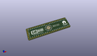
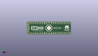
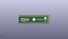
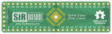
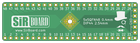

Contents
========

* [PRPR17 > ](#prpr17--)
	* [Interactive BOM](#interactive-bom)
	* [OOMP Parts](#oomp-parts)
	* [Images](#images)
	* [Tags](#tags)
  
![][im]
# PRPR17 > 

- ID: PROJ-SIRB-0017-STAN-01
- Hex ID: PRPR17
- Name: TQFP48 Breakout Board (sirboard)
- Description: TQFP48 Breakout Board (sirboard)
- Long Link: [http://oom.lt/PROJ-SIRB-0017-STAN-01](http://oom.lt/PROJ-SIRB-0017-STAN-01)
- Short Link: [http://oom.lt/PRPR17](http://oom.lt/PRPR17)

## Interactive BOM

- Interactive BOM page: [ibom.html](https://htmlpreview.github.io/?https://github.com/oomlout/oomlout_OOMP_projects/blob/main/PROJ-SIRB-0017-STAN-01/kicad/bom/ibom.html)

## OOMP Parts
  

|OOMP ID|Name|Identifier|
| :---: | :---: | :---: |
|[HEAD-I01-X-PI05-01](https://github.com/oomlout/oomlout_OOMP_parts/tree/main/HEAD-I01-X-PI05-01/)|[2.54 mm 5 Pin Header](https://github.com/oomlout/oomlout_OOMP_parts/tree/main/HEAD-I01-X-PI05-01/)|[J5](https://github.com/oomlout/oomlout_OOMP_parts/tree/main/HEAD-I01-X-PI05-01/)|
|UNMATCHED-UNMATCHED-X-UNMATCHED-01||J3, J2|
|HEAD-I01-X-PI24-01||J1, J4|

## Images
  
  

|kicadPcb3d|kicadPcb3dFront|kicadPcb3dBack|pcbdraw|pcbdrawback|
| :---: | :---: | :---: | :---: | :---: |
||||||

## Tags

- oompType: PROJ
- oompSize: SIRB
- oompColor: 0017
- oompDesc: STAN
- oompIndex: 01
- name: TQFP48 Breakout Board (sirboard)
- gitRepo: https://github.com/sirboard/BreakoutBoards
- gitName: BreakoutBoards
- kicadBoard: TQFP48/TQFP48.kicad_pcb
- kicadSchem: TQFP48/TQFP48.kicad_sch
- hexID: PRPR17
- oompID: PROJ-SIRB-0017-STAN-01
- oompParts: J5,HEAD-I01-X-PI05-01
- oompParts: J3,UNMATCHED-UNMATCHED-X-UNMATCHED-01
- oompParts: J2,UNMATCHED-UNMATCHED-X-UNMATCHED-01
- oompParts: J1,HEAD-I01-X-PI24-01
- oompParts: J4,HEAD-I01-X-PI24-01
- rawParts: G***,LOGO,logo94x134,logo94x134,,,,
- rawParts: G***,LOGO,SirBoard171x54,SirBoard171x54,,,,
- rawParts: G***,LOGO,SirBoard171x54,SirBoard171x54,,,,
- rawParts: J5,Conn_01x05,PinHeader_1x05_P2.54mm_Vertical,PinHeader_1x05_P2.54mm_Vertical,,,,
- rawParts: J3,Conn_02x24_Counter_Clockwise,UQFN-48-1EP_6x6mm_P0.4mm_EP4.62x4.62mm,UQFN-48-1EP_6x6mm_P0.4mm_EP4.62x4.62mm,,,,
- rawParts: J2,Conn_02x24_Counter_Clockwise,TQFP-48-1EP_7x7mm_P0.5mm_EP5x5mm,TQFP-48-1EP_7x7mm_P0.5mm_EP5x5mm,,,,
- rawParts: J1,Conn_01x24,PinHeader_1x24_P2.54mm_Vertical,PinHeader_1x24_P2.54mm_Vertical,,,,
- rawParts: J4,Conn_01x24,PinHeader_1x24_P2.54mm_Vertical,PinHeader_1x24_P2.54mm_Vertical,,,,

[im]: kicadPcb3d_450.png
