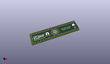
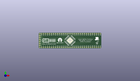
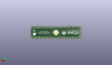
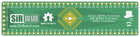
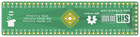

Contents
========

* [PRPR18 > ](#prpr18--)
	* [Interactive BOM](#interactive-bom)
	* [OOMP Parts](#oomp-parts)
	* [Images](#images)
	* [Tags](#tags)
  
![][im]
# PRPR18 > 

- ID: PROJ-SIRB-0018-STAN-01
- Hex ID: PRPR18
- Name: TQFP64 Breakout Board (sirboard)
- Description: TQFP64 Breakout Board (sirboard)
- Long Link: [http://oom.lt/PROJ-SIRB-0018-STAN-01](http://oom.lt/PROJ-SIRB-0018-STAN-01)
- Short Link: [http://oom.lt/PRPR18](http://oom.lt/PRPR18)

## Interactive BOM

- Interactive BOM page: [ibom.html](https://htmlpreview.github.io/?https://github.com/oomlout/oomlout_OOMP_projects/blob/main/PROJ-SIRB-0018-STAN-01/kicad/bom/ibom.html)

## OOMP Parts
  

|OOMP ID|Name|Identifier|
| :---: | :---: | :---: |
|UNMATCHED-UNMATCHED-X-UNMATCHED-01||J3, J4, J2|
|HEAD-I01-X-PI32-01||J5, J1|
|[HEAD-I01-X-PI06-01](https://github.com/oomlout/oomlout_OOMP_parts/tree/main/HEAD-I01-X-PI06-01/)|[2.54 mm 6 Pin Header](https://github.com/oomlout/oomlout_OOMP_parts/tree/main/HEAD-I01-X-PI06-01/)|[J6](https://github.com/oomlout/oomlout_OOMP_parts/tree/main/HEAD-I01-X-PI06-01/)|

## Images
  
  

|kicadPcb3d|kicadPcb3dFront|kicadPcb3dBack|pcbdraw|pcbdrawback|
| :---: | :---: | :---: | :---: | :---: |
||||||

## Tags

- oompType: PROJ
- oompSize: SIRB
- oompColor: 0018
- oompDesc: STAN
- oompIndex: 01
- name: TQFP64 Breakout Board (sirboard)
- gitRepo: https://github.com/sirboard/BreakoutBoards
- gitName: BreakoutBoards
- kicadBoard: TQFP64/TQFP64.kicad_pcb
- kicadSchem: TQFP64/TQFP64.kicad_sch
- hexID: PRPR18
- oompID: PROJ-SIRB-0018-STAN-01
- oompParts: J3,UNMATCHED-UNMATCHED-X-UNMATCHED-01
- oompParts: J5,HEAD-I01-X-PI32-01
- oompParts: J1,HEAD-I01-X-PI32-01
- oompParts: J4,UNMATCHED-UNMATCHED-X-UNMATCHED-01
- oompParts: J2,UNMATCHED-UNMATCHED-X-UNMATCHED-01
- oompParts: J6,HEAD-I01-X-PI06-01
- rawParts: J3,Conn_02x32_Counter_Clockwise,QFN-64-1EP_8x8mm_P0.4mm_EP6.5x6.5mm,QFN-64-1EP_8x8mm_P0.4mm_EP6.5x6.5mm,,,,
- rawParts: G***,LOGO,logo94x134,logo94x134,,,,
- rawParts: G***,LOGO,logo94x134,logo94x134,,,,
- rawParts: G***,LOGO,SirBoard171x54,SirBoard171x54,,,,
- rawParts: G***,LOGO,SirBoard171x54,SirBoard171x54,,,,
- rawParts: J5,Conn_01x32,PinHeader_1x32_P2.54mm_Vertical,PinHeader_1x32_P2.54mm_Vertical,,,,
- rawParts: J1,Conn_01x32,PinHeader_1x32_P2.54mm_Vertical,PinHeader_1x32_P2.54mm_Vertical,,,,
- rawParts: J4,Conn_02x32_Counter_Clockwise,TQFP-64_7x7mm_P0.4mm,TQFP-64_7x7mm_P0.4mm,,,,
- rawParts: J2,Conn_02x32_Counter_Clockwise,TQFP-64_10x10mm_P0.5mm,TQFP-64_10x10mm_P0.5mm,,,,
- rawParts: J6,Conn_01x06,PinHeader_1x06_P2.54mm_Vertical,PinHeader_1x06_P2.54mm_Vertical,,,,

[im]: kicadPcb3d_450.png
