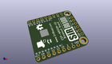
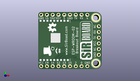
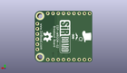
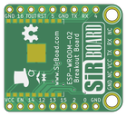
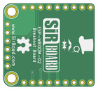

Contents
========

* [PRPR20 > ](#prpr20--)
	* [Interactive BOM](#interactive-bom)
	* [OOMP Parts](#oomp-parts)
	* [Images](#images)
	* [Tags](#tags)
  
![][im]
# PRPR20 > 

- ID: PROJ-SIRB-0020-STAN-01
- Hex ID: PRPR20
- Name: WROOM02 Breakout Board (sirboard)
- Description: WROOM02 Breakout Board (sirboard)
- Long Link: [http://oom.lt/PROJ-SIRB-0020-STAN-01](http://oom.lt/PROJ-SIRB-0020-STAN-01)
- Short Link: [http://oom.lt/PRPR20](http://oom.lt/PRPR20)

## Interactive BOM

- Interactive BOM page: [ibom.html](https://htmlpreview.github.io/?https://github.com/oomlout/oomlout_OOMP_projects/blob/main/PROJ-SIRB-0020-STAN-01/kicad/bom/ibom.html)

## OOMP Parts
  

|OOMP ID|Name|Identifier|
| :---: | :---: | :---: |
|UNMATCHED-UNMATCHED-X-UNMATCHED-01||U1|
|[HEAD-I01-X-PI06-01](https://github.com/oomlout/oomlout_OOMP_parts/tree/main/HEAD-I01-X-PI06-01/)|[2.54 mm 6 Pin Header](https://github.com/oomlout/oomlout_OOMP_parts/tree/main/HEAD-I01-X-PI06-01/)|[J3](https://github.com/oomlout/oomlout_OOMP_parts/tree/main/HEAD-I01-X-PI06-01/)|
|[HEAD-I01-X-PI09-01](https://github.com/oomlout/oomlout_OOMP_parts/tree/main/HEAD-I01-X-PI09-01/)|[2.54 mm 9 Pin Header](https://github.com/oomlout/oomlout_OOMP_parts/tree/main/HEAD-I01-X-PI09-01/)|[J2, J1](https://github.com/oomlout/oomlout_OOMP_parts/tree/main/HEAD-I01-X-PI09-01/)|

## Images
  
  

|kicadPcb3d|kicadPcb3dFront|kicadPcb3dBack|pcbdraw|pcbdrawback|
| :---: | :---: | :---: | :---: | :---: |
||||||

## Tags

- oompType: PROJ
- oompSize: SIRB
- oompColor: 0020
- oompDesc: STAN
- oompIndex: 01
- name: WROOM02 Breakout Board (sirboard)
- gitRepo: https://github.com/sirboard/BreakoutBoards
- gitName: BreakoutBoards
- kicadBoard: WROOM02/WROOM02.kicad_pcb
- kicadSchem: WROOM02/WROOM02.kicad_sch
- hexID: PRPR20
- oompID: PROJ-SIRB-0020-STAN-01
- oompParts: U1,UNMATCHED-UNMATCHED-X-UNMATCHED-01
- oompParts: J3,HEAD-I01-X-PI06-01
- oompParts: J2,HEAD-I01-X-PI09-01
- oompParts: J1,HEAD-I01-X-PI09-01
- rawParts: U1,ESP-WROOM-02,ESP-WROOM-02,ESP-WROOM-02,,,,
- rawParts: G***,LOGO,OSHW73x52,OSHW73x52,,,,
- rawParts: G***,LOGO,SirBoard164x52,SirBoard164x52,,,,
- rawParts: G***,LOGO,logo94x134,logo94x134,,,,
- rawParts: G***,LOGO,OSHW62x45,OSHW62x45,,,,
- rawParts: G***,LOGO,logo76x107,logo76x107,,,,
- rawParts: G***,LOGO,SirBoard171x54,SirBoard171x54,,,,
- rawParts: J3,Conn_01x06,PinHeader_1x06_P2.54mm_Vertical,PinHeader_1x06_P2.54mm_Vertical,,,,
- rawParts: J2,Conn_01x09,PinHeader_1x09_P2.54mm_Vertical,PinHeader_1x09_P2.54mm_Vertical,,,,
- rawParts: J1,Conn_01x09,PinHeader_1x09_P2.54mm_Vertical,PinHeader_1x09_P2.54mm_Vertical,,,,

[im]: kicadPcb3d_450.png
