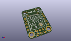
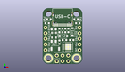
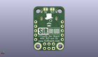
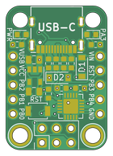
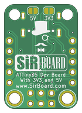

Contents
========

* [PRPR21 > ](#prpr21--)
	* [Interactive BOM](#interactive-bom)
	* [OOMP Parts](#oomp-parts)
	* [Images](#images)
	* [Tags](#tags)
  
![][im]
# PRPR21 > 

- ID: PROJ-SIRB-0021-STAN-01
- Hex ID: PRPR21
- Name: ATTiny85 SirTiny
- Description: ATTiny85 SirTiny
- Long Link: [http://oom.lt/PROJ-SIRB-0021-STAN-01](http://oom.lt/PROJ-SIRB-0021-STAN-01)
- Short Link: [http://oom.lt/PRPR21](http://oom.lt/PRPR21)

## Interactive BOM

- Interactive BOM page: [ibom.html](https://htmlpreview.github.io/?https://github.com/oomlout/oomlout_OOMP_projects/blob/main/PROJ-SIRB-0021-STAN-01/kicad/bom/ibom.html)

## OOMP Parts
  

|OOMP ID|Name|Identifier|
| :---: | :---: | :---: |
|[CAPC-0603-X-NF100-V50](https://github.com/oomlout/oomlout_OOMP_parts/tree/main/CAPC-0603-X-NF100-V50/)|[SMD (0603) 100 nF Capacitor (Ceramic) 50v](https://github.com/oomlout/oomlout_OOMP_parts/tree/main/CAPC-0603-X-NF100-V50/)|[C3](https://github.com/oomlout/oomlout_OOMP_parts/tree/main/CAPC-0603-X-NF100-V50/)|
|UNMATCHED-UNMATCHED-X-UNMATCHED-01||U1, RST, USB-C|
|[HEAD-I01-X-PI05-01](https://github.com/oomlout/oomlout_OOMP_parts/tree/main/HEAD-I01-X-PI05-01/)|[2.54 mm 5 Pin Header](https://github.com/oomlout/oomlout_OOMP_parts/tree/main/HEAD-I01-X-PI05-01/)|[J2, J3](https://github.com/oomlout/oomlout_OOMP_parts/tree/main/HEAD-I01-X-PI05-01/)|
|UNMATCHED-SO235-X-UNMATCHED-01||U2|
|[RESE-0603-X-O102-01](https://github.com/oomlout/oomlout_OOMP_parts/tree/main/RESE-0603-X-O102-01/)|[SMD (0603) 1k Ohm Resistor](https://github.com/oomlout/oomlout_OOMP_parts/tree/main/RESE-0603-X-O102-01/)|[R8, R7](https://github.com/oomlout/oomlout_OOMP_parts/tree/main/RESE-0603-X-O102-01/)|
|RESE-0603-X-UNMATCHED-01||R6, R4, R3, R2, R1|
|[RESE-0603-X-O103-01](https://github.com/oomlout/oomlout_OOMP_parts/tree/main/RESE-0603-X-O103-01/)|[SMD (0603) 10k Ohm Resistor](https://github.com/oomlout/oomlout_OOMP_parts/tree/main/RESE-0603-X-O103-01/)|[R5](https://github.com/oomlout/oomlout_OOMP_parts/tree/main/RESE-0603-X-O103-01/)|
|[HEAD-I01-X-PI2X03-01](https://github.com/oomlout/oomlout_OOMP_parts/tree/main/HEAD-I01-X-PI2X03-01/)|[2.54 mm 6 Pin (2x3) Header](https://github.com/oomlout/oomlout_OOMP_parts/tree/main/HEAD-I01-X-PI2X03-01/)|[J4](https://github.com/oomlout/oomlout_OOMP_parts/tree/main/HEAD-I01-X-PI2X03-01/)|
|[LEDS-0603-R-STAN-01](https://github.com/oomlout/oomlout_OOMP_parts/tree/main/LEDS-0603-R-STAN-01/)|[SMD (0603) Red LED](https://github.com/oomlout/oomlout_OOMP_parts/tree/main/LEDS-0603-R-STAN-01/)|[PWR, PA3](https://github.com/oomlout/oomlout_OOMP_parts/tree/main/LEDS-0603-R-STAN-01/)|
|[DIOD-S123-X-KMBR120-01](https://github.com/oomlout/oomlout_OOMP_parts/tree/main/DIOD-S123-X-KMBR120-01/)|[SMD (SOD-123) MBR120 Diode](https://github.com/oomlout/oomlout_OOMP_parts/tree/main/DIOD-S123-X-KMBR120-01/)|[D2, D1](https://github.com/oomlout/oomlout_OOMP_parts/tree/main/DIOD-S123-X-KMBR120-01/)|
|[CAPC-0805-X-UF10-V10](https://github.com/oomlout/oomlout_OOMP_parts/tree/main/CAPC-0805-X-UF10-V10/)|[SMD (0805) 10 uF Capacitor (Ceramic) 10v](https://github.com/oomlout/oomlout_OOMP_parts/tree/main/CAPC-0805-X-UF10-V10/)|[C2, C1](https://github.com/oomlout/oomlout_OOMP_parts/tree/main/CAPC-0805-X-UF10-V10/)|

## Images
  
  

|kicadPcb3d|kicadPcb3dFront|kicadPcb3dBack|pcbdraw|pcbdrawback|
| :---: | :---: | :---: | :---: | :---: |
||||||

## Tags

- oompType: PROJ
- oompSize: SIRB
- oompColor: 0021
- oompDesc: STAN
- oompIndex: 01
- name: ATTiny85 SirTiny
- gitRepo: https://github.com/sirboard/SirTiny
- gitName: SirTiny
- kicadBoard: ATTiny85/ATTiny85.kicad_pcb
- kicadSchem: ATTiny85/ATTiny85.kicad_sch
- hexID: PRPR21
- oompID: PROJ-SIRB-0021-STAN-01
- oompParts: C3,CAPC-0603-X-NF100-V50
- oompParts: U1,UNMATCHED-UNMATCHED-X-UNMATCHED-01
- oompParts: J2,HEAD-I01-X-PI05-01
- oompParts: J3,HEAD-I01-X-PI05-01
- oompParts: U2,UNMATCHED-SO235-X-UNMATCHED-01
- oompParts: RST,UNMATCHED-UNMATCHED-X-UNMATCHED-01
- oompParts: R8,RESE-0603-X-O102-01
- oompParts: R7,RESE-0603-X-O102-01
- oompParts: R6,RESE-0603-X-UNMATCHED-01
- oompParts: R5,RESE-0603-X-O103-01
- oompParts: R4,RESE-0603-X-UNMATCHED-01
- oompParts: R3,RESE-0603-X-UNMATCHED-01
- oompParts: R2,RESE-0603-X-UNMATCHED-01
- oompParts: R1,RESE-0603-X-UNMATCHED-01
- oompParts: J4,HEAD-I01-X-PI2X03-01
- oompParts: USB-C,UNMATCHED-UNMATCHED-X-UNMATCHED-01
- oompParts: PWR,LEDS-0603-R-STAN-01
- oompParts: PA3,LEDS-0603-R-STAN-01
- oompParts: D2,DIOD-S123-X-KMBR120-01
- oompParts: D1,DIOD-S123-X-KMBR120-01
- oompParts: C2,CAPC-0805-X-UF10-V10
- oompParts: C1,CAPC-0805-X-UF10-V10
- rawParts: G***,LOGO,SirBoard127x40,SirBoard127x40,,,,
- rawParts: G***,LOGO,logo76x107,logo76x107,,,,
- rawParts: C3,100nF,C_0603_1608Metric,C_0603_1608Metric,,,,
- rawParts: U1,ATtiny85-20MU,QFN-20-1EP_4x4mm_P0.5mm_EP2.6x2.6mm,QFN-20-1EP_4x4mm_P0.5mm_EP2.6x2.6mm,,,,
- rawParts: J2,Conn_01x05,PinHeader_1x05_P2.54mm_Vertical,PinHeader_1x05_P2.54mm_Vertical,,,,
- rawParts: J3,Conn_01x05,PinHeader_1x05_P2.54mm_Vertical,PinHeader_1x05_P2.54mm_Vertical,,,,
- rawParts: U2,SPX3819M5-L-3-3,SOT-23-5,SOT-23-5,,,,
- rawParts: RST,SW_SPST,SW_SPST_B3U-1000P,SW_SPST_B3U-1000P,,,,
- rawParts: R8,1K,R_0603_1608Metric,R_0603_1608Metric,,,,
- rawParts: R7,1K,R_0603_1608Metric,R_0603_1608Metric,,,,
- rawParts: R6,1k5,R_0603_1608Metric,R_0603_1608Metric,,,,
- rawParts: R5,10K,R_0603_1608Metric,R_0603_1608Metric,,,,
- rawParts: R4,68e,R_0603_1608Metric,R_0603_1608Metric,,,,
- rawParts: R3,68e,R_0603_1608Metric,R_0603_1608Metric,,,,
- rawParts: R2,5k1,R_0603_1608Metric,R_0603_1608Metric,,,,
- rawParts: R1,5k1,R_0603_1608Metric,R_0603_1608Metric,,,,
- rawParts: J4,ISP6,PinHeader_2x03_P2.54mm_Vertical,PinHeader_2x03_P2.54mm_Vertical,,,,
- rawParts: USB-C,USB_C_Receptacle_USB2.0,USB_C,USB_C,,,,
- rawParts: PWR,RED,LED_0603_1608Metric,LED_0603_1608Metric,,,,
- rawParts: PA3,RED,LED_0603_1608Metric,LED_0603_1608Metric,,,,
- rawParts: D2,MBR120,D_SOD-123,D_SOD-123,,,,
- rawParts: D1,MBR120,D_SOD-123,D_SOD-123,,,,
- rawParts: C2,10uF,C_0805_2012Metric,C_0805_2012Metric,,,,
- rawParts: C1,10uF,C_0805_2012Metric,C_0805_2012Metric,,,,

[im]: kicadPcb3d_450.png
