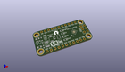
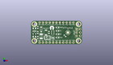
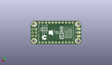
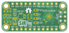
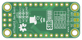

Contents
========

* [PRPR24 > ](#prpr24--)
	* [Interactive BOM](#interactive-bom)
	* [OOMP Parts](#oomp-parts)
	* [Images](#images)
	* [Tags](#tags)
  
![][im]
# PRPR24 > 

- ID: PROJ-SIRB-0024-STAN-01
- Hex ID: PRPR24
- Name: ATTinyX16 SirTiny
- Description: ATTinyX16 SirTiny
- Long Link: [http://oom.lt/PROJ-SIRB-0024-STAN-01](http://oom.lt/PROJ-SIRB-0024-STAN-01)
- Short Link: [http://oom.lt/PRPR24](http://oom.lt/PRPR24)

## Interactive BOM

- Interactive BOM page: [ibom.html](https://htmlpreview.github.io/?https://github.com/oomlout/oomlout_OOMP_projects/blob/main/PROJ-SIRB-0024-STAN-01/kicad/bom/ibom.html)

## OOMP Parts
  

|OOMP ID|Name|Identifier|
| :---: | :---: | :---: |
|CAPX-UNMATCHED-X-UF22-01||C5|
|HEAD-I01-X-PI11-01||J2, J1|
|UNMATCHED-UNMATCHED-X-UNMATCHED-01||U2, RN1, RESET|
|[LEDS-0603-G-STAN-01](https://github.com/oomlout/oomlout_OOMP_parts/tree/main/LEDS-0603-G-STAN-01/)|[SMD (0603) Green LED](https://github.com/oomlout/oomlout_OOMP_parts/tree/main/LEDS-0603-G-STAN-01/)|[TX, RX](https://github.com/oomlout/oomlout_OOMP_parts/tree/main/LEDS-0603-G-STAN-01/)|
|[DIOD-S123-X-KMBR120-01](https://github.com/oomlout/oomlout_OOMP_parts/tree/main/DIOD-S123-X-KMBR120-01/)|[SMD (SOD-123) MBR120 Diode](https://github.com/oomlout/oomlout_OOMP_parts/tree/main/DIOD-S123-X-KMBR120-01/)|[D1](https://github.com/oomlout/oomlout_OOMP_parts/tree/main/DIOD-S123-X-KMBR120-01/)|
|[CAPC-0603-X-NF100-V50](https://github.com/oomlout/oomlout_OOMP_parts/tree/main/CAPC-0603-X-NF100-V50/)|[SMD (0603) 100 nF Capacitor (Ceramic) 50v](https://github.com/oomlout/oomlout_OOMP_parts/tree/main/CAPC-0603-X-NF100-V50/)|[C3](https://github.com/oomlout/oomlout_OOMP_parts/tree/main/CAPC-0603-X-NF100-V50/)|
|[CAPC-0805-X-UF10-V10](https://github.com/oomlout/oomlout_OOMP_parts/tree/main/CAPC-0805-X-UF10-V10/)|[SMD (0805) 10 uF Capacitor (Ceramic) 10v](https://github.com/oomlout/oomlout_OOMP_parts/tree/main/CAPC-0805-X-UF10-V10/)|[C1](https://github.com/oomlout/oomlout_OOMP_parts/tree/main/CAPC-0805-X-UF10-V10/)|
|[CAPC-0805-X-UF22-V63D](https://github.com/oomlout/oomlout_OOMP_parts/tree/main/CAPC-0805-X-UF22-V63D/)|[SMD (0805) 22 uF Capacitor (Ceramic) 6.3v](https://github.com/oomlout/oomlout_OOMP_parts/tree/main/CAPC-0805-X-UF22-V63D/)|[C2](https://github.com/oomlout/oomlout_OOMP_parts/tree/main/CAPC-0805-X-UF22-V63D/)|
|UNMATCHED-SO235-X-UNMATCHED-01||U1|
|[RESE-0603-X-O103-01](https://github.com/oomlout/oomlout_OOMP_parts/tree/main/RESE-0603-X-O103-01/)|[SMD (0603) 10k Ohm Resistor](https://github.com/oomlout/oomlout_OOMP_parts/tree/main/RESE-0603-X-O103-01/)|[R6](https://github.com/oomlout/oomlout_OOMP_parts/tree/main/RESE-0603-X-O103-01/)|
|[RESE-0603-X-O183-01](https://github.com/oomlout/oomlout_OOMP_parts/tree/main/RESE-0603-X-O183-01/)|[SMD (0603) 18k Ohm Resistor](https://github.com/oomlout/oomlout_OOMP_parts/tree/main/RESE-0603-X-O183-01/)|[R5](https://github.com/oomlout/oomlout_OOMP_parts/tree/main/RESE-0603-X-O183-01/)|
|RESE-0603-X-UNMATCHED-01||R4|
|[RESE-0603-X-O393-01](https://github.com/oomlout/oomlout_OOMP_parts/tree/main/RESE-0603-X-O393-01/)|[SMD (0603) 39k Ohm Resistor](https://github.com/oomlout/oomlout_OOMP_parts/tree/main/RESE-0603-X-O393-01/)|[R3](https://github.com/oomlout/oomlout_OOMP_parts/tree/main/RESE-0603-X-O393-01/)|
|[HEAD-I01-X-PI2X03-01](https://github.com/oomlout/oomlout_OOMP_parts/tree/main/HEAD-I01-X-PI2X03-01/)|[2.54 mm 6 Pin (2x3) Header](https://github.com/oomlout/oomlout_OOMP_parts/tree/main/HEAD-I01-X-PI2X03-01/)|[UPDI](https://github.com/oomlout/oomlout_OOMP_parts/tree/main/HEAD-I01-X-PI2X03-01/)|
|[LEDS-0603-L-STAN-01](https://github.com/oomlout/oomlout_OOMP_parts/tree/main/LEDS-0603-L-STAN-01/)|[SMD (0603) Blue LED](https://github.com/oomlout/oomlout_OOMP_parts/tree/main/LEDS-0603-L-STAN-01/)|[PA3](https://github.com/oomlout/oomlout_OOMP_parts/tree/main/LEDS-0603-L-STAN-01/)|
|[LEDS-0603-R-STAN-01](https://github.com/oomlout/oomlout_OOMP_parts/tree/main/LEDS-0603-R-STAN-01/)|[SMD (0603) Red LED](https://github.com/oomlout/oomlout_OOMP_parts/tree/main/LEDS-0603-R-STAN-01/)|[PWR](https://github.com/oomlout/oomlout_OOMP_parts/tree/main/LEDS-0603-R-STAN-01/)|

## Images
  
  

|kicadPcb3d|kicadPcb3dFront|kicadPcb3dBack|pcbdraw|pcbdrawback|
| :---: | :---: | :---: | :---: | :---: |
||||||

## Tags

- oompType: PROJ
- oompSize: SIRB
- oompColor: 0024
- oompDesc: STAN
- oompIndex: 01
- name: ATTinyX16 SirTiny
- gitRepo: https://github.com/sirboard/SirTiny
- gitName: SirTiny
- kicadBoard: ATTinyX16/ATTinyX16.kicad_pcb
- kicadSchem: ATTinyX16/ATTinyX16.kicad_sch
- hexID: PRPR24
- oompID: PROJ-SIRB-0024-STAN-01
- oompParts: C5,CAPX-UNMATCHED-X-UF22-01
- oompParts: J2,HEAD-I01-X-PI11-01
- oompParts: J1,HEAD-I01-X-PI11-01
- oompParts: U2,UNMATCHED-UNMATCHED-X-UNMATCHED-01
- oompParts: RN1,UNMATCHED-UNMATCHED-X-UNMATCHED-01
- oompParts: TX,LEDS-0603-G-STAN-01
- oompParts: RX,LEDS-0603-G-STAN-01
- oompParts: D1,DIOD-S123-X-KMBR120-01
- oompParts: C3,CAPC-0603-X-NF100-V50
- oompParts: C1,CAPC-0805-X-UF10-V10
- oompParts: C2,CAPC-0805-X-UF22-V63D
- oompParts: U1,UNMATCHED-SO235-X-UNMATCHED-01
- oompParts: RESET,UNMATCHED-UNMATCHED-X-UNMATCHED-01
- oompParts: R6,RESE-0603-X-O103-01
- oompParts: R5,RESE-0603-X-O183-01
- oompParts: R4,RESE-0603-X-UNMATCHED-01
- oompParts: R3,RESE-0603-X-O393-01
- oompParts: UPDI,HEAD-I01-X-PI2X03-01
- oompParts: PA3,LEDS-0603-L-STAN-01
- oompParts: PWR,LEDS-0603-R-STAN-01
- rawParts: G***,LOGO,SirTiny80X31,SirTiny80X31,,,,
- rawParts: C5,22uF,CP_EIA-3528-15_AVX-H,CP_EIA-3528-15_AVX-H,,,,
- rawParts: J2,Conn_01x11,PinHeader_1x11_P2.54mm_Vertical,PinHeader_1x11_P2.54mm_Vertical,,,,
- rawParts: J1,Conn_01x11,PinHeader_1x11_P2.54mm_Vertical,PinHeader_1x11_P2.54mm_Vertical,,,,
- rawParts: U2,ATtiny1616-M,VQFN-20-1EP_3x3mm_P0.4mm_EP1.7x1.7mm,VQFN-20-1EP_3x3mm_P0.4mm_EP1.7x1.7mm,,,,
- rawParts: G***,LOGO,OSHW62x45,OSHW62x45,,,,
- rawParts: G***,LOGO,logo76x107,logo76x107,,,,
- rawParts: G***,LOGO,OSHW55x39,OSHW55x39,,,,
- rawParts: RN1,330E,R_Array_Convex_4x0603,R_Array_Convex_4x0603,,,,
- rawParts: TX,YEL,LED_0603_1608Metric,LED_0603_1608Metric,,,,
- rawParts: RX,YEL,LED_0603_1608Metric,LED_0603_1608Metric,,,,
- rawParts: D1,MBR120,D_SOD-123,D_SOD-123,,,,
- rawParts: G***,LOGO,SirBoard98x31,SirBoard98x31,,,,
- rawParts: C3,100nF,C_0603_1608Metric,C_0603_1608Metric,,,,
- rawParts: C1,10uF,C_0805_2012Metric,C_0805_2012Metric,,,,
- rawParts: C2,2u2,C_0805_2012Metric,C_0805_2012Metric,,,,
- rawParts: U1,AP7365,SOT-23-5,SOT-23-5,,,,
- rawParts: RESET,RST,SW_SPST_B3U-1000P,SW_SPST_B3U-1000P,,,,
- rawParts: R6,10k,R_0603_1608Metric,R_0603_1608Metric,,,,
- rawParts: R5,18k,R_0603_1608Metric,R_0603_1608Metric,,,,
- rawParts: R4,12.4k,R_0603_1608Metric,R_0603_1608Metric,,,,
- rawParts: R3,39k,R_0603_1608Metric,R_0603_1608Metric,,,,
- rawParts: UPDI,UPDI,PinHeader_2x03_P2.54mm_Vertical,PinHeader_2x03_P2.54mm_Vertical,,,,
- rawParts: PA3,BLUE,LED_0603_1608Metric,LED_0603_1608Metric,,,,
- rawParts: PWR,RED,LED_0603_1608Metric,LED_0603_1608Metric,,,,

[im]: kicadPcb3d_450.png
