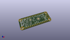
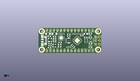
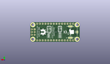
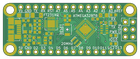
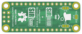

Contents
========

* [PRPR26 > ](#prpr26--)
	* [Interactive BOM](#interactive-bom)
	* [OOMP Parts](#oomp-parts)
	* [Images](#images)
	* [Tags](#tags)
  
![][im]
# PRPR26 > 

- ID: PROJ-SIRB-0026-STAN-02
- Hex ID: PRPR26
- Name: SirNanoV2 SirNano
- Description: SirNanoV2 SirNano
- Long Link: [http://oom.lt/PROJ-SIRB-0026-STAN-02](http://oom.lt/PROJ-SIRB-0026-STAN-02)
- Short Link: [http://oom.lt/PRPR26](http://oom.lt/PRPR26)

## Interactive BOM

- Interactive BOM page: [ibom.html](https://htmlpreview.github.io/?https://github.com/oomlout/oomlout_OOMP_projects/blob/main/PROJ-SIRB-0026-STAN-02/kicad/bom/ibom.html)

## OOMP Parts
  

|OOMP ID|Name|Identifier|
| :---: | :---: | :---: |
|UNMATCHED-UNMATCHED-X-UNMATCHED-01||RN1, F1, RESET, 20MHz, U1, FT231XQ, J3|
|[RESE-0603-X-O563-01](https://github.com/oomlout/oomlout_OOMP_parts/tree/main/RESE-0603-X-O563-01/)|[SMD (0603) 56k Ohm Resistor](https://github.com/oomlout/oomlout_OOMP_parts/tree/main/RESE-0603-X-O563-01/)|[R5](https://github.com/oomlout/oomlout_OOMP_parts/tree/main/RESE-0603-X-O563-01/)|
|[CAPC-0603-X-NF100-V50](https://github.com/oomlout/oomlout_OOMP_parts/tree/main/CAPC-0603-X-NF100-V50/)|[SMD (0603) 100 nF Capacitor (Ceramic) 50v](https://github.com/oomlout/oomlout_OOMP_parts/tree/main/CAPC-0603-X-NF100-V50/)|[C11, C3, C1](https://github.com/oomlout/oomlout_OOMP_parts/tree/main/CAPC-0603-X-NF100-V50/)|
|[CAPC-0603-X-UF1-V25](https://github.com/oomlout/oomlout_OOMP_parts/tree/main/CAPC-0603-X-UF1-V25/)|[SMD (0603) 1 uF Capacitor (Ceramic) 25v](https://github.com/oomlout/oomlout_OOMP_parts/tree/main/CAPC-0603-X-UF1-V25/)|[C10, C9, C7](https://github.com/oomlout/oomlout_OOMP_parts/tree/main/CAPC-0603-X-UF1-V25/)|
|[RESE-0603-X-O683-01](https://github.com/oomlout/oomlout_OOMP_parts/tree/main/RESE-0603-X-O683-01/)|[SMD (0603) 68k Ohm Resistor](https://github.com/oomlout/oomlout_OOMP_parts/tree/main/RESE-0603-X-O683-01/)|[R7](https://github.com/oomlout/oomlout_OOMP_parts/tree/main/RESE-0603-X-O683-01/)|
|DIOD-UNMATCHED-X-UNMATCHED-01||D1|
|[RESE-0603-X-O103-01](https://github.com/oomlout/oomlout_OOMP_parts/tree/main/RESE-0603-X-O103-01/)|[SMD (0603) 10k Ohm Resistor](https://github.com/oomlout/oomlout_OOMP_parts/tree/main/RESE-0603-X-O103-01/)|[R3](https://github.com/oomlout/oomlout_OOMP_parts/tree/main/RESE-0603-X-O103-01/)|
|[RESE-0603-X-O223-01](https://github.com/oomlout/oomlout_OOMP_parts/tree/main/RESE-0603-X-O223-01/)|[SMD (0603) 22k Ohm Resistor](https://github.com/oomlout/oomlout_OOMP_parts/tree/main/RESE-0603-X-O223-01/)|[R6](https://github.com/oomlout/oomlout_OOMP_parts/tree/main/RESE-0603-X-O223-01/)|
|[HEAD-I01-X-PI14-01](https://github.com/oomlout/oomlout_OOMP_parts/tree/main/HEAD-I01-X-PI14-01/)|[2.54 mm 14 Pin Header](https://github.com/oomlout/oomlout_OOMP_parts/tree/main/HEAD-I01-X-PI14-01/)|[J1, J2](https://github.com/oomlout/oomlout_OOMP_parts/tree/main/HEAD-I01-X-PI14-01/)|
|UNMATCHED-SO235-X-UNMATCHED-01||U2|
|[LEDS-0603-G-STAN-01](https://github.com/oomlout/oomlout_OOMP_parts/tree/main/LEDS-0603-G-STAN-01/)|[SMD (0603) Green LED](https://github.com/oomlout/oomlout_OOMP_parts/tree/main/LEDS-0603-G-STAN-01/)|[TX, RX, PWR, IO13](https://github.com/oomlout/oomlout_OOMP_parts/tree/main/LEDS-0603-G-STAN-01/)|
|RESE-0603-X-UNMATCHED-01||R2, R1|
|UNMATCHED-0805-X-UNMATCHED-01||L1|
|CAPX-UNMATCHED-X-UF22-01||C8|
|[CAPC-0603-X-NF10-V50](https://github.com/oomlout/oomlout_OOMP_parts/tree/main/CAPC-0603-X-NF10-V50/)|[SMD (0603) 10 nF Capacitor (Ceramic) 50v](https://github.com/oomlout/oomlout_OOMP_parts/tree/main/CAPC-0603-X-NF10-V50/)|[C6](https://github.com/oomlout/oomlout_OOMP_parts/tree/main/CAPC-0603-X-NF10-V50/)|
|CAPC-0603-X-PF47-01||C4, C2|
|[HEAD-I01-X-PI2X03-01](https://github.com/oomlout/oomlout_OOMP_parts/tree/main/HEAD-I01-X-PI2X03-01/)|[2.54 mm 6 Pin (2x3) Header](https://github.com/oomlout/oomlout_OOMP_parts/tree/main/HEAD-I01-X-PI2X03-01/)|[ICSP6](https://github.com/oomlout/oomlout_OOMP_parts/tree/main/HEAD-I01-X-PI2X03-01/)|

## Images
  
  

|kicadPcb3d|kicadPcb3dFront|kicadPcb3dBack|pcbdraw|pcbdrawback|
| :---: | :---: | :---: | :---: | :---: |
||||||

## Tags

- oompType: PROJ
- oompSize: SIRB
- oompColor: 0026
- oompDesc: STAN
- oompIndex: 02
- name: SirNanoV2 SirNano
- gitRepo: https://github.com/sirboard/SirNano
- gitName: SirNano
- kicadBoard: SirNanoV2/SirNanoV2.kicad_pcb
- kicadSchem: SirNanoV2/SirNanoV2.kicad_sch
- hexID: PRPR26
- oompID: PROJ-SIRB-0026-STAN-02
- oompParts: RN1,UNMATCHED-UNMATCHED-X-UNMATCHED-01
- oompParts: R5,RESE-0603-X-O563-01
- oompParts: C11,CAPC-0603-X-NF100-V50
- oompParts: C3,CAPC-0603-X-NF100-V50
- oompParts: C1,CAPC-0603-X-NF100-V50
- oompParts: C10,CAPC-0603-X-UF1-V25
- oompParts: C9,CAPC-0603-X-UF1-V25
- oompParts: F1,UNMATCHED-UNMATCHED-X-UNMATCHED-01
- oompParts: RESET,UNMATCHED-UNMATCHED-X-UNMATCHED-01
- oompParts: C7,CAPC-0603-X-UF1-V25
- oompParts: R7,RESE-0603-X-O683-01
- oompParts: D1,DIOD-UNMATCHED-X-UNMATCHED-01
- oompParts: R3,RESE-0603-X-O103-01
- oompParts: R6,RESE-0603-X-O223-01
- oompParts: J1,HEAD-I01-X-PI14-01
- oompParts: J2,HEAD-I01-X-PI14-01
- oompParts: U2,UNMATCHED-SO235-X-UNMATCHED-01
- oompParts: 20MHz,UNMATCHED-UNMATCHED-X-UNMATCHED-01
- oompParts: U1,UNMATCHED-UNMATCHED-X-UNMATCHED-01
- oompParts: TX,LEDS-0603-G-STAN-01
- oompParts: RX,LEDS-0603-G-STAN-01
- oompParts: PWR,LEDS-0603-G-STAN-01
- oompParts: IO13,LEDS-0603-G-STAN-01
- oompParts: R2,RESE-0603-X-UNMATCHED-01
- oompParts: R1,RESE-0603-X-UNMATCHED-01
- oompParts: L1,UNMATCHED-0805-X-UNMATCHED-01
- oompParts: C8,CAPX-UNMATCHED-X-UF22-01
- oompParts: C6,CAPC-0603-X-NF10-V50
- oompParts: C4,CAPC-0603-X-PF47-01
- oompParts: C2,CAPC-0603-X-PF47-01
- oompParts: ICSP6,HEAD-I01-X-PI2X03-01
- oompParts: FT231XQ,UNMATCHED-UNMATCHED-X-UNMATCHED-01
- oompParts: J3,UNMATCHED-UNMATCHED-X-UNMATCHED-01
- rawParts: RN1,R_Pack04,R_Array_Convex_4x0603,R_Array_Convex_4x0603,,,,
- rawParts: R5,56k,R_0603_1608Metric,R_0603_1608Metric,,,,
- rawParts: C11,100nF,C_0603_1608Metric,C_0603_1608Metric,,,,
- rawParts: C3,100nF,C_0603_1608Metric,C_0603_1608Metric,,,,
- rawParts: C1,100nF,C_0603_1608Metric,C_0603_1608Metric,,,,
- rawParts: C10,1uF,C_0603_1608Metric_Pad1.05x0.95mm_HandSolder,C_0603_1608Metric_Pad1.05x0.95mm_HandSolder,,,,
- rawParts: C9,1uF,C_0603_1608Metric_Pad1.05x0.95mm_HandSolder,C_0603_1608Metric_Pad1.05x0.95mm_HandSolder,,,,
- rawParts: F1,500mA,R_1206_3216Metric,R_1206_3216Metric,,,,
- rawParts: G***,LOGO,logo94x134,logo94x134,,,,
- rawParts: RESET,SW_Push,SW_SPST_B3U-1000P-B,SW_SPST_B3U-1000P-B,,,,
- rawParts: C7,1uF,C_0603_1608Metric,C_0603_1608Metric,,,,
- rawParts: R7,68k,R_0603_1608Metric,R_0603_1608Metric,,,,
- rawParts: D1,PRTR5V0U2X,SOT-143,SOT-143,,,,
- rawParts: R3,10k,R_0603_1608Metric,R_0603_1608Metric,,,,
- rawParts: R6,22k,R_0603_1608Metric,R_0603_1608Metric,,,,
- rawParts: J1,Conn_01x14,PinHeader_1x14_P2.54mm_Vertical,PinHeader_1x14_P2.54mm_Vertical,,,,
- rawParts: J2,Conn_01x14,PinHeader_1x14_P2.54mm_Vertical,PinHeader_1x14_P2.54mm_Vertical,,,,
- rawParts: G***,LOGO,SirNano118x40,SirNano118x40,,,,
- rawParts: G***,LOGO,SirBoard112x35,SirBoard112x35,,,,
- rawParts: U2,AP7365-ADJ,SOT-23-5,SOT-23-5,,,,
- rawParts: 20MHz,20MHz,Resonator_SMD_muRata_CSTxExxV-3Pin_3.0x1.1mm,Resonator_SMD_muRata_CSTxExxV-3Pin_3.0x1.1mm,,,,
- rawParts: U1,ATmega328PB-MU,QFN-32-1EP_5x5mm_P0.5mm_EP3.1x3.1mm,QFN-32-1EP_5x5mm_P0.5mm_EP3.1x3.1mm,,,,
- rawParts: TX,LED,LED_0603_1608Metric,LED_0603_1608Metric,,,,
- rawParts: RX,LED,LED_0603_1608Metric,LED_0603_1608Metric,,,,
- rawParts: PWR,LED,LED_0603_1608Metric,LED_0603_1608Metric,,,,
- rawParts: IO13,LED,LED_0603_1608Metric,LED_0603_1608Metric,,,,
- rawParts: R2,27e,R_0603_1608Metric,R_0603_1608Metric,,,,
- rawParts: R1,27e,R_0603_1608Metric,R_0603_1608Metric,,,,
- rawParts: L1,10uH,L_0805_2012Metric_Pad1.15x1.40mm_HandSolder,L_0805_2012Metric_Pad1.15x1.40mm_HandSolder,,,,
- rawParts: C8,22uF,CP_EIA-3216-12_Kemet-S,CP_EIA-3216-12_Kemet-S,,,,
- rawParts: C6,10nF,C_0603_1608Metric,C_0603_1608Metric,,,,
- rawParts: C4,47pF,C_0603_1608Metric,C_0603_1608Metric,,,,
- rawParts: C2,47pF,C_0603_1608Metric,C_0603_1608Metric,,,,
- rawParts: ICSP6,Conn_02x03_Odd_Even,PinHeader_2x03_P2.54mm_Vertical,PinHeader_2x03_P2.54mm_Vertical,,,,
- rawParts: FT231XQ,FT231XQ,QFN-20-1EP_4x4mm_P0.5mm_EP2.5x2.5mm,QFN-20-1EP_4x4mm_P0.5mm_EP2.5x2.5mm,,,,
- rawParts: J3,USB_B_Micro,USB_Micro-B_Molex_47346-0001,USB_Micro-B_Molex_47346-0001,,,,

[im]: kicadPcb3d_450.png
