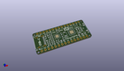
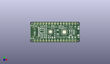
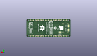
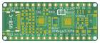
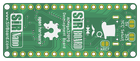

Contents
========

* [PRPR26 > ](#prpr26--)
	* [Interactive BOM](#interactive-bom)
	* [OOMP Parts](#oomp-parts)
	* [Images](#images)
	* [Tags](#tags)
  
![][im]
# PRPR26 > 

- ID: PROJ-SIRB-0026-STAN-03
- Hex ID: PRPR26
- Name: SirNanoV3 SirNano
- Description: SirNanoV3 SirNano
- Long Link: [http://oom.lt/PROJ-SIRB-0026-STAN-03](http://oom.lt/PROJ-SIRB-0026-STAN-03)
- Short Link: [http://oom.lt/PRPR26](http://oom.lt/PRPR26)

## Interactive BOM

- Interactive BOM page: [ibom.html](https://htmlpreview.github.io/?https://github.com/oomlout/oomlout_OOMP_projects/blob/main/PROJ-SIRB-0026-STAN-03/kicad/bom/ibom.html)

## OOMP Parts
  

|OOMP ID|Name|Identifier|
| :---: | :---: | :---: |
|UNMATCHED-UNMATCHED-X-UNMATCHED-01||USB-C, Y1, U1, J3, RESET, U3|
|[DIOD-S123-X-KMBR120-01](https://github.com/oomlout/oomlout_OOMP_parts/tree/main/DIOD-S123-X-KMBR120-01/)|[SMD (SOD-123) MBR120 Diode](https://github.com/oomlout/oomlout_OOMP_parts/tree/main/DIOD-S123-X-KMBR120-01/)|[D2, D3](https://github.com/oomlout/oomlout_OOMP_parts/tree/main/DIOD-S123-X-KMBR120-01/)|
|CAPX-UNMATCHED-X-UF22-01||C8|
|UNMATCHED-SO235-X-UNMATCHED-01||U2|
|RESE-0603-X-UNMATCHED-01||R12, R11, R2, R1|
|DIOD-UNMATCHED-X-UNMATCHED-01||D1|
|UNMATCHED-0805-X-UNMATCHED-01||F1, L1|
|[LEDS-0603-G-STAN-01](https://github.com/oomlout/oomlout_OOMP_parts/tree/main/LEDS-0603-G-STAN-01/)|[SMD (0603) Green LED](https://github.com/oomlout/oomlout_OOMP_parts/tree/main/LEDS-0603-G-STAN-01/)|[PWR, D13, TX0, RX0](https://github.com/oomlout/oomlout_OOMP_parts/tree/main/LEDS-0603-G-STAN-01/)|
|[RESE-0603-X-O102-01](https://github.com/oomlout/oomlout_OOMP_parts/tree/main/RESE-0603-X-O102-01/)|[SMD (0603) 1k Ohm Resistor](https://github.com/oomlout/oomlout_OOMP_parts/tree/main/RESE-0603-X-O102-01/)|[R10, R9, R8, R4](https://github.com/oomlout/oomlout_OOMP_parts/tree/main/RESE-0603-X-O102-01/)|
|[RESE-0603-X-O103-01](https://github.com/oomlout/oomlout_OOMP_parts/tree/main/RESE-0603-X-O103-01/)|[SMD (0603) 10k Ohm Resistor](https://github.com/oomlout/oomlout_OOMP_parts/tree/main/RESE-0603-X-O103-01/)|[R3](https://github.com/oomlout/oomlout_OOMP_parts/tree/main/RESE-0603-X-O103-01/)|
|[CAPC-0603-X-NF100-V50](https://github.com/oomlout/oomlout_OOMP_parts/tree/main/CAPC-0603-X-NF100-V50/)|[SMD (0603) 100 nF Capacitor (Ceramic) 50v](https://github.com/oomlout/oomlout_OOMP_parts/tree/main/CAPC-0603-X-NF100-V50/)|[C11, C9, C3, C1](https://github.com/oomlout/oomlout_OOMP_parts/tree/main/CAPC-0603-X-NF100-V50/)|
|[CAPC-0805-X-UF10-V10](https://github.com/oomlout/oomlout_OOMP_parts/tree/main/CAPC-0805-X-UF10-V10/)|[SMD (0805) 10 uF Capacitor (Ceramic) 10v](https://github.com/oomlout/oomlout_OOMP_parts/tree/main/CAPC-0805-X-UF10-V10/)|[C7](https://github.com/oomlout/oomlout_OOMP_parts/tree/main/CAPC-0805-X-UF10-V10/)|
|HEAD-I01-X-PI15-01||J1, J2|
|[CAPC-0603-X-NF10-V50](https://github.com/oomlout/oomlout_OOMP_parts/tree/main/CAPC-0603-X-NF10-V50/)|[SMD (0603) 10 nF Capacitor (Ceramic) 50v](https://github.com/oomlout/oomlout_OOMP_parts/tree/main/CAPC-0603-X-NF10-V50/)|[C6](https://github.com/oomlout/oomlout_OOMP_parts/tree/main/CAPC-0603-X-NF10-V50/)|
|CAPC-0603-X-PF47-01||C4, C2|

## Images
  
  

|kicadPcb3d|kicadPcb3dFront|kicadPcb3dBack|pcbdraw|pcbdrawback|
| :---: | :---: | :---: | :---: | :---: |
||||||

## Tags

- oompType: PROJ
- oompSize: SIRB
- oompColor: 0026
- oompDesc: STAN
- oompIndex: 03
- name: SirNanoV3 SirNano
- gitRepo: https://github.com/sirboard/SirNano
- gitName: SirNano
- kicadBoard: SirNanoV3/SirNanoV3.kicad_pcb
- kicadSchem: SirNanoV3/SirNanoV3.kicad_sch
- hexID: PRPR26
- oompID: PROJ-SIRB-0026-STAN-03
- oompParts: USB-C,UNMATCHED-UNMATCHED-X-UNMATCHED-01
- oompParts: D2,DIOD-S123-X-KMBR120-01
- oompParts: D3,DIOD-S123-X-KMBR120-01
- oompParts: C8,CAPX-UNMATCHED-X-UF22-01
- oompParts: Y1,UNMATCHED-UNMATCHED-X-UNMATCHED-01
- oompParts: U2,UNMATCHED-SO235-X-UNMATCHED-01
- oompParts: U1,UNMATCHED-UNMATCHED-X-UNMATCHED-01
- oompParts: R12,RESE-0603-X-UNMATCHED-01
- oompParts: R11,RESE-0603-X-UNMATCHED-01
- oompParts: J3,UNMATCHED-UNMATCHED-X-UNMATCHED-01
- oompParts: RESET,UNMATCHED-UNMATCHED-X-UNMATCHED-01
- oompParts: D1,DIOD-UNMATCHED-X-UNMATCHED-01
- oompParts: F1,UNMATCHED-0805-X-UNMATCHED-01
- oompParts: PWR,LEDS-0603-G-STAN-01
- oompParts: D13,LEDS-0603-G-STAN-01
- oompParts: TX0,LEDS-0603-G-STAN-01
- oompParts: RX0,LEDS-0603-G-STAN-01
- oompParts: R10,RESE-0603-X-O102-01
- oompParts: R9,RESE-0603-X-O102-01
- oompParts: R8,RESE-0603-X-O102-01
- oompParts: R4,RESE-0603-X-O102-01
- oompParts: R3,RESE-0603-X-O103-01
- oompParts: L1,UNMATCHED-0805-X-UNMATCHED-01
- oompParts: C11,CAPC-0603-X-NF100-V50
- oompParts: C9,CAPC-0603-X-NF100-V50
- oompParts: C3,CAPC-0603-X-NF100-V50
- oompParts: C1,CAPC-0603-X-NF100-V50
- oompParts: C7,CAPC-0805-X-UF10-V10
- oompParts: J1,HEAD-I01-X-PI15-01
- oompParts: J2,HEAD-I01-X-PI15-01
- oompParts: U3,UNMATCHED-UNMATCHED-X-UNMATCHED-01
- oompParts: R2,RESE-0603-X-UNMATCHED-01
- oompParts: R1,RESE-0603-X-UNMATCHED-01
- oompParts: C6,CAPC-0603-X-NF10-V50
- oompParts: C4,CAPC-0603-X-PF47-01
- oompParts: C2,CAPC-0603-X-PF47-01
- rawParts: G***,LOGO,SirBoard79x25,SirBoard79x25,,,,
- rawParts: USB-C,USB_C_Plug_USB2.0,USB_C,USB_C,,,,
- rawParts: G***,LOGO,SirBoard127x40,SirBoard127x40,,,,
- rawParts: D2,MBR120,D_SOD-123F,D_SOD-123F,,,,
- rawParts: D3,MBR120,D_SOD-123F,D_SOD-123F,,,,
- rawParts: C8,22uF,CP_EIA-3216-12_Kemet-S,CP_EIA-3216-12_Kemet-S,,,,
- rawParts: Y1,16MHz,Resonator_SMD_muRata_CSTxExxV-3Pin_3.0x1.1mm,Resonator_SMD_muRata_CSTxExxV-3Pin_3.0x1.1mm,,,,
- rawParts: U2,SPX3819M5-L-3-3,SOT-23-5,SOT-23-5,,,,
- rawParts: U1,ATmega328PB-MU,QFN-32-1EP_5x5mm_P0.5mm_EP3.1x3.1mm,QFN-32-1EP_5x5mm_P0.5mm_EP3.1x3.1mm,,,,
- rawParts: G***,LOGO,SirNano118x40,SirNano118x40,,,,
- rawParts: G***,LOGO,logo94x134,logo94x134,,,,
- rawParts: R12,5K1,R_0603_1608Metric,R_0603_1608Metric,,,,
- rawParts: R11,5K1,R_0603_1608Metric,R_0603_1608Metric,,,,
- rawParts: J3,SirBlue,SirBlue_Connector,SirBlue_Connector,,,,
- rawParts: RESET,SW_Push,SW_SPST_B3U-1000P,SW_SPST_B3U-1000P,,,,
- rawParts: D1,PRTR5V0U2X,SOT-143,SOT-143,,,,
- rawParts: F1,500mA,R_0805_2012Metric,R_0805_2012Metric,,,,
- rawParts: PWR,LED,LED_0603_1608Metric,LED_0603_1608Metric,,,,
- rawParts: D13,LED,LED_0603_1608Metric,LED_0603_1608Metric,,,,
- rawParts: TX0,LED,LED_0603_1608Metric,LED_0603_1608Metric,,,,
- rawParts: RX0,LED,LED_0603_1608Metric,LED_0603_1608Metric,,,,
- rawParts: R10,1k,R_0603_1608Metric,R_0603_1608Metric,,,,
- rawParts: R9,1k,R_0603_1608Metric,R_0603_1608Metric,,,,
- rawParts: R8,1k,R_0603_1608Metric,R_0603_1608Metric,,,,
- rawParts: R4,1k,R_0603_1608Metric,R_0603_1608Metric,,,,
- rawParts: R3,10k,R_0603_1608Metric,R_0603_1608Metric,,,,
- rawParts: L1,10uH,L_0805_2012Metric_Pad1.15x1.40mm_HandSolder,L_0805_2012Metric_Pad1.15x1.40mm_HandSolder,,,,
- rawParts: C11,100nF,C_0603_1608Metric,C_0603_1608Metric,,,,
- rawParts: C9,100nF,C_0603_1608Metric,C_0603_1608Metric,,,,
- rawParts: C3,100nF,C_0603_1608Metric,C_0603_1608Metric,,,,
- rawParts: C1,100nF,C_0603_1608Metric,C_0603_1608Metric,,,,
- rawParts: C7,10uF,C_0805_2012Metric,C_0805_2012Metric,,,,
- rawParts: J1,Conn_01x15,PinHeader_1x15_P2.54mm_Vertical,PinHeader_1x15_P2.54mm_Vertical,,,,
- rawParts: J2,Conn_01x15,PinHeader_1x15_P2.54mm_Vertical,PinHeader_1x15_P2.54mm_Vertical,,,,
- rawParts: U3,FT231XQ,QFN-20-1EP_4x4mm_P0.5mm_EP2.5x2.5mm,QFN-20-1EP_4x4mm_P0.5mm_EP2.5x2.5mm,,,,
- rawParts: R2,27e,R_0603_1608Metric,R_0603_1608Metric,,,,
- rawParts: R1,27e,R_0603_1608Metric,R_0603_1608Metric,,,,
- rawParts: C6,10nF,C_0603_1608Metric,C_0603_1608Metric,,,,
- rawParts: C4,47pF,C_0603_1608Metric,C_0603_1608Metric,,,,
- rawParts: C2,47pF,C_0603_1608Metric,C_0603_1608Metric,,,,

[im]: kicadPcb3d_450.png
