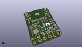
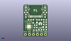
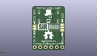
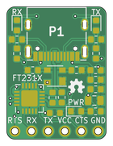
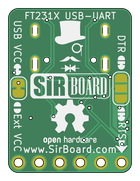

Contents
========

* [PRPR32 > ](#prpr32--)
	* [Interactive BOM](#interactive-bom)
	* [OOMP Parts](#oomp-parts)
	* [Images](#images)
	* [Tags](#tags)
  
![][im]
# PRPR32 > 

- ID: PROJ-SIRB-0032-STAN-02
- Hex ID: PRPR32
- Name: FT231V2 SirUSB
- Description: FT231V2 SirUSB
- Long Link: [http://oom.lt/PROJ-SIRB-0032-STAN-02](http://oom.lt/PROJ-SIRB-0032-STAN-02)
- Short Link: [http://oom.lt/PRPR32](http://oom.lt/PRPR32)

## Interactive BOM

- Interactive BOM page: [ibom.html](https://htmlpreview.github.io/?https://github.com/oomlout/oomlout_OOMP_projects/blob/main/PROJ-SIRB-0032-STAN-02/kicad/bom/ibom.html)

## OOMP Parts
  

|OOMP ID|Name|Identifier|
| :---: | :---: | :---: |
|UNMATCHED-UNMATCHED-X-UNMATCHED-01||U1, P1|
|DIOD-UNMATCHED-X-UNMATCHED-01||D1|
|RESE-0603-X-UNMATCHED-01||R7, R6, R2, R1|
|[HEAD-I01-X-PI06-01](https://github.com/oomlout/oomlout_OOMP_parts/tree/main/HEAD-I01-X-PI06-01/)|[2.54 mm 6 Pin Header](https://github.com/oomlout/oomlout_OOMP_parts/tree/main/HEAD-I01-X-PI06-01/)|[J1](https://github.com/oomlout/oomlout_OOMP_parts/tree/main/HEAD-I01-X-PI06-01/)|
|[CAPC-0603-X-NF100-V50](https://github.com/oomlout/oomlout_OOMP_parts/tree/main/CAPC-0603-X-NF100-V50/)|[SMD (0603) 100 nF Capacitor (Ceramic) 50v](https://github.com/oomlout/oomlout_OOMP_parts/tree/main/CAPC-0603-X-NF100-V50/)|[C6, C4](https://github.com/oomlout/oomlout_OOMP_parts/tree/main/CAPC-0603-X-NF100-V50/)|
|[RESE-0603-X-O102-01](https://github.com/oomlout/oomlout_OOMP_parts/tree/main/RESE-0603-X-O102-01/)|[SMD (0603) 1k Ohm Resistor](https://github.com/oomlout/oomlout_OOMP_parts/tree/main/RESE-0603-X-O102-01/)|[R4, R3, R5](https://github.com/oomlout/oomlout_OOMP_parts/tree/main/RESE-0603-X-O102-01/)|
|FERB-0603-X-UNMATCHED-01||FB1|
|[CAPC-0603-X-NF10-V50](https://github.com/oomlout/oomlout_OOMP_parts/tree/main/CAPC-0603-X-NF10-V50/)|[SMD (0603) 10 nF Capacitor (Ceramic) 50v](https://github.com/oomlout/oomlout_OOMP_parts/tree/main/CAPC-0603-X-NF10-V50/)|[C1](https://github.com/oomlout/oomlout_OOMP_parts/tree/main/CAPC-0603-X-NF10-V50/)|
|[LEDS-0603-G-STAN-01](https://github.com/oomlout/oomlout_OOMP_parts/tree/main/LEDS-0603-G-STAN-01/)|[SMD (0603) Green LED](https://github.com/oomlout/oomlout_OOMP_parts/tree/main/LEDS-0603-G-STAN-01/)|[TX, RX](https://github.com/oomlout/oomlout_OOMP_parts/tree/main/LEDS-0603-G-STAN-01/)|
|[LEDS-0603-R-STAN-01](https://github.com/oomlout/oomlout_OOMP_parts/tree/main/LEDS-0603-R-STAN-01/)|[SMD (0603) Red LED](https://github.com/oomlout/oomlout_OOMP_parts/tree/main/LEDS-0603-R-STAN-01/)|[PWR](https://github.com/oomlout/oomlout_OOMP_parts/tree/main/LEDS-0603-R-STAN-01/)|
|[CAPC-0805-X-UF47D-V25](https://github.com/oomlout/oomlout_OOMP_parts/tree/main/CAPC-0805-X-UF47D-V25/)|[SMD (0805) 4.7 uF Capacitor (Ceramic) 25v](https://github.com/oomlout/oomlout_OOMP_parts/tree/main/CAPC-0805-X-UF47D-V25/)|[C5](https://github.com/oomlout/oomlout_OOMP_parts/tree/main/CAPC-0805-X-UF47D-V25/)|
|CAPC-0603-X-PF47-01||C3, C2|

## Images
  
  

|kicadPcb3d|kicadPcb3dFront|kicadPcb3dBack|pcbdraw|pcbdrawback|
| :---: | :---: | :---: | :---: | :---: |
||||||

## Tags

- oompType: PROJ
- oompSize: SIRB
- oompColor: 0032
- oompDesc: STAN
- oompIndex: 02
- name: FT231V2 SirUSB
- gitRepo: https://github.com/sirboard/SirUSB
- gitName: SirUSB
- kicadBoard: FT231V2/FT231V2.kicad_pcb
- kicadSchem: FT231V2/FT231V2.kicad_sch
- hexID: PRPR32
- oompID: PROJ-SIRB-0032-STAN-02
- oompParts: U1,UNMATCHED-UNMATCHED-X-UNMATCHED-01
- oompParts: D1,DIOD-UNMATCHED-X-UNMATCHED-01
- oompParts: R7,RESE-0603-X-UNMATCHED-01
- oompParts: R6,RESE-0603-X-UNMATCHED-01
- oompParts: J1,HEAD-I01-X-PI06-01
- oompParts: P1,UNMATCHED-UNMATCHED-X-UNMATCHED-01
- oompParts: C6,CAPC-0603-X-NF100-V50
- oompParts: C4,CAPC-0603-X-NF100-V50
- oompParts: R4,RESE-0603-X-O102-01
- oompParts: R3,RESE-0603-X-O102-01
- oompParts: R5,RESE-0603-X-O102-01
- oompParts: FB1,FERB-0603-X-UNMATCHED-01
- oompParts: C1,CAPC-0603-X-NF10-V50
- oompParts: TX,LEDS-0603-G-STAN-01
- oompParts: RX,LEDS-0603-G-STAN-01
- oompParts: PWR,LEDS-0603-R-STAN-01
- oompParts: C5,CAPC-0805-X-UF47D-V25
- oompParts: C3,CAPC-0603-X-PF47-01
- oompParts: C2,CAPC-0603-X-PF47-01
- oompParts: R2,RESE-0603-X-UNMATCHED-01
- oompParts: R1,RESE-0603-X-UNMATCHED-01
- rawParts: G***,LOGO,OSHW36x26,OSHW36x26,,,,
- rawParts: U1,FT231XQ,QFN-20-1EP_4x4mm_P0.5mm_EP2.5x2.5mm,QFN-20-1EP_4x4mm_P0.5mm_EP2.5x2.5mm,,,,
- rawParts: D1,PRTR5V0U2X,SOT-143,SOT-143,,,,
- rawParts: R7,5k1,R_0603_1608Metric,R_0603_1608Metric,,,,
- rawParts: R6,5k1,R_0603_1608Metric,R_0603_1608Metric,,,,
- rawParts: J1,Conn_01x06,PinHeader_1x06_P2.54mm_Horizontal,PinHeader_1x06_P2.54mm_Horizontal,,,,
- rawParts: P1,USB_C_Plug_USB2.0,USB_C,USB_C,,,,
- rawParts: C6,100nF,C_0603_1608Metric,C_0603_1608Metric,,,,
- rawParts: C4,100nF,C_0603_1608Metric,C_0603_1608Metric,,,,
- rawParts: G***,LOGO,SirBoard98x31,SirBoard98x31,,,,
- rawParts: G***,LOGO,logo63x89,logo63x89,,,,
- rawParts: R4,1k,R_0603_1608Metric,R_0603_1608Metric,,,,
- rawParts: R3,1k,R_0603_1608Metric,R_0603_1608Metric,,,,
- rawParts: R5,1k,R_0603_1608Metric,R_0603_1608Metric,,,,
- rawParts: FB1,40E@100MHz,L_0603_1608Metric,L_0603_1608Metric,,,,
- rawParts: C1,10nF,C_0603_1608Metric,C_0603_1608Metric,,,,
- rawParts: TX,GREEN,LED_0603_1608Metric,LED_0603_1608Metric,,,,
- rawParts: RX,GREEN,LED_0603_1608Metric,LED_0603_1608Metric,,,,
- rawParts: PWR,RED,LED_0603_1608Metric,LED_0603_1608Metric,,,,
- rawParts: C5,4.7uF,C_0805_2012Metric,C_0805_2012Metric,,,,
- rawParts: C3,47pF,C_0603_1608Metric,C_0603_1608Metric,,,,
- rawParts: C2,47pF,C_0603_1608Metric,C_0603_1608Metric,,,,
- rawParts: R2,27e,R_0603_1608Metric,R_0603_1608Metric,,,,
- rawParts: R1,27e,R_0603_1608Metric,R_0603_1608Metric,,,,

[im]: kicadPcb3d_450.png
