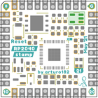
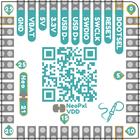
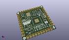
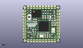
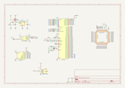

Contents
========

* [PRSO1 > ](#prso1--)
	* [Interactive BOM](#interactive-bom)
	* [OOMP Parts](#oomp-parts)
	* [Images](#images)
	* [Tags](#tags)
  
![][im]
# PRSO1 > 

- ID: PROJ-SOPA-0001-STAN-01
- Hex ID: PRSO1
- Name: RP2040 Stamp1
- Description: RP2040 Stamp1
- Long Link: [http://oom.lt/PROJ-SOPA-0001-STAN-01](http://oom.lt/PROJ-SOPA-0001-STAN-01)
- Short Link: [http://oom.lt/PRSO1](http://oom.lt/PRSO1)

## Interactive BOM

- Interactive BOM page: [ibom.html](https://htmlpreview.github.io/?https://github.com/oomlout/oomlout_OOMP_projects/blob/main/PROJ-SOPA-0001-STAN-01/kicad/bom/ibom.html)

## OOMP Parts
  

|OOMP ID|Name|Identifier|
| :---: | :---: | :---: |
|RESE-UNMATCHED-X-O103-01||R2, R5|
|RESE-UNMATCHED-X-O102-01||R8, R1|
|VREG-UNMATCHED-X-KAP2112K-01||U2|
|UNMATCHED-UNMATCHED-X-UNMATCHED-01||U1, U4, U3, SW1, Q1, Y1, JP1, JP2|
|DIOD-2020-X-K2812-01||D3|
|CAPC-UNMATCHED-X-PF12-01||C15, C14|
|CAPC-UNMATCHED-X-UF10-01||C7, C6, C16|
|CAPC-UNMATCHED-X-UF1-01||C13, C10|
|CAPC-UNMATCHED-X-NF100-01||C12, C5, C11, C4, C8, C1, C3|
|LEDS-UNMATCHED-G-STAN-01||D2|
|RESE-UNMATCHED-X-O202-01||R7|
|RESE-UNMATCHED-X-O1003-01||R6|
|RESE-UNMATCHED-X-UNMATCHED-01||R3, R4|
|DIOD-S323-X-UNMATCHED-01||D1|

## Images
  
  

|bominteractivefront|bominteractiveback|kicadPcb3d|kicadPcb3dFront|kicadschem|
| :---: | :---: | :---: | :---: | :---: |
||||||

## Tags

- oompType: PROJ
- oompSize: SOPA
- oompColor: 0001
- oompDesc: STAN
- oompIndex: 01
- name: RP2040 Stamp1
- gitRepo: https://github.com/solderparty/rp2040_stamp_hw
- gitName: rp2040_stamp_hw
- kicadBoard: rp2040_stamp.kicad_pcb
- kicadSchem: rp2040_stamp.kicad_sch
- hexID: PRSO1
- oompID: PROJ-SOPA-0001-STAN-01
- oompParts: R2,RESE-UNMATCHED-X-O103-01
- oompParts: R5,RESE-UNMATCHED-X-O103-01
- oompParts: R8,RESE-UNMATCHED-X-O102-01
- oompParts: R1,RESE-UNMATCHED-X-O102-01
- oompParts: U2,VREG-UNMATCHED-X-KAP2112K-01
- oompParts: U1,UNMATCHED-UNMATCHED-X-UNMATCHED-01
- oompParts: D3,DIOD-2020-X-K2812-01
- oompParts: C15,CAPC-UNMATCHED-X-PF12-01
- oompParts: C14,CAPC-UNMATCHED-X-PF12-01
- oompParts: U4,UNMATCHED-UNMATCHED-X-UNMATCHED-01
- oompParts: C7,CAPC-UNMATCHED-X-UF10-01
- oompParts: C6,CAPC-UNMATCHED-X-UF10-01
- oompParts: C16,CAPC-UNMATCHED-X-UF10-01
- oompParts: C13,CAPC-UNMATCHED-X-UF1-01
- oompParts: C10,CAPC-UNMATCHED-X-UF1-01
- oompParts: C12,CAPC-UNMATCHED-X-NF100-01
- oompParts: C5,CAPC-UNMATCHED-X-NF100-01
- oompParts: C11,CAPC-UNMATCHED-X-NF100-01
- oompParts: C4,CAPC-UNMATCHED-X-NF100-01
- oompParts: C8,CAPC-UNMATCHED-X-NF100-01
- oompParts: C1,CAPC-UNMATCHED-X-NF100-01
- oompParts: C3,CAPC-UNMATCHED-X-NF100-01
- oompParts: D2,LEDS-UNMATCHED-G-STAN-01
- oompParts: R7,RESE-UNMATCHED-X-O202-01
- oompParts: U3,UNMATCHED-UNMATCHED-X-UNMATCHED-01
- oompParts: R6,RESE-UNMATCHED-X-O1003-01
- oompParts: SW1,UNMATCHED-UNMATCHED-X-UNMATCHED-01
- oompParts: R3,RESE-UNMATCHED-X-UNMATCHED-01
- oompParts: R4,RESE-UNMATCHED-X-UNMATCHED-01
- oompParts: Q1,UNMATCHED-UNMATCHED-X-UNMATCHED-01
- oompParts: D1,DIOD-S323-X-UNMATCHED-01
- oompParts: Y1,UNMATCHED-UNMATCHED-X-UNMATCHED-01
- oompParts: JP1,UNMATCHED-UNMATCHED-X-UNMATCHED-01
- oompParts: JP2,UNMATCHED-UNMATCHED-X-UNMATCHED-01
- rawParts: R2,10K,R_0603_1608Metric,R_0603_1608Metric,,,,
- rawParts: R5,10K,R_0603_1608Metric,R_0603_1608Metric,,,,
- rawParts: R8,1K,R_0603_1608Metric,R_0603_1608Metric,,,,
- rawParts: R1,1K,R_0603_1608Metric,R_0603_1608Metric,,,,
- rawParts: U2,AP2112K-3.3,SOT-23-5,SOT-23-5,,,,
- rawParts: G***,LOGO,SolderParty-New-Logo_3x2.5mm_SilkScreen,SolderParty-New-Logo_3x2.5mm_SilkScreen,,,,
- rawParts: U1,RP2040,QFN-56_EP_7x7_Pitch0.4mm,QFN-56_EP_7x7_Pitch0.4mm,,,,
- rawParts: D3,WS2812B-2020,WS2812B-2020,WS2812B-2020,,,,
- rawParts: C15,12pF,C_0603_1608Metric,C_0603_1608Metric,,,,
- rawParts: C14,12pF,C_0603_1608Metric,C_0603_1608Metric,,,,
- rawParts: U4,MCP73831,SOT-23-5,SOT-23-5,,,,
- rawParts: C7,10uF,C_0603_1608Metric,C_0603_1608Metric,,,,
- rawParts: C6,10uF,C_0603_1608Metric,C_0603_1608Metric,,,,
- rawParts: C16,10uF,C_0603_1608Metric,C_0603_1608Metric,,,,
- rawParts: C13,1uF,C_0603_1608Metric,C_0603_1608Metric,,,,
- rawParts: C10,1uF,C_0603_1608Metric,C_0603_1608Metric,,,,
- rawParts: C12,0.1uF,C_0603_1608Metric,C_0603_1608Metric,,,,
- rawParts: C5,0.1uF,C_0603_1608Metric,C_0603_1608Metric,,,,
- rawParts: C11,0.1uF,C_0603_1608Metric,C_0603_1608Metric,,,,
- rawParts: C4,0.1uF,C_0603_1608Metric,C_0603_1608Metric,,,,
- rawParts: C8,0.1uF,C_0603_1608Metric,C_0603_1608Metric,,,,
- rawParts: C1,0.1uF,C_0603_1608Metric,C_0603_1608Metric,,,,
- rawParts: C3,0.1uF,C_0603_1608Metric,C_0603_1608Metric,,,,
- rawParts: D2,LED_CHR,LED_0603_1608Metric,LED_0603_1608Metric,,,,
- rawParts: R7,2K,R_0603_1608Metric,R_0603_1608Metric,,,,
- rawParts: U3,W25Q64JV,WSON-8-1EP_6x5mm_P1.27mm_EP3.4x4mm,WSON-8-1EP_6x5mm_P1.27mm_EP3.4x4mm,,,,
- rawParts: R6,100K,R_0603_1608Metric,R_0603_1608Metric,,,,
- rawParts: SW1,SW_RESET,SW_SPST_B3U-1000P,SW_SPST_B3U-1000P,,,,
- rawParts: R3,27R,R_0603_1608Metric,R_0603_1608Metric,,,,
- rawParts: R4,27R,R_0603_1608Metric,R_0603_1608Metric,,,,
- rawParts: Q1,BSS84,SOT-23,SOT-23,,,,
- rawParts: D1,D_Schottky_Small,D_SOD-323,D_SOD-323,,,,
- rawParts: Y1,XYDBPCNANF-12MHZ,Crystal_SMD_2520-4Pin_2.5x2.0mm,Crystal_SMD_2520-4Pin_2.5x2.0mm,,,,
- rawParts: JP1,Jumper_Neopixel_VDD,SolderJumper-2_P1.3mm_Bridged_RoundedPad1.0x1.5mm,SolderJumper-2_P1.3mm_Bridged_RoundedPad1.0x1.5mm,,,,
- rawParts: JP2,Jumper_Neopixel,SolderJumper-2_P1.3mm_Bridged_RoundedPad1.0x1.5mm,SolderJumper-2_P1.3mm_Bridged_RoundedPad1.0x1.5mm,,,,
- rawParts: G***,LOGO,SolderParty-New-Logo_5x4.2mm_SilkScreen,SolderParty-New-Logo_5x4.2mm_SilkScreen,,,,

[im]: kicadPcb3d_450.png
