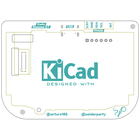
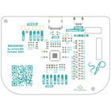
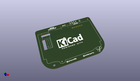
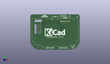
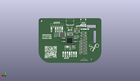
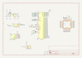

Contents
========

* [PRSO2 > ](#prso2--)
	* [Interactive BOM](#interactive-bom)
	* [OOMP Parts](#oomp-parts)
	* [Images](#images)
	* [Tags](#tags)
  
![][im]
# PRSO2 > 

- ID: PROJ-SOPA-0002-STAN-01
- Hex ID: PRSO2
- Name: BBQ20KBD1
- Description: BBQ20KBD1
- Long Link: [http://oom.lt/PROJ-SOPA-0002-STAN-01](http://oom.lt/PROJ-SOPA-0002-STAN-01)
- Short Link: [http://oom.lt/PRSO2](http://oom.lt/PRSO2)

## Interactive BOM

- Interactive BOM page: [ibom.html](https://htmlpreview.github.io/?https://github.com/oomlout/oomlout_OOMP_projects/blob/main/PROJ-SOPA-0002-STAN-01/kicad/bom/ibom.html)

## OOMP Parts
  

|OOMP ID|Name|Identifier|
| :---: | :---: | :---: |
|UNMATCHED-UNMATCHED-X-UNMATCHED-01||U4, H2, H1, U3, U1, U5, J1, J3, Y1, U6|
|RESE-UNMATCHED-X-UNMATCHED-01||R5, R6|
|CAPC-UNMATCHED-X-NF100-01||C15, C8, C2, C7, C3, C1, C4, C14, C5|
|RESE-UNMATCHED-X-O103-01||R11, R21, R15, R17, R16, R8, R18, R12, R4, R7, R13, R14, R10, R9|
|UNMATCHED-UNMATCHED-X-KBSS138-01||Q4, Q3, Q1, Q5, Q2, Q6|
|RESE-UNMATCHED-X-O472-01||R19, R20, R1, R2|
|CAPC-UNMATCHED-X-UF10-01||C10, C11|
|CAPC-UNMATCHED-X-PF12-01||C12, C13|
|RESE-UNMATCHED-X-O102-01||R22, R3|
|VREG-UNMATCHED-X-KAP2112K-01||U2|
|DIOD-S323-X-UNMATCHED-01||D1|
|CAPC-UNMATCHED-X-UF1-01||C6, C9|
|HEAD-I01-X-UNMATCHED-01||J2|

## Images
  
  

|bominteractivefront|bominteractiveback|kicadPcb3d|kicadPcb3dFront|kicadPcb3dBack|kicadschem|
| :---: | :---: | :---: | :---: | :---: | :---: |
|||||||

## Tags

- oompType: PROJ
- oompSize: SOPA
- oompColor: 0002
- oompDesc: STAN
- oompIndex: 01
- name: BBQ20KBD1
- gitRepo: https://github.com/solderparty/bbq20kbd_hw
- gitName: bbq20kbd_hw
- kicadBoard: bbq20_keyboard.kicad_pcb
- kicadSchem: bbq20_keyboard.kicad_sch
- hexID: PRSO2
- oompID: PROJ-SOPA-0002-STAN-01
- oompParts: U4,UNMATCHED-UNMATCHED-X-UNMATCHED-01
- oompParts: R5,RESE-UNMATCHED-X-UNMATCHED-01
- oompParts: R6,RESE-UNMATCHED-X-UNMATCHED-01
- oompParts: C15,CAPC-UNMATCHED-X-NF100-01
- oompParts: C8,CAPC-UNMATCHED-X-NF100-01
- oompParts: C2,CAPC-UNMATCHED-X-NF100-01
- oompParts: C7,CAPC-UNMATCHED-X-NF100-01
- oompParts: C3,CAPC-UNMATCHED-X-NF100-01
- oompParts: C1,CAPC-UNMATCHED-X-NF100-01
- oompParts: C4,CAPC-UNMATCHED-X-NF100-01
- oompParts: C14,CAPC-UNMATCHED-X-NF100-01
- oompParts: C5,CAPC-UNMATCHED-X-NF100-01
- oompParts: H2,UNMATCHED-UNMATCHED-X-UNMATCHED-01
- oompParts: H1,UNMATCHED-UNMATCHED-X-UNMATCHED-01
- oompParts: R11,RESE-UNMATCHED-X-O103-01
- oompParts: R21,RESE-UNMATCHED-X-O103-01
- oompParts: R15,RESE-UNMATCHED-X-O103-01
- oompParts: R17,RESE-UNMATCHED-X-O103-01
- oompParts: R16,RESE-UNMATCHED-X-O103-01
- oompParts: R8,RESE-UNMATCHED-X-O103-01
- oompParts: R18,RESE-UNMATCHED-X-O103-01
- oompParts: R12,RESE-UNMATCHED-X-O103-01
- oompParts: R4,RESE-UNMATCHED-X-O103-01
- oompParts: R7,RESE-UNMATCHED-X-O103-01
- oompParts: R13,RESE-UNMATCHED-X-O103-01
- oompParts: R14,RESE-UNMATCHED-X-O103-01
- oompParts: R10,RESE-UNMATCHED-X-O103-01
- oompParts: R9,RESE-UNMATCHED-X-O103-01
- oompParts: Q4,UNMATCHED-UNMATCHED-X-KBSS138-01
- oompParts: Q3,UNMATCHED-UNMATCHED-X-KBSS138-01
- oompParts: Q1,UNMATCHED-UNMATCHED-X-KBSS138-01
- oompParts: Q5,UNMATCHED-UNMATCHED-X-KBSS138-01
- oompParts: Q2,UNMATCHED-UNMATCHED-X-KBSS138-01
- oompParts: Q6,UNMATCHED-UNMATCHED-X-KBSS138-01
- oompParts: R19,RESE-UNMATCHED-X-O472-01
- oompParts: R20,RESE-UNMATCHED-X-O472-01
- oompParts: C10,CAPC-UNMATCHED-X-UF10-01
- oompParts: C11,CAPC-UNMATCHED-X-UF10-01
- oompParts: C12,CAPC-UNMATCHED-X-PF12-01
- oompParts: C13,CAPC-UNMATCHED-X-PF12-01
- oompParts: U3,UNMATCHED-UNMATCHED-X-UNMATCHED-01
- oompParts: U1,UNMATCHED-UNMATCHED-X-UNMATCHED-01
- oompParts: R22,RESE-UNMATCHED-X-O102-01
- oompParts: R3,RESE-UNMATCHED-X-O102-01
- oompParts: U5,UNMATCHED-UNMATCHED-X-UNMATCHED-01
- oompParts: U2,VREG-UNMATCHED-X-KAP2112K-01
- oompParts: J1,UNMATCHED-UNMATCHED-X-UNMATCHED-01
- oompParts: D1,DIOD-S323-X-UNMATCHED-01
- oompParts: C6,CAPC-UNMATCHED-X-UF1-01
- oompParts: C9,CAPC-UNMATCHED-X-UF1-01
- oompParts: J2,HEAD-I01-X-UNMATCHED-01
- oompParts: R1,RESE-UNMATCHED-X-O472-01
- oompParts: R2,RESE-UNMATCHED-X-O472-01
- oompParts: J3,UNMATCHED-UNMATCHED-X-UNMATCHED-01
- oompParts: Y1,UNMATCHED-UNMATCHED-X-UNMATCHED-01
- oompParts: U6,UNMATCHED-UNMATCHED-X-UNMATCHED-01
- rawParts: G***,LOGO,SolderParty-New-Logo_7.5x6.4mm_SilkScreen,SolderParty-New-Logo_7.5x6.4mm_SilkScreen,,,,
- rawParts: U4,BBQ20KBD,BM20B(0.8)-40DS-0.4V,BM20B(0.8)-40DS-0.4V,,,,
- rawParts: R5,27R,R_0603_1608Metric,R_0603_1608Metric,,,,
- rawParts: R6,27R,R_0603_1608Metric,R_0603_1608Metric,,,,
- rawParts: C15,0.1uF,C_0603_1608Metric,C_0603_1608Metric,,,,
- rawParts: C8,0.1uF,C_0603_1608Metric,C_0603_1608Metric,,,,
- rawParts: C2,0.1uF,C_0603_1608Metric,C_0603_1608Metric,,,,
- rawParts: C7,0.1uF,C_0603_1608Metric,C_0603_1608Metric,,,,
- rawParts: C3,0.1uF,C_0603_1608Metric,C_0603_1608Metric,,,,
- rawParts: C1,0.1uF,C_0603_1608Metric,C_0603_1608Metric,,,,
- rawParts: C4,0.1uF,C_0603_1608Metric,C_0603_1608Metric,,,,
- rawParts: C14,0.1uF,C_0603_1608Metric,C_0603_1608Metric,,,,
- rawParts: C5,0.1uF,C_0603_1608Metric,C_0603_1608Metric,,,,
- rawParts: H2,MountingHole,MountingHole_2.7mm_M2.5,MountingHole_2.7mm_M2.5,,,,
- rawParts: H1,MountingHole,MountingHole_2.7mm_M2.5,MountingHole_2.7mm_M2.5,,,,
- rawParts: R11,10K,R_0603_1608Metric,R_0603_1608Metric,,,,
- rawParts: R21,10K,R_0603_1608Metric,R_0603_1608Metric,,,,
- rawParts: R15,10K,R_0603_1608Metric,R_0603_1608Metric,,,,
- rawParts: R17,10K,R_0603_1608Metric,R_0603_1608Metric,,,,
- rawParts: R16,10K,R_0603_1608Metric,R_0603_1608Metric,,,,
- rawParts: R8,10K,R_0603_1608Metric,R_0603_1608Metric,,,,
- rawParts: R18,10K,R_0603_1608Metric,R_0603_1608Metric,,,,
- rawParts: R12,10K,R_0603_1608Metric,R_0603_1608Metric,,,,
- rawParts: R4,10K,R_0603_1608Metric,R_0603_1608Metric,,,,
- rawParts: R7,10K,R_0603_1608Metric,R_0603_1608Metric,,,,
- rawParts: R13,10K,R_0603_1608Metric,R_0603_1608Metric,,,,
- rawParts: R14,10K,R_0603_1608Metric,R_0603_1608Metric,,,,
- rawParts: R10,10K,R_0603_1608Metric,R_0603_1608Metric,,,,
- rawParts: R9,10K,R_0603_1608Metric,R_0603_1608Metric,,,,
- rawParts: Q4,BSS138,SOT-23,SOT-23,,,,
- rawParts: Q3,BSS138,SOT-23,SOT-23,,,,
- rawParts: Q1,BSS138,SOT-23,SOT-23,,,,
- rawParts: Q5,BSS138,SOT-23,SOT-23,,,,
- rawParts: Q2,BSS138,SOT-23,SOT-23,,,,
- rawParts: Q6,BSS138,SOT-23,SOT-23,,,,
- rawParts: R19,4.7K,R_0603_1608Metric,R_0603_1608Metric,,,,
- rawParts: R20,4.7K,R_0603_1608Metric,R_0603_1608Metric,,,,
- rawParts: C10,10uF,C_0603_1608Metric,C_0603_1608Metric,,,,
- rawParts: C11,10uF,C_0603_1608Metric,C_0603_1608Metric,,,,
- rawParts: C12,12pF,C_0603_1608Metric,C_0603_1608Metric,,,,
- rawParts: C13,12pF,C_0603_1608Metric,C_0603_1608Metric,,,,
- rawParts: U3,GD25Q16xS,SSOP-8_5.25x5.24mm_P1.27mm,SSOP-8_5.25x5.24mm_P1.27mm,,,,
- rawParts: U1,RP2040,QFN-56_EP_7x7_Pitch0.4mm,QFN-56_EP_7x7_Pitch0.4mm,,,,
- rawParts: R22,1K,R_0603_1608Metric,R_0603_1608Metric,,,,
- rawParts: R3,1K,R_0603_1608Metric,R_0603_1608Metric,,,,
- rawParts: U5,ME6212C18M5G,SOT-23-5,SOT-23-5,,,,
- rawParts: TP6,TP_3V3,TestPoint_Pad_D1.5mm,TestPoint_Pad_D1.5mm,,,,
- rawParts: U2,AP2112K-3.3,SOT-23-5,SOT-23-5,,,,
- rawParts: J1,Conn_Stemma_QT,JST_SH_SM04B-SRSS-TB_1x04-1MP_P1.00mm_Horizontal,JST_SH_SM04B-SRSS-TB_1x04-1MP_P1.00mm_Horizontal,,,,
- rawParts: G***,LOGO,SolderParty-New-Logo_12.5x10.6mm_SilkScreen,SolderParty-New-Logo_12.5x10.6mm_SilkScreen,,,,
- rawParts: D1,D_Schottky_Small,D_SOD-323,D_SOD-323,,,,
- rawParts: C6,1uF,C_0603_1608Metric,C_0603_1608Metric,,,,
- rawParts: C9,1uF,C_0603_1608Metric,C_0603_1608Metric,,,,
- rawParts: J2,PMOD,PMODPinHeader_1x06_P2.54mm_Horizontal,PMODPinHeader_1x06_P2.54mm_Horizontal,,,,
- rawParts: R1,5.1K,R_0603_1608Metric,R_0603_1608Metric,,,,
- rawParts: R2,5.1K,R_0603_1608Metric,R_0603_1608Metric,,,,
- rawParts: J3,USB_C_Receptacle_USB2.0,USB_C_Receptacle_HRO_TYPE-C-31-M-12,USB_C_Receptacle_HRO_TYPE-C-31-M-12,,,,
- rawParts: Y1,XYDBPCNANF-12MHZ,Crystal_SMD_2520-4Pin_2.5x2.0mm,Crystal_SMD_2520-4Pin_2.5x2.0mm,,,,
- rawParts: U6,ME6212C28M5G,SOT-23-5,SOT-23-5,,,,

[im]: kicadPcb3d_450.png
