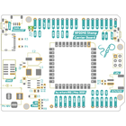
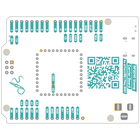
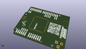
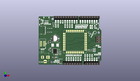
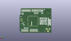
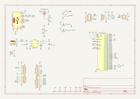

Contents
========

* [PRSO3 > ](#prso3--)
	* [Interactive BOM](#interactive-bom)
	* [OOMP Parts](#oomp-parts)
	* [Images](#images)
	* [Tags](#tags)
  
![][im]
# PRSO3 > 

- ID: PROJ-SOPA-0003-STAN-01
- Hex ID: PRSO3
- Name: The RP2040 Stamp Carrier1
- Description: The RP2040 Stamp Carrier1
- Long Link: [http://oom.lt/PROJ-SOPA-0003-STAN-01](http://oom.lt/PROJ-SOPA-0003-STAN-01)
- Short Link: [http://oom.lt/PRSO3](http://oom.lt/PRSO3)

## Interactive BOM

- Interactive BOM page: [ibom.html](https://htmlpreview.github.io/?https://github.com/oomlout/oomlout_OOMP_projects/blob/main/PROJ-SOPA-0003-STAN-01/kicad/bom/ibom.html)

## OOMP Parts
  

|OOMP ID|Name|Identifier|
| :---: | :---: | :---: |
|DIOD-S123-X-UNMATCHED-01||D3, D4|
|[RESE-0603-X-O472-01](https://github.com/oomlout/oomlout_OOMP_parts/tree/main/RESE-0603-X-O472-01/)|[SMD (0603) 4.7k Ohm Resistor](https://github.com/oomlout/oomlout_OOMP_parts/tree/main/RESE-0603-X-O472-01/)|[R2, R1, R4, R3](https://github.com/oomlout/oomlout_OOMP_parts/tree/main/RESE-0603-X-O472-01/)|
|UNMATCHED-UNMATCHED-X-UNMATCHED-01||SW2, SW1, J4, J1, U2, J5, Q1, L1|
|CAPC-0805-X-UNMATCHED-V25||C1|
|[HEAD-JSTSH-X-PI04-RS](https://github.com/oomlout/oomlout_OOMP_parts/tree/main/HEAD-JSTSH-X-PI04-RS/)|[JST XH (1 mm) 4 Pin Header Right Angle (SMD)](https://github.com/oomlout/oomlout_OOMP_parts/tree/main/HEAD-JSTSH-X-PI04-RS/)|[J2](https://github.com/oomlout/oomlout_OOMP_parts/tree/main/HEAD-JSTSH-X-PI04-RS/)|
|[RESE-0603-X-O102-01](https://github.com/oomlout/oomlout_OOMP_parts/tree/main/RESE-0603-X-O102-01/)|[SMD (0603) 1k Ohm Resistor](https://github.com/oomlout/oomlout_OOMP_parts/tree/main/RESE-0603-X-O102-01/)|[R8, R10](https://github.com/oomlout/oomlout_OOMP_parts/tree/main/RESE-0603-X-O102-01/)|
|[LEDS-0603-G-STAN-01](https://github.com/oomlout/oomlout_OOMP_parts/tree/main/LEDS-0603-G-STAN-01/)|[SMD (0603) Green LED](https://github.com/oomlout/oomlout_OOMP_parts/tree/main/LEDS-0603-G-STAN-01/)|[D1, D2](https://github.com/oomlout/oomlout_OOMP_parts/tree/main/LEDS-0603-G-STAN-01/)|
|RESE-0603-X-O1003-01||R9, R6, R5, R7|
|CAPX-UNMATCHED-X-UNMATCHED-V25||C2|

## Images
  
  

|bominteractivefront|bominteractiveback|kicadPcb3d|kicadPcb3dFront|kicadPcb3dBack|kicadschem|
| :---: | :---: | :---: | :---: | :---: | :---: |
|||||||

## Tags

- oompType: PROJ
- oompSize: SOPA
- oompColor: 0003
- oompDesc: STAN
- oompIndex: 01
- name: The RP2040 Stamp Carrier1
- gitRepo: https://github.com/solderparty/rp2040_stamp_carrier_hw
- gitName: rp2040_stamp_carrier_hw
- kicadBoard: rp2040_stamp_carrier.kicad_pcb
- kicadSchem: rp2040_stamp_carrier.kicad_sch
- hexID: PRSO3
- oompID: PROJ-SOPA-0003-STAN-01
- oompParts: D3,DIOD-S123-X-UNMATCHED-01
- oompParts: R2,RESE-0603-X-O472-01
- oompParts: R1,RESE-0603-X-O472-01
- oompParts: SW2,UNMATCHED-UNMATCHED-X-UNMATCHED-01
- oompParts: SW1,UNMATCHED-UNMATCHED-X-UNMATCHED-01
- oompParts: J4,UNMATCHED-UNMATCHED-X-UNMATCHED-01
- oompParts: C1,CAPC-0805-X-UNMATCHED-V25
- oompParts: J1,UNMATCHED-UNMATCHED-X-UNMATCHED-01
- oompParts: J2,HEAD-JSTSH-X-PI04-RS
- oompParts: R8,RESE-0603-X-O102-01
- oompParts: R10,RESE-0603-X-O102-01
- oompParts: U2,UNMATCHED-UNMATCHED-X-UNMATCHED-01
- oompParts: R4,RESE-0603-X-O472-01
- oompParts: R3,RESE-0603-X-O472-01
- oompParts: D1,LEDS-0603-G-STAN-01
- oompParts: R9,RESE-0603-X-O1003-01
- oompParts: R6,RESE-0603-X-O1003-01
- oompParts: R5,RESE-0603-X-O1003-01
- oompParts: R7,RESE-0603-X-O1003-01
- oompParts: D2,LEDS-0603-G-STAN-01
- oompParts: C2,CAPX-UNMATCHED-X-UNMATCHED-V25
- oompParts: J5,UNMATCHED-UNMATCHED-X-UNMATCHED-01
- oompParts: Q1,UNMATCHED-UNMATCHED-X-UNMATCHED-01
- oompParts: D4,DIOD-S123-X-UNMATCHED-01
- oompParts: L1,UNMATCHED-UNMATCHED-X-UNMATCHED-01
- rawParts: D3,1N5819W,D_SOD-123,D_SOD-123,,,,
- rawParts: R2,4.7K,R_0603_1608Metric,R_0603_1608Metric,,,,
- rawParts: R1,4.7K,R_0603_1608Metric,R_0603_1608Metric,,,,
- rawParts: SW2,BTN_UP,TL3330,TL3330,,,,
- rawParts: SW1,BTN_UP,TL3330,TL3330,,,,
- rawParts: J4,Conn_Batt,JST_PH_S2B-PH-SM4-TB_1x02-1MP_P2.00mm_Horizontal,JST_PH_S2B-PH-SM4-TB_1x02-1MP_P2.00mm_Horizontal,,,,
- rawParts: C1,22uF 25V,C_0805_2012Metric,C_0805_2012Metric,,,,
- rawParts: J1,USB_C_Receptacle_USB2.0,USB_C_Receptacle_XKB_U262-16XN-4BVC11,USB_C_Receptacle_XKB_U262-16XN-4BVC11,,,,
- rawParts: J2,Conn_Stemma_QT,JST_SH_SM04B-SRSS-TB_1x04-1MP_P1.00mm_Horizontal,JST_SH_SM04B-SRSS-TB_1x04-1MP_P1.00mm_Horizontal,,,,
- rawParts: R8,1K,R_0603_1608Metric,R_0603_1608Metric,,,,
- rawParts: R10,1K,R_0603_1608Metric,R_0603_1608Metric,,,,
- rawParts: U2,XL1509-5.0,SOP-8_3.9x4.9mm_P1.27mm,SOP-8_3.9x4.9mm_P1.27mm,,,,
- rawParts: R4,5.1K,R_0603_1608Metric,R_0603_1608Metric,,,,
- rawParts: R3,5.1K,R_0603_1608Metric,R_0603_1608Metric,,,,
- rawParts: D1,LED_PWR,LED_0603_1608Metric,LED_0603_1608Metric,,,,
- rawParts: G***,LOGO,SolderParty-New-Logo_10x8.5mm_SilkScreen,SolderParty-New-Logo_10x8.5mm_SilkScreen,,,,
- rawParts: G***,LOGO,SolderParty-New-Logo_10x8.5mm_SilkScreen,SolderParty-New-Logo_10x8.5mm_SilkScreen,,,,
- rawParts: R9,100K,R_0603_1608Metric,R_0603_1608Metric,,,,
- rawParts: R6,100K,R_0603_1608Metric,R_0603_1608Metric,,,,
- rawParts: R5,100K,R_0603_1608Metric,R_0603_1608Metric,,,,
- rawParts: R7,100K,R_0603_1608Metric,R_0603_1608Metric,,,,
- rawParts: D2,LED_USR,LED_0603_1608Metric,LED_0603_1608Metric,,,,
- rawParts: C2,100uF 25V,CP_Elec_6.3x4.9,CP_Elec_6.3x4.9,,,,
- rawParts: J5,Barrel_Jack,BarrelJack_Horizontal,BarrelJack_Horizontal,,,,
- rawParts: Q1,DMG3415U-7,SOT-23,SOT-23,,,,
- rawParts: D4,DSS34,D_SOD-123F,D_SOD-123F,,,,
- rawParts: L1,47uH,L_Bourns_SRP7028A_7.3x6.6mm,L_Bourns_SRP7028A_7.3x6.6mm,,,,

[im]: kicadPcb3d_450.png
