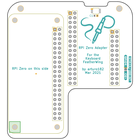
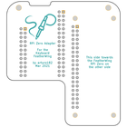
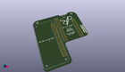
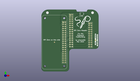
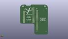
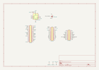

Contents
========

* [PRSO4 > ](#prso4--)
	* [Interactive BOM](#interactive-bom)
	* [OOMP Parts](#oomp-parts)
	* [Images](#images)
	* [Tags](#tags)
  
![][im]
# PRSO4 > 

- ID: PROJ-SOPA-0004-STAN-01
- Hex ID: PRSO4
- Name: Raspberry Pi Zero Adapter for the Keyboard FeatherWing1
- Description: Raspberry Pi Zero Adapter for the Keyboard FeatherWing1
- Long Link: [http://oom.lt/PROJ-SOPA-0004-STAN-01](http://oom.lt/PROJ-SOPA-0004-STAN-01)
- Short Link: [http://oom.lt/PRSO4](http://oom.lt/PRSO4)

## Interactive BOM

- Interactive BOM page: [ibom.html](https://htmlpreview.github.io/?https://github.com/oomlout/oomlout_OOMP_projects/blob/main/PROJ-SOPA-0004-STAN-01/kicad/bom/ibom.html)

## OOMP Parts
  

|OOMP ID|Name|Identifier|
| :---: | :---: | :---: |
|UNMATCHED-UNMATCHED-X-UNMATCHED-01||U1, JP1, REF**, REF**|
|HEAD-I01-X-UNMATCHED-01||J2, J3, J1|
|CAPC-UNMATCHED-X-NF100-01||C1|

## Images
  
  

|bominteractivefront|bominteractiveback|kicadPcb3d|kicadPcb3dFront|kicadPcb3dBack|kicadschem|
| :---: | :---: | :---: | :---: | :---: | :---: |
|||||||

## Tags

- oompType: PROJ
- oompSize: SOPA
- oompColor: 0004
- oompDesc: STAN
- oompIndex: 01
- name: Raspberry Pi Zero Adapter for the Keyboard FeatherWing1
- gitRepo: https://github.com/solderparty/keyboard_featherwing_zero_adapter
- gitName: keyboard_featherwing_zero_adapter
- kicadBoard: kfw_rpi_adapter.kicad_pcb
- kicadSchem: kfw_rpi_adapter.kicad_sch
- hexID: PRSO4
- oompID: PROJ-SOPA-0004-STAN-01
- oompParts: U1,UNMATCHED-UNMATCHED-X-UNMATCHED-01
- oompParts: JP1,UNMATCHED-UNMATCHED-X-UNMATCHED-01
- oompParts: REF**,UNMATCHED-UNMATCHED-X-UNMATCHED-01
- oompParts: REF**,UNMATCHED-UNMATCHED-X-UNMATCHED-01
- oompParts: J2,HEAD-I01-X-UNMATCHED-01
- oompParts: J3,HEAD-I01-X-UNMATCHED-01
- oompParts: C1,CAPC-UNMATCHED-X-NF100-01
- oompParts: J1,HEAD-I01-X-UNMATCHED-01
- rawParts: U1,ADS1115IDGS,TSSOP-10_3x3mm_P0.5mm,TSSOP-10_3x3mm_P0.5mm,,,,
- rawParts: G***,LOGO,SolderParty-New-Logo_20x16.9mm_SilkScreen,SolderParty-New-Logo_20x16.9mm_SilkScreen,,,,
- rawParts: G***,LOGO,SolderParty-New-Logo_20x16.9mm_SilkScreen,SolderParty-New-Logo_20x16.9mm_SilkScreen,,,,
- rawParts: JP1,SJ_STM_KBD,SolderJumper-3_P1.3mm_Bridged12_RoundedPad1.0x1.5mm_NumberLabels,SolderJumper-3_P1.3mm_Bridged12_RoundedPad1.0x1.5mm_NumberLabels,,,,
- rawParts: REF**,Fiducial_0.5mm_Mask1.5mm,Fiducial_0.5mm_Mask1.5mm,Fiducial_0.5mm_Mask1.5mm,,,,
- rawParts: REF**,Fiducial_0.5mm_Mask1.5mm,Fiducial_0.5mm_Mask1.5mm,Fiducial_0.5mm_Mask1.5mm,,,,
- rawParts: J2,Conn_Left,PinHeader_2x16_P2.54mm_Vertical,PinHeader_2x16_P2.54mm_Vertical,,,,
- rawParts: J3,Conn_Right,PinHeader_2x12_P2.54mm_Vertical,PinHeader_2x12_P2.54mm_Vertical,,,,
- rawParts: C1,0.1uF,C_0603_1608Metric,C_0603_1608Metric,,,,
- rawParts: J1,Conn_RPi,PinHeader_2x20_P2.54mm_Vertical,PinHeader_2x20_P2.54mm_Vertical,,,,

[im]: kicadPcb3d_450.png
