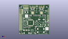
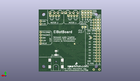
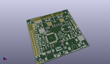

Contents
========

* [PROJ-SPAR-10025-STAN-01>EiBotBoard](#proj-spar-10025-stan-01eibotboard)
	* [Images](#images)
	* [Interactive BOM](#interactive-bom)
	* [OOMP Parts](#oomp-parts)
	* [Tags](#tags)
  
![][im]
# PROJ-SPAR-10025-STAN-01>EiBotBoard

- ID: PROJ-SPAR-10025-STAN-01
- Hex ID: PRS10025
- Name: EiBotBoard
- Description: 

## Images
  
  

|eagleImage|kicadPcb3dFront|kicadPcb3dBack|kicadPcb3d|
| :---: | :---: | :---: | :---: |
|||||

## Interactive BOM

- Interactive BOM page: [ibom.html](kicad/bom/ibom.html)

## OOMP Parts
  

|OOMP Parts|
| :---: |
|UNMATCHED-UNMATCHED-X-UNMATCHED-01, 2MM1, 31.75, 53.339999999999996, 180,2MM1, SCHMALZHAUS_SCREWTERMINAL-3.5MM-4_LOCK, EiBotBoard-v21, (1.25, 2.1), R180|
|UNMATCHED-UNMATCHED-X-UNMATCHED-01, 2MM2, 45.974, 53.339999999999996, 180,2MM2, SCHMALZHAUS_SCREWTERMINAL-3.5MM-4_LOCK, EiBotBoard-v21, (1.81, 2.1), R180|
|CAPE-0603-X-UNMATCHED-01, C1, 33.019999999999996, 35.559999999999995, 270,C1, .1uf, 0603, SparkFun-2-11-09, (1.3, 1.4), R270|
|CAPE-0603-X-UNMATCHED-01, C2, 19.812, 35.559999999999995, 270,C2, .1uf, 0603, SparkFun-2-11-09, (0.78, 1.4), R270|
|CAPE-0603-X-UNMATCHED-01, C3, 49.529999999999994, 35.559999999999995, 270,C3, .1uf, 0603, SparkFun-2-11-09, (1.95, 1.4), R270|
|CAPE-0603-X-UNMATCHED-01, C4, 35.559999999999995, 35.559999999999995, 270,C4, .1uf, 0603, SparkFun-2-11-09, (1.4, 1.4), R270|
|CAPE-0603-X-UNMATCHED-01, C5, 21.59, 35.559999999999995, 270,C5, .1uf, 0603, SparkFun-2-11-09, (0.85, 1.4), R270|
|CAPE-0603-X-UNMATCHED-01, C6, 37.846, 35.559999999999995, 270,C6, .1uf, 0603, SparkFun-2-11-09, (1.49, 1.4), R270|
|CAPE-0603-X-UNMATCHED-01, C7, 21.59, 44.449999999999996, 180,C7, .1uf, 0603, SparkFun-2-11-09, (0.85, 1.75), R180|
|CAPE-0603-X-UNMATCHED-01, C8, 29.209999999999997, 44.449999999999996, 0,C8, .1uf, 0603, SparkFun-2-11-09, (1.15, 1.75), R0|
|CAPE-0603-X-NF220-01, C9, 39.878, 35.559999999999995, 270,C9, .22uF, 0603, SparkFun-2-11-09, (1.57, 1.4), R270|
|CAPE-0603-X-NF220-01, C10, 23.241, 35.559999999999995, 270,C10, .22uF, 0603, SparkFun-2-11-09, (0.915, 1.4), R270|
|CAPE-0603-X-UNMATCHED-01, C11, 38.099999999999994, 44.449999999999996, 180,C11, .1uf, 0603, SparkFun-2-11-09, (1.5, 1.75), R180|
|CAPE-0603-X-UNMATCHED-01, C12, 45.72, 44.449999999999996, 0,C12, .1uf, 0603, SparkFun-2-11-09, (1.8, 1.75), R0|
|CAPE-UNMATCHED-X-UNMATCHED-01, C13, 11.43, 25.4, 0,C13, 10uF, EIA3216, SparkFun-2-11-09, (0.45, 1), R0|
|CAPE-UNMATCHED-X-UNMATCHED-01, C14, 41.91, 27.94, 180,C14, 100uF, PANASONIC_G, SparkFun, (1.65, 1.1), R180|
|CAPE-0603-X-UNMATCHED-01, C15, 49.529999999999994, 21.59, 270,C15, .1uf, 0603, SparkFun-2-11-09, (1.95, 0.85), R270|
|CAPE-0603-X-UNMATCHED-01, C16, 45.72, 21.59, 0,C16, 1uF, 0603, SparkFun-2-11-09, (1.8, 0.85), R0|
|CAPE-UNMATCHED-X-UNMATCHED-01, C17, 50.8, 24.13, 180,C17, 10uF, EIA3216, SparkFun-2-11-09, (2, 0.95), R180|
|CAPE-0603-X-UNMATCHED-01, C18, 33.019999999999996, 25.907999999999998, 0,C18, .1uf, 0603, SparkFun-2-11-09, (1.3, 1.02), R0|
|CAPE-0603-X-UNMATCHED-01, C19, 20.32, 12.7, 90,C19, .1uf, 0603, SparkFun-2-11-09, (0.8, 0.5), R90|
|CAPE-0603-X-UNMATCHED-01, C20, 12.7, 45.084999999999994, 270,C20, 1uF, 0603, SparkFun-2-11-09, (0.5, 1.775), R270|
|CAPE-0603-X-UNMATCHED-01, C21, 10.795, 45.084999999999994, 270,C21, .1uf, 0603, SparkFun-2-11-09, (0.425, 1.775), R270|
|UNMATCHED-UNMATCHED-X-UNMATCHED-01, D1, 40.64, 16.509999999999998, 270,D1, DO214AC, diode, (1.6, 0.65), R270|
|UNMATCHED-UNMATCHED-X-UNMATCHED-01, D2, 35.559999999999995, 15.239999999999998, 0,D2, SMA-DIODE, SparkFun, (1.4, 0.6), R0|
|UNMATCHED-UNMATCHED-X-UNMATCHED-01, D3, 45.72, 15.239999999999998, 0,D3, SMA-DIODE, SparkFun, (1.8, 0.6), R0|
|UNMATCHED-UNMATCHED-X-UNMATCHED-01, D4, 40.64, 16.509999999999998, M270,D4, SOD-123_MINI-SMA, diode, (1.6, 0.65), MR270|
|UNMATCHED-UNMATCHED-X-UNMATCHED-01, F1, 45.72, 19.049999999999997, 0,F1, PTCSMD, PTC-1206, SchmalzHaus, (1.8, 0.75), R0|
|UNMATCHED-UNMATCHED-X-UNMATCHED-01, IC1, 25.4, 40.64, 0,IC1, A4983ALT1, QFN-28-5MM_ALT1, Testing, (1, 1.6), R0|
|UNMATCHED-UNMATCHED-X-UNMATCHED-01, IC2, 41.91, 40.64, 0,IC2, A4983ALT1, QFN-28-5MM_ALT1, Testing, (1.65, 1.6), R0|
|UNMATCHED-UNMATCHED-X-UNMATCHED-01, IC3, 21.59, 21.59, 180,IC3, PIC18F46J50-I/PT, TQFP44, SchmalzHaus, (0.85, 0.85), R180|
|UNMATCHED-UNMATCHED-X-UNMATCHED-01, IC4, 52.06999999999999, 12.7, 180,IC4, LM317MABDT, DPACK, v-reg, (2.05, 0.5), R180|
|UNMATCHED-UNMATCHED-X-UNMATCHED-01, IC5, 13.97, 36.83, 180,IC5, LM317MABDT, DPACK, v-reg, (0.55, 1.45), R180|
|UNMATCHED-UNMATCHED-X-UNMATCHED-01, J3, 13.97, 5.08, 90,J3, USBSMD, USB-MINIB, SchmalzHaus, (0.55, 0.2), R90|
|UNMATCHED-UNMATCHED-X-UNMATCHED-01, J4, 3.8099999999999996, 8.889999999999999, 90,J4, IO, 1X12, SparkFun-12-01-09, (0.15, 0.35), R90|
|UNMATCHED-UNMATCHED-X-UNMATCHED-01, J5, 1.27, 8.889999999999999, 90,J5, IO, 1X12, SparkFun-12-01-09, (0.05, 0.35), R90|
|UNMATCHED-UNMATCHED-X-UNMATCHED-01, J6, 40.64, 3.8099999999999996, M90,J6, POWER_JACKSMD, POWER_JACK_SMD, SparkFun11_03_09, (1.6, 0.15), MR90|
|UNMATCHED-UNMATCHED-X-UNMATCHED-01, J7, 40.64, 3.8099999999999996, 90,J7, POWER_JACKSMD, POWER_JACK_SMD, SparkFun11_03_09, (1.6, 0.15), R90|
|UNMATCHED-UNMATCHED-X-UNMATCHED-01, J8, 54.60999999999999, 25.4, 90,J8, ICSP, 1X05_NOSILK, SchmalzHaus, (2.15, 1), R90|
|UNMATCHED-UNMATCHED-X-UNMATCHED-01, JP1, 8.889999999999999, 54.60999999999999, 270,JP1, 1X03_LOCK_NO_SILK, SparkFun, (0.35, 2.15), R270|
|UNMATCHED-UNMATCHED-X-UNMATCHED-01, JP2, 11.43, 54.60999999999999, 270,JP2, 1X03_NO_SILK, SparkFun-12-01-09, (0.45, 2.15), R270|
|UNMATCHED-UNMATCHED-X-UNMATCHED-01, JP3, 13.97, 54.60999999999999, 270,JP3, 1X03_NO_SILK, SparkFun-12-01-09, (0.55, 2.15), R270|
|UNMATCHED-UNMATCHED-X-UNMATCHED-01, JP4, 16.509999999999998, 54.60999999999999, 270,JP4, 1X03_NO_SILK, SparkFun-12-01-09, (0.65, 2.15), R270|
|UNMATCHED-UNMATCHED-X-UNMATCHED-01, JP5, 1.27, 46.99, 0,JP5, 1X03_NO_SILK, SparkFun-12-01-09, (0.05, 1.85), R0|
|UNMATCHED-UNMATCHED-X-UNMATCHED-01, JP6, 1.27, 44.449999999999996, 0,JP6, 1X03_NO_SILK, SparkFun-12-01-09, (0.05, 1.75), R0|
|UNMATCHED-UNMATCHED-X-UNMATCHED-01, JP7, 1.27, 41.91, 0,JP7, 1X03_NO_SILK, SparkFun-12-01-09, (0.05, 1.65), R0|
|UNMATCHED-UNMATCHED-X-UNMATCHED-01, JP8, 1.27, 39.37, 0,JP8, 1X03_NO_SILK, SparkFun-12-01-09, (0.05, 1.55), R0|
|UNMATCHED-UNMATCHED-X-UNMATCHED-01, JP9, 29.209999999999997, 50.8, M0,JP9, MOLEX-1X4, SparkFun-12-01-09, (1.15, 2), MR0|
|UNMATCHED-UNMATCHED-X-UNMATCHED-01, JP10, 45.72, 50.8, M0,JP10, MOLEX-1X4, SparkFun-12-01-09, (1.8, 2), MR0|
|UNMATCHED-UNMATCHED-X-UNMATCHED-01, JP12, 16.509999999999998, 40.386, M270,JP12, SJ_2S-NO, SparkFun-12-01-09, (0.65, 1.59), MR270|
|UNMATCHED-UNMATCHED-X-UNMATCHED-01, JP13, 13.97, 40.386, M270,JP13, SJ_2S-NO, SparkFun-12-01-09, (0.55, 1.59), MR270|
|UNMATCHED-UNMATCHED-X-UNMATCHED-01, JP14, 0.7619999999999999, 4.3180000000000005, 0,JP14, FIDUCIALUFIDUCIAL, MICRO-FIDUCIAL, SparkFun, (0.03, 0.17), R0|
|UNMATCHED-UNMATCHED-X-UNMATCHED-01, JP15, 54.60999999999999, 54.60999999999999, 0,JP15, FIDUCIALUFIDUCIAL, MICRO-FIDUCIAL, SparkFun, (2.15, 2.15), R0|
|UNMATCHED-0603-X-UNMATCHED-01, LED1, 33.019999999999996, 44.449999999999996, 0,LED1, DIR1_RED, LED-0603, SparkFun-2-11-09, (1.3, 1.75), R0|
|UNMATCHED-0603-X-UNMATCHED-01, LED2, 49.529999999999994, 44.449999999999996, 0,LED2, DIR2_RED, LED-0603, SparkFun-2-11-09, (1.95, 1.75), R0|
|UNMATCHED-0603-X-UNMATCHED-01, PWR, 49.529999999999994, 30.479999999999997, 0,PWR, GREEN, LED-0603, SparkFun-2-11-09, (1.95, 1.2), R0|
|RESE-0805-X-UNMATCHED-01, R1, 27.94, 48.26, 180,R1, .22, R0805, rcl, (1.1, 1.9), R180|
|RESE-0805-X-UNMATCHED-01, R2, 44.449999999999996, 48.26, 180,R2, .22, R0805, rcl, (1.75, 1.9), R180|
|RESE-0805-X-UNMATCHED-01, R3, 22.86, 48.26, 0,R3, .22, R0805, rcl, (0.9, 1.9), R0|
|RESE-0805-X-UNMATCHED-01, R4, 39.37, 48.26, 0,R4, .22, R0805, rcl, (1.55, 1.9), R0|
|<table><tr><td></td><td> R5</td><td>[RESE-0603-X-O103-01 SMD (0603) 10k Ohm Resistor](https://github.com/oomlout/oomlout_OOMP_parts/tree/main/RESE-0603-X-O103-01/)</td><td>[R6103](https://github.com/oomlout/oomlout_OOMP_parts/tree/main/RESE-0603-X-O103-01/)</td></tr></table>|
|<table><tr><td></td><td> R6</td><td>[RESE-0603-X-O103-01 SMD (0603) 10k Ohm Resistor](https://github.com/oomlout/oomlout_OOMP_parts/tree/main/RESE-0603-X-O103-01/)</td><td>[R6103](https://github.com/oomlout/oomlout_OOMP_parts/tree/main/RESE-0603-X-O103-01/)</td></tr></table>|
|<table><tr><td></td><td> R7</td><td>[RESE-0603-X-O203-01 SMD (0603) 20k Ohm Resistor](https://github.com/oomlout/oomlout_OOMP_parts/tree/main/RESE-0603-X-O203-01/)</td><td>[R6203](https://github.com/oomlout/oomlout_OOMP_parts/tree/main/RESE-0603-X-O203-01/)</td></tr></table>|
|<table><tr><td></td><td> R8</td><td>[RESE-0603-X-O203-01 SMD (0603) 20k Ohm Resistor](https://github.com/oomlout/oomlout_OOMP_parts/tree/main/RESE-0603-X-O203-01/)</td><td>[R6203](https://github.com/oomlout/oomlout_OOMP_parts/tree/main/RESE-0603-X-O203-01/)</td></tr></table>|
|<table><tr><td></td><td> R9</td><td>[RESE-0603-X-O103-01 SMD (0603) 10k Ohm Resistor](https://github.com/oomlout/oomlout_OOMP_parts/tree/main/RESE-0603-X-O103-01/)</td><td>[R6103](https://github.com/oomlout/oomlout_OOMP_parts/tree/main/RESE-0603-X-O103-01/)</td></tr></table>|
|<table><tr><td></td><td> R10</td><td>[RESE-0603-X-O103-01 SMD (0603) 10k Ohm Resistor](https://github.com/oomlout/oomlout_OOMP_parts/tree/main/RESE-0603-X-O103-01/)</td><td>[R6103](https://github.com/oomlout/oomlout_OOMP_parts/tree/main/RESE-0603-X-O103-01/)</td></tr></table>|
|ERROR, R11 TRIMPOTSMD -, 0, 0, 0,R11, TRIMPOTSMD, -, 10K, TRIMPOT-3MM, SparkFun11_03_09, (0.5, 1.15), R90|
|<table><tr><td></td><td> R12</td><td>[RESE-0603-X-O473-01 SMD (0603) 47k Ohm Resistor](https://github.com/oomlout/oomlout_OOMP_parts/tree/main/RESE-0603-X-O473-01/)</td><td>[R6473](https://github.com/oomlout/oomlout_OOMP_parts/tree/main/RESE-0603-X-O473-01/)</td></tr></table>|
|<table><tr><td></td><td> R13</td><td>[RESE-0603-X-O473-01 SMD (0603) 47k Ohm Resistor](https://github.com/oomlout/oomlout_OOMP_parts/tree/main/RESE-0603-X-O473-01/)</td><td>[R6473](https://github.com/oomlout/oomlout_OOMP_parts/tree/main/RESE-0603-X-O473-01/)</td></tr></table>|
|<table><tr><td></td><td> R14</td><td>[RESE-0603-X-O473-01 SMD (0603) 47k Ohm Resistor](https://github.com/oomlout/oomlout_OOMP_parts/tree/main/RESE-0603-X-O473-01/)</td><td>[R6473](https://github.com/oomlout/oomlout_OOMP_parts/tree/main/RESE-0603-X-O473-01/)</td></tr></table>|
|<table><tr><td></td><td> R15</td><td>[RESE-0603-X-O331-01 SMD (0603) 330 Ohm Resistor](https://github.com/oomlout/oomlout_OOMP_parts/tree/main/RESE-0603-X-O331-01/)</td><td>[R6331](https://github.com/oomlout/oomlout_OOMP_parts/tree/main/RESE-0603-X-O331-01/)</td></tr></table>|
|<table><tr><td></td><td> R16</td><td>[RESE-0603-X-O331-01 SMD (0603) 330 Ohm Resistor](https://github.com/oomlout/oomlout_OOMP_parts/tree/main/RESE-0603-X-O331-01/)</td><td>[R6331](https://github.com/oomlout/oomlout_OOMP_parts/tree/main/RESE-0603-X-O331-01/)</td></tr></table>|
|RESE-0603-X-UNMATCHED-01, R17, 12.7, 12.7, 270,R17, 68.1K, R0603, rcl, (0.5, 0.5), R270|
|RESE-0603-X-UNMATCHED-01, R18, 30.479999999999997, 10.16, 270,R18, 4.7K, R0603, rcl, (1.2, 0.4), R270|
|RESE-0603-X-UNMATCHED-01, R19, 16.509999999999998, 45.084999999999994, 90,R19, 715, R0603, rcl, (0.65, 1.775), R90|
|<table><tr><td></td><td> R20</td><td>[RESE-0603-X-O331-01 SMD (0603) 330 Ohm Resistor](https://github.com/oomlout/oomlout_OOMP_parts/tree/main/RESE-0603-X-O331-01/)</td><td>[R6331](https://github.com/oomlout/oomlout_OOMP_parts/tree/main/RESE-0603-X-O331-01/)</td></tr></table>|
|<table><tr><td></td><td> R21</td><td>[RESE-0603-X-O103-01 SMD (0603) 10k Ohm Resistor](https://github.com/oomlout/oomlout_OOMP_parts/tree/main/RESE-0603-X-O103-01/)</td><td>[R6103](https://github.com/oomlout/oomlout_OOMP_parts/tree/main/RESE-0603-X-O103-01/)</td></tr></table>|
|<table><tr><td></td><td> R22</td><td>[RESE-0603-X-O103-01 SMD (0603) 10k Ohm Resistor](https://github.com/oomlout/oomlout_OOMP_parts/tree/main/RESE-0603-X-O103-01/)</td><td>[R6103](https://github.com/oomlout/oomlout_OOMP_parts/tree/main/RESE-0603-X-O103-01/)</td></tr></table>|
|RESE-0603-X-UNMATCHED-01, R23, 54.60999999999999, 21.59, 90,R23, 240, R0603, rcl, (2.15, 0.85), R90|
|RESE-0603-X-UNMATCHED-01, R24, 14.604999999999999, 45.084999999999994, 90,R24, 240, R0603, rcl, (0.575, 1.775), R90|
|<table><tr><td></td><td> R25</td><td>[RESE-0603-X-O331-01 SMD (0603) 330 Ohm Resistor](https://github.com/oomlout/oomlout_OOMP_parts/tree/main/RESE-0603-X-O331-01/)</td><td>[R6331](https://github.com/oomlout/oomlout_OOMP_parts/tree/main/RESE-0603-X-O331-01/)</td></tr></table>|
|<table><tr><td></td><td> R26</td><td>[RESE-0603-X-O331-01 SMD (0603) 330 Ohm Resistor](https://github.com/oomlout/oomlout_OOMP_parts/tree/main/RESE-0603-X-O331-01/)</td><td>[R6331](https://github.com/oomlout/oomlout_OOMP_parts/tree/main/RESE-0603-X-O331-01/)</td></tr></table>|
|RESE-0603-X-UNMATCHED-01, R27, 52.06999999999999, 21.59, 90,R27, 390, R0603, rcl, (2.05, 0.85), R90|
|UNMATCHED-UNMATCHED-X-UNMATCHED-01, SW1, 11.43, 20.32, 270,SW1, PRG, TACTILE_SWITCH_SMD, SparkFunEagle-6-6-07, (0.45, 0.8), R270|
|UNMATCHED-UNMATCHED-X-UNMATCHED-01, SW2, 33.019999999999996, 20.32, 180,SW2, RST, TACTILE_SWITCH_SMD, SparkFunEagle-6-6-07, (1.3, 0.8), R180|
|UNMATCHED-UNMATCHED-X-UNMATCHED-01, TP1, 54.60999999999999, 43.18, 0,TP1, VCC, 1X01_NOSILK, SchmalzHaus, (2.15, 1.7), R0|
|UNMATCHED-UNMATCHED-X-UNMATCHED-01, TP2, 54.60999999999999, 45.72, 0,TP2, GND, 1X01_NOSILK, SchmalzHaus, (2.15, 1.8), R0|
|UNMATCHED-UNMATCHED-X-UNMATCHED-01, TP3, 8.889999999999999, 30.479999999999997, 0,TP3, REF, 1X01, SchmalzHaus, (0.35, 1.2), R0|
|UNMATCHED-UNMATCHED-X-UNMATCHED-01, TP4, 6.35, 1.27, 0,TP4, GND, 1X01_NOSILK, SchmalzHaus, (0.25, 0.05), R0|
|UNMATCHED-UNMATCHED-X-UNMATCHED-01, TP5, 1.27, 1.27, 0,TP5, GND, 1X01_NOSILK, SchmalzHaus, (0.05, 0.05), R0|
|UNMATCHED-UNMATCHED-X-UNMATCHED-01, TP6, 23.749, 24.892, M0,TP6, Servo, PAD.03X.05, SparkFun, (0.935, 0.98), MR0|
|UNMATCHED-0603-X-UNMATCHED-01, USB, 27.94, 2.54, 0,USB, GREEN, LED-0603, SparkFun-2-11-09, (1.1, 0.1), R0|
|UNMATCHED-0603-X-UNMATCHED-01, USR, 24.13, 2.54, 0,USR, RED, LED-0603, SparkFun-2-11-09, (0.95, 0.1), R0|

## Tags

- hexID: PRS10025
- oompType: PROJ
- oompSize: SPAR
- oompColor: 10025
- oompDesc: STAN
- oompIndex: 01
- oompName: EiBotBoard
- sources: All source files from https://github.com/sparkfun/EiBotBoard (source licence details in srcLicense.md)
- linkBuyPage: https://www.sparkfun.com/products/10025
- oompPart: UNMATCHED-UNMATCHED-X-UNMATCHED-01, 2MM1, 31.75, 53.339999999999996, 180
- oompPart: UNMATCHED-UNMATCHED-X-UNMATCHED-01, 2MM2, 45.974, 53.339999999999996, 180
- oompPart: CAPE-0603-X-UNMATCHED-01, C1, 33.019999999999996, 35.559999999999995, 270
- oompPart: CAPE-0603-X-UNMATCHED-01, C2, 19.812, 35.559999999999995, 270
- oompPart: CAPE-0603-X-UNMATCHED-01, C3, 49.529999999999994, 35.559999999999995, 270
- oompPart: CAPE-0603-X-UNMATCHED-01, C4, 35.559999999999995, 35.559999999999995, 270
- oompPart: CAPE-0603-X-UNMATCHED-01, C5, 21.59, 35.559999999999995, 270
- oompPart: CAPE-0603-X-UNMATCHED-01, C6, 37.846, 35.559999999999995, 270
- oompPart: CAPE-0603-X-UNMATCHED-01, C7, 21.59, 44.449999999999996, 180
- oompPart: CAPE-0603-X-UNMATCHED-01, C8, 29.209999999999997, 44.449999999999996, 0
- oompPart: CAPE-0603-X-NF220-01, C9, 39.878, 35.559999999999995, 270
- oompPart: CAPE-0603-X-NF220-01, C10, 23.241, 35.559999999999995, 270
- oompPart: CAPE-0603-X-UNMATCHED-01, C11, 38.099999999999994, 44.449999999999996, 180
- oompPart: CAPE-0603-X-UNMATCHED-01, C12, 45.72, 44.449999999999996, 0
- oompPart: CAPE-UNMATCHED-X-UNMATCHED-01, C13, 11.43, 25.4, 0
- oompPart: CAPE-UNMATCHED-X-UNMATCHED-01, C14, 41.91, 27.94, 180
- oompPart: CAPE-0603-X-UNMATCHED-01, C15, 49.529999999999994, 21.59, 270
- oompPart: CAPE-0603-X-UNMATCHED-01, C16, 45.72, 21.59, 0
- oompPart: CAPE-UNMATCHED-X-UNMATCHED-01, C17, 50.8, 24.13, 180
- oompPart: CAPE-0603-X-UNMATCHED-01, C18, 33.019999999999996, 25.907999999999998, 0
- oompPart: CAPE-0603-X-UNMATCHED-01, C19, 20.32, 12.7, 90
- oompPart: CAPE-0603-X-UNMATCHED-01, C20, 12.7, 45.084999999999994, 270
- oompPart: CAPE-0603-X-UNMATCHED-01, C21, 10.795, 45.084999999999994, 270
- oompPart: UNMATCHED-UNMATCHED-X-UNMATCHED-01, D1, 40.64, 16.509999999999998, 270
- oompPart: UNMATCHED-UNMATCHED-X-UNMATCHED-01, D2, 35.559999999999995, 15.239999999999998, 0
- oompPart: UNMATCHED-UNMATCHED-X-UNMATCHED-01, D3, 45.72, 15.239999999999998, 0
- oompPart: UNMATCHED-UNMATCHED-X-UNMATCHED-01, D4, 40.64, 16.509999999999998, M270
- oompPart: UNMATCHED-UNMATCHED-X-UNMATCHED-01, F1, 45.72, 19.049999999999997, 0
- oompPart: UNMATCHED-UNMATCHED-X-UNMATCHED-01, IC1, 25.4, 40.64, 0
- oompPart: UNMATCHED-UNMATCHED-X-UNMATCHED-01, IC2, 41.91, 40.64, 0
- oompPart: UNMATCHED-UNMATCHED-X-UNMATCHED-01, IC3, 21.59, 21.59, 180
- oompPart: UNMATCHED-UNMATCHED-X-UNMATCHED-01, IC4, 52.06999999999999, 12.7, 180
- oompPart: UNMATCHED-UNMATCHED-X-UNMATCHED-01, IC5, 13.97, 36.83, 180
- oompPart: UNMATCHED-UNMATCHED-X-UNMATCHED-01, J3, 13.97, 5.08, 90
- oompPart: UNMATCHED-UNMATCHED-X-UNMATCHED-01, J4, 3.8099999999999996, 8.889999999999999, 90
- oompPart: UNMATCHED-UNMATCHED-X-UNMATCHED-01, J5, 1.27, 8.889999999999999, 90
- oompPart: UNMATCHED-UNMATCHED-X-UNMATCHED-01, J6, 40.64, 3.8099999999999996, M90
- oompPart: UNMATCHED-UNMATCHED-X-UNMATCHED-01, J7, 40.64, 3.8099999999999996, 90
- oompPart: UNMATCHED-UNMATCHED-X-UNMATCHED-01, J8, 54.60999999999999, 25.4, 90
- oompPart: UNMATCHED-UNMATCHED-X-UNMATCHED-01, JP1, 8.889999999999999, 54.60999999999999, 270
- oompPart: UNMATCHED-UNMATCHED-X-UNMATCHED-01, JP2, 11.43, 54.60999999999999, 270
- oompPart: UNMATCHED-UNMATCHED-X-UNMATCHED-01, JP3, 13.97, 54.60999999999999, 270
- oompPart: UNMATCHED-UNMATCHED-X-UNMATCHED-01, JP4, 16.509999999999998, 54.60999999999999, 270
- oompPart: UNMATCHED-UNMATCHED-X-UNMATCHED-01, JP5, 1.27, 46.99, 0
- oompPart: UNMATCHED-UNMATCHED-X-UNMATCHED-01, JP6, 1.27, 44.449999999999996, 0
- oompPart: UNMATCHED-UNMATCHED-X-UNMATCHED-01, JP7, 1.27, 41.91, 0
- oompPart: UNMATCHED-UNMATCHED-X-UNMATCHED-01, JP8, 1.27, 39.37, 0
- oompPart: UNMATCHED-UNMATCHED-X-UNMATCHED-01, JP9, 29.209999999999997, 50.8, M0
- oompPart: UNMATCHED-UNMATCHED-X-UNMATCHED-01, JP10, 45.72, 50.8, M0
- oompPart: UNMATCHED-UNMATCHED-X-UNMATCHED-01, JP12, 16.509999999999998, 40.386, M270
- oompPart: UNMATCHED-UNMATCHED-X-UNMATCHED-01, JP13, 13.97, 40.386, M270
- oompPart: UNMATCHED-UNMATCHED-X-UNMATCHED-01, JP14, 0.7619999999999999, 4.3180000000000005, 0
- oompPart: UNMATCHED-UNMATCHED-X-UNMATCHED-01, JP15, 54.60999999999999, 54.60999999999999, 0
- oompPart: UNMATCHED-0603-X-UNMATCHED-01, LED1, 33.019999999999996, 44.449999999999996, 0
- oompPart: UNMATCHED-0603-X-UNMATCHED-01, LED2, 49.529999999999994, 44.449999999999996, 0
- oompPart: UNMATCHED-0603-X-UNMATCHED-01, PWR, 49.529999999999994, 30.479999999999997, 0
- oompPart: RESE-0805-X-UNMATCHED-01, R1, 27.94, 48.26, 180
- oompPart: RESE-0805-X-UNMATCHED-01, R2, 44.449999999999996, 48.26, 180
- oompPart: RESE-0805-X-UNMATCHED-01, R3, 22.86, 48.26, 0
- oompPart: RESE-0805-X-UNMATCHED-01, R4, 39.37, 48.26, 0
- oompPart: RESE-0603-X-O103-01, R5, 20.32, 30.479999999999997, 0
- oompPart: RESE-0603-X-O103-01, R6, 17.779999999999998, 12.7, 90
- oompPart: RESE-0603-X-O203-01, R7, 44.449999999999996, 35.559999999999995, 270
- oompPart: RESE-0603-X-O203-01, R8, 27.94, 35.559999999999995, 270
- oompPart: RESE-0603-X-O103-01, R9, 30.479999999999997, 35.559999999999995, 90
- oompPart: RESE-0603-X-O103-01, R10, 46.99, 35.559999999999995, 90
- oompPart: ERROR, R11 TRIMPOTSMD -, 0, 0, 0
- oompPart: RESE-0603-X-O473-01, R12, 10.16, 12.7, 90
- oompPart: RESE-0603-X-O473-01, R13, 31.75, 13.97, 270
- oompPart: RESE-0603-X-O473-01, R14, 30.479999999999997, 13.97, 90
- oompPart: RESE-0603-X-O331-01, R15, 33.019999999999996, 48.26, 270
- oompPart: RESE-0603-X-O331-01, R16, 50.8, 44.449999999999996, 90
- oompPart: RESE-0603-X-UNMATCHED-01, R17, 12.7, 12.7, 270
- oompPart: RESE-0603-X-UNMATCHED-01, R18, 30.479999999999997, 10.16, 270
- oompPart: RESE-0603-X-UNMATCHED-01, R19, 16.509999999999998, 45.084999999999994, 90
- oompPart: RESE-0603-X-O331-01, R20, 49.529999999999994, 26.669999999999998, 270
- oompPart: RESE-0603-X-O103-01, R21, 15.239999999999998, 13.97, 270
- oompPart: RESE-0603-X-O103-01, R22, 33.019999999999996, 24.13, 0
- oompPart: RESE-0603-X-UNMATCHED-01, R23, 54.60999999999999, 21.59, 90
- oompPart: RESE-0603-X-UNMATCHED-01, R24, 14.604999999999999, 45.084999999999994, 90
- oompPart: RESE-0603-X-O331-01, R25, 21.59, 2.54, 180
- oompPart: RESE-0603-X-O331-01, R26, 30.479999999999997, 2.54, 0
- oompPart: RESE-0603-X-UNMATCHED-01, R27, 52.06999999999999, 21.59, 90
- oompPart: UNMATCHED-UNMATCHED-X-UNMATCHED-01, SW1, 11.43, 20.32, 270
- oompPart: UNMATCHED-UNMATCHED-X-UNMATCHED-01, SW2, 33.019999999999996, 20.32, 180
- oompPart: UNMATCHED-UNMATCHED-X-UNMATCHED-01, TP1, 54.60999999999999, 43.18, 0
- oompPart: UNMATCHED-UNMATCHED-X-UNMATCHED-01, TP2, 54.60999999999999, 45.72, 0
- oompPart: UNMATCHED-UNMATCHED-X-UNMATCHED-01, TP3, 8.889999999999999, 30.479999999999997, 0
- oompPart: UNMATCHED-UNMATCHED-X-UNMATCHED-01, TP4, 6.35, 1.27, 0
- oompPart: UNMATCHED-UNMATCHED-X-UNMATCHED-01, TP5, 1.27, 1.27, 0
- oompPart: UNMATCHED-UNMATCHED-X-UNMATCHED-01, TP6, 23.749, 24.892, M0
- oompPart: SKIP-UNMATCHED-X-UNMATCHED-01, U$6, 38.938199999999995, 39.1414, 0
- oompPart: SKIP-UNMATCHED-X-UNMATCHED-01, U$7, 44.907199999999996, 41.6306, 0
- oompPart: SKIP-UNMATCHED-X-UNMATCHED-01, U$8, 41.91, 46.99, 0
- oompPart: SKIP-UNMATCHED-X-UNMATCHED-01, U$9, 22.4282, 39.1414, 0
- oompPart: SKIP-UNMATCHED-X-UNMATCHED-01, U$10, 25.4, 46.99, 0
- oompPart: SKIP-UNMATCHED-X-UNMATCHED-01, U$11, 28.3972, 41.6306, 0
- oompPart: UNMATCHED-0603-X-UNMATCHED-01, USB, 27.94, 2.54, 0
- oompPart: UNMATCHED-0603-X-UNMATCHED-01, USR, 24.13, 2.54, 0
- rawPart: 2MM1, SCHMALZHAUS_SCREWTERMINAL-3.5MM-4_LOCK, EiBotBoard-v21, (1.25, 2.1), R180
- rawPart: 2MM2, SCHMALZHAUS_SCREWTERMINAL-3.5MM-4_LOCK, EiBotBoard-v21, (1.81, 2.1), R180
- rawPart: C1, .1uf, 0603, SparkFun-2-11-09, (1.3, 1.4), R270
- rawPart: C2, .1uf, 0603, SparkFun-2-11-09, (0.78, 1.4), R270
- rawPart: C3, .1uf, 0603, SparkFun-2-11-09, (1.95, 1.4), R270
- rawPart: C4, .1uf, 0603, SparkFun-2-11-09, (1.4, 1.4), R270
- rawPart: C5, .1uf, 0603, SparkFun-2-11-09, (0.85, 1.4), R270
- rawPart: C6, .1uf, 0603, SparkFun-2-11-09, (1.49, 1.4), R270
- rawPart: C7, .1uf, 0603, SparkFun-2-11-09, (0.85, 1.75), R180
- rawPart: C8, .1uf, 0603, SparkFun-2-11-09, (1.15, 1.75), R0
- rawPart: C9, .22uF, 0603, SparkFun-2-11-09, (1.57, 1.4), R270
- rawPart: C10, .22uF, 0603, SparkFun-2-11-09, (0.915, 1.4), R270
- rawPart: C11, .1uf, 0603, SparkFun-2-11-09, (1.5, 1.75), R180
- rawPart: C12, .1uf, 0603, SparkFun-2-11-09, (1.8, 1.75), R0
- rawPart: C13, 10uF, EIA3216, SparkFun-2-11-09, (0.45, 1), R0
- rawPart: C14, 100uF, PANASONIC_G, SparkFun, (1.65, 1.1), R180
- rawPart: C15, .1uf, 0603, SparkFun-2-11-09, (1.95, 0.85), R270
- rawPart: C16, 1uF, 0603, SparkFun-2-11-09, (1.8, 0.85), R0
- rawPart: C17, 10uF, EIA3216, SparkFun-2-11-09, (2, 0.95), R180
- rawPart: C18, .1uf, 0603, SparkFun-2-11-09, (1.3, 1.02), R0
- rawPart: C19, .1uf, 0603, SparkFun-2-11-09, (0.8, 0.5), R90
- rawPart: C20, 1uF, 0603, SparkFun-2-11-09, (0.5, 1.775), R270
- rawPart: C21, .1uf, 0603, SparkFun-2-11-09, (0.425, 1.775), R270
- rawPart: D1, DO214AC, diode, (1.6, 0.65), R270
- rawPart: D2, SMA-DIODE, SparkFun, (1.4, 0.6), R0
- rawPart: D3, SMA-DIODE, SparkFun, (1.8, 0.6), R0
- rawPart: D4, SOD-123_MINI-SMA, diode, (1.6, 0.65), MR270
- rawPart: F1, PTCSMD, PTC-1206, SchmalzHaus, (1.8, 0.75), R0
- rawPart: IC1, A4983ALT1, QFN-28-5MM_ALT1, Testing, (1, 1.6), R0
- rawPart: IC2, A4983ALT1, QFN-28-5MM_ALT1, Testing, (1.65, 1.6), R0
- rawPart: IC3, PIC18F46J50-I/PT, TQFP44, SchmalzHaus, (0.85, 0.85), R180
- rawPart: IC4, LM317MABDT, DPACK, v-reg, (2.05, 0.5), R180
- rawPart: IC5, LM317MABDT, DPACK, v-reg, (0.55, 1.45), R180
- rawPart: J3, USBSMD, USB-MINIB, SchmalzHaus, (0.55, 0.2), R90
- rawPart: J4, IO, 1X12, SparkFun-12-01-09, (0.15, 0.35), R90
- rawPart: J5, IO, 1X12, SparkFun-12-01-09, (0.05, 0.35), R90
- rawPart: J6, POWER_JACKSMD, POWER_JACK_SMD, SparkFun11_03_09, (1.6, 0.15), MR90
- rawPart: J7, POWER_JACKSMD, POWER_JACK_SMD, SparkFun11_03_09, (1.6, 0.15), R90
- rawPart: J8, ICSP, 1X05_NOSILK, SchmalzHaus, (2.15, 1), R90
- rawPart: JP1, 1X03_LOCK_NO_SILK, SparkFun, (0.35, 2.15), R270
- rawPart: JP2, 1X03_NO_SILK, SparkFun-12-01-09, (0.45, 2.15), R270
- rawPart: JP3, 1X03_NO_SILK, SparkFun-12-01-09, (0.55, 2.15), R270
- rawPart: JP4, 1X03_NO_SILK, SparkFun-12-01-09, (0.65, 2.15), R270
- rawPart: JP5, 1X03_NO_SILK, SparkFun-12-01-09, (0.05, 1.85), R0
- rawPart: JP6, 1X03_NO_SILK, SparkFun-12-01-09, (0.05, 1.75), R0
- rawPart: JP7, 1X03_NO_SILK, SparkFun-12-01-09, (0.05, 1.65), R0
- rawPart: JP8, 1X03_NO_SILK, SparkFun-12-01-09, (0.05, 1.55), R0
- rawPart: JP9, MOLEX-1X4, SparkFun-12-01-09, (1.15, 2), MR0
- rawPart: JP10, MOLEX-1X4, SparkFun-12-01-09, (1.8, 2), MR0
- rawPart: JP12, SJ_2S-NO, SparkFun-12-01-09, (0.65, 1.59), MR270
- rawPart: JP13, SJ_2S-NO, SparkFun-12-01-09, (0.55, 1.59), MR270
- rawPart: JP14, FIDUCIALUFIDUCIAL, MICRO-FIDUCIAL, SparkFun, (0.03, 0.17), R0
- rawPart: JP15, FIDUCIALUFIDUCIAL, MICRO-FIDUCIAL, SparkFun, (2.15, 2.15), R0
- rawPart: LED1, DIR1_RED, LED-0603, SparkFun-2-11-09, (1.3, 1.75), R0
- rawPart: LED2, DIR2_RED, LED-0603, SparkFun-2-11-09, (1.95, 1.75), R0
- rawPart: PWR, GREEN, LED-0603, SparkFun-2-11-09, (1.95, 1.2), R0
- rawPart: R1, .22, R0805, rcl, (1.1, 1.9), R180
- rawPart: R2, .22, R0805, rcl, (1.75, 1.9), R180
- rawPart: R3, .22, R0805, rcl, (0.9, 1.9), R0
- rawPart: R4, .22, R0805, rcl, (1.55, 1.9), R0
- rawPart: R5, 10K, R0603, rcl, (0.8, 1.2), R0
- rawPart: R6, 10K, R0603, rcl, (0.7, 0.5), R90
- rawPart: R7, 20K, R0603, rcl, (1.75, 1.4), R270
- rawPart: R8, 20K, R0603, rcl, (1.1, 1.4), R270
- rawPart: R9, 10K, R0603, rcl, (1.2, 1.4), R90
- rawPart: R10, 10K, R0603, rcl, (1.85, 1.4), R90
- rawPart: R11, TRIMPOTSMD, -, 10K, TRIMPOT-3MM, SparkFun11_03_09, (0.5, 1.15), R90
- rawPart: R12, 47K, R0603, rcl, (0.4, 0.5), R90
- rawPart: R13, 47K, R0603, rcl, (1.25, 0.55), R270
- rawPart: R14, 47K, R0603, rcl, (1.2, 0.55), R90
- rawPart: R15, 330, R0603, rcl, (1.3, 1.9), R270
- rawPart: R16, 330, R0603, rcl, (2, 1.75), R90
- rawPart: R17, 68.1K, R0603, rcl, (0.5, 0.5), R270
- rawPart: R18, 4.7K, R0603, rcl, (1.2, 0.4), R270
- rawPart: R19, 715, R0603, rcl, (0.65, 1.775), R90
- rawPart: R20, 330, R0603, rcl, (1.95, 1.05), R270
- rawPart: R21, 10K, R0603, rcl, (0.6, 0.55), R270
- rawPart: R22, 10K, R0603, rcl, (1.3, 0.95), R0
- rawPart: R23, 240, R0603, rcl, (2.15, 0.85), R90
- rawPart: R24, 240, R0603, rcl, (0.575, 1.775), R90
- rawPart: R25, 330, R0603, rcl, (0.85, 0.1), R180
- rawPart: R26, 330, R0603, rcl, (1.2, 0.1), R0
- rawPart: R27, 390, R0603, rcl, (2.05, 0.85), R90
- rawPart: SW1, PRG, TACTILE_SWITCH_SMD, SparkFunEagle-6-6-07, (0.45, 0.8), R270
- rawPart: SW2, RST, TACTILE_SWITCH_SMD, SparkFunEagle-6-6-07, (1.3, 0.8), R180
- rawPart: TP1, VCC, 1X01_NOSILK, SchmalzHaus, (2.15, 1.7), R0
- rawPart: TP2, GND, 1X01_NOSILK, SchmalzHaus, (2.15, 1.8), R0
- rawPart: TP3, REF, 1X01, SchmalzHaus, (0.35, 1.2), R0
- rawPart: TP4, GND, 1X01_NOSILK, SchmalzHaus, (0.25, 0.05), R0
- rawPart: TP5, GND, 1X01_NOSILK, SchmalzHaus, (0.05, 0.05), R0
- rawPart: TP6, Servo, PAD.03X.05, SparkFun, (0.935, 0.98), MR0
- rawPart: U$6, PAD, PAD-0.008, Testing, (1.533, 1.541), R0
- rawPart: U$7, PAD, PAD-0.008, Testing, (1.768, 1.639), R0
- rawPart: U$8, PAD, PAD-0.008, Testing, (1.65, 1.85), R0
- rawPart: U$9, PAD, PAD-0.008, Testing, (0.883, 1.541), R0
- rawPart: U$10, PAD, PAD-0.008, Testing, (1, 1.85), R0
- rawPart: U$11, PAD, PAD-0.008, Testing, (1.118, 1.639), R0
- rawPart: USB, GREEN, LED-0603, SparkFun-2-11-09, (1.1, 0.1), R0
- rawPart: USR, RED, LED-0603, SparkFun-2-11-09, (0.95, 0.1), R0

[im]: kicadPcb3d_450.png
