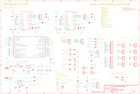

Contents
========

* [PRS10025 > Sparkfun](#prs10025--sparkfun)
	* [Images](#images)
	* [Tags](#tags)
  
![][im]
# PRS10025 > Sparkfun

- ID: PROJ-SPAR-10025-STAN-01
- Hex ID: PRS10025
- Name: Sparkfun
- Description: Sparkfun

## Images
  
  

|kicadPcb3d|kicadPcb3dFront|kicadPcb3dBack|eagleImage|eagleSchemImage|
| :---: | :---: | :---: | :---: | :---: |
||||||

## Tags

- hexID: PRS10025
- oompType: PROJ
- oompSize: SPAR
- oompColor: 10025
- oompDesc: STAN
- oompIndex: 01
- oompName: EiBotBoard
- sources: All source files from https://github.com/sparkfun/EiBotBoard (source licence details in srcLicense.md)
- linkBuyPage: https://www.sparkfun.com/products/10025
- oompID: PROJ-SPAR-10025-STAN-01
- oompParts: 2MM1,UNMATCHED-UNMATCHED-UNMATCHED-UNMATCHED-UNMATCHED
- oompParts: 2MM2,UNMATCHED-UNMATCHED-UNMATCHED-UNMATCHED-UNMATCHED
- oompParts: C1,UNMATCHED-UNMATCHED-UNMATCHED-UNMATCHED-UNMATCHED
- oompParts: C2,UNMATCHED-UNMATCHED-UNMATCHED-UNMATCHED-UNMATCHED
- oompParts: C3,UNMATCHED-UNMATCHED-UNMATCHED-UNMATCHED-UNMATCHED
- oompParts: C4,UNMATCHED-UNMATCHED-UNMATCHED-UNMATCHED-UNMATCHED
- oompParts: C5,UNMATCHED-UNMATCHED-UNMATCHED-UNMATCHED-UNMATCHED
- oompParts: C6,UNMATCHED-UNMATCHED-UNMATCHED-UNMATCHED-UNMATCHED
- oompParts: C7,UNMATCHED-UNMATCHED-UNMATCHED-UNMATCHED-UNMATCHED
- oompParts: C8,UNMATCHED-UNMATCHED-UNMATCHED-UNMATCHED-UNMATCHED
- oompParts: C9,UNMATCHED-UNMATCHED-UNMATCHED-UNMATCHED-UNMATCHED
- oompParts: C10,UNMATCHED-UNMATCHED-UNMATCHED-UNMATCHED-UNMATCHED
- oompParts: C11,UNMATCHED-UNMATCHED-UNMATCHED-UNMATCHED-UNMATCHED
- oompParts: C12,UNMATCHED-UNMATCHED-UNMATCHED-UNMATCHED-UNMATCHED
- oompParts: C13,UNMATCHED-UNMATCHED-UNMATCHED-UNMATCHED-UNMATCHED
- oompParts: C14,UNMATCHED-UNMATCHED-UNMATCHED-UNMATCHED-UNMATCHED
- oompParts: C15,UNMATCHED-UNMATCHED-UNMATCHED-UNMATCHED-UNMATCHED
- oompParts: C16,UNMATCHED-UNMATCHED-UNMATCHED-UNMATCHED-UNMATCHED
- oompParts: C17,UNMATCHED-UNMATCHED-UNMATCHED-UNMATCHED-UNMATCHED
- oompParts: C18,UNMATCHED-UNMATCHED-UNMATCHED-UNMATCHED-UNMATCHED
- oompParts: C19,UNMATCHED-UNMATCHED-UNMATCHED-UNMATCHED-UNMATCHED
- oompParts: C20,UNMATCHED-UNMATCHED-UNMATCHED-UNMATCHED-UNMATCHED
- oompParts: C21,UNMATCHED-UNMATCHED-UNMATCHED-UNMATCHED-UNMATCHED
- oompParts: D1,UNMATCHED-UNMATCHED-UNMATCHED-UNMATCHED-UNMATCHED
- oompParts: D2,UNMATCHED-UNMATCHED-UNMATCHED-UNMATCHED-UNMATCHED
- oompParts: D3,UNMATCHED-UNMATCHED-UNMATCHED-UNMATCHED-UNMATCHED
- oompParts: D4,UNMATCHED-UNMATCHED-UNMATCHED-UNMATCHED-UNMATCHED
- oompParts: F1,UNMATCHED-UNMATCHED-UNMATCHED-UNMATCHED-UNMATCHED
- oompParts: IC1,UNMATCHED-UNMATCHED-UNMATCHED-UNMATCHED-UNMATCHED
- oompParts: IC2,UNMATCHED-UNMATCHED-UNMATCHED-UNMATCHED-UNMATCHED
- oompParts: IC3,UNMATCHED-UNMATCHED-UNMATCHED-UNMATCHED-UNMATCHED
- oompParts: IC4,UNMATCHED-UNMATCHED-UNMATCHED-UNMATCHED-UNMATCHED
- oompParts: IC5,UNMATCHED-UNMATCHED-UNMATCHED-UNMATCHED-UNMATCHED
- oompParts: J3,UNMATCHED-UNMATCHED-UNMATCHED-UNMATCHED-UNMATCHED
- oompParts: J4,UNMATCHED-UNMATCHED-UNMATCHED-UNMATCHED-UNMATCHED
- oompParts: J5,UNMATCHED-UNMATCHED-UNMATCHED-UNMATCHED-UNMATCHED
- oompParts: J6,UNMATCHED-UNMATCHED-UNMATCHED-UNMATCHED-UNMATCHED
- oompParts: J7,UNMATCHED-UNMATCHED-UNMATCHED-UNMATCHED-UNMATCHED
- oompParts: J8,UNMATCHED-UNMATCHED-UNMATCHED-UNMATCHED-UNMATCHED
- oompParts: JP1,UNMATCHED-UNMATCHED-UNMATCHED-UNMATCHED-UNMATCHED
- oompParts: JP2,UNMATCHED-UNMATCHED-UNMATCHED-UNMATCHED-UNMATCHED
- oompParts: JP3,UNMATCHED-UNMATCHED-UNMATCHED-UNMATCHED-UNMATCHED
- oompParts: JP4,UNMATCHED-UNMATCHED-UNMATCHED-UNMATCHED-UNMATCHED
- oompParts: JP5,UNMATCHED-UNMATCHED-UNMATCHED-UNMATCHED-UNMATCHED
- oompParts: JP6,UNMATCHED-UNMATCHED-UNMATCHED-UNMATCHED-UNMATCHED
- oompParts: JP7,UNMATCHED-UNMATCHED-UNMATCHED-UNMATCHED-UNMATCHED
- oompParts: JP8,UNMATCHED-UNMATCHED-UNMATCHED-UNMATCHED-UNMATCHED
- oompParts: JP9,UNMATCHED-UNMATCHED-UNMATCHED-UNMATCHED-UNMATCHED
- oompParts: JP10,UNMATCHED-UNMATCHED-UNMATCHED-UNMATCHED-UNMATCHED
- oompParts: JP11,UNMATCHED-UNMATCHED-UNMATCHED-UNMATCHED-UNMATCHED
- oompParts: JP12,UNMATCHED-UNMATCHED-UNMATCHED-UNMATCHED-UNMATCHED
- oompParts: JP13,UNMATCHED-UNMATCHED-UNMATCHED-UNMATCHED-UNMATCHED
- oompParts: LED1,UNMATCHED-UNMATCHED-UNMATCHED-UNMATCHED-UNMATCHED
- oompParts: LED2,UNMATCHED-UNMATCHED-UNMATCHED-UNMATCHED-UNMATCHED
- oompParts: PWR,UNMATCHED-UNMATCHED-UNMATCHED-UNMATCHED-UNMATCHED
- oompParts: R1,UNMATCHED-UNMATCHED-UNMATCHED-UNMATCHED-UNMATCHED
- oompParts: R2,UNMATCHED-UNMATCHED-UNMATCHED-UNMATCHED-UNMATCHED
- oompParts: R3,UNMATCHED-UNMATCHED-UNMATCHED-UNMATCHED-UNMATCHED
- oompParts: R4,UNMATCHED-UNMATCHED-UNMATCHED-UNMATCHED-UNMATCHED
- oompParts: R5,UNMATCHED-UNMATCHED-UNMATCHED-UNMATCHED-UNMATCHED
- oompParts: R6,UNMATCHED-UNMATCHED-UNMATCHED-UNMATCHED-UNMATCHED
- oompParts: R7,UNMATCHED-UNMATCHED-UNMATCHED-UNMATCHED-UNMATCHED
- oompParts: R8,UNMATCHED-UNMATCHED-UNMATCHED-UNMATCHED-UNMATCHED
- oompParts: R9,UNMATCHED-UNMATCHED-UNMATCHED-UNMATCHED-UNMATCHED
- oompParts: R10,UNMATCHED-UNMATCHED-UNMATCHED-UNMATCHED-UNMATCHED
- oompParts: R11,UNMATCHED-UNMATCHED-UNMATCHED-UNMATCHED-UNMATCHED
- oompParts: R12,UNMATCHED-UNMATCHED-UNMATCHED-UNMATCHED-UNMATCHED
- oompParts: R13,UNMATCHED-UNMATCHED-UNMATCHED-UNMATCHED-UNMATCHED
- oompParts: R14,UNMATCHED-UNMATCHED-UNMATCHED-UNMATCHED-UNMATCHED
- oompParts: R15,UNMATCHED-UNMATCHED-UNMATCHED-UNMATCHED-UNMATCHED
- oompParts: R16,UNMATCHED-UNMATCHED-UNMATCHED-UNMATCHED-UNMATCHED
- oompParts: R17,UNMATCHED-UNMATCHED-UNMATCHED-UNMATCHED-UNMATCHED
- oompParts: R18,UNMATCHED-UNMATCHED-UNMATCHED-UNMATCHED-UNMATCHED
- oompParts: R19,UNMATCHED-UNMATCHED-UNMATCHED-UNMATCHED-UNMATCHED
- oompParts: R20,UNMATCHED-UNMATCHED-UNMATCHED-UNMATCHED-UNMATCHED
- oompParts: R21,UNMATCHED-UNMATCHED-UNMATCHED-UNMATCHED-UNMATCHED
- oompParts: R22,UNMATCHED-UNMATCHED-UNMATCHED-UNMATCHED-UNMATCHED
- oompParts: R23,UNMATCHED-UNMATCHED-UNMATCHED-UNMATCHED-UNMATCHED
- oompParts: R24,UNMATCHED-UNMATCHED-UNMATCHED-UNMATCHED-UNMATCHED
- oompParts: R25,UNMATCHED-UNMATCHED-UNMATCHED-UNMATCHED-UNMATCHED
- oompParts: R26,UNMATCHED-UNMATCHED-UNMATCHED-UNMATCHED-UNMATCHED
- oompParts: R27,UNMATCHED-UNMATCHED-UNMATCHED-UNMATCHED-UNMATCHED
- oompParts: SW1,UNMATCHED-UNMATCHED-UNMATCHED-UNMATCHED-UNMATCHED
- oompParts: SW2,UNMATCHED-UNMATCHED-UNMATCHED-UNMATCHED-UNMATCHED
- oompParts: TP1,UNMATCHED-UNMATCHED-UNMATCHED-UNMATCHED-UNMATCHED
- oompParts: TP2,UNMATCHED-UNMATCHED-UNMATCHED-UNMATCHED-UNMATCHED
- oompParts: TP3,UNMATCHED-UNMATCHED-UNMATCHED-UNMATCHED-UNMATCHED
- oompParts: TP4,UNMATCHED-UNMATCHED-UNMATCHED-UNMATCHED-UNMATCHED
- oompParts: TP5,UNMATCHED-UNMATCHED-UNMATCHED-UNMATCHED-UNMATCHED
- oompParts: TP6,UNMATCHED-UNMATCHED-UNMATCHED-UNMATCHED-UNMATCHED
- oompParts: U$1,UNMATCHED-UNMATCHED-UNMATCHED-UNMATCHED-UNMATCHED
- oompParts: U$2,UNMATCHED-UNMATCHED-UNMATCHED-UNMATCHED-UNMATCHED
- oompParts: U$3,UNMATCHED-UNMATCHED-UNMATCHED-UNMATCHED-UNMATCHED
- oompParts: U$4,UNMATCHED-UNMATCHED-UNMATCHED-UNMATCHED-UNMATCHED
- oompParts: U$5,UNMATCHED-UNMATCHED-UNMATCHED-UNMATCHED-UNMATCHED
- oompParts: U$6,UNMATCHED-UNMATCHED-UNMATCHED-UNMATCHED-UNMATCHED
- oompParts: U$7,UNMATCHED-UNMATCHED-UNMATCHED-UNMATCHED-UNMATCHED
- oompParts: U$8,UNMATCHED-UNMATCHED-UNMATCHED-UNMATCHED-UNMATCHED
- oompParts: U$9,UNMATCHED-UNMATCHED-UNMATCHED-UNMATCHED-UNMATCHED
- oompParts: U$10,UNMATCHED-UNMATCHED-UNMATCHED-UNMATCHED-UNMATCHED
- oompParts: U$11,UNMATCHED-UNMATCHED-UNMATCHED-UNMATCHED-UNMATCHED
- oompParts: USB,UNMATCHED-UNMATCHED-UNMATCHED-UNMATCHED-UNMATCHED
- oompParts: USR,UNMATCHED-UNMATCHED-UNMATCHED-UNMATCHED-UNMATCHED
- rawParts: 2MM1,,SCHMALZHAUS_M04,SCHMALZHAUS_SCREWTERMINAL-3.5MM-4_LOCK,Header 4,,
- rawParts: 2MM2,,SCHMALZHAUS_M04,SCHMALZHAUS_SCREWTERMINAL-3.5MM-4_LOCK,Header 4,,
- rawParts: C1,.1uf,CAP0603,0603,Capacitor,,
- rawParts: C2,.1uf,CAP0603,0603,Capacitor,,
- rawParts: C3,.1uf,CAP0603,0603,Capacitor,,
- rawParts: C4,.1uf,CAP0603,0603,Capacitor,,
- rawParts: C5,.1uf,CAP0603,0603,Capacitor,,
- rawParts: C6,.1uf,CAP0603,0603,Capacitor,,
- rawParts: C7,.1uf,CAP0603,0603,Capacitor,,
- rawParts: C8,.1uf,CAP0603,0603,Capacitor,,
- rawParts: C9,.22uF,CAP0603,0603,Capacitor,,
- rawParts: C10,.22uF,CAP0603,0603,Capacitor,,
- rawParts: C11,.1uf,CAP0603,0603,Capacitor,,
- rawParts: C12,.1uf,CAP0603,0603,Capacitor,,
- rawParts: C13,10uF,CAP_POL1206,EIA3216,Capacitor Polarized,,
- rawParts: C14,100uF,CAP_POLG,PANASONIC_G,Capacitor Polarized,,
- rawParts: C15,.1uf,CAP0603,0603,Capacitor,,
- rawParts: C16,1uF,CAP0603,0603,Capacitor,,
- rawParts: C17,10uF,CAP_POL1206,EIA3216,Capacitor Polarized,,
- rawParts: C18,.1uf,CAP0603,0603,Capacitor,,
- rawParts: C19,.1uf,CAP0603,0603,Capacitor,,
- rawParts: C20,1uF,CAP0603,0603,Capacitor,,
- rawParts: C21,.1uf,CAP0603,0603,Capacitor,,
- rawParts: D1,,DIODE-DO214AC,DO214AC,DIODE,,
- rawParts: D2,,DIODESMA,SMA-DIODE,Diode,,
- rawParts: D3,,DIODESMA,SMA-DIODE,Diode,,
- rawParts: D4,,CGRM4001-G,SOD-123_MINI-SMA,Molded plasitc,JEDEC SOD-123/Mini SMA,,
- rawParts: F1,PTCSMD,PTCSMD,PTC-1206,Resettable Fuse PTC,,
- rawParts: IC1,A4983ALT1,A4983ALT1,QFN-28-5MM_ALT1,DMOS Microstepping Driver with Translator,,
- rawParts: IC2,A4983ALT1,A4983ALT1,QFN-28-5MM_ALT1,DMOS Microstepping Driver with Translator,,
- rawParts: IC3,PIC18F46J50-I/PT,PIC18F4J50,TQFP44,,,
- rawParts: IC4,LM317MABDT,LM317MABDT,DPACK,500 mA Adjustable Output Positive Voltage Regulator,,
- rawParts: IC5,LM317MABDT,LM317MABDT,DPACK,500 mA Adjustable Output Positive Voltage Regulator,,
- rawParts: J3,USBSMD,USBSMD,USB-MINIB,USB Connectors,,
- rawParts: J4,IO,M12PTH,1X12,Header 12,,
- rawParts: J5,IO,M12PTH,1X12,Header 12,,
- rawParts: J6,POWER_JACKSMD,POWER_JACKSMD,POWER_JACK_SMD,Power Jack,,
- rawParts: J7,POWER_JACKSMD,POWER_JACKSMD,POWER_JACK_SMD,Power Jack,,
- rawParts: J8,ICSP,M05_WIDENOSILK,1X05_NOSILK,Header 5,,
- rawParts: JP1,,M03LOCK_NO_SILK,1X03_LOCK_NO_SILK,Header 3,,
- rawParts: JP2,,M031X03_NO_SILK,1X03_NO_SILK,Header 3,,
- rawParts: JP3,,M031X03_NO_SILK,1X03_NO_SILK,Header 3,,
- rawParts: JP4,,M031X03_NO_SILK,1X03_NO_SILK,Header 3,,
- rawParts: JP5,,M031X03_NO_SILK,1X03_NO_SILK,Header 3,,
- rawParts: JP6,,M031X03_NO_SILK,1X03_NO_SILK,Header 3,,
- rawParts: JP7,,M031X03_NO_SILK,1X03_NO_SILK,Header 3,,
- rawParts: JP8,,M031X03_NO_SILK,1X03_NO_SILK,Header 3,,
- rawParts: JP9,,M04POLAR,MOLEX-1X4,Header 4,,
- rawParts: JP10,,M04POLAR,MOLEX-1X4,Header 4,,
- rawParts: JP11,LOGO-SFENEW,LOGO-SFENEW,SFE-NEW-WEBLOGO,Spark Fun Electronics PCB Logo,,
- rawParts: JP12,,JUMPER-2SMD-NO,SJ_2S-NO,Jumper,,
- rawParts: JP13,,JUMPER-2SMD-NO,SJ_2S-NO,Jumper,,
- rawParts: JP14,FIDUCIALUFIDUCIAL,FIDUCIALUFIDUCIAL,MICRO-FIDUCIAL,Fiducial Alignment Points,,
- rawParts: JP15,FIDUCIALUFIDUCIAL,FIDUCIALUFIDUCIAL,MICRO-FIDUCIAL,Fiducial Alignment Points,,
- rawParts: LED1,DIR1_RED,LED0603,LED-0603,LEDs,,
- rawParts: LED2,DIR2_RED,LED0603,LED-0603,LEDs,,
- rawParts: PWR,GREEN,LED0603,LED-0603,LEDs,,
- rawParts: R1,.22,R-US_R0805,R0805,RESISTOR, American symbol,,
- rawParts: R2,.22,R-US_R0805,R0805,RESISTOR, American symbol,,
- rawParts: R3,.22,R-US_R0805,R0805,RESISTOR, American symbol,,
- rawParts: R4,.22,R-US_R0805,R0805,RESISTOR, American symbol,,
- rawParts: R5,10K,R-US_R0603,R0603,RESISTOR, American symbol,,
- rawParts: R6,10K,R-US_R0603,R0603,RESISTOR, American symbol,,
- rawParts: R7,20K,R-US_R0603,R0603,RESISTOR, American symbol,,
- rawParts: R8,20K,R-US_R0603,R0603,RESISTOR, American symbol,,
- rawParts: R9,10K,R-US_R0603,R0603,RESISTOR, American symbol,,
- rawParts: R10,10K,R-US_R0603,R0603,RESISTOR, American symbol,,
- rawParts: R11,TRIMPOTSMD - 10K,TRIMPOTSMD,TRIMPOT-3MM,,,
- rawParts: R12,47K,R-US_R0603,R0603,RESISTOR, American symbol,,
- rawParts: R13,47K,R-US_R0603,R0603,RESISTOR, American symbol,,
- rawParts: R14,47K,R-US_R0603,R0603,RESISTOR, American symbol,,
- rawParts: R15,330,R-US_R0603,R0603,RESISTOR, American symbol,,
- rawParts: R16,330,R-US_R0603,R0603,RESISTOR, American symbol,,
- rawParts: R17,68.1K,R-US_R0603,R0603,RESISTOR, American symbol,,
- rawParts: R18,4.7K,R-US_R0603,R0603,RESISTOR, American symbol,,
- rawParts: R19,715,R-US_R0603,R0603,RESISTOR, American symbol,,
- rawParts: R20,330,R-US_R0603,R0603,RESISTOR, American symbol,,
- rawParts: R21,10K,R-US_R0603,R0603,RESISTOR, American symbol,,
- rawParts: R22,10K,R-US_R0603,R0603,RESISTOR, American symbol,,
- rawParts: R23,240,R-US_R0603,R0603,RESISTOR, American symbol,,
- rawParts: R24,240,R-US_R0603,R0603,RESISTOR, American symbol,,
- rawParts: R25,330,R-US_R0603,R0603,RESISTOR, American symbol,,
- rawParts: R26,330,R-US_R0603,R0603,RESISTOR, American symbol,,
- rawParts: R27,390,R-US_R0603,R0603,RESISTOR, American symbol,,
- rawParts: SW1,PRG,TAC_SWITCHSND,TACTILE_SWITCH_SMD,Momentary Switch,,
- rawParts: SW2,RST,TAC_SWITCHSND,TACTILE_SWITCH_SMD,Momentary Switch,,
- rawParts: TP1,VCC,M01_WIDENOSLIK,1X01_NOSILK,Header 1,,
- rawParts: TP2,GND,M01_WIDENOSLIK,1X01_NOSILK,Header 1,,
- rawParts: TP3,REF,M01PTH,1X01,Header 1,,
- rawParts: TP4,GND,M01_WIDENOSLIK,1X01_NOSILK,Header 1,,
- rawParts: TP5,GND,M01_WIDENOSLIK,1X01_NOSILK,Header 1,,
- rawParts: TP6,Servo,TEST-POINT3X5,PAD.03X.05,,,
- rawParts: U$1,SCHMALZHAUSSCHMALZHAUS_SMALL,SCHMALZHAUSSCHMALZHAUS_SMALL,SCHMALZHAUS_SMALL,,,
- rawParts: U$2,STAND-OFF,STAND-OFF,STAND-OFF,Stand Off,,
- rawParts: U$3,STAND-OFF,STAND-OFF,STAND-OFF,Stand Off,,
- rawParts: U$4,STAND-OFF,STAND-OFF,STAND-OFF,Stand Off,,
- rawParts: U$5,STAND-OFF,STAND-OFF,STAND-OFF,Stand Off,,
- rawParts: U$6,PAD,PAD,PAD-0.008,,,
- rawParts: U$7,PAD,PAD,PAD-0.008,,,
- rawParts: U$8,PAD,PAD,PAD-0.008,,,
- rawParts: U$9,PAD,PAD,PAD-0.008,,,
- rawParts: U$10,PAD,PAD,PAD-0.008,,,
- rawParts: U$11,PAD,PAD,PAD-0.008,,,
- rawParts: USB,GREEN,LED0603,LED-0603,LEDs,,
- rawParts: USR,RED,LED0603,LED-0603,LEDs,,

[im]: kicadPcb3d_450.png
