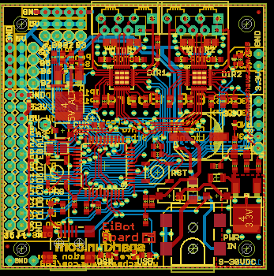
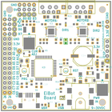
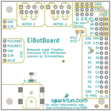

Contents
========

* [PRS10025 > EiBotBoard](#prs10025--eibotboard)
	* [Schematic](#schematic)
	* [PCB](#pcb)
	* [Interactive BOM](#interactive-bom)
	* [OOMP Parts](#oomp-parts)
	* [Images](#images)
	* [Tags](#tags)
  
![][im]
# PRS10025 > EiBotBoard

- ID: PROJ-SPAR-10025-STAN-01
- Hex ID: PRS10025
- Name: Sparkfun
- Description: Sparkfun
- Long Link: [http://oom.lt/PROJ-SPAR-10025-STAN-01](http://oom.lt/PROJ-SPAR-10025-STAN-01)
- Short Link: [http://oom.lt/PRS10025](http://oom.lt/PRS10025)

## Schematic
  

## PCB
  

## Interactive BOM

- Interactive BOM page: [ibom.html](https://htmlpreview.github.io/?https://github.com/oomlout/oomlout_OOMP_projects/blob/main/PROJ-SPAR-10025-STAN-01/kicad/bom/ibom.html)

## OOMP Parts
  

|OOMP Parts|
| :---: |
|TERS-35D-L-PI04-01 2MM1, 2MM2|
|[CAPC-0603-X-NF100-V50  SMD (0603) 100 nF Capacitor (Ceramic) 50v  C1, C2, C3, C4, C5, C6, C7, C8, C11, C12, C15, C18, C19, C21](https://github.com/oomlout/oomlout_OOMP_parts/tree/main/CAPC-0603-X-NF100-V50/)|
|[CAPC-0603-X-NF220-V25  SMD (0603) 220 nF Capacitor (Ceramic) 25v  C9, C10](https://github.com/oomlout/oomlout_OOMP_parts/tree/main/CAPC-0603-X-NF220-V25/)|
|CAPT-3216-X-UF10-01 C13, C17|
|CAPE-PANG-X-UF100-01 C14|
|[CAPC-0603-X-UF1-V25  SMD (0603) 1 uF Capacitor (Ceramic) 25v  C16, C20](https://github.com/oomlout/oomlout_OOMP_parts/tree/main/CAPC-0603-X-UF1-V25/)|
|DIOD-D214-X-UNMATCHED-01 D1|
|DIOD-UNMATCHED-X-UNMATCHED-01 D2, D3|
|DIOD-S123-X-UNMATCHED-01 D4|
|REFU-1206-X-UNMATCHED-01 F1|
|UNMATCHED-UNMATCHED-X-UNMATCHED-01 IC1, IC2, IC3, IC4, IC5, J3, JP12, JP13, SW1, SW2, TP6, U$1|
|[HEAD-I01-X-PI12-01  2.54 mm 12 Pin Header  J4, J5](https://github.com/oomlout/oomlout_OOMP_parts/tree/main/HEAD-I01-X-PI12-01/)|
|[DCJP-S21D-X-STAN-01  2.1 mm (SMD) DC Jack  J6, J7](https://github.com/oomlout/oomlout_OOMP_parts/tree/main/DCJP-S21D-X-STAN-01/)|
|[HEAD-I01-X-PI05-01  2.54 mm 5 Pin Header  J8](https://github.com/oomlout/oomlout_OOMP_parts/tree/main/HEAD-I01-X-PI05-01/)|
|[HEAD-I01-X-PI03-01  2.54 mm 3 Pin Header  JP1, JP2, JP3, JP4, JP5, JP6, JP7, JP8](https://github.com/oomlout/oomlout_OOMP_parts/tree/main/HEAD-I01-X-PI03-01/)|
|HEAD-I01-X-UNMATCHED-01 JP9, JP10|
|[LEDS-0603-R-STAN-01  SMD (0603) Red LED  LED1, LED2, USR](https://github.com/oomlout/oomlout_OOMP_parts/tree/main/LEDS-0603-R-STAN-01/)|
|[LEDS-0603-G-STAN-01  SMD (0603) Green LED  PWR, USB](https://github.com/oomlout/oomlout_OOMP_parts/tree/main/LEDS-0603-G-STAN-01/)|
|RESE-0805-X-UNMATCHED-01 R1, R2, R3, R4|
|[RESE-0603-X-O103-01  SMD (0603) 10k Ohm Resistor  R5, R6, R9, R10, R21, R22](https://github.com/oomlout/oomlout_OOMP_parts/tree/main/RESE-0603-X-O103-01/)|
|[RESE-0603-X-O203-01  SMD (0603) 20k Ohm Resistor  R7, R8](https://github.com/oomlout/oomlout_OOMP_parts/tree/main/RESE-0603-X-O203-01/)|
|RESE-UNMATCHED-X-UNMATCHED-01 R11|
|[RESE-0603-X-O473-01  SMD (0603) 47k Ohm Resistor  R12, R13, R14](https://github.com/oomlout/oomlout_OOMP_parts/tree/main/RESE-0603-X-O473-01/)|
|[RESE-0603-X-O331-01  SMD (0603) 330 Ohm Resistor  R15, R16, R20, R25, R26](https://github.com/oomlout/oomlout_OOMP_parts/tree/main/RESE-0603-X-O331-01/)|
|RESE-0603-X-UNMATCHED-01 R17|
|[RESE-0603-X-O472-01  SMD (0603) 4.7k Ohm Resistor  R18](https://github.com/oomlout/oomlout_OOMP_parts/tree/main/RESE-0603-X-O472-01/)|
|RESE-0603-X-O711-01 R19|
|[RESE-0603-X-O241-01  SMD (0603) 240 Ohm Resistor  R23, R24](https://github.com/oomlout/oomlout_OOMP_parts/tree/main/RESE-0603-X-O241-01/)|
|[RESE-0603-X-O391-01  SMD (0603) 390 Ohm Resistor  R27](https://github.com/oomlout/oomlout_OOMP_parts/tree/main/RESE-0603-X-O391-01/)|
|HEAD-I01-X-PI01-01 TP1, TP2, TP3, TP4, TP5|

## Images
  
  

|bominteractivefront|bominteractiveback|kicadPcb3d|kicadPcb3dFront|kicadPcb3dBack|eagleImage|eagleSchemImage|
| :---: | :---: | :---: | :---: | :---: | :---: | :---: |
||||||||

## Tags

- hexID: PRS10025
- oompType: PROJ
- oompSize: SPAR
- oompColor: 10025
- oompDesc: STAN
- oompIndex: 01
- oompName: EiBotBoard
- sources: All source files from https://github.com/sparkfun/EiBotBoard (source licence details in srcLicense.md)
- linkBuyPage: https://www.sparkfun.com/products/10025
- oompID: PROJ-SPAR-10025-STAN-01
- oompParts: 2MM1,TERS-35D-L-PI04-01
- oompParts: 2MM2,TERS-35D-L-PI04-01
- oompParts: C1,CAPC-0603-X-NF100-V50
- oompParts: C2,CAPC-0603-X-NF100-V50
- oompParts: C3,CAPC-0603-X-NF100-V50
- oompParts: C4,CAPC-0603-X-NF100-V50
- oompParts: C5,CAPC-0603-X-NF100-V50
- oompParts: C6,CAPC-0603-X-NF100-V50
- oompParts: C7,CAPC-0603-X-NF100-V50
- oompParts: C8,CAPC-0603-X-NF100-V50
- oompParts: C9,CAPC-0603-X-NF220-V25
- oompParts: C10,CAPC-0603-X-NF220-V25
- oompParts: C11,CAPC-0603-X-NF100-V50
- oompParts: C12,CAPC-0603-X-NF100-V50
- oompParts: C13,CAPT-3216-X-UF10-01
- oompParts: C14,CAPE-PANG-X-UF100-01
- oompParts: C15,CAPC-0603-X-NF100-V50
- oompParts: C16,CAPC-0603-X-UF1-V25
- oompParts: C17,CAPT-3216-X-UF10-01
- oompParts: C18,CAPC-0603-X-NF100-V50
- oompParts: C19,CAPC-0603-X-NF100-V50
- oompParts: C20,CAPC-0603-X-UF1-V25
- oompParts: C21,CAPC-0603-X-NF100-V50
- oompParts: D1,DIOD-D214-X-UNMATCHED-01
- oompParts: D2,DIOD-UNMATCHED-X-UNMATCHED-01
- oompParts: D3,DIOD-UNMATCHED-X-UNMATCHED-01
- oompParts: D4,DIOD-S123-X-UNMATCHED-01
- oompParts: F1,REFU-1206-X-UNMATCHED-01
- oompParts: IC1,UNMATCHED-UNMATCHED-X-UNMATCHED-01
- oompParts: IC2,UNMATCHED-UNMATCHED-X-UNMATCHED-01
- oompParts: IC3,UNMATCHED-UNMATCHED-X-UNMATCHED-01
- oompParts: IC4,UNMATCHED-UNMATCHED-X-UNMATCHED-01
- oompParts: IC5,UNMATCHED-UNMATCHED-X-UNMATCHED-01
- oompParts: J3,UNMATCHED-UNMATCHED-X-UNMATCHED-01
- oompParts: J4,HEAD-I01-X-PI12-01
- oompParts: J5,HEAD-I01-X-PI12-01
- oompParts: J6,DCJP-S21D-X-STAN-01
- oompParts: J7,DCJP-S21D-X-STAN-01
- oompParts: J8,HEAD-I01-X-PI05-01
- oompParts: JP1,HEAD-I01-X-PI03-01
- oompParts: JP2,HEAD-I01-X-PI03-01
- oompParts: JP3,HEAD-I01-X-PI03-01
- oompParts: JP4,HEAD-I01-X-PI03-01
- oompParts: JP5,HEAD-I01-X-PI03-01
- oompParts: JP6,HEAD-I01-X-PI03-01
- oompParts: JP7,HEAD-I01-X-PI03-01
- oompParts: JP8,HEAD-I01-X-PI03-01
- oompParts: JP9,HEAD-I01-X-UNMATCHED-01
- oompParts: JP10,HEAD-I01-X-UNMATCHED-01
- oompParts: JP12,UNMATCHED-UNMATCHED-X-UNMATCHED-01
- oompParts: JP13,UNMATCHED-UNMATCHED-X-UNMATCHED-01
- oompParts: LED1,LEDS-0603-R-STAN-01
- oompParts: LED2,LEDS-0603-R-STAN-01
- oompParts: PWR,LEDS-0603-G-STAN-01
- oompParts: R1,RESE-0805-X-UNMATCHED-01
- oompParts: R2,RESE-0805-X-UNMATCHED-01
- oompParts: R3,RESE-0805-X-UNMATCHED-01
- oompParts: R4,RESE-0805-X-UNMATCHED-01
- oompParts: R5,RESE-0603-X-O103-01
- oompParts: R6,RESE-0603-X-O103-01
- oompParts: R7,RESE-0603-X-O203-01
- oompParts: R8,RESE-0603-X-O203-01
- oompParts: R9,RESE-0603-X-O103-01
- oompParts: R10,RESE-0603-X-O103-01
- oompParts: R11,RESE-UNMATCHED-X-UNMATCHED-01
- oompParts: R12,RESE-0603-X-O473-01
- oompParts: R13,RESE-0603-X-O473-01
- oompParts: R14,RESE-0603-X-O473-01
- oompParts: R15,RESE-0603-X-O331-01
- oompParts: R16,RESE-0603-X-O331-01
- oompParts: R17,RESE-0603-X-UNMATCHED-01
- oompParts: R18,RESE-0603-X-O472-01
- oompParts: R19,RESE-0603-X-O711-01
- oompParts: R20,RESE-0603-X-O331-01
- oompParts: R21,RESE-0603-X-O103-01
- oompParts: R22,RESE-0603-X-O103-01
- oompParts: R23,RESE-0603-X-O241-01
- oompParts: R24,RESE-0603-X-O241-01
- oompParts: R25,RESE-0603-X-O331-01
- oompParts: R26,RESE-0603-X-O331-01
- oompParts: R27,RESE-0603-X-O391-01
- oompParts: SW1,UNMATCHED-UNMATCHED-X-UNMATCHED-01
- oompParts: SW2,UNMATCHED-UNMATCHED-X-UNMATCHED-01
- oompParts: TP1,HEAD-I01-X-PI01-01
- oompParts: TP2,HEAD-I01-X-PI01-01
- oompParts: TP3,HEAD-I01-X-PI01-01
- oompParts: TP4,HEAD-I01-X-PI01-01
- oompParts: TP5,HEAD-I01-X-PI01-01
- oompParts: TP6,UNMATCHED-UNMATCHED-X-UNMATCHED-01
- oompParts: U$1,UNMATCHED-UNMATCHED-X-UNMATCHED-01
- oompParts: USB,LEDS-0603-G-STAN-01
- oompParts: USR,LEDS-0603-R-STAN-01
- rawParts: 2MM1,,SCHMALZHAUS_M04,SCHMALZHAUS_SCREWTERMINAL-3.5MM-4_LOCK,Header 4,,
- rawParts: 2MM2,,SCHMALZHAUS_M04,SCHMALZHAUS_SCREWTERMINAL-3.5MM-4_LOCK,Header 4,,
- rawParts: C1,.1uf,CAP0603,0603,Capacitor,,
- rawParts: C2,.1uf,CAP0603,0603,Capacitor,,
- rawParts: C3,.1uf,CAP0603,0603,Capacitor,,
- rawParts: C4,.1uf,CAP0603,0603,Capacitor,,
- rawParts: C5,.1uf,CAP0603,0603,Capacitor,,
- rawParts: C6,.1uf,CAP0603,0603,Capacitor,,
- rawParts: C7,.1uf,CAP0603,0603,Capacitor,,
- rawParts: C8,.1uf,CAP0603,0603,Capacitor,,
- rawParts: C9,.22uF,CAP0603,0603,Capacitor,,
- rawParts: C10,.22uF,CAP0603,0603,Capacitor,,
- rawParts: C11,.1uf,CAP0603,0603,Capacitor,,
- rawParts: C12,.1uf,CAP0603,0603,Capacitor,,
- rawParts: C13,10uF,CAP_POL1206,EIA3216,Capacitor Polarized,,
- rawParts: C14,100uF,CAP_POLG,PANASONIC_G,Capacitor Polarized,,
- rawParts: C15,.1uf,CAP0603,0603,Capacitor,,
- rawParts: C16,1uF,CAP0603,0603,Capacitor,,
- rawParts: C17,10uF,CAP_POL1206,EIA3216,Capacitor Polarized,,
- rawParts: C18,.1uf,CAP0603,0603,Capacitor,,
- rawParts: C19,.1uf,CAP0603,0603,Capacitor,,
- rawParts: C20,1uF,CAP0603,0603,Capacitor,,
- rawParts: C21,.1uf,CAP0603,0603,Capacitor,,
- rawParts: D1,,DIODE-DO214AC,DO214AC,DIODE,,
- rawParts: D2,,DIODESMA,SMA-DIODE,Diode,,
- rawParts: D3,,DIODESMA,SMA-DIODE,Diode,,
- rawParts: D4,,CGRM4001-G,SOD-123_MINI-SMA,Molded plasitc,JEDEC SOD-123/Mini SMA,,
- rawParts: F1,PTCSMD,PTCSMD,PTC-1206,Resettable Fuse PTC,,
- rawParts: IC1,A4983ALT1,A4983ALT1,QFN-28-5MM_ALT1,DMOS Microstepping Driver with Translator,,
- rawParts: IC2,A4983ALT1,A4983ALT1,QFN-28-5MM_ALT1,DMOS Microstepping Driver with Translator,,
- rawParts: IC3,PIC18F46J50-I/PT,PIC18F4J50,TQFP44,,,
- rawParts: IC4,LM317MABDT,LM317MABDT,DPACK,500 mA Adjustable Output Positive Voltage Regulator,,
- rawParts: IC5,LM317MABDT,LM317MABDT,DPACK,500 mA Adjustable Output Positive Voltage Regulator,,
- rawParts: J3,USBSMD,USBSMD,USB-MINIB,USB Connectors,,
- rawParts: J4,IO,M12PTH,1X12,Header 12,,
- rawParts: J5,IO,M12PTH,1X12,Header 12,,
- rawParts: J6,POWER_JACKSMD,POWER_JACKSMD,POWER_JACK_SMD,Power Jack,,
- rawParts: J7,POWER_JACKSMD,POWER_JACKSMD,POWER_JACK_SMD,Power Jack,,
- rawParts: J8,ICSP,M05_WIDENOSILK,1X05_NOSILK,Header 5,,
- rawParts: JP1,,M03LOCK_NO_SILK,1X03_LOCK_NO_SILK,Header 3,,
- rawParts: JP2,,M031X03_NO_SILK,1X03_NO_SILK,Header 3,,
- rawParts: JP3,,M031X03_NO_SILK,1X03_NO_SILK,Header 3,,
- rawParts: JP4,,M031X03_NO_SILK,1X03_NO_SILK,Header 3,,
- rawParts: JP5,,M031X03_NO_SILK,1X03_NO_SILK,Header 3,,
- rawParts: JP6,,M031X03_NO_SILK,1X03_NO_SILK,Header 3,,
- rawParts: JP7,,M031X03_NO_SILK,1X03_NO_SILK,Header 3,,
- rawParts: JP8,,M031X03_NO_SILK,1X03_NO_SILK,Header 3,,
- rawParts: JP9,,M04POLAR,MOLEX-1X4,Header 4,,
- rawParts: JP10,,M04POLAR,MOLEX-1X4,Header 4,,
- rawParts: JP11,LOGO-SFENEW,LOGO-SFENEW,SFE-NEW-WEBLOGO,Spark Fun Electronics PCB Logo,,
- rawParts: JP12,,JUMPER-2SMD-NO,SJ_2S-NO,Jumper,,
- rawParts: JP13,,JUMPER-2SMD-NO,SJ_2S-NO,Jumper,,
- rawParts: JP14,FIDUCIALUFIDUCIAL,FIDUCIALUFIDUCIAL,MICRO-FIDUCIAL,Fiducial Alignment Points,,
- rawParts: JP15,FIDUCIALUFIDUCIAL,FIDUCIALUFIDUCIAL,MICRO-FIDUCIAL,Fiducial Alignment Points,,
- rawParts: LED1,DIR1_RED,LED0603,LED-0603,LEDs,,
- rawParts: LED2,DIR2_RED,LED0603,LED-0603,LEDs,,
- rawParts: PWR,GREEN,LED0603,LED-0603,LEDs,,
- rawParts: R1,.22,R-US_R0805,R0805,RESISTOR, American symbol,,
- rawParts: R2,.22,R-US_R0805,R0805,RESISTOR, American symbol,,
- rawParts: R3,.22,R-US_R0805,R0805,RESISTOR, American symbol,,
- rawParts: R4,.22,R-US_R0805,R0805,RESISTOR, American symbol,,
- rawParts: R5,10K,R-US_R0603,R0603,RESISTOR, American symbol,,
- rawParts: R6,10K,R-US_R0603,R0603,RESISTOR, American symbol,,
- rawParts: R7,20K,R-US_R0603,R0603,RESISTOR, American symbol,,
- rawParts: R8,20K,R-US_R0603,R0603,RESISTOR, American symbol,,
- rawParts: R9,10K,R-US_R0603,R0603,RESISTOR, American symbol,,
- rawParts: R10,10K,R-US_R0603,R0603,RESISTOR, American symbol,,
- rawParts: R11,TRIMPOTSMD - 10K,TRIMPOTSMD,TRIMPOT-3MM,,,
- rawParts: R12,47K,R-US_R0603,R0603,RESISTOR, American symbol,,
- rawParts: R13,47K,R-US_R0603,R0603,RESISTOR, American symbol,,
- rawParts: R14,47K,R-US_R0603,R0603,RESISTOR, American symbol,,
- rawParts: R15,330,R-US_R0603,R0603,RESISTOR, American symbol,,
- rawParts: R16,330,R-US_R0603,R0603,RESISTOR, American symbol,,
- rawParts: R17,68.1K,R-US_R0603,R0603,RESISTOR, American symbol,,
- rawParts: R18,4.7K,R-US_R0603,R0603,RESISTOR, American symbol,,
- rawParts: R19,715,R-US_R0603,R0603,RESISTOR, American symbol,,
- rawParts: R20,330,R-US_R0603,R0603,RESISTOR, American symbol,,
- rawParts: R21,10K,R-US_R0603,R0603,RESISTOR, American symbol,,
- rawParts: R22,10K,R-US_R0603,R0603,RESISTOR, American symbol,,
- rawParts: R23,240,R-US_R0603,R0603,RESISTOR, American symbol,,
- rawParts: R24,240,R-US_R0603,R0603,RESISTOR, American symbol,,
- rawParts: R25,330,R-US_R0603,R0603,RESISTOR, American symbol,,
- rawParts: R26,330,R-US_R0603,R0603,RESISTOR, American symbol,,
- rawParts: R27,390,R-US_R0603,R0603,RESISTOR, American symbol,,
- rawParts: SW1,PRG,TAC_SWITCHSND,TACTILE_SWITCH_SMD,Momentary Switch,,
- rawParts: SW2,RST,TAC_SWITCHSND,TACTILE_SWITCH_SMD,Momentary Switch,,
- rawParts: TP1,VCC,M01_WIDENOSLIK,1X01_NOSILK,Header 1,,
- rawParts: TP2,GND,M01_WIDENOSLIK,1X01_NOSILK,Header 1,,
- rawParts: TP3,REF,M01PTH,1X01,Header 1,,
- rawParts: TP4,GND,M01_WIDENOSLIK,1X01_NOSILK,Header 1,,
- rawParts: TP5,GND,M01_WIDENOSLIK,1X01_NOSILK,Header 1,,
- rawParts: TP6,Servo,TEST-POINT3X5,PAD.03X.05,,,
- rawParts: U$1,SCHMALZHAUSSCHMALZHAUS_SMALL,SCHMALZHAUSSCHMALZHAUS_SMALL,SCHMALZHAUS_SMALL,,,
- rawParts: U$2,STAND-OFF,STAND-OFF,STAND-OFF,Stand Off,,
- rawParts: U$3,STAND-OFF,STAND-OFF,STAND-OFF,Stand Off,,
- rawParts: U$4,STAND-OFF,STAND-OFF,STAND-OFF,Stand Off,,
- rawParts: U$5,STAND-OFF,STAND-OFF,STAND-OFF,Stand Off,,
- rawParts: U$6,PAD,PAD,PAD-0.008,,,
- rawParts: U$7,PAD,PAD,PAD-0.008,,,
- rawParts: U$8,PAD,PAD,PAD-0.008,,,
- rawParts: U$9,PAD,PAD,PAD-0.008,,,
- rawParts: U$10,PAD,PAD,PAD-0.008,,,
- rawParts: U$11,PAD,PAD,PAD-0.008,,,
- rawParts: USB,GREEN,LED0603,LED-0603,LEDs,,
- rawParts: USR,RED,LED0603,LED-0603,LEDs,,

[im]: kicadPcb3d_450.png
