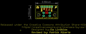

Contents
========

* [PROJ-SPAR-10031-STAN-01>USB microB Plug Breakout](#proj-spar-10031-stan-01usb-microb-plug-breakout)
	* [Images](#images)
	* [Interactive BOM](#interactive-bom)
	* [Tags](#tags)
  
![][im]
# PROJ-SPAR-10031-STAN-01>USB microB Plug Breakout

- ID: PROJ-SPAR-10031-STAN-01
- Hex ID: PRS10031
- Name: USB microB Plug Breakout
- Description: 

## Images
  
  

|eagleImage|
| :---: |
||

## Interactive BOM

- Interactive BOM page: [ibom.html](kicad/bom/ibom.html)

## Tags

- hexID: PRS10031
- oompType: PROJ
- oompSize: SPAR
- oompColor: 10031
- oompDesc: STAN
- oompIndex: 01
- oompName: USB microB Plug Breakout
- sources: All source files from https://github.com/sparkfun/USB_microB_Plug_Breakout (source licence details in srcLicense.md)
- linkBuyPage: https://www.sparkfun.com/products/10031
- oompPart: UNMATCHED-UNMATCHED-X-UNMATCHED-01, JP1, 16.509999999999998, 12.7, 180
- oompPart: ERROR, JP2 USB Micro, 0, 0, 0
- rawPart: 

[im]: eagleImage_450.png
