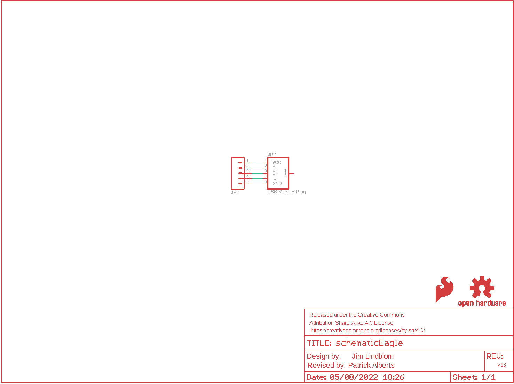
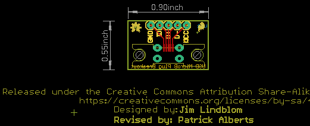
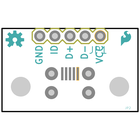
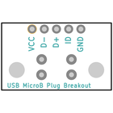
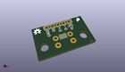
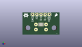
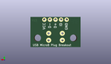
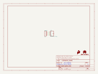
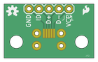
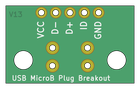

Contents
========

* [PRS10031 > USB microB Plug Breakout](#prs10031--usb-microb-plug-breakout)
	* [Schematic](#schematic)
	* [PCB](#pcb)
	* [Interactive BOM](#interactive-bom)
	* [OOMP Parts](#oomp-parts)
	* [Images](#images)
	* [Tags](#tags)
  
![][im]
# PRS10031 > USB microB Plug Breakout

- ID: PROJ-SPAR-10031-STAN-01
- Hex ID: PRS10031
- Name: Sparkfun
- Description: Sparkfun
- Long Link: [http://oom.lt/PROJ-SPAR-10031-STAN-01](http://oom.lt/PROJ-SPAR-10031-STAN-01)
- Short Link: [http://oom.lt/PRS10031](http://oom.lt/PRS10031)

## Schematic
  

## PCB
  

## Interactive BOM

- Interactive BOM page: [ibom.html](https://htmlpreview.github.io/?https://github.com/oomlout/oomlout_OOMP_projects/blob/main/PROJ-SPAR-10031-STAN-01/kicad/bom/ibom.html)

## OOMP Parts
  

|OOMP ID|Name|Identifier|
| :---: | :---: | :---: |
|[HEAD-I01-X-PI05-01](https://github.com/oomlout/oomlout_OOMP_parts/tree/main/HEAD-I01-X-PI05-01/)|[2.54 mm 5 Pin Header](https://github.com/oomlout/oomlout_OOMP_parts/tree/main/HEAD-I01-X-PI05-01/)|[JP1](https://github.com/oomlout/oomlout_OOMP_parts/tree/main/HEAD-I01-X-PI05-01/)|
|UNMATCHED-UNMATCHED-X-UNMATCHED-01||JP2|

## Images
  
  

|bominteractivefront|bominteractiveback|kicadPcb3d|kicadPcb3dFront|kicadPcb3dBack|kicadSchem|eagleImage|eagleSchemImage|pcbdraw|pcbdrawback|
| :---: | :---: | :---: | :---: | :---: | :---: | :---: | :---: | :---: | :---: |
|||||||||||

## Tags

- hexID: PRS10031
- oompType: PROJ
- oompSize: SPAR
- oompColor: 10031
- oompDesc: STAN
- oompIndex: 01
- oompName: USB microB Plug Breakout
- sources: All source files from https://github.com/sparkfun/USB_microB_Plug_Breakout (source licence details in srcLicense.md)
- linkBuyPage: https://www.sparkfun.com/products/10031
- oompID: PROJ-SPAR-10031-STAN-01
- oompParts: JP1,HEAD-I01-X-PI05-01
- oompParts: JP2,UNMATCHED-UNMATCHED-X-UNMATCHED-01
- rawParts: FRAME1,FRAME-LETTER,FRAME-LETTER,CREATIVE_COMMONS,Schematic Frame,,
- rawParts: JP1,,M05PTH,1X05,Header 5,,
- rawParts: JP2,USB Micro B Plug,USB_MICROB_PLUG-SMT,MICRO-B-SMT,USB Micro-B connectors,CONN-09900,
- rawParts: LOGO1,OSHW-LOGOS,OSHW-LOGOS,OSHW-LOGO-S,Open Source Hardware Logo,,
- rawParts: LOGO2,SFE_LOGO_FLAME.1_INCH,SFE_LOGO_FLAME.1_INCH,SFE_LOGO_FLAME_.1,SFE Logo, flame only,,

[im]: kicadPcb3d_450.png
