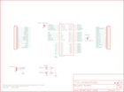

Contents
========

* [PRS10050 > WiFly GSX Breakout](#prs10050--wifly-gsx-breakout)
	* [Schematic](#schematic)
	* [PCB](#pcb)
	* [Interactive BOM](#interactive-bom)
	* [OOMP Parts](#oomp-parts)
	* [Images](#images)
	* [Tags](#tags)
  
![][im]
# PRS10050 > WiFly GSX Breakout

- ID: PROJ-SPAR-10050-STAN-01
- Hex ID: PRS10050
- Name: Sparkfun
- Description: Sparkfun
- Long Link: [http://oom.lt/PROJ-SPAR-10050-STAN-01](http://oom.lt/PROJ-SPAR-10050-STAN-01)
- Short Link: [http://oom.lt/PRS10050](http://oom.lt/PRS10050)

## Schematic
  

## PCB
  

## Interactive BOM

- Interactive BOM page: [ibom.html](https://htmlpreview.github.io/?https://github.com/oomlout/oomlout_OOMP_projects/blob/main/PROJ-SPAR-10050-STAN-01/kicad/bom/ibom.html)

## OOMP Parts
  

|OOMP ID|Name|Identifier|
| :---: | :---: | :---: |
|UNMATCHED-UNMATCHED-X-UNMATCHED-01||J1, J2, JP1, JP2, JP3, U1|
|[LEDS-0603-G-STAN-01](https://github.com/oomlout/oomlout_OOMP_parts/tree/main/LEDS-0603-G-STAN-01/)|[SMD (0603) Green LED](https://github.com/oomlout/oomlout_OOMP_parts/tree/main/LEDS-0603-G-STAN-01/)|[LED1](https://github.com/oomlout/oomlout_OOMP_parts/tree/main/LEDS-0603-G-STAN-01/)|
|[LEDS-0603-R-STAN-01](https://github.com/oomlout/oomlout_OOMP_parts/tree/main/LEDS-0603-R-STAN-01/)|[SMD (0603) Red LED](https://github.com/oomlout/oomlout_OOMP_parts/tree/main/LEDS-0603-R-STAN-01/)|[LED2](https://github.com/oomlout/oomlout_OOMP_parts/tree/main/LEDS-0603-R-STAN-01/)|
|[RESE-0402-X-O221-01](https://github.com/oomlout/oomlout_OOMP_parts/tree/main/RESE-0402-X-O221-01/)|[SMD (0402) 220 Ohm Resistor](https://github.com/oomlout/oomlout_OOMP_parts/tree/main/RESE-0402-X-O221-01/)|[R1, R2](https://github.com/oomlout/oomlout_OOMP_parts/tree/main/RESE-0402-X-O221-01/)|

## Images
  
  

|bominteractivefront|bominteractiveback|kicadPcb3d|kicadPcb3dFront|kicadPcb3dBack|kicadSchem|eagleImage|eagleSchemImage|pcbdraw|pcbdrawback|
| :---: | :---: | :---: | :---: | :---: | :---: | :---: | :---: | :---: | :---: |
|||||||||||

## Tags

- hexID: PRS10050
- oompType: PROJ
- oompSize: SPAR
- oompColor: 10050
- oompDesc: STAN
- oompIndex: 01
- oompName: WiFly GSX Breakout
- sources: All source files from https://github.com/sparkfun/WiFly_GSX_Breakout (source licence details in srcLicense.md)
- linkBuyPage: https://www.sparkfun.com/products/10050
- oompID: PROJ-SPAR-10050-STAN-01
- oompParts: J1,UNMATCHED-UNMATCHED-X-UNMATCHED-01
- oompParts: J2,UNMATCHED-UNMATCHED-X-UNMATCHED-01
- oompParts: JP1,UNMATCHED-UNMATCHED-X-UNMATCHED-01
- oompParts: JP2,UNMATCHED-UNMATCHED-X-UNMATCHED-01
- oompParts: JP3,UNMATCHED-UNMATCHED-X-UNMATCHED-01
- oompParts: LED1,LEDS-0603-G-STAN-01
- oompParts: LED2,LEDS-0603-R-STAN-01
- oompParts: R1,RESE-0402-X-O221-01
- oompParts: R2,RESE-0402-X-O221-01
- oompParts: U1,UNMATCHED-UNMATCHED-X-UNMATCHED-01
- rawParts: J1,M17,M17,1X17,,,
- rawParts: J2,M17,M17,1X17,,,
- rawParts: JP1,,JUMPER-2SMD-NO,SJ_2S-NO,Jumper,,
- rawParts: JP2,,JUMPER-2SMD-NO,SJ_2S-NO,Jumper,,
- rawParts: JP3,JUMPER-31-2,JUMPER-31-2,SJ_3_PASTE1&2,,,
- rawParts: LED1,GREEN,LED0603,LED-0603,LEDs,,
- rawParts: LED2,RED,LED0603,LED-0603,LEDs,,
- rawParts: R1,220,RESISTOR0402-RES,0402-RES,Resistor,,
- rawParts: R2,220,RESISTOR0402-RES,0402-RES,Resistor,,
- rawParts: U$1,LOGO-SFENEW,LOGO-SFENEW,SFE-NEW-WEBLOGO,Spark Fun Electronics PCB Logo,,
- rawParts: U$2,FIDUCIAL1X2,FIDUCIAL1X2,FIDUCIAL-1X2,Fiducial Alignment Points,,
- rawParts: U$3,FIDUCIAL1X2,FIDUCIAL1X2,FIDUCIAL-1X2,Fiducial Alignment Points,,
- rawParts: U$4,CREATIVE_COMMONS,CREATIVE_COMMONS,CREATIVE_COMMONS,,,
- rawParts: U1,RN-131G,RN-131G,RN-131G,Roving Netowrks WiFLy GSX Module,,

[im]: kicadPcb3d_450.png
