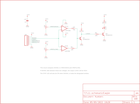

Contents
========

* [PRS10101 > Sparkfun](#prs10101--sparkfun)
	* [Schematic](#schematic)
	* [OOMP Parts](#oomp-parts)
	* [Images](#images)
	* [Tags](#tags)
  
![][im]
# PRS10101 > Sparkfun

- ID: PROJ-SPAR-10101-STAN-01
- Hex ID: PRS10101
- Name: Sparkfun
- Description: Sparkfun
- Long Link: [http://oom.lt/PROJ-SPAR-10101-STAN-01](http://oom.lt/PROJ-SPAR-10101-STAN-01)
- Short Link: [http://oom.lt/PRS10101](http://oom.lt/PRS10101)

## Schematic
  

## OOMP Parts
  

|OOMP Parts|
| :---: |
|C1,CAPC-0603-X-UNMATCHED-01,C1,.1uF,CAP0603-CAP,0603-CAP,Capacitor,,|
|IC1,UNMATCHED-UNMATCHED-X-UNMATCHED-01,IC1,LMV358,OPAMP-DUALU,SO08,Operational Amplifier,,|
|JP2,HEAD-I01-X-PI06-01,JP2,,M06SIP,1X06,Header 6,,|
|Q1,UNMATCHED-SO23-X-UNMATCHED-01,Q1,mmbt2222,TRANSISTOR_NPNSOT23-3,SOT23-3,Transistor NPN,,|
|Q2,UNMATCHED-SO23-X-UNMATCHED-01,Q2,mmbt2222,TRANSISTOR_NPNSOT23-3,SOT23-3,Transistor NPN,,|
|R1,RESE-UNMATCHED-X-O103-01,R1,10K,TRIMPOTSMD,TRIMPOT-3MM,,,|
|R2,RESE-UNMATCHED-X-O103-01,R2,10K,TRIMPOTSMD,TRIMPOT-3MM,,,|
|R3,RESE-0603-X-O103-01,R3,10K,RESISTOR0603-RES,0603-RES,Resistor,,|
|R4,RESE-0603-X-O331-01,R4,330,RESISTOR0603-RES,0603-RES,Resistor,,|
|R5,RESE-0603-X-O103-01,R5,10K,RESISTOR0603-RES,0603-RES,Resistor,,|
|R6,RESE-0603-X-O203-01,R6,20K,RESISTOR0603-RES,0603-RES,Resistor,,|
|R7,RESE-0603-X-O202-01,R7,2K,RESISTOR0603-RES,0603-RES,Resistor,,|
|STAT,LEDS-0603-G-STAN-01,STAT,,LED0603,LED-0603,LEDs,,|

## Images
  
  

|kicadPcb3d|kicadPcb3dFront|kicadPcb3dBack|eagleImage|eagleSchemImage|
| :---: | :---: | :---: | :---: | :---: |
||||||

## Tags

- hexID: PRS10101
- oompType: PROJ
- oompSize: SPAR
- oompColor: 10101
- oompDesc: STAN
- oompIndex: 01
- oompName: Window Comparator
- sources: All source files from https://github.com/sparkfun/Window_Comparator (source licence details in srcLicense.md)
- linkBuyPage: https://www.sparkfun.com/products/10101
- oompID: PROJ-SPAR-10101-STAN-01
- oompParts: C1,CAPC-0603-X-UNMATCHED-01
- oompParts: IC1,UNMATCHED-UNMATCHED-X-UNMATCHED-01
- oompParts: JP2,HEAD-I01-X-PI06-01
- oompParts: Q1,UNMATCHED-SO23-X-UNMATCHED-01
- oompParts: Q2,UNMATCHED-SO23-X-UNMATCHED-01
- oompParts: R1,RESE-UNMATCHED-X-O103-01
- oompParts: R2,RESE-UNMATCHED-X-O103-01
- oompParts: R3,RESE-0603-X-O103-01
- oompParts: R4,RESE-0603-X-O331-01
- oompParts: R5,RESE-0603-X-O103-01
- oompParts: R6,RESE-0603-X-O203-01
- oompParts: R7,RESE-0603-X-O202-01
- oompParts: STAT,LEDS-0603-G-STAN-01
- rawParts: C1,.1uF,CAP0603-CAP,0603-CAP,Capacitor,,
- rawParts: IC1,LMV358,OPAMP-DUALU,SO08,Operational Amplifier,,
- rawParts: JP2,,M06SIP,1X06,Header 6,,
- rawParts: Q1,mmbt2222,TRANSISTOR_NPNSOT23-3,SOT23-3,Transistor NPN,,
- rawParts: Q2,mmbt2222,TRANSISTOR_NPNSOT23-3,SOT23-3,Transistor NPN,,
- rawParts: R1,10K,TRIMPOTSMD,TRIMPOT-3MM,,,
- rawParts: R2,10K,TRIMPOTSMD,TRIMPOT-3MM,,,
- rawParts: R3,10K,RESISTOR0603-RES,0603-RES,Resistor,,
- rawParts: R4,330,RESISTOR0603-RES,0603-RES,Resistor,,
- rawParts: R5,10K,RESISTOR0603-RES,0603-RES,Resistor,,
- rawParts: R6,20K,RESISTOR0603-RES,0603-RES,Resistor,,
- rawParts: R7,2K,RESISTOR0603-RES,0603-RES,Resistor,,
- rawParts: STAT,,LED0603,LED-0603,LEDs,,
- rawParts: U$3,LOGO-SFENEW,LOGO-SFENEW,SFE-NEW-WEBLOGO,Spark Fun Electronics PCB Logo,,

[im]: kicadPcb3d_450.png
