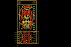

Contents
========

* [PROJ-SPAR-10103-STAN-01>Serial Alphanumeric Display Driver](#proj-spar-10103-stan-01serial-alphanumeric-display-driver)
	* [Images](#images)
	* [Tags](#tags)
  
![][im]
# PROJ-SPAR-10103-STAN-01>Serial Alphanumeric Display Driver

- ID: PROJ-SPAR-10103-STAN-01
- Hex ID: PRS10103
- Name: Serial Alphanumeric Display Driver
- Description: 

## Images
  
  

|eagleImage|kicadPcb3dFront|kicadPcb3dBack|kicadPcb3d|
| :---: | :---: | :---: | :---: |
|||||

## Tags

- hexID: PRS10103
- oompType: PROJ
- oompSize: SPAR
- oompColor: 10103
- oompDesc: STAN
- oompIndex: 01
- oompName: Serial Alphanumeric Display Driver
- sources: All source files from https://github.com/sparkfun/Serial_Alphanumeric_Display_Driver (source licence details in srcLicense.md)
- linkBuyPage: https://www.sparkfun.com/products/10103
- oompID: PROJ-SPAR-10103-STAN-01
- oompParts: C1,UNMATCHED-UNMATCHED-UNMATCHED-UNMATCHED-UNMATCHED
- oompParts: C2,UNMATCHED-UNMATCHED-UNMATCHED-UNMATCHED-UNMATCHED
- oompParts: INPUT,UNMATCHED-UNMATCHED-UNMATCHED-UNMATCHED-UNMATCHED
- oompParts: JP1,UNMATCHED-UNMATCHED-UNMATCHED-UNMATCHED-UNMATCHED
- oompParts: JP2,UNMATCHED-UNMATCHED-UNMATCHED-UNMATCHED-UNMATCHED
- oompParts: JP3,UNMATCHED-UNMATCHED-UNMATCHED-UNMATCHED-UNMATCHED
- oompParts: JP4,UNMATCHED-UNMATCHED-UNMATCHED-UNMATCHED-UNMATCHED
- oompParts: JP5,UNMATCHED-UNMATCHED-UNMATCHED-UNMATCHED-UNMATCHED
- oompParts: OUTPUT,UNMATCHED-UNMATCHED-UNMATCHED-UNMATCHED-UNMATCHED
- oompParts: R1,UNMATCHED-UNMATCHED-UNMATCHED-UNMATCHED-UNMATCHED
- oompParts: R2,UNMATCHED-UNMATCHED-UNMATCHED-UNMATCHED-UNMATCHED
- oompParts: U$1,UNMATCHED-UNMATCHED-UNMATCHED-UNMATCHED-UNMATCHED
- oompParts: U1,UNMATCHED-UNMATCHED-UNMATCHED-UNMATCHED-UNMATCHED
- oompParts: U2,UNMATCHED-UNMATCHED-UNMATCHED-UNMATCHED-UNMATCHED
- oompParts: U3,UNMATCHED-UNMATCHED-UNMATCHED-UNMATCHED-UNMATCHED
- rawParts: C1,10uF,CAP_POL1206,EIA3216,Capacitor Polarized,,
- rawParts: C2,0.1uF,CAP0402-CAP,0402-CAP,Capacitor,,
- rawParts: INPUT,,M06SMD-FEMALE-V2,1X06-SMD-FEMALE-V2,Header 6,,
- rawParts: JP1,LOGO-SFESK,LOGO-SFESK,SFE-LOGO-FLAME,Spark Fun Electronics PCB Logo,,
- rawParts: JP2,STAND-OFF,STAND-OFF,STAND-OFF,Stand Off,,
- rawParts: JP3,STAND-OFF,STAND-OFF,STAND-OFF,Stand Off,,
- rawParts: JP4,LOGO-SFENW2,LOGO-SFENW2,SFE-NEW-WEB,Spark Fun Electronics PCB Logo,,
- rawParts: JP5,LOGO-SFESK,LOGO-SFESK,SFE-LOGO-FLAME,Spark Fun Electronics PCB Logo,,
- rawParts: JP6,FIDUCIAL1X2,FIDUCIAL1X2,FIDUCIAL-1X2,Fiducial Alignment Points,,
- rawParts: JP7,FIDUCIAL1X2,FIDUCIAL1X2,FIDUCIAL-1X2,Fiducial Alignment Points,,
- rawParts: OUTPUT,,M06SMD,1X06-SMD,Header 6,,
- rawParts: R1,4.7k,RESISTOR0402-RES,0402-RES,Resistor,,
- rawParts: R2,DNP,RESISTORPTH-1/6W,1/6W-RES,Resistor,,
- rawParts: U$1,CREATIVE_COMMONS,CREATIVE_COMMONS,CREATIVE_COMMONS,,,
- rawParts: U1,DNP,ALPHANUMERICPTH,ALPHANUMERIC,,,
- rawParts: U2,V_REG_LDOSMD,V_REG_LDOSMD,SOT23-5,Voltage Regulator LDO,,
- rawParts: U3,A6282-LP,A6282-LP,TSSOP-24,Allegro A6282,,

[im]: kicadPcb3d_450.png
