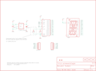

Contents
========

* [PRS10103 > Sparkfun](#prs10103--sparkfun)
	* [Schematic](#schematic)
	* [OOMP Parts](#oomp-parts)
	* [Images](#images)
	* [Tags](#tags)
  
![][im]
# PRS10103 > Sparkfun

- ID: PROJ-SPAR-10103-STAN-01
- Hex ID: PRS10103
- Name: Sparkfun
- Description: Sparkfun
- Long Link: [http://oom.lt/PROJ-SPAR-10103-STAN-01](http://oom.lt/PROJ-SPAR-10103-STAN-01)
- Short Link: [http://oom.lt/PRS10103](http://oom.lt/PRS10103)

## Schematic
  

## OOMP Parts
  

|OOMP Parts|
| :---: |
|C1,CAPX-UNMATCHED-X-UF10-01,C1,10uF,CAP_POL1206,EIA3216,Capacitor Polarized,,|
|C2,CAPC-0402-X-NF100-01,C2,0.1uF,CAP0402-CAP,0402-CAP,Capacitor,,|
|INPUT,UNMATCHED-UNMATCHED-X-UNMATCHED-01,INPUT,,M06SMD-FEMALE-V2,1X06-SMD-FEMALE-V2,Header 6,,|
|OUTPUT,UNMATCHED-UNMATCHED-X-UNMATCHED-01,JP1,LOGO-SFESK,LOGO-SFESK,SFE-LOGO-FLAME,Spark Fun Electronics PCB Logo,,|
|R1,RESE-0402-X-UNMATCHED-01,JP2,STAND-OFF,STAND-OFF,STAND-OFF,Stand Off,,|
|R2,RESE-UNMATCHED-X-UNMATCHED-01,JP3,STAND-OFF,STAND-OFF,STAND-OFF,Stand Off,,|
|U$1,UNMATCHED-UNMATCHED-X-UNMATCHED-01,JP4,LOGO-SFENW2,LOGO-SFENW2,SFE-NEW-WEB,Spark Fun Electronics PCB Logo,,|
|U2,UNMATCHED-SO235-X-UNMATCHED-01,JP5,LOGO-SFESK,LOGO-SFESK,SFE-LOGO-FLAME,Spark Fun Electronics PCB Logo,,|
|U3,UNMATCHED-UNMATCHED-X-UNMATCHED-01,JP6,FIDUCIAL1X2,FIDUCIAL1X2,FIDUCIAL-1X2,Fiducial Alignment Points,,|

## Images
  
  

|kicadPcb3d|kicadPcb3dFront|kicadPcb3dBack|eagleImage|eagleSchemImage|
| :---: | :---: | :---: | :---: | :---: |
||||||

## Tags

- hexID: PRS10103
- oompType: PROJ
- oompSize: SPAR
- oompColor: 10103
- oompDesc: STAN
- oompIndex: 01
- oompName: Serial Alphanumeric Display Driver
- sources: All source files from https://github.com/sparkfun/Serial_Alphanumeric_Display_Driver (source licence details in srcLicense.md)
- linkBuyPage: https://www.sparkfun.com/products/10103
- oompID: PROJ-SPAR-10103-STAN-01
- oompParts: C1,CAPX-UNMATCHED-X-UF10-01
- oompParts: C2,CAPC-0402-X-NF100-01
- oompParts: INPUT,UNMATCHED-UNMATCHED-X-UNMATCHED-01
- oompParts: OUTPUT,UNMATCHED-UNMATCHED-X-UNMATCHED-01
- oompParts: R1,RESE-0402-X-UNMATCHED-01
- oompParts: R2,RESE-UNMATCHED-X-UNMATCHED-01
- oompParts: U$1,UNMATCHED-UNMATCHED-X-UNMATCHED-01
- oompParts: U2,UNMATCHED-SO235-X-UNMATCHED-01
- oompParts: U3,UNMATCHED-UNMATCHED-X-UNMATCHED-01
- rawParts: C1,10uF,CAP_POL1206,EIA3216,Capacitor Polarized,,
- rawParts: C2,0.1uF,CAP0402-CAP,0402-CAP,Capacitor,,
- rawParts: INPUT,,M06SMD-FEMALE-V2,1X06-SMD-FEMALE-V2,Header 6,,
- rawParts: JP1,LOGO-SFESK,LOGO-SFESK,SFE-LOGO-FLAME,Spark Fun Electronics PCB Logo,,
- rawParts: JP2,STAND-OFF,STAND-OFF,STAND-OFF,Stand Off,,
- rawParts: JP3,STAND-OFF,STAND-OFF,STAND-OFF,Stand Off,,
- rawParts: JP4,LOGO-SFENW2,LOGO-SFENW2,SFE-NEW-WEB,Spark Fun Electronics PCB Logo,,
- rawParts: JP5,LOGO-SFESK,LOGO-SFESK,SFE-LOGO-FLAME,Spark Fun Electronics PCB Logo,,
- rawParts: JP6,FIDUCIAL1X2,FIDUCIAL1X2,FIDUCIAL-1X2,Fiducial Alignment Points,,
- rawParts: JP7,FIDUCIAL1X2,FIDUCIAL1X2,FIDUCIAL-1X2,Fiducial Alignment Points,,
- rawParts: OUTPUT,,M06SMD,1X06-SMD,Header 6,,
- rawParts: R1,4.7k,RESISTOR0402-RES,0402-RES,Resistor,,
- rawParts: R2,DNP,RESISTORPTH-1/6W,1/6W-RES,Resistor,,
- rawParts: U$1,CREATIVE_COMMONS,CREATIVE_COMMONS,CREATIVE_COMMONS,,,
- rawParts: U1,DNP,ALPHANUMERICPTH,ALPHANUMERIC,,,
- rawParts: U2,V_REG_LDOSMD,V_REG_LDOSMD,SOT23-5,Voltage Regulator LDO,,
- rawParts: U3,A6282-LP,A6282-LP,TSSOP-24,Allegro A6282,,

[im]: kicadPcb3d_450.png
