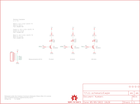

Contents
========

* [PRS10111 > Tri-Color Breakout](#prs10111--tri-color-breakout)
	* [Schematic](#schematic)
	* [PCB](#pcb)
	* [Interactive BOM](#interactive-bom)
	* [OOMP Parts](#oomp-parts)
	* [Images](#images)
	* [Tags](#tags)
  
![][im]
# PRS10111 > Tri-Color Breakout

- ID: PROJ-SPAR-10111-STAN-01
- Hex ID: PRS10111
- Name: Sparkfun
- Description: Sparkfun
- Long Link: [http://oom.lt/PROJ-SPAR-10111-STAN-01](http://oom.lt/PROJ-SPAR-10111-STAN-01)
- Short Link: [http://oom.lt/PRS10111](http://oom.lt/PRS10111)

## Schematic
  

## PCB
  

## Interactive BOM

- Interactive BOM page: [ibom.html](https://htmlpreview.github.io/?https://github.com/oomlout/oomlout_OOMP_projects/blob/main/PROJ-SPAR-10111-STAN-01/kicad/bom/ibom.html)

## OOMP Parts
  

|OOMP Parts|
| :---: |
|[HEAD-I01-X-PI05-01  2.54 mm 5 Pin Header  JP6](https://github.com/oomlout/oomlout_OOMP_parts/tree/main/HEAD-I01-X-PI05-01/)|
|LEDS-UNMATCHED-R-STAN-01 LED1|
|LEDS-UNMATCHED-G-STAN-01 LED2|
|LEDS-UNMATCHED-L-STAN-01 LED3|
|UNMATCHED-UNMATCHED-X-UNMATCHED-01 Q1, Q2, Q3|
|RESE-UNMATCHED-X-O360-01 R1|
|RESE-UNMATCHED-X-O220-01 R2, R3|
|RESE-UNMATCHED-X-O331-01 R4, R5, R6|

## Images
  
  

|bominteractivefront|bominteractiveback|kicadPcb3d|kicadPcb3dFront|kicadPcb3dBack|eagleImage|eagleSchemImage|pcbdraw|pcbdrawback|
| :---: | :---: | :---: | :---: | :---: | :---: | :---: | :---: | :---: |
||||||||||

## Tags

- hexID: PRS10111
- oompType: PROJ
- oompSize: SPAR
- oompColor: 10111
- oompDesc: STAN
- oompIndex: 01
- oompName: Tri-Color Breakout
- sources: All source files from https://github.com/sparkfun/Tri-Color_Breakout (source licence details in srcLicense.md)
- linkBuyPage: https://www.sparkfun.com/products/10111
- oompID: PROJ-SPAR-10111-STAN-01
- oompParts: JP6,HEAD-I01-X-PI05-01
- oompParts: LED1,LEDS-UNMATCHED-R-STAN-01
- oompParts: LED2,LEDS-UNMATCHED-G-STAN-01
- oompParts: LED3,LEDS-UNMATCHED-L-STAN-01
- oompParts: Q1,UNMATCHED-UNMATCHED-X-UNMATCHED-01
- oompParts: Q2,UNMATCHED-UNMATCHED-X-UNMATCHED-01
- oompParts: Q3,UNMATCHED-UNMATCHED-X-UNMATCHED-01
- oompParts: R1,RESE-UNMATCHED-X-O360-01
- oompParts: R2,RESE-UNMATCHED-X-O220-01
- oompParts: R3,RESE-UNMATCHED-X-O220-01
- oompParts: R4,RESE-UNMATCHED-X-O331-01
- oompParts: R5,RESE-UNMATCHED-X-O331-01
- oompParts: R6,RESE-UNMATCHED-X-O331-01
- rawParts: JP1,STAND-OFF,STAND-OFF,STAND-OFF,Stand Off,,
- rawParts: JP2,STAND-OFF,STAND-OFF,STAND-OFF,Stand Off,,
- rawParts: JP3,STAND-OFF,STAND-OFF,STAND-OFF,Stand Off,,
- rawParts: JP4,STAND-OFF,STAND-OFF,STAND-OFF,Stand Off,,
- rawParts: JP5,LOGO-SFESK,LOGO-SFESK,SFE-LOGO-FLAME,Spark Fun Electronics PCB Logo,,
- rawParts: JP6,,M05PTH,1X05,Header 5,,
- rawParts: JP7,LOGO-SFESK,LOGO-SFESK,SFE-LOGO-FLAME,Spark Fun Electronics PCB Logo,,
- rawParts: LED1,Red,LED10MM,LED10MM,LEDs,,
- rawParts: LED2,Green,LED10MM,LED10MM,LEDs,,
- rawParts: LED3,Blue,LED10MM,LED10MM,LEDs,,
- rawParts: Q1,2N3904,TRANSISTOR_NPNTO92,TO-92,Transistor NPN,,
- rawParts: Q2,2N3904,TRANSISTOR_NPNTO92,TO-92,Transistor NPN,,
- rawParts: Q3,2N3904,TRANSISTOR_NPNTO92,TO-92,Transistor NPN,,
- rawParts: R1,36,RESISTORPTH-1/4W,AXIAL-0.4,Resistor,,
- rawParts: R2,22,RESISTORPTH-1/4W,AXIAL-0.4,Resistor,,
- rawParts: R3,22,RESISTORPTH-1/4W,AXIAL-0.4,Resistor,,
- rawParts: R4,330,RESISTORAXIAL-0.3,AXIAL-0.3,Resistor,,
- rawParts: R5,330,RESISTORAXIAL-0.3,AXIAL-0.3,Resistor,,
- rawParts: R6,330,RESISTORAXIAL-0.3,AXIAL-0.3,Resistor,,
- rawParts: U$1,CREATIVE_COMMONS,CREATIVE_COMMONS,CREATIVE_COMMONS,,,
- rawParts: U$6,OSHW-LOGOS,OSHW-LOGOS,OSHW-LOGO-S,Open Source Hardware Logo This logo indicates the piece of hardware it is found on incorporates a OSHW license and/or adheres to the definition of open source hardware found here: http://freedomdefined.org/OSHW,,

[im]: kicadPcb3d_450.png
