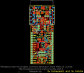

Contents
========

* [PROJ-SPAR-10116-STAN-01>Arduino Fio](#proj-spar-10116-stan-01arduino-fio)
	* [Images](#images)
	* [Interactive BOM](#interactive-bom)
	* [Tags](#tags)
  
![][im]
# PROJ-SPAR-10116-STAN-01>Arduino Fio

- ID: PROJ-SPAR-10116-STAN-01
- Hex ID: PRS10116
- Name: Arduino Fio
- Description: 

## Images
  
  

|eagleImage|
| :---: |
||

## Interactive BOM

- Interactive BOM page: [ibom.html](kicad/bom/ibom.html)

## Tags

- hexID: PRS10116
- oompType: PROJ
- oompSize: SPAR
- oompColor: 10116
- oompDesc: STAN
- oompIndex: 01
- oompName: Arduino Fio
- sources: All source files from https://github.com/sparkfun/Arduino_Fio (source licence details in srcLicense.md)
- linkBuyPage: https://www.sparkfun.com/products/10116

[im]: eagleImage_450.png
