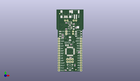
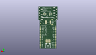
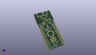

Contents
========

* [PROJ-SPAR-10116-STAN-01>Arduino Fio](#proj-spar-10116-stan-01arduino-fio)
	* [Images](#images)
	* [Interactive BOM](#interactive-bom)
	* [OOMP Parts](#oomp-parts)
	* [Tags](#tags)
  
![][im]
# PROJ-SPAR-10116-STAN-01>Arduino Fio

- ID: PROJ-SPAR-10116-STAN-01
- Hex ID: PRS10116
- Name: Arduino Fio
- Description: 

## Images
  
  

|eagleImage|kicadPcb3dFront|kicadPcb3dBack|kicadPcb3d|
| :---: | :---: | :---: | :---: |
|||||

## Interactive BOM

- Interactive BOM page: [ibom.html](kicad/bom/ibom.html)

## OOMP Parts
  

|OOMP Parts|
| :---: |
|CAPC-UNMATCHED-X-UNMATCHED-01, C1, 12.7, 34.29, 90,C1, 10uF, EIA3216, SparkFun, (0.5, 1.35), R90|
|CAPC-0402-X-NF100-V50, C2, 13.97, 27.94, 0,C2, 0.1uF, 0402-CAP, SparkFun, (0.55, 1.1), R0|
|CAPC-0402-X-NF100-V50, C3, 22.098, 20.32, 180,C3, 0.1uF, 0402-CAP, SparkFun, (0.87, 0.8), R180|
|CAPC-0402-X-NF100-V50, C6, 13.334999999999999, 14.604999999999999, 0,C6, 0.1uF, 0402-CAP, SparkFun, (0.525, 0.575), R0|
|CAPC-0402-X-UNMATCHED-01, C9, 8.889999999999999, 50.8, 180,C9, 4.7uF, 0402-CAP, SparkFun, (0.35, 2), R180|
|CAPC-0402-X-UNMATCHED-01, C10, 16.509999999999998, 49.529999999999994, 0,C10, 4.7uF, 0402-CAP, SparkFun, (0.65, 1.95), R0|
|UNMATCHED-0603-X-UNMATCHED-01, D1, 12.7, 1.27, 270,D1, Red, LED-0603, SparkFun, (0.5, 0.05), R270|
|UNMATCHED-0603-X-UNMATCHED-01, D2, 2.54, 36.83, 90,D2, Green, LED-0603, SparkFun, (0.1, 1.45), R90|
|UNMATCHED-0603-X-UNMATCHED-01, D3, 2.54, 39.37, 90,D3, Red, LED-0603, SparkFun, (0.1, 1.55), R90|
|UNMATCHED-0603-X-UNMATCHED-01, D4, 2.54, 41.91, 270,D4, Yellow, LED-0603, SparkFun, (0.1, 1.65), R270|
|UNMATCHED-UNMATCHED-X-UNMATCHED-01, F1, 16.509999999999998, 45.72, 270,F1, PTCSMD, PTC-1206, SparkFun, (0.65, 1.8), R270|
|<table><tr><td></td><td> JP1</td><td>[HEAD-I01-X-PI14-01 2.54 mm 14 Pin Header](https://github.com/oomlout/oomlout_OOMP_parts/tree/main/HEAD-I01-X-PI14-01/)</td><td>[H14](https://github.com/oomlout/oomlout_OOMP_parts/tree/main/HEAD-I01-X-PI14-01/)</td></tr></table>|
|<table><tr><td></td><td> JP2</td><td>[HEAD-I01-X-PI02-01 2.54 mm 2 Pin Header](https://github.com/oomlout/oomlout_OOMP_parts/tree/main/HEAD-I01-X-PI02-01/)</td><td>[H02](https://github.com/oomlout/oomlout_OOMP_parts/tree/main/HEAD-I01-X-PI02-01/)</td></tr></table>|
|UNMATCHED-UNMATCHED-X-UNMATCHED-01, JP3, 18.287999999999997, 60.959999999999994, 0,JP3, JST-2-SMD, SparkFun, (0.72, 2.4), R0|
|UNMATCHED-UNMATCHED-X-UNMATCHED-01, JP4, 10.16, 10.16, 0,JP4, AVR_SPI, 2X3, SparkFun, (0.4, 0.4), R0|
|<table><tr><td></td><td> JP5</td><td>[HEAD-I01-X-PI14-01 2.54 mm 14 Pin Header](https://github.com/oomlout/oomlout_OOMP_parts/tree/main/HEAD-I01-X-PI14-01/)</td><td>[H14](https://github.com/oomlout/oomlout_OOMP_parts/tree/main/HEAD-I01-X-PI14-01/)</td></tr></table>|
|<table><tr><td></td><td> JP6</td><td>[HEAD-I01-X-PI02-01 2.54 mm 2 Pin Header](https://github.com/oomlout/oomlout_OOMP_parts/tree/main/HEAD-I01-X-PI02-01/)</td><td>[H02](https://github.com/oomlout/oomlout_OOMP_parts/tree/main/HEAD-I01-X-PI02-01/)</td></tr></table>|
|<table><tr><td></td><td> JP7</td><td>[HEAD-I01-X-PI02-01 2.54 mm 2 Pin Header](https://github.com/oomlout/oomlout_OOMP_parts/tree/main/HEAD-I01-X-PI02-01/)</td><td>[H02](https://github.com/oomlout/oomlout_OOMP_parts/tree/main/HEAD-I01-X-PI02-01/)</td></tr></table>|
|HEAD-I01-X-PI01-01, JP8, 8.889999999999999, 41.91, 0,JP8, 1X01, SparkFun, (0.35, 1.65), R0|
|HEAD-I01-X-PI01-01, JP9, 8.889999999999999, 39.37, 0,JP9, 1X01, SparkFun, (0.35, 1.55), R0|
|RESE-0402-X-UNMATCHED-01, R1, 8.254999999999999, 1.27, 0,R1, 1k, 0402-RES, SparkFun, (0.325, 0.05), R0|
|RESE-0402-X-UNMATCHED-01, R2, 5.08, 35.559999999999995, 0,R2, 1k, 0402-RES, SparkFun, (0.2, 1.4), R0|
|RESE-0402-X-UNMATCHED-01, R3, 5.08, 38.099999999999994, 0,R3, 1k, 0402-RES, SparkFun, (0.2, 1.5), R0|
|<table><tr><td></td><td> R4</td><td>[RESE-0402-X-O103-01 SMD (0402) 10k Ohm Resistor](https://github.com/oomlout/oomlout_OOMP_parts/tree/main/RESE-0402-X-O103-01/)</td><td>[R42103](https://github.com/oomlout/oomlout_OOMP_parts/tree/main/RESE-0402-X-O103-01/)</td></tr></table>|
|RESE-0402-X-UNMATCHED-01, R5, 12.7, 48.26, 0,R5, 2K, 0402-RES, SparkFun, (0.5, 1.9), R0|
|RESE-0402-X-UNMATCHED-01, R8, 19.049999999999997, 45.72, 90,R8, 100, 0402-RES, SparkFun, (0.75, 1.8), R90|
|RESE-0402-X-UNMATCHED-01, R9, 8.889999999999999, 44.449999999999996, 180,R9, 470, 0402-RES, SparkFun, (0.35, 1.75), R180|
|UNMATCHED-UNMATCHED-X-UNMATCHED-01, S1, 12.7, 5.08, 180,S1, TACTILE_SWITCH_SMD, SparkFun, (0.5, 0.2), R180|
|UNMATCHED-UNMATCHED-X-UNMATCHED-01, S2, 21.59, 39.37, 90,S2, AYZ0202, SparkFun, (0.85, 1.55), R90|
|UNMATCHED-UNMATCHED-X-UNMATCHED-01, U1, 12.7, 50.8, 90,U1, MCP73831, SOT23-5, SparkFun, (0.5, 2), R90|
|UNMATCHED-UNMATCHED-X-UNMATCHED-01, U2, 12.7, 45.72, 90,U2, 3.3V, SOT23-5, SparkFun, (0.5, 1.8), R90|
|UNMATCHED-UNMATCHED-X-UNMATCHED-01, U3, 12.69000002, 20.964999979999998, 270,U3, ATMEGA328, TQFP32-08, SparkFun, (0.4996063, 0.8253937), R270|
|UNMATCHED-UNMATCHED-X-UNMATCHED-01, U4, 12.7, 64.77, M180,U4, XBEE-1B3, XBEE-SMD, SparkFun, (0.5, 2.55), MR180|
|UNMATCHED-UNMATCHED-X-UNMATCHED-01, X1, 8.382, 59.69, 270,X1, USBSMD, USB-MINIB, SparkFun, (0.33, 2.35), R270|
|UNMATCHED-UNMATCHED-X-UNMATCHED-01, Y1, 9.524999999999999, 27.432, 0,Y1, 8MHz, RESONATOR-SMD, SparkFun, (0.375, 1.08), R0|

## Tags

- hexID: PRS10116
- oompType: PROJ
- oompSize: SPAR
- oompColor: 10116
- oompDesc: STAN
- oompIndex: 01
- oompName: Arduino Fio
- sources: All source files from https://github.com/sparkfun/Arduino_Fio (source licence details in srcLicense.md)
- linkBuyPage: https://www.sparkfun.com/products/10116
- oompID: PROJ-SPAR-10116-STAN-01
- oompPart: CAPC-UNMATCHED-X-UNMATCHED-01, C1, 12.7, 34.29, 90
- oompPart: CAPC-0402-X-NF100-V50, C2, 13.97, 27.94, 0
- oompPart: CAPC-0402-X-NF100-V50, C3, 22.098, 20.32, 180
- oompPart: CAPC-0402-X-NF100-V50, C6, 13.334999999999999, 14.604999999999999, 0
- oompPart: CAPC-0402-X-UNMATCHED-01, C9, 8.889999999999999, 50.8, 180
- oompPart: CAPC-0402-X-UNMATCHED-01, C10, 16.509999999999998, 49.529999999999994, 0
- oompPart: UNMATCHED-0603-X-UNMATCHED-01, D1, 12.7, 1.27, 270
- oompPart: UNMATCHED-0603-X-UNMATCHED-01, D2, 2.54, 36.83, 90
- oompPart: UNMATCHED-0603-X-UNMATCHED-01, D3, 2.54, 39.37, 90
- oompPart: UNMATCHED-0603-X-UNMATCHED-01, D4, 2.54, 41.91, 270
- oompPart: UNMATCHED-UNMATCHED-X-UNMATCHED-01, F1, 16.509999999999998, 45.72, 270
- oompPart: SKIP-UNMATCHED-X-UNMATCHED-01, FD1, 23.875999999999998, 38.354, M0
- oompPart: SKIP-UNMATCHED-X-UNMATCHED-01, FD2, 7.874, 59.943999999999996, M0
- oompPart: HEAD-I01-X-PI14-01, JP1, 1.27, 34.29, 270
- oompPart: HEAD-I01-X-PI02-01, JP2, 16.509999999999998, 53.339999999999996, M180
- oompPart: UNMATCHED-UNMATCHED-X-UNMATCHED-01, JP3, 18.287999999999997, 60.959999999999994, 0
- oompPart: UNMATCHED-UNMATCHED-X-UNMATCHED-01, JP4, 10.16, 10.16, 0
- oompPart: HEAD-I01-X-PI14-01, JP5, 24.13, 34.29, 270
- oompPart: HEAD-I01-X-PI02-01, JP6, 7.619999999999999, 53.339999999999996, M180
- oompPart: HEAD-I01-X-PI02-01, JP7, 15.875, 39.37, M90
- oompPart: HEAD-I01-X-PI01-01, JP8, 8.889999999999999, 41.91, 0
- oompPart: HEAD-I01-X-PI01-01, JP9, 8.889999999999999, 39.37, 0
- oompPart: RESE-0402-X-UNMATCHED-01, R1, 8.254999999999999, 1.27, 0
- oompPart: RESE-0402-X-UNMATCHED-01, R2, 5.08, 35.559999999999995, 0
- oompPart: RESE-0402-X-UNMATCHED-01, R3, 5.08, 38.099999999999994, 0
- oompPart: RESE-0402-X-O103-01, R4, 17.779999999999998, 6.35, 270
- oompPart: RESE-0402-X-UNMATCHED-01, R5, 12.7, 48.26, 0
- oompPart: RESE-0402-X-UNMATCHED-01, R8, 19.049999999999997, 45.72, 90
- oompPart: RESE-0402-X-UNMATCHED-01, R9, 8.889999999999999, 44.449999999999996, 180
- oompPart: UNMATCHED-UNMATCHED-X-UNMATCHED-01, S1, 12.7, 5.08, 180
- oompPart: UNMATCHED-UNMATCHED-X-UNMATCHED-01, S2, 21.59, 39.37, 90
- oompPart: SKIP-UNMATCHED-X-UNMATCHED-01, SJ1, 20.955, 46.228, 270
- oompPart: SKIP-UNMATCHED-X-UNMATCHED-01, TP1, 6.35, 36.83, M0
- oompPart: SKIP-UNMATCHED-X-UNMATCHED-01, TP2, 6.35, 44.449999999999996, M0
- oompPart: SKIP-UNMATCHED-X-UNMATCHED-01, U$4, 18.796, 1.778, 0
- oompPart: SKIP-UNMATCHED-X-UNMATCHED-01, U$5, 2.032, 60.45199999999999, 0
- oompPart: UNMATCHED-UNMATCHED-X-UNMATCHED-01, U1, 12.7, 50.8, 90
- oompPart: UNMATCHED-UNMATCHED-X-UNMATCHED-01, U2, 12.7, 45.72, 90
- oompPart: UNMATCHED-UNMATCHED-X-UNMATCHED-01, U3, 12.69000002, 20.964999979999998, 270
- oompPart: UNMATCHED-UNMATCHED-X-UNMATCHED-01, U4, 12.7, 64.77, M180
- oompPart: UNMATCHED-UNMATCHED-X-UNMATCHED-01, X1, 8.382, 59.69, 270
- oompPart: UNMATCHED-UNMATCHED-X-UNMATCHED-01, Y1, 9.524999999999999, 27.432, 0
- rawPart: C1, 10uF, EIA3216, SparkFun, (0.5, 1.35), R90
- rawPart: C2, 0.1uF, 0402-CAP, SparkFun, (0.55, 1.1), R0
- rawPart: C3, 0.1uF, 0402-CAP, SparkFun, (0.87, 0.8), R180
- rawPart: C6, 0.1uF, 0402-CAP, SparkFun, (0.525, 0.575), R0
- rawPart: C9, 4.7uF, 0402-CAP, SparkFun, (0.35, 2), R180
- rawPart: C10, 4.7uF, 0402-CAP, SparkFun, (0.65, 1.95), R0
- rawPart: D1, Red, LED-0603, SparkFun, (0.5, 0.05), R270
- rawPart: D2, Green, LED-0603, SparkFun, (0.1, 1.45), R90
- rawPart: D3, Red, LED-0603, SparkFun, (0.1, 1.55), R90
- rawPart: D4, Yellow, LED-0603, SparkFun, (0.1, 1.65), R270
- rawPart: F1, PTCSMD, PTC-1206, SparkFun, (0.65, 1.8), R270
- rawPart: FD1, FIDUCIAL1X2, FIDUCIAL-1X2, SparkFun-Aesthetics, (0.94, 1.51), MR0
- rawPart: FD2, FIDUCIAL1X2, FIDUCIAL-1X2, SparkFun-Aesthetics, (0.31, 2.36), MR0
- rawPart: JP1, M14, 1X14, SparkFun, (0.05, 1.35), R270
- rawPart: JP2, 1X02, SparkFun, (0.65, 2.1), MR180
- rawPart: JP3, JST-2-SMD, SparkFun, (0.72, 2.4), R0
- rawPart: JP4, AVR_SPI, 2X3, SparkFun, (0.4, 0.4), R0
- rawPart: JP5, M14, 1X14, SparkFun, (0.95, 1.35), R270
- rawPart: JP6, 1X02, SparkFun, (0.3, 2.1), MR180
- rawPart: JP7, 1X02, SparkFun, (0.625, 1.55), MR90
- rawPart: JP8, 1X01, SparkFun, (0.35, 1.65), R0
- rawPart: JP9, 1X01, SparkFun, (0.35, 1.55), R0
- rawPart: R1, 1k, 0402-RES, SparkFun, (0.325, 0.05), R0
- rawPart: R2, 1k, 0402-RES, SparkFun, (0.2, 1.4), R0
- rawPart: R3, 1k, 0402-RES, SparkFun, (0.2, 1.5), R0
- rawPart: R4, 10k, 0402-RES, SparkFun, (0.7, 0.25), R270
- rawPart: R5, 2K, 0402-RES, SparkFun, (0.5, 1.9), R0
- rawPart: R8, 100, 0402-RES, SparkFun, (0.75, 1.8), R90
- rawPart: R9, 470, 0402-RES, SparkFun, (0.35, 1.75), R180
- rawPart: S1, TACTILE_SWITCH_SMD, SparkFun, (0.5, 0.2), R180
- rawPart: S2, AYZ0202, SparkFun, (0.85, 1.55), R90
- rawPart: SJ1, SOLDERJUMPERNC, SJ_2S, SparkFun, (0.825, 1.82), R270
- rawPart: TP1, RSSI, PAD.03X.05, SparkFun, (0.25, 1.45), MR0
- rawPart: TP2, ON, PAD.03X.05, SparkFun, (0.25, 1.75), MR0
- rawPart: U$4, FIDUCIAL1X2, FIDUCIAL-1X2, SparkFun, (0.74, 0.07), R0
- rawPart: U$5, FIDUCIAL1X2, FIDUCIAL-1X2, SparkFun, (0.08, 2.38), R0
- rawPart: U1, MCP73831, SOT23-5, SparkFun, (0.5, 2), R90
- rawPart: U2, 3.3V, SOT23-5, SparkFun, (0.5, 1.8), R90
- rawPart: U3, ATMEGA328, TQFP32-08, SparkFun, (0.4996063, 0.8253937), R270
- rawPart: U4, XBEE-1B3, XBEE-SMD, SparkFun, (0.5, 2.55), MR180
- rawPart: X1, USBSMD, USB-MINIB, SparkFun, (0.33, 2.35), R270
- rawPart: Y1, 8MHz, RESONATOR-SMD, SparkFun, (0.375, 1.08), R0

[im]: kicadPcb3d_450.png
