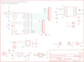

Contents
========

* [PRS10116 > Sparkfun](#prs10116--sparkfun)
	* [Images](#images)
	* [Tags](#tags)
  
![][im]
# PRS10116 > Sparkfun

- ID: PROJ-SPAR-10116-STAN-01
- Hex ID: PRS10116
- Name: Sparkfun
- Description: Sparkfun

## Images
  
  

|kicadPcb3d|kicadPcb3dFront|kicadPcb3dBack|eagleImage|eagleSchemImage|
| :---: | :---: | :---: | :---: | :---: |
||||||

## Tags

- hexID: PRS10116
- oompType: PROJ
- oompSize: SPAR
- oompColor: 10116
- oompDesc: STAN
- oompIndex: 01
- oompName: Arduino Fio
- sources: All source files from https://github.com/sparkfun/Arduino_Fio (source licence details in srcLicense.md)
- linkBuyPage: https://www.sparkfun.com/products/10116
- oompID: PROJ-SPAR-10116-STAN-01
- oompParts: C1,UNMATCHED-UNMATCHED-UNMATCHED-UNMATCHED-UNMATCHED
- oompParts: C2,UNMATCHED-UNMATCHED-UNMATCHED-UNMATCHED-UNMATCHED
- oompParts: C3,UNMATCHED-UNMATCHED-UNMATCHED-UNMATCHED-UNMATCHED
- oompParts: C6,UNMATCHED-UNMATCHED-UNMATCHED-UNMATCHED-UNMATCHED
- oompParts: C9,UNMATCHED-UNMATCHED-UNMATCHED-UNMATCHED-UNMATCHED
- oompParts: C10,UNMATCHED-UNMATCHED-UNMATCHED-UNMATCHED-UNMATCHED
- oompParts: D1,UNMATCHED-UNMATCHED-UNMATCHED-UNMATCHED-UNMATCHED
- oompParts: D2,UNMATCHED-UNMATCHED-UNMATCHED-UNMATCHED-UNMATCHED
- oompParts: D3,UNMATCHED-UNMATCHED-UNMATCHED-UNMATCHED-UNMATCHED
- oompParts: D4,UNMATCHED-UNMATCHED-UNMATCHED-UNMATCHED-UNMATCHED
- oompParts: F1,UNMATCHED-UNMATCHED-UNMATCHED-UNMATCHED-UNMATCHED
- oompParts: JP1,UNMATCHED-UNMATCHED-UNMATCHED-UNMATCHED-UNMATCHED
- oompParts: JP2,UNMATCHED-UNMATCHED-UNMATCHED-UNMATCHED-UNMATCHED
- oompParts: JP3,UNMATCHED-UNMATCHED-UNMATCHED-UNMATCHED-UNMATCHED
- oompParts: JP4,UNMATCHED-UNMATCHED-UNMATCHED-UNMATCHED-UNMATCHED
- oompParts: JP5,UNMATCHED-UNMATCHED-UNMATCHED-UNMATCHED-UNMATCHED
- oompParts: JP6,UNMATCHED-UNMATCHED-UNMATCHED-UNMATCHED-UNMATCHED
- oompParts: JP7,UNMATCHED-UNMATCHED-UNMATCHED-UNMATCHED-UNMATCHED
- oompParts: JP8,UNMATCHED-UNMATCHED-UNMATCHED-UNMATCHED-UNMATCHED
- oompParts: JP9,UNMATCHED-UNMATCHED-UNMATCHED-UNMATCHED-UNMATCHED
- oompParts: R1,UNMATCHED-UNMATCHED-UNMATCHED-UNMATCHED-UNMATCHED
- oompParts: R2,UNMATCHED-UNMATCHED-UNMATCHED-UNMATCHED-UNMATCHED
- oompParts: R3,UNMATCHED-UNMATCHED-UNMATCHED-UNMATCHED-UNMATCHED
- oompParts: R4,UNMATCHED-UNMATCHED-UNMATCHED-UNMATCHED-UNMATCHED
- oompParts: R5,UNMATCHED-UNMATCHED-UNMATCHED-UNMATCHED-UNMATCHED
- oompParts: R8,UNMATCHED-UNMATCHED-UNMATCHED-UNMATCHED-UNMATCHED
- oompParts: R9,UNMATCHED-UNMATCHED-UNMATCHED-UNMATCHED-UNMATCHED
- oompParts: S1,UNMATCHED-UNMATCHED-UNMATCHED-UNMATCHED-UNMATCHED
- oompParts: S2,UNMATCHED-UNMATCHED-UNMATCHED-UNMATCHED-UNMATCHED
- oompParts: SJ1,UNMATCHED-UNMATCHED-UNMATCHED-UNMATCHED-UNMATCHED
- oompParts: TP1,UNMATCHED-UNMATCHED-UNMATCHED-UNMATCHED-UNMATCHED
- oompParts: TP2,UNMATCHED-UNMATCHED-UNMATCHED-UNMATCHED-UNMATCHED
- oompParts: U$1,UNMATCHED-UNMATCHED-UNMATCHED-UNMATCHED-UNMATCHED
- oompParts: U$3,UNMATCHED-UNMATCHED-UNMATCHED-UNMATCHED-UNMATCHED
- oompParts: U$6,UNMATCHED-UNMATCHED-UNMATCHED-UNMATCHED-UNMATCHED
- oompParts: U1,UNMATCHED-UNMATCHED-UNMATCHED-UNMATCHED-UNMATCHED
- oompParts: U2,UNMATCHED-UNMATCHED-UNMATCHED-UNMATCHED-UNMATCHED
- oompParts: U3,UNMATCHED-UNMATCHED-UNMATCHED-UNMATCHED-UNMATCHED
- oompParts: U4,UNMATCHED-UNMATCHED-UNMATCHED-UNMATCHED-UNMATCHED
- oompParts: X1,UNMATCHED-UNMATCHED-UNMATCHED-UNMATCHED-UNMATCHED
- oompParts: Y1,UNMATCHED-UNMATCHED-UNMATCHED-UNMATCHED-UNMATCHED
- rawParts: C1,10uF,CAP_POL1206,EIA3216,Capacitor Polarized,,
- rawParts: C2,0.1uF,CAP0402-CAP,0402-CAP,Capacitor,,
- rawParts: C3,0.1uF,CAP0402-CAP,0402-CAP,Capacitor,,
- rawParts: C6,0.1uF,CAP0402-CAP,0402-CAP,Capacitor,,
- rawParts: C9,4.7uF,CAP0402-CAP,0402-CAP,Capacitor,,
- rawParts: C10,4.7uF,CAP0402-CAP,0402-CAP,Capacitor,,
- rawParts: D1,Red,LED0603,LED-0603,LEDs,,
- rawParts: D2,Green,LED0603,LED-0603,LEDs,,
- rawParts: D3,Red,LED0603,LED-0603,LEDs,,
- rawParts: D4,Yellow,LED0603,LED-0603,LEDs,,
- rawParts: F1,PTCSMD,PTCSMD,PTC-1206,Resettable Fuse PTC,,
- rawParts: FD1,FIDUCIAL1X2,FIDUCIAL1X2,FIDUCIAL-1X2,Fiducial Alignment Points,,
- rawParts: FD2,FIDUCIAL1X2,FIDUCIAL1X2,FIDUCIAL-1X2,Fiducial Alignment Points,,
- rawParts: JP1,M14,M14,1X14,Header 14,,
- rawParts: JP2,,M02PTH,1X02,Header 2,,
- rawParts: JP3,,M02-JST-2MM-SMT,JST-2-SMD,Header 2,,
- rawParts: JP4,AVR_SPI,AVR_SPI_PRG_6PTH,2X3,AVR ISP 6 Pin,,
- rawParts: JP5,M14,M14,1X14,Header 14,,
- rawParts: JP6,,M02PTH,1X02,Header 2,,
- rawParts: JP7,,M02PTH,1X02,Header 2,,
- rawParts: JP8,,M01PTH,1X01,Header 1,,
- rawParts: JP9,,M01PTH,1X01,Header 1,,
- rawParts: R1,1k,RESISTOR0402-RES,0402-RES,Resistor,,
- rawParts: R2,1k,RESISTOR0402-RES,0402-RES,Resistor,,
- rawParts: R3,1k,RESISTOR0402-RES,0402-RES,Resistor,,
- rawParts: R4,10k,RESISTOR0402-RES,0402-RES,Resistor,,
- rawParts: R5,2K,RESISTOR0402-RES,0402-RES,Resistor,,
- rawParts: R8,100,RESISTOR0402-RES,0402-RES,Resistor,,
- rawParts: R9,470,RESISTOR0402-RES,0402-RES,Resistor,,
- rawParts: S1,,TAC_SWITCHSMD,TACTILE_SWITCH_SMD,Momentary Switch,,
- rawParts: S2,,SWITCH-SPSTSMD,AYZ0202,SPST Switch,,
- rawParts: SJ1,SOLDERJUMPERNC,SOLDERJUMPERNC,SJ_2S,Solder Jumper,,
- rawParts: TP1,RSSI,TEST-POINT3X5,PAD.03X.05,,,
- rawParts: TP2,ON,TEST-POINT3X5,PAD.03X.05,,,
- rawParts: U$1,LOGO-SFENEW,LOGO-SFENEW,SFE-NEW-WEBLOGO,Spark Fun Electronics PCB Logo,,
- rawParts: U$3,CREATIVE_COMMONS,CREATIVE_COMMONS,CREATIVE_COMMONS,,,
- rawParts: U$4,FIDUCIAL1X2,FIDUCIAL1X2,FIDUCIAL-1X2,Fiducial Alignment Points,,
- rawParts: U$5,FIDUCIAL1X2,FIDUCIAL1X2,FIDUCIAL-1X2,Fiducial Alignment Points,,
- rawParts: U$6,FIO_LOGOV2,FIO_LOGOV2,FUNNEL_LOGO_BOTTOM_V2,,,
- rawParts: U1,MCP73831,MCP73831SMD,SOT23-5,,,
- rawParts: U2,3.3V,V_REG_LDOSMD,SOT23-5,Voltage Regulator LDO,,
- rawParts: U3,ATMEGA328,ATMEGA168,TQFP32-08,,,
- rawParts: U4,XBEE-1B3,XBEE-1B3,XBEE-SMD,,,
- rawParts: X1,USBSMD,USBSMD,USB-MINIB,USB Connectors,,
- rawParts: Y1,8MHz,RESONATORSMD,RESONATOR-SMD,Resonator,,

[im]: kicadPcb3d_450.png
