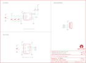

Contents
========

* [PRS10121 > Sparkfun](#prs10121--sparkfun)
	* [Schematic](#schematic)
	* [Interactive BOM](#interactive-bom)
	* [OOMP Parts](#oomp-parts)
	* [Images](#images)
	* [Tags](#tags)
  
![][im]
# PRS10121 > Sparkfun

- ID: PROJ-SPAR-10121-STAN-01
- Hex ID: PRS10121
- Name: Sparkfun
- Description: Sparkfun
- Long Link: [http://oom.lt/PROJ-SPAR-10121-STAN-01](http://oom.lt/PROJ-SPAR-10121-STAN-01)
- Short Link: [http://oom.lt/PRS10121](http://oom.lt/PRS10121)

## Schematic
  

## Interactive BOM

- Interactive BOM page: [ibom.html](https://htmlpreview.github.io/?https://github.com/oomlout/oomlout_OOMP_projects/blob/main/PROJ-SPAR-10121-STAN-01/kicad/bom/ibom.html)

## OOMP Parts
  

|OOMP Parts|
| :---: |
|C1,UNMATCHED-UNMATCHED-UNMATCHED-UNMATCHED-UNMATCHED,C1,0.1uF,CAP0603-CAP,0603-CAP,Capacitor,,|
|C2,UNMATCHED-UNMATCHED-UNMATCHED-UNMATCHED-UNMATCHED,C2,0.1uF,CAP0603-CAP,0603-CAP,Capacitor,,|
|C3,UNMATCHED-UNMATCHED-UNMATCHED-UNMATCHED-UNMATCHED,C3,10nF,CAP0603-CAP,0603-CAP,Capacitor,,|
|C4,UNMATCHED-UNMATCHED-UNMATCHED-UNMATCHED-UNMATCHED,C4,0.1uF,CAP0603-CAP,0603-CAP,Capacitor,,|
|C5,UNMATCHED-UNMATCHED-UNMATCHED-UNMATCHED-UNMATCHED,C5,2.2nF,CAP0603-CAP,0603-CAP,Capacitor,,|
|FRAME1,UNMATCHED-UNMATCHED-UNMATCHED-UNMATCHED-UNMATCHED,FRAME1,FRAME-LETTER,FRAME-LETTER,CREATIVE_COMMONS,Schematic Frame,,|
|JP1,UNMATCHED-UNMATCHED-UNMATCHED-UNMATCHED-UNMATCHED,JP1,,M06SIP,1X06,Header 6,,|
|JP2,UNMATCHED-UNMATCHED-UNMATCHED-UNMATCHED-UNMATCHED,JP2,STAND-OFF,STAND-OFF,STAND-OFF,Stand Off,,|
|JP3,UNMATCHED-UNMATCHED-UNMATCHED-UNMATCHED-UNMATCHED,JP3,LOGO-SFESK,LOGO-SFESK,SFE-LOGO-FLAME,Spark Fun Electronics PCB Logo,,|
|JP5,UNMATCHED-UNMATCHED-UNMATCHED-UNMATCHED-UNMATCHED,JP4,FIDUCIAL1X2,FIDUCIAL1X2,FIDUCIAL-1X2,Fiducial Alignment Points,,|
|R1,UNMATCHED-UNMATCHED-UNMATCHED-UNMATCHED-UNMATCHED,JP5,STAND-OFF,STAND-OFF,STAND-OFF,Stand Off,,|
|R2,UNMATCHED-UNMATCHED-UNMATCHED-UNMATCHED-UNMATCHED,JP6,FIDUCIAL1X2,FIDUCIAL1X2,FIDUCIAL-1X2,Fiducial Alignment Points,,|
|U$1,UNMATCHED-UNMATCHED-UNMATCHED-UNMATCHED-UNMATCHED,R1,4.7K,RESISTOR0603-RES,0603-RES,Resistor,,|
|U$2,UNMATCHED-UNMATCHED-UNMATCHED-UNMATCHED-UNMATCHED,R2,4.7k,RESISTOR0603-RES,0603-RES,Resistor,,|
|U1,UNMATCHED-UNMATCHED-UNMATCHED-UNMATCHED-UNMATCHED,U$1,REVISION,REVISION,REVISION,,,|
|U3,UNMATCHED-UNMATCHED-UNMATCHED-UNMATCHED-UNMATCHED,U$2,OSHW-LOGOS,OSHW-LOGOS,OSHW-LOGO-S,Open Source Hardware Logo This logo indicates the piece of hardware it is found on incorporates a OSHW license and/or adheres to the definition of open source hardware found here: http://freedomdefined.org/OSHW,,|

## Images
  
  

|kicadPcb3d|kicadPcb3dFront|kicadPcb3dBack|eagleImage|eagleSchemImage|
| :---: | :---: | :---: | :---: | :---: |
||||||

## Tags

- hexID: PRS10121
- oompType: PROJ
- oompSize: SPAR
- oompColor: 10121
- oompDesc: STAN
- oompIndex: 01
- oompName: IMU Digital Combo Board
- sources: All source files from https://github.com/sparkfun/IMU_Digital_Combo_Board (source licence details in srcLicense.md)
- linkBuyPage: https://www.sparkfun.com/products/10121
- oompID: PROJ-SPAR-10121-STAN-01
- oompParts: C1,UNMATCHED-UNMATCHED-UNMATCHED-UNMATCHED-UNMATCHED
- oompParts: C2,UNMATCHED-UNMATCHED-UNMATCHED-UNMATCHED-UNMATCHED
- oompParts: C3,UNMATCHED-UNMATCHED-UNMATCHED-UNMATCHED-UNMATCHED
- oompParts: C4,UNMATCHED-UNMATCHED-UNMATCHED-UNMATCHED-UNMATCHED
- oompParts: C5,UNMATCHED-UNMATCHED-UNMATCHED-UNMATCHED-UNMATCHED
- oompParts: FRAME1,UNMATCHED-UNMATCHED-UNMATCHED-UNMATCHED-UNMATCHED
- oompParts: JP1,UNMATCHED-UNMATCHED-UNMATCHED-UNMATCHED-UNMATCHED
- oompParts: JP2,UNMATCHED-UNMATCHED-UNMATCHED-UNMATCHED-UNMATCHED
- oompParts: JP3,UNMATCHED-UNMATCHED-UNMATCHED-UNMATCHED-UNMATCHED
- oompParts: JP5,UNMATCHED-UNMATCHED-UNMATCHED-UNMATCHED-UNMATCHED
- oompParts: R1,UNMATCHED-UNMATCHED-UNMATCHED-UNMATCHED-UNMATCHED
- oompParts: R2,UNMATCHED-UNMATCHED-UNMATCHED-UNMATCHED-UNMATCHED
- oompParts: U$1,UNMATCHED-UNMATCHED-UNMATCHED-UNMATCHED-UNMATCHED
- oompParts: U$2,UNMATCHED-UNMATCHED-UNMATCHED-UNMATCHED-UNMATCHED
- oompParts: U1,UNMATCHED-UNMATCHED-UNMATCHED-UNMATCHED-UNMATCHED
- oompParts: U3,UNMATCHED-UNMATCHED-UNMATCHED-UNMATCHED-UNMATCHED
- rawParts: C1,0.1uF,CAP0603-CAP,0603-CAP,Capacitor,,
- rawParts: C2,0.1uF,CAP0603-CAP,0603-CAP,Capacitor,,
- rawParts: C3,10nF,CAP0603-CAP,0603-CAP,Capacitor,,
- rawParts: C4,0.1uF,CAP0603-CAP,0603-CAP,Capacitor,,
- rawParts: C5,2.2nF,CAP0603-CAP,0603-CAP,Capacitor,,
- rawParts: FRAME1,FRAME-LETTER,FRAME-LETTER,CREATIVE_COMMONS,Schematic Frame,,
- rawParts: JP1,,M06SIP,1X06,Header 6,,
- rawParts: JP2,STAND-OFF,STAND-OFF,STAND-OFF,Stand Off,,
- rawParts: JP3,LOGO-SFESK,LOGO-SFESK,SFE-LOGO-FLAME,Spark Fun Electronics PCB Logo,,
- rawParts: JP4,FIDUCIAL1X2,FIDUCIAL1X2,FIDUCIAL-1X2,Fiducial Alignment Points,,
- rawParts: JP5,STAND-OFF,STAND-OFF,STAND-OFF,Stand Off,,
- rawParts: JP6,FIDUCIAL1X2,FIDUCIAL1X2,FIDUCIAL-1X2,Fiducial Alignment Points,,
- rawParts: R1,4.7K,RESISTOR0603-RES,0603-RES,Resistor,,
- rawParts: R2,4.7k,RESISTOR0603-RES,0603-RES,Resistor,,
- rawParts: U$1,REVISION,REVISION,REVISION,,,
- rawParts: U$2,OSHW-LOGOS,OSHW-LOGOS,OSHW-LOGO-S,Open Source Hardware Logo This logo indicates the piece of hardware it is found on incorporates a OSHW license and/or adheres to the definition of open source hardware found here: http://freedomdefined.org/OSHW,,
- rawParts: U1,ADXL3451:1,ADXL3451:1,LGA14,,,
- rawParts: U3,ITG-32001:1,ITG-32001:1,QFN-24_ITG3200_1:1,ITG-3200 3-axis gyro, digital output, qfn24 package,,

[im]: kicadPcb3d_450.png
