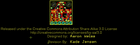

Contents
========

* [PROJ-SPAR-10121-STAN-01>IMU Digital Combo Board](#proj-spar-10121-stan-01imu-digital-combo-board)
	* [Images](#images)
	* [Interactive BOM](#interactive-bom)
	* [OOMP Parts](#oomp-parts)
	* [Tags](#tags)
  
![][im]
# PROJ-SPAR-10121-STAN-01>IMU Digital Combo Board

- ID: PROJ-SPAR-10121-STAN-01
- Hex ID: PRS10121
- Name: IMU Digital Combo Board
- Description: 

## Images
  
  

|eagleImage|kicadPcb3dFront|kicadPcb3dBack|kicadPcb3d|
| :---: | :---: | :---: | :---: |
|||||

## Interactive BOM

- Interactive BOM page: [ibom.html](kicad/bom/ibom.html)

## OOMP Parts
  

|OOMP Parts|
| :---: |
|CAPE-0603-X-NF100-01, C1, 1.27, 9.270999999999999, 90,C1, 0.1uF, 0603-CAP, SparkFun, (0.05, 0.365), R90|
|CAPE-0603-X-NF100-01, C2, 11.43, 10.16, 0,C2, 0.1uF, 0603-CAP, SparkFun, (0.45, 0.4), R0|
|CAPE-0603-X-UNMATCHED-01, C3, 14.097000000000001, 4.191, 90,C3, 10nF, 0603-CAP, SparkFun, (0.555, 0.165), R90|
|CAPE-0603-X-NF100-01, C4, 14.097000000000001, 9.652, 90,C4, 0.1uF, 0603-CAP, SparkFun, (0.555, 0.38), R90|
|CAPE-0603-X-NF22D-01, C5, 7.619999999999999, 10.16, 0,C5, 2.2nF, 0603-CAP, SparkFun, (0.3, 0.4), R0|
|UNMATCHED-UNMATCHED-X-UNMATCHED-01, JP1, 1.27, 1.27, M180,JP1, 1X06, SparkFun, (0.05, 0.05), MR180|
|UNMATCHED-UNMATCHED-X-UNMATCHED-01, JP4, 10.16, 15.239999999999998, 0,JP4, FIDUCIAL1X2, FIDUCIAL-1X2, SparkFun, (0.4, 0.6), R0|
|UNMATCHED-UNMATCHED-X-UNMATCHED-01, JP6, 5.08, 2.921, 0,JP6, FIDUCIAL1X2, FIDUCIAL-1X2, SparkFun, (0.2, 0.115), R0|
|RESE-0603-X-UNMATCHED-01, R1, 7.619999999999999, 12.318999999999999, 0,R1, 4.7K, 0603-RES, SparkFun, (0.3, 0.485), R0|
|RESE-0603-X-UNMATCHED-01, R2, 3.8099999999999996, 10.16, 180,R2, 4.7k, 0603-RES, SparkFun, (0.15, 0.4), R180|
|UNMATCHED-UNMATCHED-X-UNMATCHED-01, U1, 3.8099999999999996, 6.35, 90,U1, ADXL3451:1, LGA14, Testing, (0.15, 0.25), R90|
|UNMATCHED-UNMATCHED-X-UNMATCHED-01, U3, 10.16, 6.35, 90,U3, ITG-32001:1, QFN-24_ITG3200_1:1, Testing, (0.4, 0.25), R90|

## Tags

- hexID: PRS10121
- oompType: PROJ
- oompSize: SPAR
- oompColor: 10121
- oompDesc: STAN
- oompIndex: 01
- oompName: IMU Digital Combo Board
- sources: All source files from https://github.com/sparkfun/IMU_Digital_Combo_Board (source licence details in srcLicense.md)
- linkBuyPage: https://www.sparkfun.com/products/10121
- oompPart: CAPE-0603-X-NF100-01, C1, 1.27, 9.270999999999999, 90
- oompPart: CAPE-0603-X-NF100-01, C2, 11.43, 10.16, 0
- oompPart: CAPE-0603-X-UNMATCHED-01, C3, 14.097000000000001, 4.191, 90
- oompPart: CAPE-0603-X-NF100-01, C4, 14.097000000000001, 9.652, 90
- oompPart: CAPE-0603-X-NF22D-01, C5, 7.619999999999999, 10.16, 0
- oompPart: UNMATCHED-UNMATCHED-X-UNMATCHED-01, JP1, 1.27, 1.27, M180
- oompPart: UNMATCHED-UNMATCHED-X-UNMATCHED-01, JP4, 10.16, 15.239999999999998, 0
- oompPart: UNMATCHED-UNMATCHED-X-UNMATCHED-01, JP6, 5.08, 2.921, 0
- oompPart: RESE-0603-X-UNMATCHED-01, R1, 7.619999999999999, 12.318999999999999, 0
- oompPart: RESE-0603-X-UNMATCHED-01, R2, 3.8099999999999996, 10.16, 180
- oompPart: UNMATCHED-UNMATCHED-X-UNMATCHED-01, U1, 3.8099999999999996, 6.35, 90
- oompPart: UNMATCHED-UNMATCHED-X-UNMATCHED-01, U3, 10.16, 6.35, 90
- rawPart: C1, 0.1uF, 0603-CAP, SparkFun, (0.05, 0.365), R90
- rawPart: C2, 0.1uF, 0603-CAP, SparkFun, (0.45, 0.4), R0
- rawPart: C3, 10nF, 0603-CAP, SparkFun, (0.555, 0.165), R90
- rawPart: C4, 0.1uF, 0603-CAP, SparkFun, (0.555, 0.38), R90
- rawPart: C5, 2.2nF, 0603-CAP, SparkFun, (0.3, 0.4), R0
- rawPart: JP1, 1X06, SparkFun, (0.05, 0.05), MR180
- rawPart: JP4, FIDUCIAL1X2, FIDUCIAL-1X2, SparkFun, (0.4, 0.6), R0
- rawPart: JP6, FIDUCIAL1X2, FIDUCIAL-1X2, SparkFun, (0.2, 0.115), R0
- rawPart: R1, 4.7K, 0603-RES, SparkFun, (0.3, 0.485), R0
- rawPart: R2, 4.7k, 0603-RES, SparkFun, (0.15, 0.4), R180
- rawPart: U1, ADXL3451:1, LGA14, Testing, (0.15, 0.25), R90
- rawPart: U3, ITG-32001:1, QFN-24_ITG3200_1:1, Testing, (0.4, 0.25), R90

[im]: kicadPcb3d_450.png
