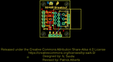
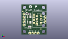
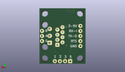
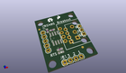

Contents
========

* [PROJ-SPAR-10124-STAN-01>RS-485 Breakout](#proj-spar-10124-stan-01rs-485-breakout)
	* [Images](#images)
	* [Interactive BOM](#interactive-bom)
	* [OOMP Parts](#oomp-parts)
	* [Tags](#tags)
  
![][im]
# PROJ-SPAR-10124-STAN-01>RS-485 Breakout

- ID: PROJ-SPAR-10124-STAN-01
- Hex ID: PRS10124
- Name: RS-485 Breakout
- Description: 

## Images
  
  

|eagleImage|kicadPcb3dFront|kicadPcb3dBack|kicadPcb3d|
| :---: | :---: | :---: | :---: |
|||||

## Interactive BOM

- Interactive BOM page: [ibom.html](kicad/bom/ibom.html)

## OOMP Parts
  

|OOMP Parts|
| :---: |
|<table><tr><td></td><td> C3</td><td>[CAPC-0603-X-NF100-V50 SMD (0603) 100 nF Capacitor (Ceramic) 50v](https://github.com/oomlout/oomlout_OOMP_parts/tree/main/CAPC-0603-X-NF100-V50/)</td><td>[C6N100](https://github.com/oomlout/oomlout_OOMP_parts/tree/main/CAPC-0603-X-NF100-V50/)</td></tr></table>|
|<table><tr><td></td><td> JP1</td><td>[HEAD-I01-X-PI04-01 2.54 mm 4 Pin Header](https://github.com/oomlout/oomlout_OOMP_parts/tree/main/HEAD-I01-X-PI04-01/)</td><td>[H04](https://github.com/oomlout/oomlout_OOMP_parts/tree/main/HEAD-I01-X-PI04-01/)</td></tr></table>|
|UNMATCHED-UNMATCHED-X-UNMATCHED-01, JP2, 17.779999999999998, 10.540999999999999, 90,JP2, SCREWTERMINAL-3.5MM-3, SparkFun, (0.7, 0.415), R90|
|<table><tr><td></td><td> JP3</td><td>[HEAD-I01-X-PI03-01 2.54 mm 3 Pin Header](https://github.com/oomlout/oomlout_OOMP_parts/tree/main/HEAD-I01-X-PI03-01/)</td><td>[H03](https://github.com/oomlout/oomlout_OOMP_parts/tree/main/HEAD-I01-X-PI03-01/)</td></tr></table>|
|UNMATCHED-UNMATCHED-X-UNMATCHED-01, JP4, 20.32, 13.97, 90,JP4, RJ45-8PTH, RJ45-8, SparkFun, (0.8, 0.55), R90|
|HEAD-I01-X-PI2-01, JP5, 17.779999999999998, 5.08, 0,JP5, FIDUCIAL1X2, FIDUCIAL-1X2, SparkFun, (0.7, 0.2), R0|
|<table><tr><td></td><td> JP9</td><td>[HEAD-I01-X-PI05-01 2.54 mm 5 Pin Header](https://github.com/oomlout/oomlout_OOMP_parts/tree/main/HEAD-I01-X-PI05-01/)</td><td>[H05](https://github.com/oomlout/oomlout_OOMP_parts/tree/main/HEAD-I01-X-PI05-01/)</td></tr></table>|
|HEAD-I01-X-PI2-01, JP10, 1.27, 21.59, 0,JP10, FIDUCIAL1X2, FIDUCIAL-1X2, SparkFun, (0.05, 0.85), R0|
|UNMATCHED-0603-X-UNMATCHED-01, LED3, 7.619999999999999, 6.095999999999999, 270,LED3, Green, LED-0603, SparkFun-LED, (0.3, 0.24), R270|
|<table><tr><td></td><td> R3</td><td>[RESE-0603-X-O331-01 SMD (0603) 330 Ohm Resistor](https://github.com/oomlout/oomlout_OOMP_parts/tree/main/RESE-0603-X-O331-01/)</td><td>[R6331](https://github.com/oomlout/oomlout_OOMP_parts/tree/main/RESE-0603-X-O331-01/)</td></tr></table>|
|<table><tr><td></td><td> R4</td><td>[RESE-0603-X-O221-01 SMD (0603) 220 Ohm Resistor](https://github.com/oomlout/oomlout_OOMP_parts/tree/main/RESE-0603-X-O221-01/)</td><td>[R6221](https://github.com/oomlout/oomlout_OOMP_parts/tree/main/RESE-0603-X-O221-01/)</td></tr></table>|
|UNMATCHED-UNMATCHED-X-UNMATCHED-01, U2, 7.619999999999999, 13.97, 0,U2, RS485SOIC, SO08, SparkFun, (0.3, 0.55), R0|

## Tags

- hexID: PRS10124
- oompType: PROJ
- oompSize: SPAR
- oompColor: 10124
- oompDesc: STAN
- oompIndex: 01
- oompName: RS-485 Breakout
- sources: All source files from https://github.com/sparkfun/RS-485_Breakout (source licence details in srcLicense.md)
- linkBuyPage: https://www.sparkfun.com/products/10124
- oompID: PROJ-SPAR-10124-STAN-01
- oompPart: CAPC-0603-X-NF100-V50, C3, 4.953, 19.431, 90
- oompPart: HEAD-I01-X-PI04-01, JP1, 7.619999999999999, 1.27, 0
- oompPart: UNMATCHED-UNMATCHED-X-UNMATCHED-01, JP2, 17.779999999999998, 10.540999999999999, 90
- oompPart: HEAD-I01-X-PI03-01, JP3, 21.59, 11.43, 90
- oompPart: UNMATCHED-UNMATCHED-X-UNMATCHED-01, JP4, 20.32, 13.97, 90
- oompPart: HEAD-I01-X-PI2-01, JP5, 17.779999999999998, 5.08, 0
- oompPart: HEAD-I01-X-PI05-01, JP9, 2.54, 19.049999999999997, 270
- oompPart: HEAD-I01-X-PI2-01, JP10, 1.27, 21.59, 0
- oompPart: UNMATCHED-0603-X-UNMATCHED-01, LED3, 7.619999999999999, 6.095999999999999, 270
- oompPart: RESE-0603-X-O331-01, R3, 7.619999999999999, 7.619999999999999, 0
- oompPart: RESE-0603-X-O221-01, R4, 7.365999999999999, 19.049999999999997, 180
- oompPart: UNMATCHED-UNMATCHED-X-UNMATCHED-01, U2, 7.619999999999999, 13.97, 0
- rawPart: C3, 0.1uF, 0603-CAP, SparkFun-Capacitors, (0.195, 0.765), R90
- rawPart: JP1, 1X04, SparkFun, (0.3, 0.05), R0
- rawPart: JP2, SCREWTERMINAL-3.5MM-3, SparkFun, (0.7, 0.415), R90
- rawPart: JP3, 1X03, SparkFun, (0.85, 0.45), R90
- rawPart: JP4, RJ45-8PTH, RJ45-8, SparkFun, (0.8, 0.55), R90
- rawPart: JP5, FIDUCIAL1X2, FIDUCIAL-1X2, SparkFun, (0.7, 0.2), R0
- rawPart: JP9, 1X05, SparkFun, (0.1, 0.75), R270
- rawPart: JP10, FIDUCIAL1X2, FIDUCIAL-1X2, SparkFun, (0.05, 0.85), R0
- rawPart: LED3, Green, LED-0603, SparkFun-LED, (0.3, 0.24), R270
- rawPart: R3, 330, 0603-RES, SparkFun-Resistors, (0.3, 0.3), R0
- rawPart: R4, 220, 0603-RES, SparkFun-Resistors, (0.29, 0.75), R180
- rawPart: U2, RS485SOIC, SO08, SparkFun, (0.3, 0.55), R0

[im]: kicadPcb3d_450.png
