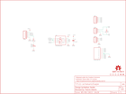

Contents
========

* [PRS10124 > Sparkfun](#prs10124--sparkfun)
	* [Schematic](#schematic)
	* [Interactive BOM](#interactive-bom)
	* [OOMP Parts](#oomp-parts)
	* [Images](#images)
	* [Tags](#tags)
  
![][im]
# PRS10124 > Sparkfun

- ID: PROJ-SPAR-10124-STAN-01
- Hex ID: PRS10124
- Name: Sparkfun
- Description: Sparkfun
- Long Link: [http://oom.lt/PROJ-SPAR-10124-STAN-01](http://oom.lt/PROJ-SPAR-10124-STAN-01)
- Short Link: [http://oom.lt/PRS10124](http://oom.lt/PRS10124)

## Schematic
  

## Interactive BOM

- Interactive BOM page: [ibom.html](https://htmlpreview.github.io/?https://github.com/oomlout/oomlout_OOMP_projects/blob/main/PROJ-SPAR-10124-STAN-01/kicad/bom/ibom.html)

## OOMP Parts
  

|OOMP Parts|
| :---: |
|C3,CAPC-0603-X-NF100-V50,C3,0.1uF,0.1UF-25V(+80/-20%)(0603),0603-CAP,CAP-00810,CAP-00810,0.1uF,|
|JP1,HEAD-I01-X-PI04-01,FRAME1,FRAME-LETTER,FRAME-LETTER,CREATIVE_COMMONS,Schematic Frame,,,|
|JP2,TERS-35D-L-PI03-01,JP1,,M04PTH,1X04,Header 4,,,|
|JP3,HEAD-I01-X-PI03-01,JP2,,M03SCREW,SCREWTERMINAL-3.5MM-3,Header 3,,,|
|JP4,UNMATCHED-UNMATCHED-X-UNMATCHED-01,JP3,,M03PTH,1X03,Header 3,,,|
|JP9,HEAD-I01-X-PI05-01,JP4,RJ45-8PTH,RJ45-8PTH,RJ45-8,RJ45 Jack,,,|
|LED3,LEDS-0603-G-STAN-01,JP5,FIDUCIAL1X2,FIDUCIAL1X2,FIDUCIAL-1X2,Fiducial Alignment Points,,,|
|R3,RESE-0603-X-O331-01,JP6,STAND-OFF,STAND-OFF,STAND-OFF,Stand Off,,,|
|R4,RESE-0603-X-O221-01,JP7,STAND-OFF,STAND-OFF,STAND-OFF,Stand Off,,,|
|U2,UNMATCHED-UNMATCHED-X-UNMATCHED-01,JP8,STAND-OFF,STAND-OFF,STAND-OFF,Stand Off,,,|

## Images
  
  

|kicadPcb3d|kicadPcb3dFront|kicadPcb3dBack|eagleImage|eagleSchemImage|
| :---: | :---: | :---: | :---: | :---: |
||||||

## Tags

- hexID: PRS10124
- oompType: PROJ
- oompSize: SPAR
- oompColor: 10124
- oompDesc: STAN
- oompIndex: 01
- oompName: RS-485 Breakout
- sources: All source files from https://github.com/sparkfun/RS-485_Breakout (source licence details in srcLicense.md)
- linkBuyPage: https://www.sparkfun.com/products/10124
- oompID: PROJ-SPAR-10124-STAN-01
- oompParts: C3,CAPC-0603-X-NF100-V50
- oompParts: JP1,HEAD-I01-X-PI04-01
- oompParts: JP2,TERS-35D-L-PI03-01
- oompParts: JP3,HEAD-I01-X-PI03-01
- oompParts: JP4,UNMATCHED-UNMATCHED-X-UNMATCHED-01
- oompParts: JP9,HEAD-I01-X-PI05-01
- oompParts: LED3,LEDS-0603-G-STAN-01
- oompParts: R3,RESE-0603-X-O331-01
- oompParts: R4,RESE-0603-X-O221-01
- oompParts: U2,UNMATCHED-UNMATCHED-X-UNMATCHED-01
- rawParts: C3,0.1uF,0.1UF-25V(+80/-20%)(0603),0603-CAP,CAP-00810,CAP-00810,0.1uF,
- rawParts: FRAME1,FRAME-LETTER,FRAME-LETTER,CREATIVE_COMMONS,Schematic Frame,,,
- rawParts: JP1,,M04PTH,1X04,Header 4,,,
- rawParts: JP2,,M03SCREW,SCREWTERMINAL-3.5MM-3,Header 3,,,
- rawParts: JP3,,M03PTH,1X03,Header 3,,,
- rawParts: JP4,RJ45-8PTH,RJ45-8PTH,RJ45-8,RJ45 Jack,,,
- rawParts: JP5,FIDUCIAL1X2,FIDUCIAL1X2,FIDUCIAL-1X2,Fiducial Alignment Points,,,
- rawParts: JP6,STAND-OFF,STAND-OFF,STAND-OFF,Stand Off,,,
- rawParts: JP7,STAND-OFF,STAND-OFF,STAND-OFF,Stand Off,,,
- rawParts: JP8,STAND-OFF,STAND-OFF,STAND-OFF,Stand Off,,,
- rawParts: JP9,,M05PTH,1X05,Header 5,,,
- rawParts: JP10,FIDUCIAL1X2,FIDUCIAL1X2,FIDUCIAL-1X2,Fiducial Alignment Points,,,
- rawParts: JP15,STAND-OFF,STAND-OFF,STAND-OFF,Stand Off,,,
- rawParts: LED3,Green,LED-GREEN0603,LED-0603,Various green LEDs,DIO-00821,GREEN,
- rawParts: LOGO1,OSHW-LOGOS,OSHW-LOGOS,OSHW-LOGO-S,Open Source Hardware Logo This logo indicates the piece of hardware it is found on incorporates a OSHW license and/or adheres to the definition of open source hardware found here: http://freedomdefined.org/OSHW,,,
- rawParts: R3,330,330OHM1/10W1%(0603),0603-RES,RES-00818,RES-00818,330,
- rawParts: R4,220,22OHM1/10W1%(0603),0603-RES,RES-08698,RES-08698,22,
- rawParts: U$2,LOGO-SFESK,LOGO-SFESK,SFE-LOGO-FLAME,Spark Fun Electronics PCB Logo,,,
- rawParts: U2,RS485SOIC,RS485SOIC,SO08,,,,

[im]: kicadPcb3d_450.png
