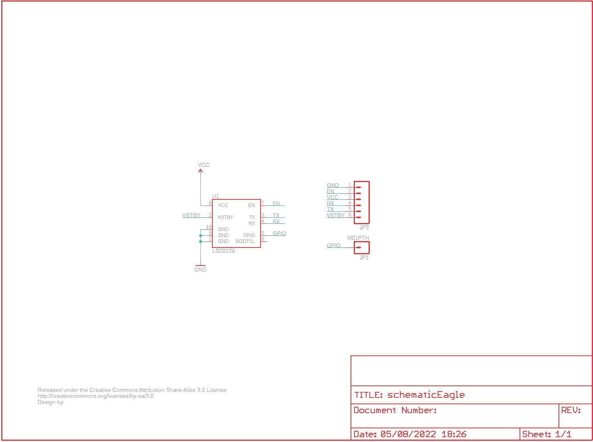
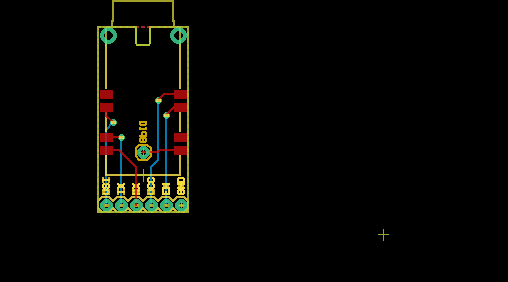
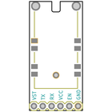
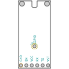
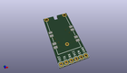
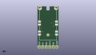
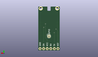
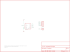

Contents
========

* [PRS10141 > LS20126 GPS Breakout](#prs10141--ls20126-gps-breakout)
	* [Schematic](#schematic)
	* [PCB](#pcb)
	* [Interactive BOM](#interactive-bom)
	* [OOMP Parts](#oomp-parts)
	* [Images](#images)
	* [Tags](#tags)
  
![][im]
# PRS10141 > LS20126 GPS Breakout

- ID: PROJ-SPAR-10141-STAN-01
- Hex ID: PRS10141
- Name: Sparkfun
- Description: Sparkfun
- Long Link: [http://oom.lt/PROJ-SPAR-10141-STAN-01](http://oom.lt/PROJ-SPAR-10141-STAN-01)
- Short Link: [http://oom.lt/PRS10141](http://oom.lt/PRS10141)

## Schematic
  

## PCB
  

## Interactive BOM

- Interactive BOM page: [ibom.html](https://htmlpreview.github.io/?https://github.com/oomlout/oomlout_OOMP_projects/blob/main/PROJ-SPAR-10141-STAN-01/kicad/bom/ibom.html)

## OOMP Parts
  

|OOMP Parts|
| :---: |
|HEAD-I01-X-PI01-01 JP1|
|[HEAD-I01-X-PI06-01  2.54 mm 6 Pin Header  JP2](https://github.com/oomlout/oomlout_OOMP_parts/tree/main/HEAD-I01-X-PI06-01/)|
|UNMATCHED-UNMATCHED-X-UNMATCHED-01 U1|

## Images
  
  

|bominteractivefront|bominteractiveback|kicadPcb3d|kicadPcb3dFront|kicadPcb3dBack|eagleImage|eagleSchemImage|
| :---: | :---: | :---: | :---: | :---: | :---: | :---: |
||||||||

## Tags

- hexID: PRS10141
- oompType: PROJ
- oompSize: SPAR
- oompColor: 10141
- oompDesc: STAN
- oompIndex: 01
- oompName: LS20126 GPS Breakout
- sources: All source files from https://github.com/sparkfun/LS20126_GPS_Breakout (source licence details in srcLicense.md)
- linkBuyPage: https://www.sparkfun.com/products/10141
- oompID: PROJ-SPAR-10141-STAN-01
- oompParts: JP1,HEAD-I01-X-PI01-01
- oompParts: JP2,HEAD-I01-X-PI06-01
- oompParts: U1,UNMATCHED-UNMATCHED-X-UNMATCHED-01
- rawParts: JP1,M01PTH,M01PTH,1X01,Header 1,,
- rawParts: JP2,,M06SIP,1X06,Header 6,,
- rawParts: U$1,CREATIVE_COMMONS,CREATIVE_COMMONS,CREATIVE_COMMONS,,,
- rawParts: U1,LS20126,LS20126,LS20126,LS20126 20-Channel GPS Module,,

[im]: kicadPcb3d_450.png
