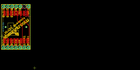
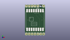
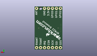
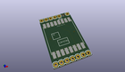

Contents
========

* [PROJ-SPAR-10154-STAN-01>RF Transceiver Breakout-RFM22B](#proj-spar-10154-stan-01rf-transceiver-breakout-rfm22b)
	* [Images](#images)
	* [Interactive BOM](#interactive-bom)
	* [OOMP Parts](#oomp-parts)
	* [Tags](#tags)
  
![][im]
# PROJ-SPAR-10154-STAN-01>RF Transceiver Breakout-RFM22B

- ID: PROJ-SPAR-10154-STAN-01
- Hex ID: PRS10154
- Name: RF Transceiver Breakout-RFM22B
- Description: 

## Images
  
  

|eagleImage|kicadPcb3dFront|kicadPcb3dBack|kicadPcb3d|
| :---: | :---: | :---: | :---: |
|||||

## Interactive BOM

- Interactive BOM page: [ibom.html](kicad/bom/ibom.html)

## OOMP Parts
  

|OOMP Parts|
| :---: |
|UNMATCHED-UNMATCHED-X-UNMATCHED-01, JP0, 11.43, 26.669999999999998, 180,JP0, POWER, 1X02, SparkFun, (0.45, 1.05), R180|
|UNMATCHED-UNMATCHED-X-UNMATCHED-01, JP2, 16.509999999999998, 26.669999999999998, 0,JP2, ANT, 1X01, SparkFun, (0.65, 1.05), R0|
|UNMATCHED-UNMATCHED-X-UNMATCHED-01, JP3, 1.27, 26.669999999999998, 0,JP3, GPIO, 1X03, SparkFun, (0.05, 1.05), R0|
|UNMATCHED-UNMATCHED-X-UNMATCHED-01, JP4, 11.43, 1.27, 180,JP4, SPI, 1X05, SparkFun, (0.45, 0.05), R180|
|UNMATCHED-UNMATCHED-X-UNMATCHED-01, JP5, 16.509999999999998, 1.27, 180,JP5, RX/TX-ANT, 1X02, SparkFun, (0.65, 0.05), R180|
|UNMATCHED-UNMATCHED-X-UNMATCHED-01, RFM22-XXX-S2, 8.889999999999999, 13.97, 270,RFM22-XXX-S2, RFM22, RFM22-XXX-S2, SparkFun, (0.35, 0.55), R270|

## Tags

- hexID: PRS10154
- oompType: PROJ
- oompSize: SPAR
- oompColor: 10154
- oompDesc: STAN
- oompIndex: 01
- oompName: RF Transceiver Breakout-RFM22B
- sources: All source files from https://github.com/sparkfun/RF_Transceiver_Breakout-RFM22B (source licence details in srcLicense.md)
- linkBuyPage: https://www.sparkfun.com/products/10154
- oompPart: UNMATCHED-UNMATCHED-X-UNMATCHED-01, JP0, 11.43, 26.669999999999998, 180
- oompPart: UNMATCHED-UNMATCHED-X-UNMATCHED-01, JP2, 16.509999999999998, 26.669999999999998, 0
- oompPart: UNMATCHED-UNMATCHED-X-UNMATCHED-01, JP3, 1.27, 26.669999999999998, 0
- oompPart: UNMATCHED-UNMATCHED-X-UNMATCHED-01, JP4, 11.43, 1.27, 180
- oompPart: UNMATCHED-UNMATCHED-X-UNMATCHED-01, JP5, 16.509999999999998, 1.27, 180
- oompPart: UNMATCHED-UNMATCHED-X-UNMATCHED-01, RFM22-XXX-S2, 8.889999999999999, 13.97, 270
- rawPart: JP0, POWER, 1X02, SparkFun, (0.45, 1.05), R180
- rawPart: JP2, ANT, 1X01, SparkFun, (0.65, 1.05), R0
- rawPart: JP3, GPIO, 1X03, SparkFun, (0.05, 1.05), R0
- rawPart: JP4, SPI, 1X05, SparkFun, (0.45, 0.05), R180
- rawPart: JP5, RX/TX-ANT, 1X02, SparkFun, (0.65, 0.05), R180
- rawPart: RFM22-XXX-S2, RFM22, RFM22-XXX-S2, SparkFun, (0.35, 0.55), R270

[im]: kicadPcb3d_450.png
