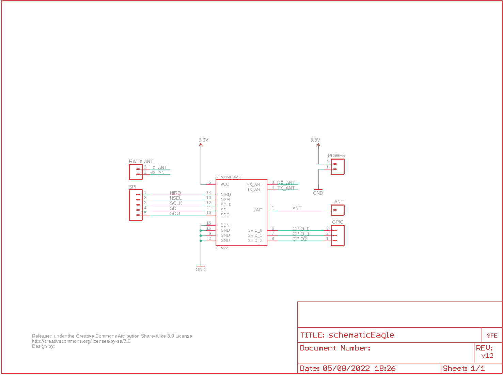

Contents
========

* [PRS10154 > RF Transceiver Breakout-RFM22B](#prs10154--rf-transceiver-breakout-rfm22b)
	* [Schematic](#schematic)
	* [PCB](#pcb)
	* [Interactive BOM](#interactive-bom)
	* [OOMP Parts](#oomp-parts)
	* [Images](#images)
	* [Tags](#tags)
  
![][im]
# PRS10154 > RF Transceiver Breakout-RFM22B

- ID: PROJ-SPAR-10154-STAN-01
- Hex ID: PRS10154
- Name: Sparkfun
- Description: Sparkfun
- Long Link: [http://oom.lt/PROJ-SPAR-10154-STAN-01](http://oom.lt/PROJ-SPAR-10154-STAN-01)
- Short Link: [http://oom.lt/PRS10154](http://oom.lt/PRS10154)

## Schematic
  

## PCB
  

## Interactive BOM

- Interactive BOM page: [ibom.html](https://htmlpreview.github.io/?https://github.com/oomlout/oomlout_OOMP_projects/blob/main/PROJ-SPAR-10154-STAN-01/kicad/bom/ibom.html)

## OOMP Parts
  

|OOMP Parts|
| :---: |
|[HEAD-I01-X-PI02-01  2.54 mm 2 Pin Header  JP0, JP5](https://github.com/oomlout/oomlout_OOMP_parts/tree/main/HEAD-I01-X-PI02-01/)|
|HEAD-I01-X-PI01-01 JP2|
|[HEAD-I01-X-PI03-01  2.54 mm 3 Pin Header  JP3](https://github.com/oomlout/oomlout_OOMP_parts/tree/main/HEAD-I01-X-PI03-01/)|
|[HEAD-I01-X-PI05-01  2.54 mm 5 Pin Header  JP4](https://github.com/oomlout/oomlout_OOMP_parts/tree/main/HEAD-I01-X-PI05-01/)|
|UNMATCHED-UNMATCHED-X-UNMATCHED-01 RFM22-XXX-S2|

## Images
  
  

|kicadPcb3d|kicadPcb3dFront|kicadPcb3dBack|eagleImage|eagleSchemImage|
| :---: | :---: | :---: | :---: | :---: |
||||||

## Tags

- hexID: PRS10154
- oompType: PROJ
- oompSize: SPAR
- oompColor: 10154
- oompDesc: STAN
- oompIndex: 01
- oompName: RF Transceiver Breakout-RFM22B
- sources: All source files from https://github.com/sparkfun/RF_Transceiver_Breakout-RFM22B (source licence details in srcLicense.md)
- linkBuyPage: https://www.sparkfun.com/products/10154
- oompID: PROJ-SPAR-10154-STAN-01
- oompParts: JP0,HEAD-I01-X-PI02-01
- oompParts: JP2,HEAD-I01-X-PI01-01
- oompParts: JP3,HEAD-I01-X-PI03-01
- oompParts: JP4,HEAD-I01-X-PI05-01
- oompParts: JP5,HEAD-I01-X-PI02-01
- oompParts: RFM22-XXX-S2,UNMATCHED-UNMATCHED-X-UNMATCHED-01
- rawParts: JP0,POWER,M02PTH,1X02,Header 2,,
- rawParts: JP1,LOGO-SFENEW,LOGO-SFENEW,SFE-NEW-WEBLOGO,Spark Fun Electronics PCB Logo,,
- rawParts: JP2,ANT,M01PTH,1X01,Header 1,,
- rawParts: JP3,GPIO,M03PTH,1X03,Header 3,,
- rawParts: JP4,SPI,M05PTH,1X05,Header 5,,
- rawParts: JP5,RX/TX-ANT,M02PTH,1X02,Header 2,,
- rawParts: RFM22-XXX-S2,RFM22,RFM22,RFM22-XXX-S2,*Hope RFs RFM22*,,
- rawParts: U$1,CREATIVE_COMMONS,CREATIVE_COMMONS,CREATIVE_COMMONS,,,

[im]: kicadPcb3d_450.png
