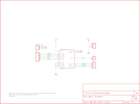

Contents
========

* [PRS10154 > Sparkfun](#prs10154--sparkfun)
	* [Images](#images)
	* [Tags](#tags)
  
![][im]
# PRS10154 > Sparkfun

- ID: PROJ-SPAR-10154-STAN-01
- Hex ID: PRS10154
- Name: Sparkfun
- Description: Sparkfun

## Images
  
  

|kicadPcb3d|kicadPcb3dFront|kicadPcb3dBack|eagleImage|eagleSchemImage|
| :---: | :---: | :---: | :---: | :---: |
||||||

## Tags

- hexID: PRS10154
- oompType: PROJ
- oompSize: SPAR
- oompColor: 10154
- oompDesc: STAN
- oompIndex: 01
- oompName: RF Transceiver Breakout-RFM22B
- sources: All source files from https://github.com/sparkfun/RF_Transceiver_Breakout-RFM22B (source licence details in srcLicense.md)
- linkBuyPage: https://www.sparkfun.com/products/10154
- oompID: PROJ-SPAR-10154-STAN-01
- oompParts: JP0,UNMATCHED-UNMATCHED-UNMATCHED-UNMATCHED-UNMATCHED
- oompParts: JP1,UNMATCHED-UNMATCHED-UNMATCHED-UNMATCHED-UNMATCHED
- oompParts: JP2,UNMATCHED-UNMATCHED-UNMATCHED-UNMATCHED-UNMATCHED
- oompParts: JP3,UNMATCHED-UNMATCHED-UNMATCHED-UNMATCHED-UNMATCHED
- oompParts: JP4,UNMATCHED-UNMATCHED-UNMATCHED-UNMATCHED-UNMATCHED
- oompParts: JP5,UNMATCHED-UNMATCHED-UNMATCHED-UNMATCHED-UNMATCHED
- oompParts: RFM22-XXX-S2,UNMATCHED-UNMATCHED-UNMATCHED-UNMATCHED-UNMATCHED
- oompParts: U$1,UNMATCHED-UNMATCHED-UNMATCHED-UNMATCHED-UNMATCHED
- rawParts: JP0,POWER,M02PTH,1X02,Header 2,,
- rawParts: JP1,LOGO-SFENEW,LOGO-SFENEW,SFE-NEW-WEBLOGO,Spark Fun Electronics PCB Logo,,
- rawParts: JP2,ANT,M01PTH,1X01,Header 1,,
- rawParts: JP3,GPIO,M03PTH,1X03,Header 3,,
- rawParts: JP4,SPI,M05PTH,1X05,Header 5,,
- rawParts: JP5,RX/TX-ANT,M02PTH,1X02,Header 2,,
- rawParts: RFM22-XXX-S2,RFM22,RFM22,RFM22-XXX-S2,*Hope RFs RFM22*,,
- rawParts: U$1,CREATIVE_COMMONS,CREATIVE_COMMONS,CREATIVE_COMMONS,,,

[im]: kicadPcb3d_450.png
