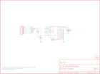

Contents
========

* [PRS10160 > DeadOn RTC](#prs10160--deadon-rtc)
	* [Schematic](#schematic)
	* [PCB](#pcb)
	* [Interactive BOM](#interactive-bom)
	* [OOMP Parts](#oomp-parts)
	* [Images](#images)
	* [Tags](#tags)
  
![][im]
# PRS10160 > DeadOn RTC

- ID: PROJ-SPAR-10160-STAN-01
- Hex ID: PRS10160
- Name: Sparkfun
- Description: Sparkfun
- Long Link: [http://oom.lt/PROJ-SPAR-10160-STAN-01](http://oom.lt/PROJ-SPAR-10160-STAN-01)
- Short Link: [http://oom.lt/PRS10160](http://oom.lt/PRS10160)

## Schematic
  

## PCB
  

## Interactive BOM

- Interactive BOM page: [ibom.html](https://htmlpreview.github.io/?https://github.com/oomlout/oomlout_OOMP_projects/blob/main/PROJ-SPAR-10160-STAN-01/kicad/bom/ibom.html)

## OOMP Parts
  

|OOMP Parts|
| :---: |
|BAT1 BAT1,UNMATCHED-UNMATCHED-X-UNMATCHED-01|
|C1 C1,CAPC-0402-X-PF22-01|
|[JP1 HEAD-I01-X-PI07-01 2.54 mm 7 Pin Header](https://github.com/oomlout/oomlout_OOMP_parts/tree/main/HEAD-I01-X-PI07-01/)|
|[R1 RESE-0402-X-O103-01 SMD (0402) 10k Ohm Resistor](https://github.com/oomlout/oomlout_OOMP_parts/tree/main/RESE-0402-X-O103-01/)|
|U1 U1,UNMATCHED-UNMATCHED-X-UNMATCHED-01|

## Images
  
  

|kicadPcb3d|kicadPcb3dFront|kicadPcb3dBack|eagleImage|eagleSchemImage|
| :---: | :---: | :---: | :---: | :---: |
||||||

## Tags

- hexID: PRS10160
- oompType: PROJ
- oompSize: SPAR
- oompColor: 10160
- oompDesc: STAN
- oompIndex: 01
- oompName: DeadOn RTC
- sources: All source files from https://github.com/sparkfun/DeadOn_RTC (source licence details in srcLicense.md)
- linkBuyPage: https://www.sparkfun.com/products/10160
- oompID: PROJ-SPAR-10160-STAN-01
- oompParts: BAT1,UNMATCHED-UNMATCHED-X-UNMATCHED-01
- oompParts: C1,CAPC-0402-X-PF22-01
- oompParts: JP1,HEAD-I01-X-PI07-01
- oompParts: R1,RESE-0402-X-O103-01
- oompParts: U1,UNMATCHED-UNMATCHED-X-UNMATCHED-01
- rawParts: BAT1,3V,BATTERY,BATTCON_12MM_CURVED,Battery Holders,,
- rawParts: C1,22pF,CAP0402-CAP,0402-CAP,Capacitor,,
- rawParts: JP1,,M07,1X07,Header 7,,
- rawParts: JP2,LOGO-SFESK,LOGO-SFESK,SFE-LOGO-FLAME,Spark Fun Electronics PCB Logo,,
- rawParts: JP3,FIDUCIAL1X2,FIDUCIAL1X2,FIDUCIAL-1X2,Fiducial Alignment Points,,
- rawParts: JP4,FIDUCIAL1X2,FIDUCIAL1X2,FIDUCIAL-1X2,Fiducial Alignment Points,,
- rawParts: R1,10k,RESISTOR0402-RES,0402-RES,Resistor,,
- rawParts: U$1,CREATIVE_COMMONS,CREATIVE_COMMONS,CREATIVE_COMMONS,,,
- rawParts: U1,DS3234,DS3234,DS3234,DS3234 Real Time Clock,,

[im]: kicadPcb3d_450.png
