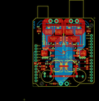

Contents
========

* [PROJ-SPAR-10182-STAN-01>Monster Moto Shield](#proj-spar-10182-stan-01monster-moto-shield)
	* [Images](#images)
	* [OOMP Parts](#oomp-parts)
	* [Tags](#tags)
  
![][im]
# PROJ-SPAR-10182-STAN-01>Monster Moto Shield

- ID: PROJ-SPAR-10182-STAN-01
- Hex ID: PRS10182
- Name: Monster Moto Shield
- Description: 

## Images
  
  

|eagleImage|
| :---: |
||

## OOMP Parts
  

|OOMP Parts|
| :---: |
|CAPE-0402-X-UNMATCHED-01, C1, 7.619999999999999, 17.779999999999998, 90,C1, 33nF, 0402-CAP, SparkFun, (0.3, 0.7), R90|
|CAPE-UNMATCHED-X-UNMATCHED-01, C2, 20.32, 17.779999999999998, 180,C2, 560uF, PANASONIC_G, SparkFun, (0.8, 0.7), R180|
|ERROR, C3 DNP CPOL-RADIAL-1000UF-25V, 0, 0, 0,C3, DNP, CPOL-RADIAL-1000UF-25V, SparkFun, (0.5, 0.35), R0|
|CAPE-0402-X-UNMATCHED-01, C4, 7.619999999999999, 15.239999999999998, 90,C4, 33nF, 0402-CAP, SparkFun, (0.3, 0.6), R90|
|CAPE-UNMATCHED-X-UNMATCHED-01, C5, 33.019999999999996, 17.779999999999998, 0,C5, 560uF, PANASONIC_G, SparkFun, (1.3, 0.7), R0|
|ERROR, C6 DNP CPOL-RADIAL-1000UF-25V, 0, 0, 0,C6, DNP, CPOL-RADIAL-1000UF-25V, SparkFun, (1.6, 0.35), R180|
|UNMATCHED-UNMATCHED-X-UNMATCHED-01, D1, 26.669999999999998, 29.209999999999997, 180,D1, BZT52, SOD-323, SparkFun, (1.05, 1.15), R180|
|UNMATCHED-UNMATCHED-X-UNMATCHED-01, JP1, 17.779999999999998, 57.15, 0,JP1, M1, 1X02_XTRA_BIG, SparkFun, (0.7, 2.25), R0|
|UNMATCHED-UNMATCHED-X-UNMATCHED-01, JP2, 35.559999999999995, 57.15, 0,JP2, M2, 1X02_XTRA_BIG, SparkFun, (1.4, 2.25), R0|
|UNMATCHED-UNMATCHED-X-UNMATCHED-01, JP3, 26.669999999999998, 2.54, 0,JP3, VCC, 1X02_XTRA_BIG, SparkFun, (1.05, 0.1), R0|
|UNMATCHED-UNMATCHED-X-UNMATCHED-01, JP4, 49.529999999999994, 57.15, 0,JP4, FIDUCIAL1X2, FIDUCIAL-1X2, SparkFun, (1.95, 2.25), R0|
|UNMATCHED-UNMATCHED-X-UNMATCHED-01, JP6, 11.43, 1.27, 0,JP6, FIDUCIAL1X2, FIDUCIAL-1X2, SparkFun, (0.45, 0.05), R0|
|UNMATCHED-0603-X-UNMATCHED-01, LED1, 17.779999999999998, 2.54, 180,LED1, RED, LED-0603, SparkFun, (0.7, 0.1), R180|
|UNMATCHED-0603-X-UNMATCHED-01, LED2, 5.08, 48.26, 0,LED2, GREEN, LED-0603, SparkFun, (0.2, 1.9), R0|
|UNMATCHED-0603-X-UNMATCHED-01, LED3, 6.35, 48.26, 180,LED3, GREEN, LED-0603, SparkFun, (0.25, 1.9), R180|
|UNMATCHED-0603-X-UNMATCHED-01, LED4, 48.26, 48.26, 0,LED4, GREEN, LED-0603, SparkFun, (1.9, 1.9), R0|
|UNMATCHED-0603-X-UNMATCHED-01, LED5, 49.529999999999994, 48.26, 180,LED5, GREEN, LED-0603, SparkFun, (1.95, 1.9), R180|
|UNMATCHED-UNMATCHED-X-UNMATCHED-01, Q1, 11.43, 29.209999999999997, 90,Q1, FDD8580, DPAK, SparkFun, (0.45, 1.15), R90|
|UNMATCHED-UNMATCHED-X-UNMATCHED-01, Q2, 41.91, 29.209999999999997, 270,Q2, FDD8580, DPAK, SparkFun, (1.65, 1.15), R270|
|<table><tr><td></td><td> R1</td><td>[RESE-0402-X-O102-01 SMD (0402) 1k Ohm Resistor](https://github.com/oomlout/oomlout_OOMP_parts/tree/main/RESE-0402-X-O102-01/)</td><td>[R42102](https://github.com/oomlout/oomlout_OOMP_parts/tree/main/RESE-0402-X-O102-01/)</td></tr></table>|
|<table><tr><td></td><td> R2</td><td>[RESE-0402-X-O102-01 SMD (0402) 1k Ohm Resistor](https://github.com/oomlout/oomlout_OOMP_parts/tree/main/RESE-0402-X-O102-01/)</td><td>[R42102](https://github.com/oomlout/oomlout_OOMP_parts/tree/main/RESE-0402-X-O102-01/)</td></tr></table>|
|<table><tr><td></td><td> R3</td><td>[RESE-0402-X-O102-01 SMD (0402) 1k Ohm Resistor](https://github.com/oomlout/oomlout_OOMP_parts/tree/main/RESE-0402-X-O102-01/)</td><td>[R42102](https://github.com/oomlout/oomlout_OOMP_parts/tree/main/RESE-0402-X-O102-01/)</td></tr></table>|
|<table><tr><td></td><td> R4</td><td>[RESE-0402-X-O102-01 SMD (0402) 1k Ohm Resistor](https://github.com/oomlout/oomlout_OOMP_parts/tree/main/RESE-0402-X-O102-01/)</td><td>[R42102](https://github.com/oomlout/oomlout_OOMP_parts/tree/main/RESE-0402-X-O102-01/)</td></tr></table>|
|<table><tr><td></td><td> R5</td><td>[RESE-0402-X-O103-01 SMD (0402) 10k Ohm Resistor](https://github.com/oomlout/oomlout_OOMP_parts/tree/main/RESE-0402-X-O103-01/)</td><td>[R42103](https://github.com/oomlout/oomlout_OOMP_parts/tree/main/RESE-0402-X-O103-01/)</td></tr></table>|
|RESE-0402-X-UNMATCHED-01, R6, 10.16, 17.779999999999998, 90,R6, 1.5K, 0402-RES, SparkFun, (0.4, 0.7), R90|
|<table><tr><td></td><td> R7</td><td>[RESE-0402-X-O102-01 SMD (0402) 1k Ohm Resistor](https://github.com/oomlout/oomlout_OOMP_parts/tree/main/RESE-0402-X-O102-01/)</td><td>[R42102](https://github.com/oomlout/oomlout_OOMP_parts/tree/main/RESE-0402-X-O102-01/)</td></tr></table>|
|RESE-0402-X-UNMATCHED-01, R8, 2.54, 20.32, 270,R8, 4.7K, 0402-RES, SparkFun, (0.1, 0.8), R270|
|<table><tr><td></td><td> R9</td><td>[RESE-0402-X-O104-01 SMD (0402) 110k Ohm Resistor](https://github.com/oomlout/oomlout_OOMP_parts/tree/main/RESE-0402-X-O104-01/)</td><td>[R42104](https://github.com/oomlout/oomlout_OOMP_parts/tree/main/RESE-0402-X-O104-01/)</td></tr></table>|
|<table><tr><td></td><td> R10</td><td>[RESE-0402-X-O102-01 SMD (0402) 1k Ohm Resistor](https://github.com/oomlout/oomlout_OOMP_parts/tree/main/RESE-0402-X-O102-01/)</td><td>[R42102](https://github.com/oomlout/oomlout_OOMP_parts/tree/main/RESE-0402-X-O102-01/)</td></tr></table>|
|<table><tr><td></td><td> R11</td><td>[RESE-0402-X-O102-01 SMD (0402) 1k Ohm Resistor](https://github.com/oomlout/oomlout_OOMP_parts/tree/main/RESE-0402-X-O102-01/)</td><td>[R42102](https://github.com/oomlout/oomlout_OOMP_parts/tree/main/RESE-0402-X-O102-01/)</td></tr></table>|
|<table><tr><td></td><td> R12</td><td>[RESE-0402-X-O102-01 SMD (0402) 1k Ohm Resistor](https://github.com/oomlout/oomlout_OOMP_parts/tree/main/RESE-0402-X-O102-01/)</td><td>[R42102](https://github.com/oomlout/oomlout_OOMP_parts/tree/main/RESE-0402-X-O102-01/)</td></tr></table>|
|<table><tr><td></td><td> R13</td><td>[RESE-0402-X-O102-01 SMD (0402) 1k Ohm Resistor](https://github.com/oomlout/oomlout_OOMP_parts/tree/main/RESE-0402-X-O102-01/)</td><td>[R42102](https://github.com/oomlout/oomlout_OOMP_parts/tree/main/RESE-0402-X-O102-01/)</td></tr></table>|
|<table><tr><td></td><td> R14</td><td>[RESE-0402-X-O103-01 SMD (0402) 10k Ohm Resistor](https://github.com/oomlout/oomlout_OOMP_parts/tree/main/RESE-0402-X-O103-01/)</td><td>[R42103](https://github.com/oomlout/oomlout_OOMP_parts/tree/main/RESE-0402-X-O103-01/)</td></tr></table>|
|RESE-0402-X-UNMATCHED-01, R15, 10.16, 15.239999999999998, 90,R15, 1.5K, 0402-RES, SparkFun, (0.4, 0.6), R90|
|<table><tr><td></td><td> R16</td><td>[RESE-0402-X-O102-01 SMD (0402) 1k Ohm Resistor](https://github.com/oomlout/oomlout_OOMP_parts/tree/main/RESE-0402-X-O102-01/)</td><td>[R42102](https://github.com/oomlout/oomlout_OOMP_parts/tree/main/RESE-0402-X-O102-01/)</td></tr></table>|
|RESE-0402-X-UNMATCHED-01, R17, 5.08, 20.32, 270,R17, 4.7K, 0402-RES, SparkFun, (0.2, 0.8), R270|
|RESE-0402-X-O331-01, R18, 3.8099999999999996, 48.26, 90,R18, 330, 0402-RES, SparkFun, (0.15, 1.9), R90|
|RESE-0402-X-O331-01, R19, 46.99, 48.26, 90,R19, 330, 0402-RES, SparkFun, (1.85, 1.9), R90|
|RESE-0402-X-O331-01, R20, 19.049999999999997, 2.54, 270,R20, 330, 0402-RES, SparkFun, (0.75, 0.1), R270|
|UNMATCHED-UNMATCHED-X-UNMATCHED-01, U1, 17.779999999999998, 44.449999999999996, 0,U1, VNH2SP30, VNH2SP30, SparkFun, (0.7, 1.75), R0|
|UNMATCHED-UNMATCHED-X-UNMATCHED-01, U2, 35.559999999999995, 44.449999999999996, 0,U2, VNH2SP30, VNH2SP30, SparkFun, (1.4, 1.75), R0|
|UNMATCHED-UNMATCHED-X-UNMATCHED-01, U3, 53.339999999999996, 59.69, 180,U3, ARDUINO_SHIELDLABEL, DUEMILANOVE_SHIELD, SparkFun, (2.1, 2.35), R180|

## Tags

- hexID: PRS10182
- oompType: PROJ
- oompSize: SPAR
- oompColor: 10182
- oompDesc: STAN
- oompIndex: 01
- oompName: Monster Moto Shield
- sources: All source files from https://github.com/sparkfun/Monster_Moto_Shield (source licence details in srcLicense.md)
- linkBuyPage: https://www.sparkfun.com/products/10182
- oompPart: CAPE-0402-X-UNMATCHED-01, C1, 7.619999999999999, 17.779999999999998, 90
- oompPart: CAPE-UNMATCHED-X-UNMATCHED-01, C2, 20.32, 17.779999999999998, 180
- oompPart: ERROR, C3 DNP CPOL-RADIAL-1000UF-25V, 0, 0, 0
- oompPart: CAPE-0402-X-UNMATCHED-01, C4, 7.619999999999999, 15.239999999999998, 90
- oompPart: CAPE-UNMATCHED-X-UNMATCHED-01, C5, 33.019999999999996, 17.779999999999998, 0
- oompPart: ERROR, C6 DNP CPOL-RADIAL-1000UF-25V, 0, 0, 0
- oompPart: UNMATCHED-UNMATCHED-X-UNMATCHED-01, D1, 26.669999999999998, 29.209999999999997, 180
- oompPart: UNMATCHED-UNMATCHED-X-UNMATCHED-01, JP1, 17.779999999999998, 57.15, 0
- oompPart: UNMATCHED-UNMATCHED-X-UNMATCHED-01, JP2, 35.559999999999995, 57.15, 0
- oompPart: UNMATCHED-UNMATCHED-X-UNMATCHED-01, JP3, 26.669999999999998, 2.54, 0
- oompPart: UNMATCHED-UNMATCHED-X-UNMATCHED-01, JP4, 49.529999999999994, 57.15, 0
- oompPart: UNMATCHED-UNMATCHED-X-UNMATCHED-01, JP6, 11.43, 1.27, 0
- oompPart: UNMATCHED-0603-X-UNMATCHED-01, LED1, 17.779999999999998, 2.54, 180
- oompPart: UNMATCHED-0603-X-UNMATCHED-01, LED2, 5.08, 48.26, 0
- oompPart: UNMATCHED-0603-X-UNMATCHED-01, LED3, 6.35, 48.26, 180
- oompPart: UNMATCHED-0603-X-UNMATCHED-01, LED4, 48.26, 48.26, 0
- oompPart: UNMATCHED-0603-X-UNMATCHED-01, LED5, 49.529999999999994, 48.26, 180
- oompPart: UNMATCHED-UNMATCHED-X-UNMATCHED-01, Q1, 11.43, 29.209999999999997, 90
- oompPart: UNMATCHED-UNMATCHED-X-UNMATCHED-01, Q2, 41.91, 29.209999999999997, 270
- oompPart: RESE-0402-X-O102-01, R1, 46.99, 22.86, 180
- oompPart: RESE-0402-X-O102-01, R2, 46.99, 24.13, 180
- oompPart: RESE-0402-X-O102-01, R3, 46.99, 16.509999999999998, 180
- oompPart: RESE-0402-X-O102-01, R4, 46.99, 17.779999999999998, 0
- oompPart: RESE-0402-X-O103-01, R5, 8.889999999999999, 17.779999999999998, 270
- oompPart: RESE-0402-X-UNMATCHED-01, R6, 10.16, 17.779999999999998, 90
- oompPart: RESE-0402-X-O102-01, R7, 1.27, 20.32, 270
- oompPart: RESE-0402-X-UNMATCHED-01, R8, 2.54, 20.32, 270
- oompPart: RESE-0402-X-O104-01, R9, 26.669999999999998, 30.479999999999997, 180
- oompPart: RESE-0402-X-O102-01, R10, 46.99, 15.239999999999998, 180
- oompPart: RESE-0402-X-O102-01, R11, 46.99, 33.019999999999996, 180
- oompPart: RESE-0402-X-O102-01, R12, 46.99, 20.32, 180
- oompPart: RESE-0402-X-O102-01, R13, 46.99, 21.59, 0
- oompPart: RESE-0402-X-O103-01, R14, 8.889999999999999, 15.239999999999998, 270
- oompPart: RESE-0402-X-UNMATCHED-01, R15, 10.16, 15.239999999999998, 90
- oompPart: RESE-0402-X-O102-01, R16, 6.35, 20.32, 270
- oompPart: RESE-0402-X-UNMATCHED-01, R17, 5.08, 20.32, 270
- oompPart: RESE-0402-X-O331-01, R18, 3.8099999999999996, 48.26, 90
- oompPart: RESE-0402-X-O331-01, R19, 46.99, 48.26, 90
- oompPart: RESE-0402-X-O331-01, R20, 19.049999999999997, 2.54, 270
- oompPart: UNMATCHED-UNMATCHED-X-UNMATCHED-01, U1, 17.779999999999998, 44.449999999999996, 0
- oompPart: UNMATCHED-UNMATCHED-X-UNMATCHED-01, U2, 35.559999999999995, 44.449999999999996, 0
- oompPart: UNMATCHED-UNMATCHED-X-UNMATCHED-01, U3, 53.339999999999996, 59.69, 180
- rawPart: C1, 33nF, 0402-CAP, SparkFun, (0.3, 0.7), R90
- rawPart: C2, 560uF, PANASONIC_G, SparkFun, (0.8, 0.7), R180
- rawPart: C3, DNP, CPOL-RADIAL-1000UF-25V, SparkFun, (0.5, 0.35), R0
- rawPart: C4, 33nF, 0402-CAP, SparkFun, (0.3, 0.6), R90
- rawPart: C5, 560uF, PANASONIC_G, SparkFun, (1.3, 0.7), R0
- rawPart: C6, DNP, CPOL-RADIAL-1000UF-25V, SparkFun, (1.6, 0.35), R180
- rawPart: D1, BZT52, SOD-323, SparkFun, (1.05, 1.15), R180
- rawPart: JP1, M1, 1X02_XTRA_BIG, SparkFun, (0.7, 2.25), R0
- rawPart: JP2, M2, 1X02_XTRA_BIG, SparkFun, (1.4, 2.25), R0
- rawPart: JP3, VCC, 1X02_XTRA_BIG, SparkFun, (1.05, 0.1), R0
- rawPart: JP4, FIDUCIAL1X2, FIDUCIAL-1X2, SparkFun, (1.95, 2.25), R0
- rawPart: JP6, FIDUCIAL1X2, FIDUCIAL-1X2, SparkFun, (0.45, 0.05), R0
- rawPart: LED1, RED, LED-0603, SparkFun, (0.7, 0.1), R180
- rawPart: LED2, GREEN, LED-0603, SparkFun, (0.2, 1.9), R0
- rawPart: LED3, GREEN, LED-0603, SparkFun, (0.25, 1.9), R180
- rawPart: LED4, GREEN, LED-0603, SparkFun, (1.9, 1.9), R0
- rawPart: LED5, GREEN, LED-0603, SparkFun, (1.95, 1.9), R180
- rawPart: Q1, FDD8580, DPAK, SparkFun, (0.45, 1.15), R90
- rawPart: Q2, FDD8580, DPAK, SparkFun, (1.65, 1.15), R270
- rawPart: R1, 1K, 0402-RES, SparkFun, (1.85, 0.9), R180
- rawPart: R2, 1K, 0402-RES, SparkFun, (1.85, 0.95), R180
- rawPart: R3, 1K, 0402-RES, SparkFun, (1.85, 0.65), R180
- rawPart: R4, 1K, 0402-RES, SparkFun, (1.85, 0.7), R0
- rawPart: R5, 10K, 0402-RES, SparkFun, (0.35, 0.7), R270
- rawPart: R6, 1.5K, 0402-RES, SparkFun, (0.4, 0.7), R90
- rawPart: R7, 1K, 0402-RES, SparkFun, (0.05, 0.8), R270
- rawPart: R8, 4.7K, 0402-RES, SparkFun, (0.1, 0.8), R270
- rawPart: R9, 100K, 0402-RES, SparkFun, (1.05, 1.2), R180
- rawPart: R10, 1K, 0402-RES, SparkFun, (1.85, 0.6), R180
- rawPart: R11, 1K, 0402-RES, SparkFun, (1.85, 1.3), R180
- rawPart: R12, 1K, 0402-RES, SparkFun, (1.85, 0.8), R180
- rawPart: R13, 1K, 0402-RES, SparkFun, (1.85, 0.85), R0
- rawPart: R14, 10K, 0402-RES, SparkFun, (0.35, 0.6), R270
- rawPart: R15, 1.5K, 0402-RES, SparkFun, (0.4, 0.6), R90
- rawPart: R16, 1K, 0402-RES, SparkFun, (0.25, 0.8), R270
- rawPart: R17, 4.7K, 0402-RES, SparkFun, (0.2, 0.8), R270
- rawPart: R18, 330, 0402-RES, SparkFun, (0.15, 1.9), R90
- rawPart: R19, 330, 0402-RES, SparkFun, (1.85, 1.9), R90
- rawPart: R20, 330, 0402-RES, SparkFun, (0.75, 0.1), R270
- rawPart: U1, VNH2SP30, VNH2SP30, SparkFun, (0.7, 1.75), R0
- rawPart: U2, VNH2SP30, VNH2SP30, SparkFun, (1.4, 1.75), R0
- rawPart: U3, ARDUINO_SHIELDLABEL, DUEMILANOVE_SHIELD, SparkFun, (2.1, 2.35), R180

[im]: eagleImage_450.png
