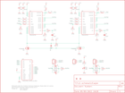

Contents
========

* [PRS10182 > Sparkfun](#prs10182--sparkfun)
	* [Schematic](#schematic)
	* [OOMP Parts](#oomp-parts)
	* [Images](#images)
	* [Tags](#tags)
  
![][im]
# PRS10182 > Sparkfun

- ID: PROJ-SPAR-10182-STAN-01
- Hex ID: PRS10182
- Name: Sparkfun
- Description: Sparkfun
- Long Link: [http://oom.lt/PROJ-SPAR-10182-STAN-01](http://oom.lt/PROJ-SPAR-10182-STAN-01)
- Short Link: [http://oom.lt/PRS10182](http://oom.lt/PRS10182)

## Schematic
  

## OOMP Parts
  

|OOMP Parts|
| :---: |
|C1,CAPC-0402-X-UNMATCHED-01,C1,33nF,CAP0402-CAP,0402-CAP,Capacitor,,|
|C2,CAPX-UNMATCHED-X-UF560-01,C2,560uF,CAP_POLG,PANASONIC_G,Capacitor Polarized,,|
|C4,CAPC-0402-X-UNMATCHED-01,C3,DNP,CAP_POLPTH4,CPOL-RADIAL-1000UF-25V,Capacitor Polarized,,|
|C5,CAPX-UNMATCHED-X-UF560-01,C4,33nF,CAP0402-CAP,0402-CAP,Capacitor,,|
|D1,DIOD-S323-X-UNMATCHED-01,C5,560uF,CAP_POLG,PANASONIC_G,Capacitor Polarized,,|
|JP1,HEAD-I01-X-PI02-01,C6,DNP,CAP_POLPTH4,CPOL-RADIAL-1000UF-25V,Capacitor Polarized,,|
|JP2,HEAD-I01-X-PI02-01,D1,BZT52,DIODE-ZENER-BZT52,SOD-323,Zener Diode,,|
|JP3,HEAD-I01-X-PI02-01,JP1,M1,M02PTH4,1X02_XTRA_BIG,Header 2,,|
|LED1,LEDS-0603-G-STAN-01,JP2,M2,M02PTH4,1X02_XTRA_BIG,Header 2,,|
|LED2,LEDS-0603-G-STAN-01,JP3,VCC,M02PTH4,1X02_XTRA_BIG,Header 2,,|
|LED3,LEDS-0603-G-STAN-01,JP4,FIDUCIAL1X2,FIDUCIAL1X2,FIDUCIAL-1X2,Fiducial Alignment Points,,|
|LED4,LEDS-0603-G-STAN-01,JP5,LOGO-SFENEW,LOGO-SFENEW,SFE-NEW-WEBLOGO,Spark Fun Electronics PCB Logo,,|
|LED5,LEDS-0603-G-STAN-01,JP6,FIDUCIAL1X2,FIDUCIAL1X2,FIDUCIAL-1X2,Fiducial Alignment Points,,|
|Q1,UNMATCHED-UNMATCHED-X-UNMATCHED-01,LED1,RED,LED0603,LED-0603,LEDs,,|
|Q2,UNMATCHED-UNMATCHED-X-UNMATCHED-01,LED2,GREEN,LED0603,LED-0603,LEDs,,|
|R1,RESE-0402-X-O102-01,LED3,GREEN,LED0603,LED-0603,LEDs,,|
|R2,RESE-0402-X-O102-01,LED4,GREEN,LED0603,LED-0603,LEDs,,|
|R3,RESE-0402-X-O102-01,LED5,GREEN,LED0603,LED-0603,LEDs,,|
|R4,RESE-0402-X-O102-01,Q1,FDD8580,MOSFET-NCHANNELFDD8580,DPAK,,,|
|R5,RESE-0402-X-O103-01,Q2,FDD8580,MOSFET-NCHANNELFDD8580,DPAK,,,|
|R6,RESE-0402-X-UNMATCHED-01,R1,1K,RESISTOR0402-RES,0402-RES,Resistor,,|
|R7,RESE-0402-X-O102-01,R2,1K,RESISTOR0402-RES,0402-RES,Resistor,,|
|R8,RESE-0402-X-O472-01,R3,1K,RESISTOR0402-RES,0402-RES,Resistor,,|
|R9,RESE-0402-X-O1003-01,R4,1K,RESISTOR0402-RES,0402-RES,Resistor,,|
|R10,RESE-0402-X-O102-01,R5,10K,RESISTOR0402-RES,0402-RES,Resistor,,|
|R11,RESE-0402-X-O102-01,R6,1.5K,RESISTOR0402-RES,0402-RES,Resistor,,|
|R12,RESE-0402-X-O102-01,R7,1K,RESISTOR0402-RES,0402-RES,Resistor,,|
|R13,RESE-0402-X-O102-01,R8,4.7K,RESISTOR0402-RES,0402-RES,Resistor,,|
|R14,RESE-0402-X-O103-01,R9,100K,RESISTOR0402-RES,0402-RES,Resistor,,|
|R15,RESE-0402-X-UNMATCHED-01,R10,1K,RESISTOR0402-RES,0402-RES,Resistor,,|
|R16,RESE-0402-X-O102-01,R11,1K,RESISTOR0402-RES,0402-RES,Resistor,,|
|R17,RESE-0402-X-O472-01,R12,1K,RESISTOR0402-RES,0402-RES,Resistor,,|
|R18,RESE-0402-X-O331-01,R13,1K,RESISTOR0402-RES,0402-RES,Resistor,,|
|R19,RESE-0402-X-O331-01,R14,10K,RESISTOR0402-RES,0402-RES,Resistor,,|
|R20,RESE-0402-X-O331-01,R15,1.5K,RESISTOR0402-RES,0402-RES,Resistor,,|
|U$6,UNMATCHED-UNMATCHED-X-UNMATCHED-01,R16,1K,RESISTOR0402-RES,0402-RES,Resistor,,|
|U1,UNMATCHED-UNMATCHED-X-UNMATCHED-01,R17,4.7K,RESISTOR0402-RES,0402-RES,Resistor,,|
|U2,UNMATCHED-UNMATCHED-X-UNMATCHED-01,R18,330,RESISTOR0402-RES,0402-RES,Resistor,,|
|U3,UNMATCHED-UNMATCHED-X-UNMATCHED-01,R19,330,RESISTOR0402-RES,0402-RES,Resistor,,|

## Images
  
  

|kicadPcb3d|kicadPcb3dFront|kicadPcb3dBack|eagleImage|eagleSchemImage|
| :---: | :---: | :---: | :---: | :---: |
||||||

## Tags

- hexID: PRS10182
- oompType: PROJ
- oompSize: SPAR
- oompColor: 10182
- oompDesc: STAN
- oompIndex: 01
- oompName: Monster Moto Shield
- sources: All source files from https://github.com/sparkfun/Monster_Moto_Shield (source licence details in srcLicense.md)
- linkBuyPage: https://www.sparkfun.com/products/10182
- oompID: PROJ-SPAR-10182-STAN-01
- oompParts: C1,CAPC-0402-X-UNMATCHED-01
- oompParts: C2,CAPX-UNMATCHED-X-UF560-01
- oompParts: C4,CAPC-0402-X-UNMATCHED-01
- oompParts: C5,CAPX-UNMATCHED-X-UF560-01
- oompParts: D1,DIOD-S323-X-UNMATCHED-01
- oompParts: JP1,HEAD-I01-X-PI02-01
- oompParts: JP2,HEAD-I01-X-PI02-01
- oompParts: JP3,HEAD-I01-X-PI02-01
- oompParts: LED1,LEDS-0603-G-STAN-01
- oompParts: LED2,LEDS-0603-G-STAN-01
- oompParts: LED3,LEDS-0603-G-STAN-01
- oompParts: LED4,LEDS-0603-G-STAN-01
- oompParts: LED5,LEDS-0603-G-STAN-01
- oompParts: Q1,UNMATCHED-UNMATCHED-X-UNMATCHED-01
- oompParts: Q2,UNMATCHED-UNMATCHED-X-UNMATCHED-01
- oompParts: R1,RESE-0402-X-O102-01
- oompParts: R2,RESE-0402-X-O102-01
- oompParts: R3,RESE-0402-X-O102-01
- oompParts: R4,RESE-0402-X-O102-01
- oompParts: R5,RESE-0402-X-O103-01
- oompParts: R6,RESE-0402-X-UNMATCHED-01
- oompParts: R7,RESE-0402-X-O102-01
- oompParts: R8,RESE-0402-X-O472-01
- oompParts: R9,RESE-0402-X-O1003-01
- oompParts: R10,RESE-0402-X-O102-01
- oompParts: R11,RESE-0402-X-O102-01
- oompParts: R12,RESE-0402-X-O102-01
- oompParts: R13,RESE-0402-X-O102-01
- oompParts: R14,RESE-0402-X-O103-01
- oompParts: R15,RESE-0402-X-UNMATCHED-01
- oompParts: R16,RESE-0402-X-O102-01
- oompParts: R17,RESE-0402-X-O472-01
- oompParts: R18,RESE-0402-X-O331-01
- oompParts: R19,RESE-0402-X-O331-01
- oompParts: R20,RESE-0402-X-O331-01
- oompParts: U$6,UNMATCHED-UNMATCHED-X-UNMATCHED-01
- oompParts: U1,UNMATCHED-UNMATCHED-X-UNMATCHED-01
- oompParts: U2,UNMATCHED-UNMATCHED-X-UNMATCHED-01
- oompParts: U3,UNMATCHED-UNMATCHED-X-UNMATCHED-01
- rawParts: C1,33nF,CAP0402-CAP,0402-CAP,Capacitor,,
- rawParts: C2,560uF,CAP_POLG,PANASONIC_G,Capacitor Polarized,,
- rawParts: C3,DNP,CAP_POLPTH4,CPOL-RADIAL-1000UF-25V,Capacitor Polarized,,
- rawParts: C4,33nF,CAP0402-CAP,0402-CAP,Capacitor,,
- rawParts: C5,560uF,CAP_POLG,PANASONIC_G,Capacitor Polarized,,
- rawParts: C6,DNP,CAP_POLPTH4,CPOL-RADIAL-1000UF-25V,Capacitor Polarized,,
- rawParts: D1,BZT52,DIODE-ZENER-BZT52,SOD-323,Zener Diode,,
- rawParts: JP1,M1,M02PTH4,1X02_XTRA_BIG,Header 2,,
- rawParts: JP2,M2,M02PTH4,1X02_XTRA_BIG,Header 2,,
- rawParts: JP3,VCC,M02PTH4,1X02_XTRA_BIG,Header 2,,
- rawParts: JP4,FIDUCIAL1X2,FIDUCIAL1X2,FIDUCIAL-1X2,Fiducial Alignment Points,,
- rawParts: JP5,LOGO-SFENEW,LOGO-SFENEW,SFE-NEW-WEBLOGO,Spark Fun Electronics PCB Logo,,
- rawParts: JP6,FIDUCIAL1X2,FIDUCIAL1X2,FIDUCIAL-1X2,Fiducial Alignment Points,,
- rawParts: LED1,RED,LED0603,LED-0603,LEDs,,
- rawParts: LED2,GREEN,LED0603,LED-0603,LEDs,,
- rawParts: LED3,GREEN,LED0603,LED-0603,LEDs,,
- rawParts: LED4,GREEN,LED0603,LED-0603,LEDs,,
- rawParts: LED5,GREEN,LED0603,LED-0603,LEDs,,
- rawParts: Q1,FDD8580,MOSFET-NCHANNELFDD8580,DPAK,,,
- rawParts: Q2,FDD8580,MOSFET-NCHANNELFDD8580,DPAK,,,
- rawParts: R1,1K,RESISTOR0402-RES,0402-RES,Resistor,,
- rawParts: R2,1K,RESISTOR0402-RES,0402-RES,Resistor,,
- rawParts: R3,1K,RESISTOR0402-RES,0402-RES,Resistor,,
- rawParts: R4,1K,RESISTOR0402-RES,0402-RES,Resistor,,
- rawParts: R5,10K,RESISTOR0402-RES,0402-RES,Resistor,,
- rawParts: R6,1.5K,RESISTOR0402-RES,0402-RES,Resistor,,
- rawParts: R7,1K,RESISTOR0402-RES,0402-RES,Resistor,,
- rawParts: R8,4.7K,RESISTOR0402-RES,0402-RES,Resistor,,
- rawParts: R9,100K,RESISTOR0402-RES,0402-RES,Resistor,,
- rawParts: R10,1K,RESISTOR0402-RES,0402-RES,Resistor,,
- rawParts: R11,1K,RESISTOR0402-RES,0402-RES,Resistor,,
- rawParts: R12,1K,RESISTOR0402-RES,0402-RES,Resistor,,
- rawParts: R13,1K,RESISTOR0402-RES,0402-RES,Resistor,,
- rawParts: R14,10K,RESISTOR0402-RES,0402-RES,Resistor,,
- rawParts: R15,1.5K,RESISTOR0402-RES,0402-RES,Resistor,,
- rawParts: R16,1K,RESISTOR0402-RES,0402-RES,Resistor,,
- rawParts: R17,4.7K,RESISTOR0402-RES,0402-RES,Resistor,,
- rawParts: R18,330,RESISTOR0402-RES,0402-RES,Resistor,,
- rawParts: R19,330,RESISTOR0402-RES,0402-RES,Resistor,,
- rawParts: R20,330,RESISTOR0402-RES,0402-RES,Resistor,,
- rawParts: U$6,CREATIVE_COMMONS,CREATIVE_COMMONS,CREATIVE_COMMONS,,,
- rawParts: U1,VNH2SP30,VNH2SP30,VNH2SP30,,,
- rawParts: U2,VNH2SP30,VNH2SP30,VNH2SP30,,,
- rawParts: U3,ARDUINO_SHIELDLABEL,ARDUINO_SHIELDLABEL,DUEMILANOVE_SHIELD,,,

[im]: kicadPcb3d_450.png
