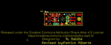
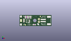
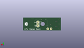
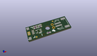

Contents
========

* [PROJ-SPAR-10217-STAN-01>Lipo Charger Basic-microUSB](#proj-spar-10217-stan-01lipo-charger-basic-microusb)
	* [Images](#images)
	* [Interactive BOM](#interactive-bom)
	* [OOMP Parts](#oomp-parts)
	* [Tags](#tags)
  
![][im]
# PROJ-SPAR-10217-STAN-01>Lipo Charger Basic-microUSB

- ID: PROJ-SPAR-10217-STAN-01
- Hex ID: PRS10217
- Name: Lipo Charger Basic-microUSB
- Description: 

## Images
  
  

|eagleImage|kicadPcb3dFront|kicadPcb3dBack|kicadPcb3d|
| :---: | :---: | :---: | :---: |
|||||

## Interactive BOM

- Interactive BOM page: [ibom.html](kicad/bom/ibom.html)

## OOMP Parts
  

|OOMP Parts|
| :---: |
|CAPC-0603-X-UNMATCHED-01, C3, 6.29158127, 7.508240508, 0,C3, 4.7uF, 0603-CAP, SparkFun-Capacitors, (0.24770005, 0.29560002), R0|
|CAPC-0603-X-UNMATCHED-01, C4, 9.375140508, 7.505703047999999, 180,C4, 4.7uF, 0603-CAP, SparkFun-Capacitors, (0.36910002, 0.29550012), R180|
|UNMATCHED-0603-X-UNMATCHED-01, D11, 9.466581269999999, 8.889999999999999, 270,D11, RED, LED-0603, SparkFun-LED, (0.37270005, 0.35), R270|
|UNMATCHED-UNMATCHED-X-UNMATCHED-01, JP1, 25.4, 5.08, 270,JP1, JST, JST-2-SMD, SparkFun-Connectors, (1, 0.2), R270|
|HEAD-I01-X-PI2-01, JP3, 5.3213, 1.0541, 0,JP3, FIDUCIAL1X2, FIDUCIAL-1X2, SparkFun, (0.2095, 0.0415), R0|
|HEAD-I01-X-PI2-01, JP4, 19.049999999999997, 8.889999999999999, 0,JP4, FIDUCIAL1X2, FIDUCIAL-1X2, SparkFun, (0.75, 0.35), R0|
|<table><tr><td></td><td> JP8</td><td>[HEAD-I01-X-PI02-01 2.54 mm 2 Pin Header](https://github.com/oomlout/oomlout_OOMP_parts/tree/main/HEAD-I01-X-PI02-01/)</td><td>[H02](https://github.com/oomlout/oomlout_OOMP_parts/tree/main/HEAD-I01-X-PI02-01/)</td></tr></table>|
|ERROR, JP9 Micro USB, 0, 0, 0,JP9, Micro, USB, USB-AB-MICRO-SMD_V03, SparkFun-Connectors, (0.05280007, 0.2), R0|
|RESE-UNMATCHED-X-UNMATCHED-01, R1, 7.619999999999999, 1.27, 0,R1, AXIAL-0.1EZ, SparkFun-Resistors, (0.3, 0.05), R0|
|<table><tr><td></td><td> R3</td><td>[RESE-0603-X-O331-01 SMD (0603) 330 Ohm Resistor](https://github.com/oomlout/oomlout_OOMP_parts/tree/main/RESE-0603-X-O331-01/)</td><td>[R6331](https://github.com/oomlout/oomlout_OOMP_parts/tree/main/RESE-0603-X-O331-01/)</td></tr></table>|
|RESE-0603-X-UNMATCHED-01, R4, 13.454384318, 1.257303048, 0,R4, 2.0k, 0603-RES, SparkFun-Resistors, (0.52970017, 0.04950012), R0|
|UNMATCHED-UNMATCHED-X-UNMATCHED-01, U1, 7.713984318, 4.5973999999999995, 90,U1, MCP73831, SOT23-5, SparkFun-PowerIC, (0.30370017, 0.181), R90|

## Tags

- hexID: PRS10217
- oompType: PROJ
- oompSize: SPAR
- oompColor: 10217
- oompDesc: STAN
- oompIndex: 01
- oompName: Lipo Charger Basic-microUSB
- sources: All source files from https://github.com/sparkfun/Lipo_Charger_Basic-microUSB (source licence details in srcLicense.md)
- linkBuyPage: https://www.sparkfun.com/products/10217
- oompID: PROJ-SPAR-10217-STAN-01
- oompPart: CAPC-0603-X-UNMATCHED-01, C3, 6.29158127, 7.508240508, 0
- oompPart: CAPC-0603-X-UNMATCHED-01, C4, 9.375140508, 7.505703047999999, 180
- oompPart: UNMATCHED-0603-X-UNMATCHED-01, D11, 9.466581269999999, 8.889999999999999, 270
- oompPart: UNMATCHED-UNMATCHED-X-UNMATCHED-01, JP1, 25.4, 5.08, 270
- oompPart: HEAD-I01-X-PI2-01, JP3, 5.3213, 1.0541, 0
- oompPart: HEAD-I01-X-PI2-01, JP4, 19.049999999999997, 8.889999999999999, 0
- oompPart: HEAD-I01-X-PI02-01, JP8, 17.779999999999998, 6.35, M270
- oompPart: ERROR, JP9 Micro USB, 0, 0, 0
- oompPart: RESE-UNMATCHED-X-UNMATCHED-01, R1, 7.619999999999999, 1.27, 0
- oompPart: RESE-0603-X-O331-01, R3, 6.294121778, 8.9027, 180
- oompPart: RESE-0603-X-UNMATCHED-01, R4, 13.454384318, 1.257303048, 0
- oompPart: UNMATCHED-UNMATCHED-X-UNMATCHED-01, U1, 7.713984318, 4.5973999999999995, 90
- rawPart: C3, 4.7uF, 0603-CAP, SparkFun-Capacitors, (0.24770005, 0.29560002), R0
- rawPart: C4, 4.7uF, 0603-CAP, SparkFun-Capacitors, (0.36910002, 0.29550012), R180
- rawPart: D11, RED, LED-0603, SparkFun-LED, (0.37270005, 0.35), R270
- rawPart: JP1, JST, JST-2-SMD, SparkFun-Connectors, (1, 0.2), R270
- rawPart: JP3, FIDUCIAL1X2, FIDUCIAL-1X2, SparkFun, (0.2095, 0.0415), R0
- rawPart: JP4, FIDUCIAL1X2, FIDUCIAL-1X2, SparkFun, (0.75, 0.35), R0
- rawPart: JP8, M02PTH, 1X02, SparkFun-Connectors, (0.7, 0.25), MR270
- rawPart: JP9, Micro, USB, USB-AB-MICRO-SMD_V03, SparkFun-Connectors, (0.05280007, 0.2), R0
- rawPart: R1, AXIAL-0.1EZ, SparkFun-Resistors, (0.3, 0.05), R0
- rawPart: R3, 330, 0603-RES, SparkFun-Resistors, (0.24780007, 0.3505), R180
- rawPart: R4, 2.0k, 0603-RES, SparkFun-Resistors, (0.52970017, 0.04950012), R0
- rawPart: U1, MCP73831, SOT23-5, SparkFun-PowerIC, (0.30370017, 0.181), R90

[im]: kicadPcb3d_450.png
