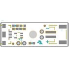
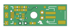
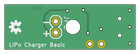

Contents
========

* [PRS10217 > Lipo Charger Basic-microUSB](#prs10217--lipo-charger-basic-microusb)
	* [Schematic](#schematic)
	* [PCB](#pcb)
	* [Interactive BOM](#interactive-bom)
	* [OOMP Parts](#oomp-parts)
	* [Images](#images)
	* [Tags](#tags)
  
![][im]
# PRS10217 > Lipo Charger Basic-microUSB

- ID: PROJ-SPAR-10217-STAN-01
- Hex ID: PRS10217
- Name: Sparkfun
- Description: Sparkfun
- Long Link: [http://oom.lt/PROJ-SPAR-10217-STAN-01](http://oom.lt/PROJ-SPAR-10217-STAN-01)
- Short Link: [http://oom.lt/PRS10217](http://oom.lt/PRS10217)

## Schematic
  

## PCB
  

## Interactive BOM

- Interactive BOM page: [ibom.html](https://htmlpreview.github.io/?https://github.com/oomlout/oomlout_OOMP_projects/blob/main/PROJ-SPAR-10217-STAN-01/kicad/bom/ibom.html)

## OOMP Parts
  

|OOMP Parts|
| :---: |
|[CAPC-0603-X-UF47D-V10  SMD (0603) 4.7 uF Capacitor (Ceramic) 10v  C3, C4](https://github.com/oomlout/oomlout_OOMP_parts/tree/main/CAPC-0603-X-UF47D-V10/)|
|[LEDS-0603-R-STAN-01  SMD (0603) Red LED  D11](https://github.com/oomlout/oomlout_OOMP_parts/tree/main/LEDS-0603-R-STAN-01/)|
|UNMATCHED-UNMATCHED-X-UNMATCHED-01 JP1, JP9|
|[HEAD-I01-X-PI02-01  2.54 mm 2 Pin Header  JP8](https://github.com/oomlout/oomlout_OOMP_parts/tree/main/HEAD-I01-X-PI02-01/)|
|RESE-UNMATCHED-X-UNMATCHED-01 R1|
|[RESE-0603-X-O331-01  SMD (0603) 330 Ohm Resistor  R3](https://github.com/oomlout/oomlout_OOMP_parts/tree/main/RESE-0603-X-O331-01/)|
|RESE-0603-X-UNMATCHED-01 R4|
|UNMATCHED-SO235-X-UNMATCHED-01 U1|

## Images
  
  

|bominteractivefront|bominteractiveback|kicadPcb3d|kicadPcb3dFront|kicadPcb3dBack|eagleImage|eagleSchemImage|pcbdraw|pcbdrawback|
| :---: | :---: | :---: | :---: | :---: | :---: | :---: | :---: | :---: |
||||||||||

## Tags

- hexID: PRS10217
- oompType: PROJ
- oompSize: SPAR
- oompColor: 10217
- oompDesc: STAN
- oompIndex: 01
- oompName: Lipo Charger Basic-microUSB
- sources: All source files from https://github.com/sparkfun/Lipo_Charger_Basic-microUSB (source licence details in srcLicense.md)
- linkBuyPage: https://www.sparkfun.com/products/10217
- oompID: PROJ-SPAR-10217-STAN-01
- oompParts: C3,CAPC-0603-X-UF47D-V10
- oompParts: C4,CAPC-0603-X-UF47D-V10
- oompParts: D11,LEDS-0603-R-STAN-01
- oompParts: JP1,UNMATCHED-UNMATCHED-X-UNMATCHED-01
- oompParts: JP8,HEAD-I01-X-PI02-01
- oompParts: JP9,UNMATCHED-UNMATCHED-X-UNMATCHED-01
- oompParts: R1,RESE-UNMATCHED-X-UNMATCHED-01
- oompParts: R3,RESE-0603-X-O331-01
- oompParts: R4,RESE-0603-X-UNMATCHED-01
- oompParts: U1,UNMATCHED-SO235-X-UNMATCHED-01
- rawParts: C3,4.7uF,4.7UF-6.3V-10%(0603)0603,0603-CAP,CAP-08280,CAP-08280,4.7uF,
- rawParts: C4,4.7uF,4.7UF-6.3V-10%(0603)0603,0603-CAP,CAP-08280,CAP-08280,4.7uF,
- rawParts: D11,RED,LED-RED0603,LED-0603,Assorted Red LEDs,DIO-00819,RED,
- rawParts: FRAME1,FRAME-LETTER,FRAME-LETTER,CREATIVE_COMMONS,Schematic Frame,,,
- rawParts: JP1,JST,JST_2MM_MALE,JST-2-SMD,Mates to single-cell LiPo batteries.,CONN-08352,,
- rawParts: JP2,STAND-OFF,STAND-OFF,STAND-OFF,Stand Off,,,
- rawParts: JP3,FIDUCIAL1X2,FIDUCIAL1X2,FIDUCIAL-1X2,Fiducial Alignment Points,,,
- rawParts: JP4,FIDUCIAL1X2,FIDUCIAL1X2,FIDUCIAL-1X2,Fiducial Alignment Points,,,
- rawParts: JP8,M02PTH,M02PTH,1X02,Standard 2-pin 0.1 header. Use with,,,
- rawParts: JP9,Micro USB,USB-ABCONN-11794,USB-AB-MICRO-SMD_V03,This is a USB AB connector that is compatible with USB OTG. i.e. this connector can serve as a host or device,CONN-11794,,
- rawParts: LOGO1,OSHW-LOGOS,OSHW-LOGOS,OSHW-LOGO-S,Open Source Hardware Logo This logo indicates the piece of hardware it is found on incorporates a OSHW license and/or adheres to the definition of open source hardware found here: http://freedomdefined.org/OSHW,,,
- rawParts: LOGO2,SFE_LOGO_FLAME.1_INCH,SFE_LOGO_FLAME.1_INCH,SFE_LOGO_FLAME_.1,SFE Logo, flame only,,,
- rawParts: R1,,RESISTORPTH-1/4W-VERT-KIT,AXIAL-0.1EZ,Resistor,,,
- rawParts: R3,330,330OHM1/10W1%(0603),0603-RES,RES-00818,RES-00818,330,
- rawParts: R4,2.0k,2.0KOHM1/10W5%(0603),0603-RES,RES-08296,RES-08296,2.0k,
- rawParts: U1,MCP73831,MCP73831,SOT23-5,Miniature single cell, fully integrated Li-Ion, Li-polymer charge management controller,IC-09995,,

[im]: kicadPcb3d_450.png
