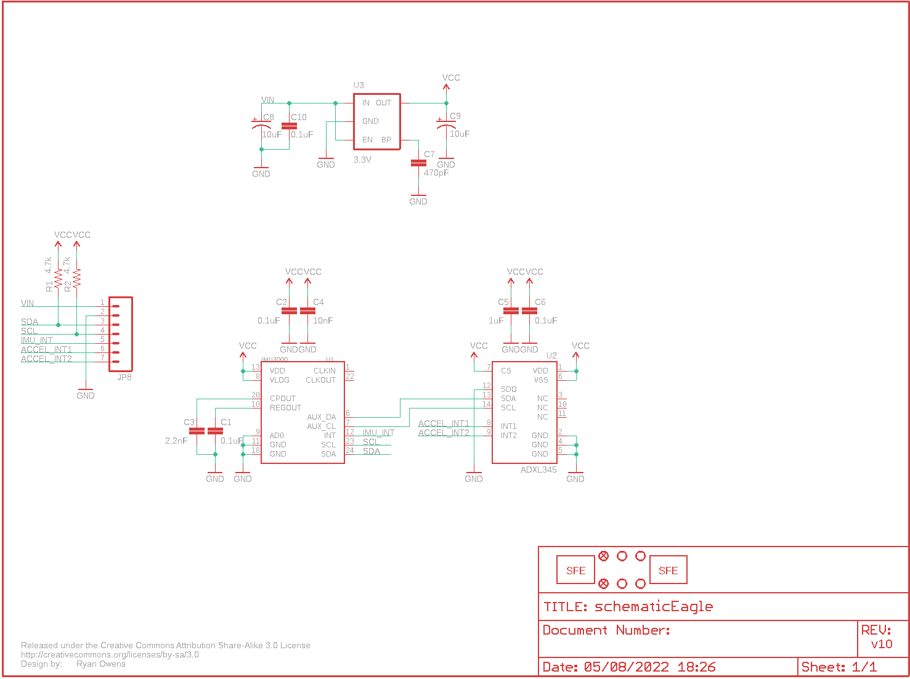
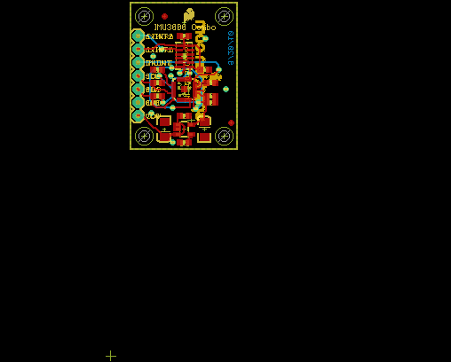

Contents
========

* [PRS10252 > IMU Fusion Board](#prs10252--imu-fusion-board)
	* [Schematic](#schematic)
	* [PCB](#pcb)
	* [Interactive BOM](#interactive-bom)
	* [OOMP Parts](#oomp-parts)
	* [Images](#images)
	* [Tags](#tags)
  
![][im]
# PRS10252 > IMU Fusion Board

- ID: PROJ-SPAR-10252-STAN-01
- Hex ID: PRS10252
- Name: Sparkfun
- Description: Sparkfun
- Long Link: [http://oom.lt/PROJ-SPAR-10252-STAN-01](http://oom.lt/PROJ-SPAR-10252-STAN-01)
- Short Link: [http://oom.lt/PRS10252](http://oom.lt/PRS10252)

## Schematic
  

## PCB
  

## Interactive BOM

- Interactive BOM page: [ibom.html](https://htmlpreview.github.io/?https://github.com/oomlout/oomlout_OOMP_projects/blob/main/PROJ-SPAR-10252-STAN-01/kicad/bom/ibom.html)

## OOMP Parts
  

|OOMP Parts|
| :---: |
|C1 C1,CAPC-0603-X-UF1D-01|
|C2 C2,CAPC-0603-X-UF1D-01|
|C3 C3,CAPC-0603-X-PF22D-01|
|C4 C4,CAPC-0603-X-NF10-01|
|C5 C5,CAPC-0603-X-UF1-01|
|C6 C6,CAPC-0603-X-UF1D-01|
|C7 C7,CAPC-0603-X-PF470-01|
|C8 C8,CAPX-UNMATCHED-X-UF10-01|
|C9 C9,CAPX-UNMATCHED-X-UF10-01|
|C10 C10,CAPC-0603-X-UF1D-01|
|[JP8 HEAD-I01-X-PI07-01 2.54 mm 7 Pin Header](https://github.com/oomlout/oomlout_OOMP_parts/tree/main/HEAD-I01-X-PI07-01/)|
|[R1 RESE-0603-X-O472-01 SMD (0603) 4.7k Ohm Resistor](https://github.com/oomlout/oomlout_OOMP_parts/tree/main/RESE-0603-X-O472-01/)|
|[R2 RESE-0603-X-O472-01 SMD (0603) 4.7k Ohm Resistor](https://github.com/oomlout/oomlout_OOMP_parts/tree/main/RESE-0603-X-O472-01/)|
|U1 U1,UNMATCHED-UNMATCHED-X-UNMATCHED-01|
|U2 U2,UNMATCHED-UNMATCHED-X-UNMATCHED-01|
|U3 U3,UNMATCHED-SO235-X-UNMATCHED-01|

## Images
  
  

|kicadPcb3d|kicadPcb3dFront|kicadPcb3dBack|eagleImage|eagleSchemImage|
| :---: | :---: | :---: | :---: | :---: |
||||||

## Tags

- hexID: PRS10252
- oompType: PROJ
- oompSize: SPAR
- oompColor: 10252
- oompDesc: STAN
- oompIndex: 01
- oompName: IMU Fusion Board
- sources: All source files from https://github.com/sparkfun/IMU_Fusion_Board (source licence details in srcLicense.md)
- linkBuyPage: https://www.sparkfun.com/products/10252
- oompID: PROJ-SPAR-10252-STAN-01
- oompParts: C1,CAPC-0603-X-UF1D-01
- oompParts: C2,CAPC-0603-X-UF1D-01
- oompParts: C3,CAPC-0603-X-PF22D-01
- oompParts: C4,CAPC-0603-X-NF10-01
- oompParts: C5,CAPC-0603-X-UF1-01
- oompParts: C6,CAPC-0603-X-UF1D-01
- oompParts: C7,CAPC-0603-X-PF470-01
- oompParts: C8,CAPX-UNMATCHED-X-UF10-01
- oompParts: C9,CAPX-UNMATCHED-X-UF10-01
- oompParts: C10,CAPC-0603-X-UF1D-01
- oompParts: JP8,HEAD-I01-X-PI07-01
- oompParts: R1,RESE-0603-X-O472-01
- oompParts: R2,RESE-0603-X-O472-01
- oompParts: U1,UNMATCHED-UNMATCHED-X-UNMATCHED-01
- oompParts: U2,UNMATCHED-UNMATCHED-X-UNMATCHED-01
- oompParts: U3,UNMATCHED-SO235-X-UNMATCHED-01
- rawParts: C1,0.1uF,CAP0603-CAP,0603-CAP,Capacitor,,
- rawParts: C2,0.1uF,CAP0603-CAP,0603-CAP,Capacitor,,
- rawParts: C3,2.2nF,CAP0603-CAP,0603-CAP,Capacitor,,
- rawParts: C4,10nF,CAP0603-CAP,0603-CAP,Capacitor,,
- rawParts: C5,1uF,CAP0603-CAP,0603-CAP,Capacitor,,
- rawParts: C6,0.1uF,CAP0603-CAP,0603-CAP,Capacitor,,
- rawParts: C7,470pF,CAP0603-CAP,0603-CAP,Capacitor,,
- rawParts: C8,10uF,CAP_POL1206,EIA3216,Capacitor Polarized,,
- rawParts: C9,10uF,CAP_POL1206,EIA3216,Capacitor Polarized,,
- rawParts: C10,0.1uF,CAP0603-CAP,0603-CAP,Capacitor,,
- rawParts: JP1,LOGO-SFENEW,LOGO-SFENEW,SFE-NEW-WEBLOGO,Spark Fun Electronics PCB Logo,,
- rawParts: JP2,FIDUCIAL1X2,FIDUCIAL1X2,FIDUCIAL-1X2,Fiducial Alignment Points,,
- rawParts: JP3,FIDUCIAL1X2,FIDUCIAL1X2,FIDUCIAL-1X2,Fiducial Alignment Points,,
- rawParts: JP4,STAND-OFF,STAND-OFF,STAND-OFF,Stand Off,,
- rawParts: JP5,STAND-OFF,STAND-OFF,STAND-OFF,Stand Off,,
- rawParts: JP6,STAND-OFF,STAND-OFF,STAND-OFF,Stand Off,,
- rawParts: JP7,STAND-OFF,STAND-OFF,STAND-OFF,Stand Off,,
- rawParts: JP8,,M07,1X07,Header 7,,
- rawParts: JP9,LOGO-SFESK,LOGO-SFESK,SFE-LOGO-FLAME,Spark Fun Electronics PCB Logo,,
- rawParts: R1,4.7k,RESISTOR0603-RES,0603-RES,Resistor,,
- rawParts: R2,4.7k,RESISTOR0603-RES,0603-RES,Resistor,,
- rawParts: U$1,CREATIVE_COMMONS,CREATIVE_COMMONS,CREATIVE_COMMONS,,,
- rawParts: U1,IMU3000,IMU3000,QFN-24,,,
- rawParts: U2,ADXL345,ADXL345,LGA14,,,
- rawParts: U3,3.3V,V_REG_LDOSMD,SOT23-5,Voltage Regulator LDO,,

[im]: kicadPcb3d_450.png
