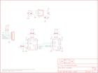

Contents
========

* [PRS10252 > Sparkfun](#prs10252--sparkfun)
	* [Schematic](#schematic)
	* [Interactive BOM](#interactive-bom)
	* [OOMP Parts](#oomp-parts)
	* [Images](#images)
	* [Tags](#tags)
  
![][im]
# PRS10252 > Sparkfun

- ID: PROJ-SPAR-10252-STAN-01
- Hex ID: PRS10252
- Name: Sparkfun
- Description: Sparkfun
- Long Link: [http://oom.lt/PROJ-SPAR-10252-STAN-01](http://oom.lt/PROJ-SPAR-10252-STAN-01)
- Long Link: [http://oom.lt/PRS10252](http://oom.lt/PRS10252)

## Schematic
  
![][schem]
## Interactive BOM

- Interactive BOM page: [ibom.html](https://htmlpreview.github.io/?https://github.com/oomlout/oomlout_OOMP_projects/blob/main/PROJ-SPAR-10252-STAN-01/kicad/bom/ibom.html)

## OOMP Parts
  

|OOMP Parts|
| :---: |
|C1,UNMATCHED-UNMATCHED-UNMATCHED-UNMATCHED-UNMATCHED,C1,0.1uF,CAP0603-CAP,0603-CAP,Capacitor,,|
|C2,UNMATCHED-UNMATCHED-UNMATCHED-UNMATCHED-UNMATCHED,C2,0.1uF,CAP0603-CAP,0603-CAP,Capacitor,,|
|C3,UNMATCHED-UNMATCHED-UNMATCHED-UNMATCHED-UNMATCHED,C3,2.2nF,CAP0603-CAP,0603-CAP,Capacitor,,|
|C4,UNMATCHED-UNMATCHED-UNMATCHED-UNMATCHED-UNMATCHED,C4,10nF,CAP0603-CAP,0603-CAP,Capacitor,,|
|C5,UNMATCHED-UNMATCHED-UNMATCHED-UNMATCHED-UNMATCHED,C5,1uF,CAP0603-CAP,0603-CAP,Capacitor,,|
|C6,UNMATCHED-UNMATCHED-UNMATCHED-UNMATCHED-UNMATCHED,C6,0.1uF,CAP0603-CAP,0603-CAP,Capacitor,,|
|C7,UNMATCHED-UNMATCHED-UNMATCHED-UNMATCHED-UNMATCHED,C7,470pF,CAP0603-CAP,0603-CAP,Capacitor,,|
|C8,UNMATCHED-UNMATCHED-UNMATCHED-UNMATCHED-UNMATCHED,C8,10uF,CAP_POL1206,EIA3216,Capacitor Polarized,,|
|C9,UNMATCHED-UNMATCHED-UNMATCHED-UNMATCHED-UNMATCHED,C9,10uF,CAP_POL1206,EIA3216,Capacitor Polarized,,|
|C10,UNMATCHED-UNMATCHED-UNMATCHED-UNMATCHED-UNMATCHED,C10,0.1uF,CAP0603-CAP,0603-CAP,Capacitor,,|
|JP1,UNMATCHED-UNMATCHED-UNMATCHED-UNMATCHED-UNMATCHED,JP1,LOGO-SFENEW,LOGO-SFENEW,SFE-NEW-WEBLOGO,Spark Fun Electronics PCB Logo,,|
|JP4,UNMATCHED-UNMATCHED-UNMATCHED-UNMATCHED-UNMATCHED,JP2,FIDUCIAL1X2,FIDUCIAL1X2,FIDUCIAL-1X2,Fiducial Alignment Points,,|
|JP5,UNMATCHED-UNMATCHED-UNMATCHED-UNMATCHED-UNMATCHED,JP3,FIDUCIAL1X2,FIDUCIAL1X2,FIDUCIAL-1X2,Fiducial Alignment Points,,|
|JP6,UNMATCHED-UNMATCHED-UNMATCHED-UNMATCHED-UNMATCHED,JP4,STAND-OFF,STAND-OFF,STAND-OFF,Stand Off,,|
|JP7,UNMATCHED-UNMATCHED-UNMATCHED-UNMATCHED-UNMATCHED,JP5,STAND-OFF,STAND-OFF,STAND-OFF,Stand Off,,|
|JP8,UNMATCHED-UNMATCHED-UNMATCHED-UNMATCHED-UNMATCHED,JP6,STAND-OFF,STAND-OFF,STAND-OFF,Stand Off,,|
|JP9,UNMATCHED-UNMATCHED-UNMATCHED-UNMATCHED-UNMATCHED,JP7,STAND-OFF,STAND-OFF,STAND-OFF,Stand Off,,|
|R1,UNMATCHED-UNMATCHED-UNMATCHED-UNMATCHED-UNMATCHED,JP8,,M07,1X07,Header 7,,|
|R2,UNMATCHED-UNMATCHED-UNMATCHED-UNMATCHED-UNMATCHED,JP9,LOGO-SFESK,LOGO-SFESK,SFE-LOGO-FLAME,Spark Fun Electronics PCB Logo,,|
|U$1,UNMATCHED-UNMATCHED-UNMATCHED-UNMATCHED-UNMATCHED,R1,4.7k,RESISTOR0603-RES,0603-RES,Resistor,,|
|U1,UNMATCHED-UNMATCHED-UNMATCHED-UNMATCHED-UNMATCHED,R2,4.7k,RESISTOR0603-RES,0603-RES,Resistor,,|
|U2,UNMATCHED-UNMATCHED-UNMATCHED-UNMATCHED-UNMATCHED,U$1,CREATIVE_COMMONS,CREATIVE_COMMONS,CREATIVE_COMMONS,,,|
|U3,UNMATCHED-UNMATCHED-UNMATCHED-UNMATCHED-UNMATCHED,U1,IMU3000,IMU3000,QFN-24,,,|

## Images
  
  

|kicadPcb3d|kicadPcb3dFront|kicadPcb3dBack|eagleImage|eagleSchemImage|
| :---: | :---: | :---: | :---: | :---: |
||||||

## Tags

- hexID: PRS10252
- oompType: PROJ
- oompSize: SPAR
- oompColor: 10252
- oompDesc: STAN
- oompIndex: 01
- oompName: IMU Fusion Board
- sources: All source files from https://github.com/sparkfun/IMU_Fusion_Board (source licence details in srcLicense.md)
- linkBuyPage: https://www.sparkfun.com/products/10252
- oompID: PROJ-SPAR-10252-STAN-01
- oompParts: C1,UNMATCHED-UNMATCHED-UNMATCHED-UNMATCHED-UNMATCHED
- oompParts: C2,UNMATCHED-UNMATCHED-UNMATCHED-UNMATCHED-UNMATCHED
- oompParts: C3,UNMATCHED-UNMATCHED-UNMATCHED-UNMATCHED-UNMATCHED
- oompParts: C4,UNMATCHED-UNMATCHED-UNMATCHED-UNMATCHED-UNMATCHED
- oompParts: C5,UNMATCHED-UNMATCHED-UNMATCHED-UNMATCHED-UNMATCHED
- oompParts: C6,UNMATCHED-UNMATCHED-UNMATCHED-UNMATCHED-UNMATCHED
- oompParts: C7,UNMATCHED-UNMATCHED-UNMATCHED-UNMATCHED-UNMATCHED
- oompParts: C8,UNMATCHED-UNMATCHED-UNMATCHED-UNMATCHED-UNMATCHED
- oompParts: C9,UNMATCHED-UNMATCHED-UNMATCHED-UNMATCHED-UNMATCHED
- oompParts: C10,UNMATCHED-UNMATCHED-UNMATCHED-UNMATCHED-UNMATCHED
- oompParts: JP1,UNMATCHED-UNMATCHED-UNMATCHED-UNMATCHED-UNMATCHED
- oompParts: JP4,UNMATCHED-UNMATCHED-UNMATCHED-UNMATCHED-UNMATCHED
- oompParts: JP5,UNMATCHED-UNMATCHED-UNMATCHED-UNMATCHED-UNMATCHED
- oompParts: JP6,UNMATCHED-UNMATCHED-UNMATCHED-UNMATCHED-UNMATCHED
- oompParts: JP7,UNMATCHED-UNMATCHED-UNMATCHED-UNMATCHED-UNMATCHED
- oompParts: JP8,UNMATCHED-UNMATCHED-UNMATCHED-UNMATCHED-UNMATCHED
- oompParts: JP9,UNMATCHED-UNMATCHED-UNMATCHED-UNMATCHED-UNMATCHED
- oompParts: R1,UNMATCHED-UNMATCHED-UNMATCHED-UNMATCHED-UNMATCHED
- oompParts: R2,UNMATCHED-UNMATCHED-UNMATCHED-UNMATCHED-UNMATCHED
- oompParts: U$1,UNMATCHED-UNMATCHED-UNMATCHED-UNMATCHED-UNMATCHED
- oompParts: U1,UNMATCHED-UNMATCHED-UNMATCHED-UNMATCHED-UNMATCHED
- oompParts: U2,UNMATCHED-UNMATCHED-UNMATCHED-UNMATCHED-UNMATCHED
- oompParts: U3,UNMATCHED-UNMATCHED-UNMATCHED-UNMATCHED-UNMATCHED
- rawParts: C1,0.1uF,CAP0603-CAP,0603-CAP,Capacitor,,
- rawParts: C2,0.1uF,CAP0603-CAP,0603-CAP,Capacitor,,
- rawParts: C3,2.2nF,CAP0603-CAP,0603-CAP,Capacitor,,
- rawParts: C4,10nF,CAP0603-CAP,0603-CAP,Capacitor,,
- rawParts: C5,1uF,CAP0603-CAP,0603-CAP,Capacitor,,
- rawParts: C6,0.1uF,CAP0603-CAP,0603-CAP,Capacitor,,
- rawParts: C7,470pF,CAP0603-CAP,0603-CAP,Capacitor,,
- rawParts: C8,10uF,CAP_POL1206,EIA3216,Capacitor Polarized,,
- rawParts: C9,10uF,CAP_POL1206,EIA3216,Capacitor Polarized,,
- rawParts: C10,0.1uF,CAP0603-CAP,0603-CAP,Capacitor,,
- rawParts: JP1,LOGO-SFENEW,LOGO-SFENEW,SFE-NEW-WEBLOGO,Spark Fun Electronics PCB Logo,,
- rawParts: JP2,FIDUCIAL1X2,FIDUCIAL1X2,FIDUCIAL-1X2,Fiducial Alignment Points,,
- rawParts: JP3,FIDUCIAL1X2,FIDUCIAL1X2,FIDUCIAL-1X2,Fiducial Alignment Points,,
- rawParts: JP4,STAND-OFF,STAND-OFF,STAND-OFF,Stand Off,,
- rawParts: JP5,STAND-OFF,STAND-OFF,STAND-OFF,Stand Off,,
- rawParts: JP6,STAND-OFF,STAND-OFF,STAND-OFF,Stand Off,,
- rawParts: JP7,STAND-OFF,STAND-OFF,STAND-OFF,Stand Off,,
- rawParts: JP8,,M07,1X07,Header 7,,
- rawParts: JP9,LOGO-SFESK,LOGO-SFESK,SFE-LOGO-FLAME,Spark Fun Electronics PCB Logo,,
- rawParts: R1,4.7k,RESISTOR0603-RES,0603-RES,Resistor,,
- rawParts: R2,4.7k,RESISTOR0603-RES,0603-RES,Resistor,,
- rawParts: U$1,CREATIVE_COMMONS,CREATIVE_COMMONS,CREATIVE_COMMONS,,,
- rawParts: U1,IMU3000,IMU3000,QFN-24,,,
- rawParts: U2,ADXL345,ADXL345,LGA14,,,
- rawParts: U3,3.3V,V_REG_LDOSMD,SOT23-5,Voltage Regulator LDO,,

[im]: kicadPcb3d_450.png
[schem]: eagleSchemImage.png
