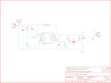

Contents
========

* [PRS10255 > LiPower Boost Converter](#prs10255--lipower-boost-converter)
	* [Schematic](#schematic)
	* [PCB](#pcb)
	* [Interactive BOM](#interactive-bom)
	* [OOMP Parts](#oomp-parts)
	* [Images](#images)
	* [Tags](#tags)
  
![][im]
# PRS10255 > LiPower Boost Converter

- ID: PROJ-SPAR-10255-STAN-01
- Hex ID: PRS10255
- Name: Sparkfun
- Description: Sparkfun
- Long Link: [http://oom.lt/PROJ-SPAR-10255-STAN-01](http://oom.lt/PROJ-SPAR-10255-STAN-01)
- Short Link: [http://oom.lt/PRS10255](http://oom.lt/PRS10255)

## Schematic
  

## PCB
  

## Interactive BOM

- Interactive BOM page: [ibom.html](https://htmlpreview.github.io/?https://github.com/oomlout/oomlout_OOMP_projects/blob/main/PROJ-SPAR-10255-STAN-01/kicad/bom/ibom.html)

## OOMP Parts
  

|OOMP Parts|
| :---: |
|[CAPC-1206-X-UF10-V25  SMD (1206) 10 uF Capacitor (Ceramic) 25v  C1](https://github.com/oomlout/oomlout_OOMP_parts/tree/main/CAPC-1206-X-UF10-V25/)|
|[CAPC-0603-X-NF100-V50  SMD (0603) 100 nF Capacitor (Ceramic) 50v  C2, C4](https://github.com/oomlout/oomlout_OOMP_parts/tree/main/CAPC-0603-X-NF100-V50/)|
|[CAPC-0805-X-UF22-V63D  SMD (0805) 22 uF Capacitor (Ceramic) 6.3v  C3](https://github.com/oomlout/oomlout_OOMP_parts/tree/main/CAPC-0805-X-UF22-V63D/)|
|[HEAD-I01-X-PI02-01  2.54 mm 2 Pin Header  JP1, JP7](https://github.com/oomlout/oomlout_OOMP_parts/tree/main/HEAD-I01-X-PI02-01/)|
|HEAD-I01-X-UNMATCHED-01 JP3|
|UNMATCHED-UNMATCHED-X-UNMATCHED-01 L1, U1|
|RESE-0603-X-O205-01 R3, R7|
|RESE-0603-X-O2203-01 R4, R6|
|RESE-0603-X-UNMATCHED-01 R5|

## Images
  
  

|bominteractivefront|bominteractiveback|kicadPcb3d|kicadPcb3dFront|kicadPcb3dBack|eagleImage|eagleSchemImage|pcbdraw|pcbdrawback|
| :---: | :---: | :---: | :---: | :---: | :---: | :---: | :---: | :---: |
||||||||||

## Tags

- hexID: PRS10255
- oompType: PROJ
- oompSize: SPAR
- oompColor: 10255
- oompDesc: STAN
- oompIndex: 01
- oompName: LiPower Boost Converter
- sources: All source files from https://github.com/sparkfun/LiPower_Boost_Converter (source licence details in srcLicense.md)
- linkBuyPage: https://www.sparkfun.com/products/10255
- oompID: PROJ-SPAR-10255-STAN-01
- oompParts: C1,CAPC-1206-X-UF10-V25
- oompParts: C2,CAPC-0603-X-NF100-V50
- oompParts: C3,CAPC-0805-X-UF22-V63D
- oompParts: C4,CAPC-0603-X-NF100-V50
- oompParts: JP1,HEAD-I01-X-PI02-01
- oompParts: JP3,HEAD-I01-X-UNMATCHED-01
- oompParts: JP7,HEAD-I01-X-PI02-01
- oompParts: L1,UNMATCHED-UNMATCHED-X-UNMATCHED-01
- oompParts: R3,RESE-0603-X-O205-01
- oompParts: R4,RESE-0603-X-O2203-01
- oompParts: R5,RESE-0603-X-UNMATCHED-01
- oompParts: R6,RESE-0603-X-O2203-01
- oompParts: R7,RESE-0603-X-O205-01
- oompParts: U1,UNMATCHED-UNMATCHED-X-UNMATCHED-01
- rawParts: C1,10uF,CAP1206,1206,Capacitor,,
- rawParts: C2,0.1uF,CAP0603-CAP,0603-CAP,Capacitor,,
- rawParts: C3,22uF,CAP0805,0805,Capacitor,,
- rawParts: C4,0.1uF,CAP0603-CAP,0603-CAP,Capacitor,,
- rawParts: FRAME1,FRAME-LETTER,FRAME-LETTER,CREATIVE_COMMONS,Schematic Frame,,
- rawParts: JP1,VOUT,M02PTH,1X02,Header 2,,
- rawParts: JP2,LOGO-SFESK,LOGO-SFESK,SFE-LOGO-FLAME,Spark Fun Electronics PCB Logo,,
- rawParts: JP3,JST,M02-JST-2MM-SMT,JST-2-SMD,Header 2,,
- rawParts: JP4,FIDUCIAL1X2,FIDUCIAL1X2,FIDUCIAL-1X2,Fiducial Alignment Points,,
- rawParts: JP5,FIDUCIAL1X2,FIDUCIAL1X2,FIDUCIAL-1X2,Fiducial Alignment Points,,
- rawParts: JP6,LOGO-SFENEW,LOGO-SFENEW,SFE-NEW-WEBLOGO,Spark Fun Electronics PCB Logo,,
- rawParts: JP7,VIN,M02PTH,1X02,Header 2,,
- rawParts: L1,4.7uH, 1.2A,INDUCTOR.,CDRH2D09,Inductors,,
- rawParts: R3,2M,RESISTOR0603-RES,0603-RES,Resistor,,
- rawParts: R4,220k,RESISTOR0603-RES,0603-RES,Resistor,,
- rawParts: R5,1.2M,RESISTOR0603-RES,0603-RES,Resistor,,
- rawParts: R6,220k,RESISTOR0603-RES,0603-RES,Resistor,,
- rawParts: R7,2M,RESISTOR0603-RES,0603-RES,Resistor,,
- rawParts: SJ1,,SOLDERJUMPER_2WAYPASTE2&3,SJ_3_PASTE2&3,Solder Jumper,,
- rawParts: U1,TPS61200,TPS61200,QFN-10_PAD,DC to DC Booster,,

[im]: kicadPcb3d_450.png
