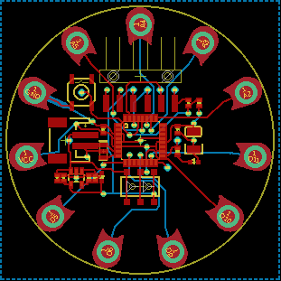

Contents
========

* [PRS10274 > LilyPad Arduino Simple](#prs10274--lilypad-arduino-simple)
	* [Schematic](#schematic)
	* [PCB](#pcb)
	* [Interactive BOM](#interactive-bom)
	* [OOMP Parts](#oomp-parts)
	* [Images](#images)
	* [Tags](#tags)
  
![][im]
# PRS10274 > LilyPad Arduino Simple

- ID: PROJ-SPAR-10274-STAN-01
- Hex ID: PRS10274
- Name: Sparkfun
- Description: Sparkfun
- Long Link: [http://oom.lt/PROJ-SPAR-10274-STAN-01](http://oom.lt/PROJ-SPAR-10274-STAN-01)
- Short Link: [http://oom.lt/PRS10274](http://oom.lt/PRS10274)

## Schematic
  

## PCB
  

## Interactive BOM

- Interactive BOM page: [ibom.html](https://htmlpreview.github.io/?https://github.com/oomlout/oomlout_OOMP_projects/blob/main/PROJ-SPAR-10274-STAN-01/kicad/bom/ibom.html)

## OOMP Parts
  

|OOMP Parts|
| :---: |
|C1 C1,CAPC-0402-X-UF1D-01|
|C2 C2,CAPX-UNMATCHED-X-UF47-01|
|C3 C3,CAPC-0402-X-UF1-01|
|C4 C4,CAPC-0402-X-UF1D-01|
|C9 C9,CAPC-0402-X-UF47D-01|
|C10 C10,CAPC-0402-X-UF47D-01|
|[D2 LEDS-0603-G-STAN-01 SMD (0603) Green LED](https://github.com/oomlout/oomlout_OOMP_parts/tree/main/LEDS-0603-G-STAN-01/)|
|[D4 LEDS-0603-G-STAN-01 SMD (0603) Green LED](https://github.com/oomlout/oomlout_OOMP_parts/tree/main/LEDS-0603-G-STAN-01/)|
|JP1 JP1,UNMATCHED-UNMATCHED-X-UNMATCHED-01|
|[JP2 HEAD-I01-X-PI06-01 2.54 mm 6 Pin Header](https://github.com/oomlout/oomlout_OOMP_parts/tree/main/HEAD-I01-X-PI06-01/)|
|PP-MISO PP-MISO,UNMATCHED-UNMATCHED-X-UNMATCHED-01|
|PP-RST PP-RST,UNMATCHED-UNMATCHED-X-UNMATCHED-01|
|PP-SCK PP-SCK,UNMATCHED-UNMATCHED-X-UNMATCHED-01|
|R1 R1,RESE-0402-X-O331-01|
|[R2 RESE-0402-X-O103-01 SMD (0402) 10k Ohm Resistor](https://github.com/oomlout/oomlout_OOMP_parts/tree/main/RESE-0402-X-O103-01/)|
|[R3 RESE-0402-X-O103-01 SMD (0402) 10k Ohm Resistor](https://github.com/oomlout/oomlout_OOMP_parts/tree/main/RESE-0402-X-O103-01/)|
|R9 R9,RESE-0402-X-O331-01|
|S2 S2,UNMATCHED-UNMATCHED-X-UNMATCHED-01|
|S3 S3,UNMATCHED-UNMATCHED-X-UNMATCHED-01|
|TP-DTR TP-DTR,UNMATCHED-UNMATCHED-X-UNMATCHED-01|
|TP-FTDI_VCC TP-FTDI_VCC,UNMATCHED-UNMATCHED-X-UNMATCHED-01|
|TP-RX TP-RX,UNMATCHED-UNMATCHED-X-UNMATCHED-01|
|TP-TX TP-TX,UNMATCHED-UNMATCHED-X-UNMATCHED-01|
|TP-VBATT TP-VBATT,UNMATCHED-UNMATCHED-X-UNMATCHED-01|
|U1 U1,UNMATCHED-UNMATCHED-X-UNMATCHED-01|
|U2 U2,UNMATCHED-SO235-X-UNMATCHED-01|
|Y1 Y1,UNMATCHED-UNMATCHED-X-UNMATCHED-01|

## Images
  
  

|kicadPcb3d|kicadPcb3dFront|kicadPcb3dBack|eagleImage|eagleSchemImage|
| :---: | :---: | :---: | :---: | :---: |
||||||

## Tags

- hexID: PRS10274
- oompType: PROJ
- oompSize: SPAR
- oompColor: 10274
- oompDesc: STAN
- oompIndex: 01
- oompName: LilyPad Arduino Simple
- sources: All source files from https://github.com/sparkfun/LilyPad_Arduino_Simple (source licence details in srcLicense.md)
- linkBuyPage: https://www.sparkfun.com/products/10274
- oompID: PROJ-SPAR-10274-STAN-01
- oompParts: C1,CAPC-0402-X-UF1D-01
- oompParts: C2,CAPX-UNMATCHED-X-UF47-01
- oompParts: C3,CAPC-0402-X-UF1-01
- oompParts: C4,CAPC-0402-X-UF1D-01
- oompParts: C9,CAPC-0402-X-UF47D-01
- oompParts: C10,CAPC-0402-X-UF47D-01
- oompParts: D2,LEDS-0603-G-STAN-01
- oompParts: D4,LEDS-0603-G-STAN-01
- oompParts: JP1,UNMATCHED-UNMATCHED-X-UNMATCHED-01
- oompParts: JP2,HEAD-I01-X-PI06-01
- oompParts: PP-MISO,UNMATCHED-UNMATCHED-X-UNMATCHED-01
- oompParts: PP-RST,UNMATCHED-UNMATCHED-X-UNMATCHED-01
- oompParts: PP-SCK,UNMATCHED-UNMATCHED-X-UNMATCHED-01
- oompParts: R1,RESE-0402-X-O331-01
- oompParts: R2,RESE-0402-X-O103-01
- oompParts: R3,RESE-0402-X-O103-01
- oompParts: R9,RESE-0402-X-O331-01
- oompParts: S2,UNMATCHED-UNMATCHED-X-UNMATCHED-01
- oompParts: S3,UNMATCHED-UNMATCHED-X-UNMATCHED-01
- oompParts: TP-DTR,UNMATCHED-UNMATCHED-X-UNMATCHED-01
- oompParts: TP-FTDI_VCC,UNMATCHED-UNMATCHED-X-UNMATCHED-01
- oompParts: TP-RX,UNMATCHED-UNMATCHED-X-UNMATCHED-01
- oompParts: TP-TX,UNMATCHED-UNMATCHED-X-UNMATCHED-01
- oompParts: TP-VBATT,UNMATCHED-UNMATCHED-X-UNMATCHED-01
- oompParts: U1,UNMATCHED-UNMATCHED-X-UNMATCHED-01
- oompParts: U2,UNMATCHED-SO235-X-UNMATCHED-01
- oompParts: Y1,UNMATCHED-UNMATCHED-X-UNMATCHED-01
- rawParts: A2/16,SEWTAP9,SEWTAP9,PETAL-LONG-1-2SIDE,,,
- rawParts: A3/17,SEWTAP9,SEWTAP9,PETAL-LONG-1-2SIDE,,,
- rawParts: A4/18,SEWTAP9,SEWTAP9,PETAL-LONG-1-2SIDE,,,
- rawParts: A5/19,SEWTAP9,SEWTAP9,PETAL-LONG-1-2SIDE,,,
- rawParts: C1,0.1uF,CAP0402-CAP,0402-CAP,Capacitor,,
- rawParts: C2,47uF,CAP_POL3528,EIA3528,Capacitor Polarized,,
- rawParts: C3,1.0uF,CAP0402-CAP,0402-CAP,Capacitor,,
- rawParts: C4,0.1uF,CAP0402-CAP,0402-CAP,Capacitor,,
- rawParts: C9,4.7uF,CAP0402-CAP,0402-CAP,Capacitor,,
- rawParts: C10,4.7uF,CAP0402-CAP,0402-CAP,Capacitor,,
- rawParts: D2,Status,LED0603,LED-0603,LEDs,,
- rawParts: D4,Yellow,LED0603,LED-0603,LEDs,,
- rawParts: JP1,LiPo,M02-JST-2MM-SMT,JST-2-SMD,Header 2,,
- rawParts: JP2,,ARDUINO_SERIAL_PROGRAMSMD,1X06-SMD,,,
- rawParts: PP-MISO,,TEST-POINT3X5,PAD.03X.05,,,
- rawParts: PP-RST,,TEST-POINT3X5,PAD.03X.05,,,
- rawParts: PP-SCK,,TEST-POINT3X5,PAD.03X.05,,,
- rawParts: R1,330,RESISTOR0402-RES,0402-RES,Resistor,,
- rawParts: R2,10k,RESISTOR0402-RES,0402-RES,Resistor,,
- rawParts: R3,10K,RESISTOR0402-RES,0402-RES,Resistor,,
- rawParts: R9,330,RESISTOR0402-RES,0402-RES,Resistor,,
- rawParts: S2,On/Off,AYZ0202,AYZ0202,SPDT Slide Switch,,
- rawParts: S3,Reset,SWITCH-MOMENTARY-2SMD,TACTILE_SWITCH_SMD,,,
- rawParts: TP-DTR,,TEST-POINT3X5,PAD.03X.05,,,
- rawParts: TP-FTDI_VCC,,TEST-POINT3X5,PAD.03X.05,,,
- rawParts: TP-RX,,TEST-POINT3X5,PAD.03X.05,,,
- rawParts: TP-TX,,TEST-POINT3X5,PAD.03X.05,,,
- rawParts: TP-VBATT,,TEST-POINT3X5,PAD.03X.05,,,
- rawParts: U$4,SEWTAP9,SEWTAP9,PETAL-LONG-1-2SIDE,,,
- rawParts: U$35,SEWTAP9,SEWTAP9,PETAL-LONG-1-2SIDE,,,
- rawParts: U$37,SEWTAP9,SEWTAP9,PETAL-LONG-1-2SIDE,,,
- rawParts: U$39,SEWTAP9,SEWTAP9,PETAL-LONG-1-2SIDE,,,
- rawParts: U$41,SEWTAP9,SEWTAP9,PETAL-LONG-1-2SIDE,,,
- rawParts: U$43,SEWTAP9,SEWTAP9,PETAL-LONG-1-2SIDE,,,
- rawParts: U$45,SEWTAP9,SEWTAP9,PETAL-LONG-1-2SIDE,,,
- rawParts: U1,ATMEGA328,ATMEGA168,TQFP32-08,,,
- rawParts: U2,MCP73831,MCP73831,SOT23-5,Microchips MCP73831,,
- rawParts: Y1,8MHz,RESONATORSMD,RESONATOR-SMD,Resonator,,

[im]: kicadPcb3d_450.png
