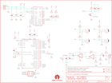

Contents
========

* [PRS10311 > Sparkfun](#prs10311--sparkfun)
	* [Images](#images)
	* [Tags](#tags)
  
![][im]
# PRS10311 > Sparkfun

- ID: PROJ-SPAR-10311-STAN-01
- Hex ID: PRS10311
- Name: Sparkfun
- Description: Sparkfun

## Images
  
  

|kicadPcb3d|kicadPcb3dFront|kicadPcb3dBack|eagleImage|eagleSchemImage|
| :---: | :---: | :---: | :---: | :---: |
||||||

## Tags

- hexID: PRS10311
- oompType: PROJ
- oompSize: SPAR
- oompColor: 10311
- oompDesc: STAN
- oompIndex: 01
- oompName: PicoBoard
- sources: All source files from https://github.com/sparkfun/PicoBoard (source licence details in srcLicense.md)
- linkBuyPage: https://www.sparkfun.com/products/10311
- oompID: PROJ-SPAR-10311-STAN-01
- oompParts: C1,UNMATCHED-UNMATCHED-UNMATCHED-UNMATCHED-UNMATCHED
- oompParts: C2,UNMATCHED-UNMATCHED-UNMATCHED-UNMATCHED-UNMATCHED
- oompParts: C3,UNMATCHED-UNMATCHED-UNMATCHED-UNMATCHED-UNMATCHED
- oompParts: C4,UNMATCHED-UNMATCHED-UNMATCHED-UNMATCHED-UNMATCHED
- oompParts: C5,UNMATCHED-UNMATCHED-UNMATCHED-UNMATCHED-UNMATCHED
- oompParts: C6,UNMATCHED-UNMATCHED-UNMATCHED-UNMATCHED-UNMATCHED
- oompParts: C7,UNMATCHED-UNMATCHED-UNMATCHED-UNMATCHED-UNMATCHED
- oompParts: C8,UNMATCHED-UNMATCHED-UNMATCHED-UNMATCHED-UNMATCHED
- oompParts: C9,UNMATCHED-UNMATCHED-UNMATCHED-UNMATCHED-UNMATCHED
- oompParts: C10,UNMATCHED-UNMATCHED-UNMATCHED-UNMATCHED-UNMATCHED
- oompParts: C11,UNMATCHED-UNMATCHED-UNMATCHED-UNMATCHED-UNMATCHED
- oompParts: D1,UNMATCHED-UNMATCHED-UNMATCHED-UNMATCHED-UNMATCHED
- oompParts: FRAME1,UNMATCHED-UNMATCHED-UNMATCHED-UNMATCHED-UNMATCHED
- oompParts: J1,UNMATCHED-UNMATCHED-UNMATCHED-UNMATCHED-UNMATCHED
- oompParts: JP1,UNMATCHED-UNMATCHED-UNMATCHED-UNMATCHED-UNMATCHED
- oompParts: LED1,UNMATCHED-UNMATCHED-UNMATCHED-UNMATCHED-UNMATCHED
- oompParts: LED2,UNMATCHED-UNMATCHED-UNMATCHED-UNMATCHED-UNMATCHED
- oompParts: LOGO1,UNMATCHED-UNMATCHED-UNMATCHED-UNMATCHED-UNMATCHED
- oompParts: R1,UNMATCHED-UNMATCHED-UNMATCHED-UNMATCHED-UNMATCHED
- oompParts: R2,UNMATCHED-UNMATCHED-UNMATCHED-UNMATCHED-UNMATCHED
- oompParts: R3,UNMATCHED-UNMATCHED-UNMATCHED-UNMATCHED-UNMATCHED
- oompParts: R4,UNMATCHED-UNMATCHED-UNMATCHED-UNMATCHED-UNMATCHED
- oompParts: R5,UNMATCHED-UNMATCHED-UNMATCHED-UNMATCHED-UNMATCHED
- oompParts: R6,UNMATCHED-UNMATCHED-UNMATCHED-UNMATCHED-UNMATCHED
- oompParts: R7,UNMATCHED-UNMATCHED-UNMATCHED-UNMATCHED-UNMATCHED
- oompParts: R8,UNMATCHED-UNMATCHED-UNMATCHED-UNMATCHED-UNMATCHED
- oompParts: R9,UNMATCHED-UNMATCHED-UNMATCHED-UNMATCHED-UNMATCHED
- oompParts: R10,UNMATCHED-UNMATCHED-UNMATCHED-UNMATCHED-UNMATCHED
- oompParts: R11,UNMATCHED-UNMATCHED-UNMATCHED-UNMATCHED-UNMATCHED
- oompParts: R12,UNMATCHED-UNMATCHED-UNMATCHED-UNMATCHED-UNMATCHED
- oompParts: R13,UNMATCHED-UNMATCHED-UNMATCHED-UNMATCHED-UNMATCHED
- oompParts: S2,UNMATCHED-UNMATCHED-UNMATCHED-UNMATCHED-UNMATCHED
- oompParts: U1,UNMATCHED-UNMATCHED-UNMATCHED-UNMATCHED-UNMATCHED
- oompParts: U2,UNMATCHED-UNMATCHED-UNMATCHED-UNMATCHED-UNMATCHED
- oompParts: U3,UNMATCHED-UNMATCHED-UNMATCHED-UNMATCHED-UNMATCHED
- oompParts: U4,UNMATCHED-UNMATCHED-UNMATCHED-UNMATCHED-UNMATCHED
- oompParts: U5,UNMATCHED-UNMATCHED-UNMATCHED-UNMATCHED-UNMATCHED
- oompParts: U6,UNMATCHED-UNMATCHED-UNMATCHED-UNMATCHED-UNMATCHED
- oompParts: U7,UNMATCHED-UNMATCHED-UNMATCHED-UNMATCHED-UNMATCHED
- oompParts: U8,UNMATCHED-UNMATCHED-UNMATCHED-UNMATCHED-UNMATCHED
- oompParts: U9,UNMATCHED-UNMATCHED-UNMATCHED-UNMATCHED-UNMATCHED
- oompParts: U10,UNMATCHED-UNMATCHED-UNMATCHED-UNMATCHED-UNMATCHED
- oompParts: X1,UNMATCHED-UNMATCHED-UNMATCHED-UNMATCHED-UNMATCHED
- oompParts: Y1,UNMATCHED-UNMATCHED-UNMATCHED-UNMATCHED-UNMATCHED
- rawParts: C1,0.1uF,CAP0603-CAP,0603-CAP,Capacitor,,
- rawParts: C2,0.1uF,CAP0603-CAP,0603-CAP,Capacitor,,
- rawParts: C3,0.1uF,CAP0603-CAP,0603-CAP,Capacitor,,
- rawParts: C4,0.1uF,CAP0603-CAP,0603-CAP,Capacitor,,
- rawParts: C5,10uF,CAP_POL1206,EIA3216,Capacitor Polarized,,
- rawParts: C6,0.1uF,CAP0603-CAP,0603-CAP,Capacitor,,
- rawParts: C7,0.22uF,CAP0603-CAP,0603-CAP,Capacitor,,
- rawParts: C8,0.1uF,CAP0603-CAP,0603-CAP,Capacitor,,
- rawParts: C9,0.1uF,CAP0603-CAP,0603-CAP,Capacitor,,
- rawParts: C10,0.1uF,CAP0603-CAP,0603-CAP,Capacitor,,
- rawParts: C11,0.1uF,CAP0603-CAP,0603-CAP,Capacitor,,
- rawParts: D1,MBRA140,DIODESMA,SMA-DIODE,Diode,,
- rawParts: FID1,FIDUCIAL1X2,FIDUCIAL1X2,FIDUCIAL-1X2,Fiducial Alignment Points,,
- rawParts: FID2,FIDUCIAL1X2,FIDUCIAL1X2,FIDUCIAL-1X2,Fiducial Alignment Points,,
- rawParts: FRAME1,FRAME-LETTER,FRAME-LETTER,CREATIVE_COMMONS,Schematic Frame,,
- rawParts: J1,AVR Prog.,AVR_SPI_PRG_6PTH,2X3,AVR ISP 6 Pin,,
- rawParts: JP1,LOGO-SFENEW,LOGO-SFENEW,SFE-NEW-WEBLOGO,Spark Fun Electronics PCB Logo,,
- rawParts: LED1,Red,LED0603,LED-0603,LEDs,,
- rawParts: LED2,Green,LED0603,LED-0603,LEDs,,
- rawParts: LOGO1,OSHW-LOGOL,OSHW-LOGOL,OSHW-LOGO-L,Open Source Hardware Logo This logo indicates the piece of hardware it is found on incorporates a OSHW license and/or adheres to the definition of open source hardware found here: http://freedomdefined.org/OSHW,,
- rawParts: R1,1K,RESISTOR0603-RES,0603-RES,Resistor,,
- rawParts: R2,1K,RESISTOR0603-RES,0603-RES,Resistor,,
- rawParts: R3,10k,RESISTOR0603-RES,0603-RES,Resistor,,
- rawParts: R4,100k,RESISTOR0603-RES,0603-RES,Resistor,,
- rawParts: R5,10k,RESISTOR0603-RES,0603-RES,Resistor,,
- rawParts: R6,10k,RESISTOR0603-RES,0603-RES,Resistor,,
- rawParts: R7,2.2k,RESISTOR0603-RES,0603-RES,Resistor,,
- rawParts: R8,100k,RESISTOR0603-RES,0603-RES,Resistor,,
- rawParts: R9,100k,RESISTOR0603-RES,0603-RES,Resistor,,
- rawParts: R10,10k,RESISTOR0603-RES,0603-RES,Resistor,,
- rawParts: R11,10k,RESISTOR0603-RES,0603-RES,Resistor,,
- rawParts: R12,10k,RESISTOR0603-RES,0603-RES,Resistor,,
- rawParts: R13,10k,RESISTOR0603-RES,0603-RES,Resistor,,
- rawParts: S2,12mm Button,SWITCH-MOMENTARY-2SMD-12MM,TACTILE-SMD-12MM,Various NO switches- pushbuttons, reed, etc,,
- rawParts: U1,FT232RLSSOP,FT232RLSSOP,SSOP28DB,USB UART,,
- rawParts: U2,ATMEGA328,ATMEGA168,TQFP32-08,,,
- rawParts: U3,2.5mm,AUDIO-JACK1:1,STEREOJACK2.5MM,3.5mm Audio Jack,,
- rawParts: U4,2.5mm,AUDIO-JACK1:1,STEREOJACK2.5MM,3.5mm Audio Jack,,
- rawParts: U5,2.5mm,AUDIO-JACK1:1,STEREOJACK2.5MM,3.5mm Audio Jack,,
- rawParts: U6,2.5mm,AUDIO-JACK1:1,STEREOJACK2.5MM,3.5mm Audio Jack,,
- rawParts: U7,TEMT6000,TEMT6000,TEMT6000-SEN,Ambient Light Sensor,,
- rawParts: U8,LMV358,LMV358,SO08,,,
- rawParts: U9,MIC9.7MM,MIC9.7MM,MIC-9.7MM,Microphone,,
- rawParts: U10,,SLIDER60MM,SLIDER,Slide-type potentiometers.,RES-09484,
- rawParts: X1,USBSMD,USBSMD,USB-MINIB,USB Connectors,,
- rawParts: Y1,16MHz,RESONATORSMD,RESONATOR-SMD,Resonator,,

[im]: kicadPcb3d_450.png
