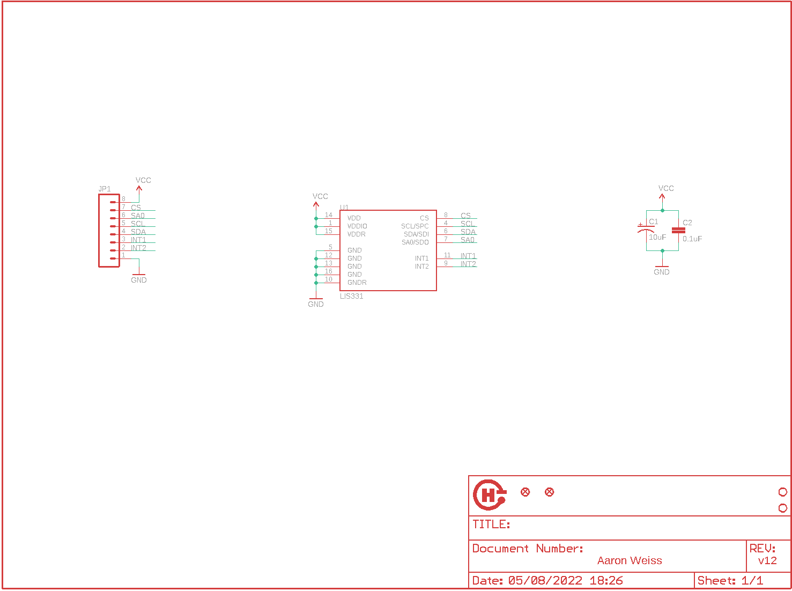
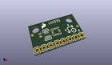
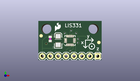
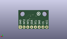
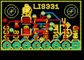
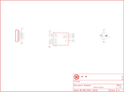

Contents
========

* [PRS10345 > Sparkfun](#prs10345--sparkfun)
	* [Schematic](#schematic)
	* [Interactive BOM](#interactive-bom)
	* [OOMP Parts](#oomp-parts)
	* [Images](#images)
	* [Tags](#tags)
  
![][im]
# PRS10345 > Sparkfun

- ID: PROJ-SPAR-10345-STAN-01
- Hex ID: PRS10345
- Name: Sparkfun
- Description: Sparkfun
- Long Link: [http://oom.lt/PROJ-SPAR-10345-STAN-01](http://oom.lt/PROJ-SPAR-10345-STAN-01)
- Short Link: [http://oom.lt/PRS10345](http://oom.lt/PRS10345)

## Schematic
  

## Interactive BOM

- Interactive BOM page: [ibom.html](https://htmlpreview.github.io/?https://github.com/oomlout/oomlout_OOMP_projects/blob/main/PROJ-SPAR-10345-STAN-01/kicad/bom/ibom.html)

## OOMP Parts
  

|OOMP Parts|
| :---: |
|C1,UNMATCHED-UNMATCHED-UNMATCHED-UNMATCHED-UNMATCHED,C1,10uF,CAP_POL1206,EIA3216,Capacitor Polarized,,|
|C2,UNMATCHED-UNMATCHED-UNMATCHED-UNMATCHED-UNMATCHED,C2,0.1uF,CAP0402-CAP,0402-CAP,Capacitor,,|
|JP1,UNMATCHED-UNMATCHED-UNMATCHED-UNMATCHED-UNMATCHED,JP1,,M08,1X08,Header 8,,|
|JP3,UNMATCHED-UNMATCHED-UNMATCHED-UNMATCHED-UNMATCHED,JP3,STAND-OFF,STAND-OFF,STAND-OFF,Stand Off,,|
|JP4,UNMATCHED-UNMATCHED-UNMATCHED-UNMATCHED-UNMATCHED,JP4,STAND-OFF,STAND-OFF,STAND-OFF,Stand Off,,|
|U$1,UNMATCHED-UNMATCHED-UNMATCHED-UNMATCHED-UNMATCHED,JP5,FIDUCIAL1X2,FIDUCIAL1X2,FIDUCIAL-1X2,Fiducial Alignment Points,,|
|U1,UNMATCHED-UNMATCHED-UNMATCHED-UNMATCHED-UNMATCHED,JP6,FIDUCIAL1X2,FIDUCIAL1X2,FIDUCIAL-1X2,Fiducial Alignment Points,,|

## Images
  
  

|kicadPcb3d|kicadPcb3dFront|kicadPcb3dBack|eagleImage|eagleSchemImage|
| :---: | :---: | :---: | :---: | :---: |
||||||

## Tags

- hexID: PRS10345
- oompType: PROJ
- oompSize: SPAR
- oompColor: 10345
- oompDesc: STAN
- oompIndex: 01
- oompName: Triple Axis Accelerometer Breakout-LIS331
- sources: All source files from https://github.com/sparkfun/Triple_Axis_Accelerometer_Breakout-LIS331 (source licence details in srcLicense.md)
- linkBuyPage: https://www.sparkfun.com/products/10345
- oompID: PROJ-SPAR-10345-STAN-01
- oompParts: C1,UNMATCHED-UNMATCHED-UNMATCHED-UNMATCHED-UNMATCHED
- oompParts: C2,UNMATCHED-UNMATCHED-UNMATCHED-UNMATCHED-UNMATCHED
- oompParts: JP1,UNMATCHED-UNMATCHED-UNMATCHED-UNMATCHED-UNMATCHED
- oompParts: JP3,UNMATCHED-UNMATCHED-UNMATCHED-UNMATCHED-UNMATCHED
- oompParts: JP4,UNMATCHED-UNMATCHED-UNMATCHED-UNMATCHED-UNMATCHED
- oompParts: U$1,UNMATCHED-UNMATCHED-UNMATCHED-UNMATCHED-UNMATCHED
- oompParts: U1,UNMATCHED-UNMATCHED-UNMATCHED-UNMATCHED-UNMATCHED
- rawParts: C1,10uF,CAP_POL1206,EIA3216,Capacitor Polarized,,
- rawParts: C2,0.1uF,CAP0402-CAP,0402-CAP,Capacitor,,
- rawParts: JP1,,M08,1X08,Header 8,,
- rawParts: JP3,STAND-OFF,STAND-OFF,STAND-OFF,Stand Off,,
- rawParts: JP4,STAND-OFF,STAND-OFF,STAND-OFF,Stand Off,,
- rawParts: JP5,FIDUCIAL1X2,FIDUCIAL1X2,FIDUCIAL-1X2,Fiducial Alignment Points,,
- rawParts: JP6,FIDUCIAL1X2,FIDUCIAL1X2,FIDUCIAL-1X2,Fiducial Alignment Points,,
- rawParts: U$1,OSHW-LOGO-SMALL,OSHW-LOGO-SMALL,OSHW-LOGO-SMALL,,,
- rawParts: U1,LIS331,LIS331,LGA16-3MM,LIS331HH 3-axis accelerometer,,

[im]: kicadPcb3d_450.png
