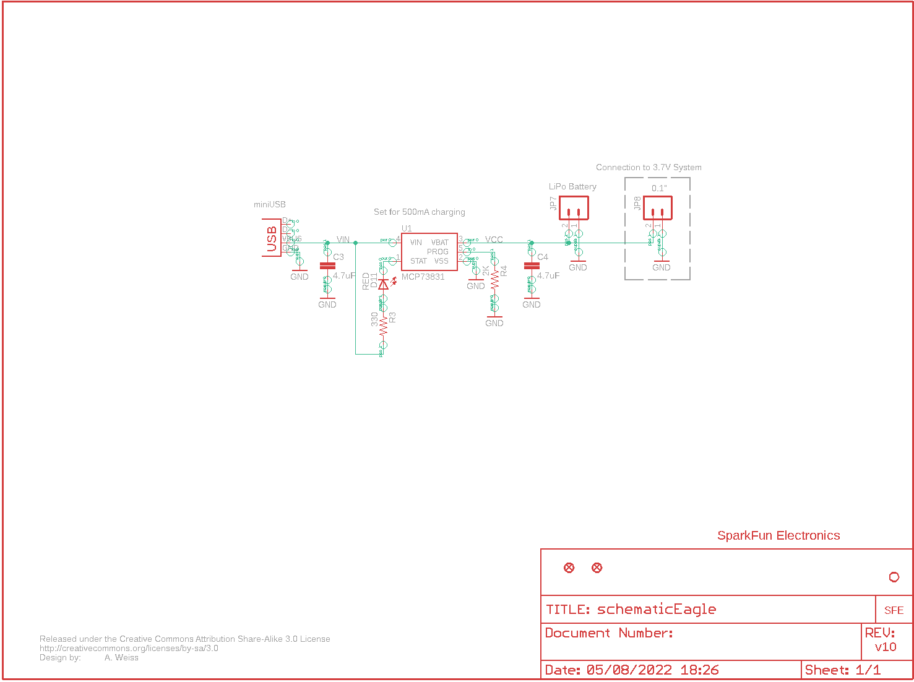
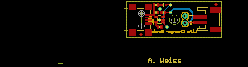
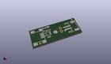
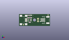
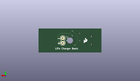

Contents
========

* [PRS10401 > Lipo Charger Basic-miniUSB](#prs10401--lipo-charger-basic-miniusb)
	* [Schematic](#schematic)
	* [PCB](#pcb)
	* [Interactive BOM](#interactive-bom)
	* [OOMP Parts](#oomp-parts)
	* [Images](#images)
	* [Tags](#tags)
  
![][im]
# PRS10401 > Lipo Charger Basic-miniUSB

- ID: PROJ-SPAR-10401-STAN-01
- Hex ID: PRS10401
- Name: Sparkfun
- Description: Sparkfun
- Long Link: [http://oom.lt/PROJ-SPAR-10401-STAN-01](http://oom.lt/PROJ-SPAR-10401-STAN-01)
- Short Link: [http://oom.lt/PRS10401](http://oom.lt/PRS10401)

## Schematic
  

## PCB
  

## Interactive BOM

- Interactive BOM page: [ibom.html](https://htmlpreview.github.io/?https://github.com/oomlout/oomlout_OOMP_projects/blob/main/PROJ-SPAR-10401-STAN-01/kicad/bom/ibom.html)

## OOMP Parts
  

|OOMP Parts|
| :---: |
|[CAPC-0402-X-UF47D-V63D  SMD (0402) 4.7 uF Capacitor (Ceramic) 6.3v  C3, C4](https://github.com/oomlout/oomlout_OOMP_parts/tree/main/CAPC-0402-X-UF47D-V63D/)|
|[LEDS-0603-R-STAN-01  SMD (0603) Red LED  D11](https://github.com/oomlout/oomlout_OOMP_parts/tree/main/LEDS-0603-R-STAN-01/)|
|HEAD-I01-X-UNMATCHED-01 JP7|
|[HEAD-I01-X-PI02-01  2.54 mm 2 Pin Header  JP8](https://github.com/oomlout/oomlout_OOMP_parts/tree/main/HEAD-I01-X-PI02-01/)|
|RESE-0402-X-O331-01 R3|
|RESE-0402-X-O202-01 R4|
|UNMATCHED-SO235-X-UNMATCHED-01 U1|
|UNMATCHED-UNMATCHED-X-UNMATCHED-01 X1|

## Images
  
  

|kicadPcb3d|kicadPcb3dFront|kicadPcb3dBack|eagleImage|eagleSchemImage|
| :---: | :---: | :---: | :---: | :---: |
||||||

## Tags

- hexID: PRS10401
- oompType: PROJ
- oompSize: SPAR
- oompColor: 10401
- oompDesc: STAN
- oompIndex: 01
- oompName: Lipo Charger Basic-miniUSB
- sources: All source files from https://github.com/sparkfun/Lipo_Charger_Basic-miniUSB (source licence details in srcLicense.md)
- linkBuyPage: https://www.sparkfun.com/products/10401
- oompID: PROJ-SPAR-10401-STAN-01
- oompParts: C3,CAPC-0402-X-UF47D-V63D
- oompParts: C4,CAPC-0402-X-UF47D-V63D
- oompParts: D11,LEDS-0603-R-STAN-01
- oompParts: JP7,HEAD-I01-X-UNMATCHED-01
- oompParts: JP8,HEAD-I01-X-PI02-01
- oompParts: R3,RESE-0402-X-O331-01
- oompParts: R4,RESE-0402-X-O202-01
- oompParts: U1,UNMATCHED-SO235-X-UNMATCHED-01
- oompParts: X1,UNMATCHED-UNMATCHED-X-UNMATCHED-01
- rawParts: C3,4.7uF,CAP0402-CAP,0402-CAP,Capacitor,,
- rawParts: C4,4.7uF,CAP0402-CAP,0402-CAP,Capacitor,,
- rawParts: D11,RED,LED0603,LED-0603,LEDs,,
- rawParts: JP1,LOGO-SFESK,LOGO-SFESK,SFE-LOGO-FLAME,Spark Fun Electronics PCB Logo,,
- rawParts: JP2,STAND-OFF,STAND-OFF,STAND-OFF,Stand Off,,
- rawParts: JP3,FIDUCIAL1X2,FIDUCIAL1X2,FIDUCIAL-1X2,Fiducial Alignment Points,,
- rawParts: JP4,FIDUCIAL1X2,FIDUCIAL1X2,FIDUCIAL-1X2,Fiducial Alignment Points,,
- rawParts: JP7,LiPo Battery,M02-JST-2MM-SMT,JST-2-SMD,Header 2,,
- rawParts: JP8,,M02PTH,1X02,Header 2,,
- rawParts: R3,330,RESISTOR0402-RES,0402-RES,Resistor,,
- rawParts: R4,2K,RESISTOR0402-RES,0402-RES,Resistor,,
- rawParts: U$1,CREATIVE_COMMONS,CREATIVE_COMMONS,CREATIVE_COMMONS,,,
- rawParts: U1,MCP73831,MCP73831,SOT23-5,Microchips MCP73831,,
- rawParts: X1,Micro USB,USBSMD,USB-MINIB,USB Connectors,,

[im]: kicadPcb3d_450.png
