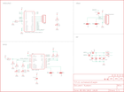

Contents
========

* [PRS10406 > RFID Evaluation Shield](#prs10406--rfid-evaluation-shield)
	* [Schematic](#schematic)
	* [PCB](#pcb)
	* [OOMP Parts](#oomp-parts)
	* [Images](#images)
	* [Tags](#tags)
  
![][im]
# PRS10406 > RFID Evaluation Shield

- ID: PROJ-SPAR-10406-STAN-01
- Hex ID: PRS10406
- Name: Sparkfun
- Description: Sparkfun
- Long Link: [http://oom.lt/PROJ-SPAR-10406-STAN-01](http://oom.lt/PROJ-SPAR-10406-STAN-01)
- Short Link: [http://oom.lt/PRS10406](http://oom.lt/PRS10406)

## Schematic
  

## PCB
  

## OOMP Parts
  

|OOMP ID|Name|Identifier|
| :---: | :---: | :---: |
|[CAPC-0402-X-NF100-V10](https://github.com/oomlout/oomlout_OOMP_parts/tree/main/CAPC-0402-X-NF100-V10/)|[SMD (0402) 100 nF Capacitor (Ceramic) 10v](https://github.com/oomlout/oomlout_OOMP_parts/tree/main/CAPC-0402-X-NF100-V10/)|[C1, C8](https://github.com/oomlout/oomlout_OOMP_parts/tree/main/CAPC-0402-X-NF100-V10/)|
|[CAPC-0402-X-PF22-V50](https://github.com/oomlout/oomlout_OOMP_parts/tree/main/CAPC-0402-X-PF22-V50/)|[SMD (0402) 22 pF Capacitor (Ceramic) 50v](https://github.com/oomlout/oomlout_OOMP_parts/tree/main/CAPC-0402-X-PF22-V50/)|[C2, C7](https://github.com/oomlout/oomlout_OOMP_parts/tree/main/CAPC-0402-X-PF22-V50/)|
|[CAPC-0402-X-PF27-V50](https://github.com/oomlout/oomlout_OOMP_parts/tree/main/CAPC-0402-X-PF27-V50/)|[SMD (0402) 27 pF Capacitor (Ceramic) 50v](https://github.com/oomlout/oomlout_OOMP_parts/tree/main/CAPC-0402-X-PF27-V50/)|[C3, C4](https://github.com/oomlout/oomlout_OOMP_parts/tree/main/CAPC-0402-X-PF27-V50/)|
|[CAPC-0402-X-PF18-V50](https://github.com/oomlout/oomlout_OOMP_parts/tree/main/CAPC-0402-X-PF18-V50/)|[SMD (0402) 18 pF Capacitor (Ceramic) 50v](https://github.com/oomlout/oomlout_OOMP_parts/tree/main/CAPC-0402-X-PF18-V50/)|[C5, C6](https://github.com/oomlout/oomlout_OOMP_parts/tree/main/CAPC-0402-X-PF18-V50/)|
|[HEAD-I01-X-PI06-01](https://github.com/oomlout/oomlout_OOMP_parts/tree/main/HEAD-I01-X-PI06-01/)|[2.54 mm 6 Pin Header](https://github.com/oomlout/oomlout_OOMP_parts/tree/main/HEAD-I01-X-PI06-01/)|[JP1](https://github.com/oomlout/oomlout_OOMP_parts/tree/main/HEAD-I01-X-PI06-01/)|
|[HEAD-I01-X-PI05-01](https://github.com/oomlout/oomlout_OOMP_parts/tree/main/HEAD-I01-X-PI05-01/)|[2.54 mm 5 Pin Header](https://github.com/oomlout/oomlout_OOMP_parts/tree/main/HEAD-I01-X-PI05-01/)|[JP6](https://github.com/oomlout/oomlout_OOMP_parts/tree/main/HEAD-I01-X-PI05-01/)|
|[LEDS-0603-Y-STAN-01](https://github.com/oomlout/oomlout_OOMP_parts/tree/main/LEDS-0603-Y-STAN-01/)|[SMD (0603) Yellow LED](https://github.com/oomlout/oomlout_OOMP_parts/tree/main/LEDS-0603-Y-STAN-01/)|[LED1](https://github.com/oomlout/oomlout_OOMP_parts/tree/main/LEDS-0603-Y-STAN-01/)|
|[LEDS-0603-G-STAN-01](https://github.com/oomlout/oomlout_OOMP_parts/tree/main/LEDS-0603-G-STAN-01/)|[SMD (0603) Green LED](https://github.com/oomlout/oomlout_OOMP_parts/tree/main/LEDS-0603-G-STAN-01/)|[LED2](https://github.com/oomlout/oomlout_OOMP_parts/tree/main/LEDS-0603-G-STAN-01/)|
|[LEDS-0603-R-STAN-01](https://github.com/oomlout/oomlout_OOMP_parts/tree/main/LEDS-0603-R-STAN-01/)|[SMD (0603) Red LED](https://github.com/oomlout/oomlout_OOMP_parts/tree/main/LEDS-0603-R-STAN-01/)|[LED3](https://github.com/oomlout/oomlout_OOMP_parts/tree/main/LEDS-0603-R-STAN-01/)|
|[RESE-0402-X-O103-01](https://github.com/oomlout/oomlout_OOMP_parts/tree/main/RESE-0402-X-O103-01/)|[SMD (0402) 10k Ohm Resistor](https://github.com/oomlout/oomlout_OOMP_parts/tree/main/RESE-0402-X-O103-01/)|[R1](https://github.com/oomlout/oomlout_OOMP_parts/tree/main/RESE-0402-X-O103-01/)|
|RESE-0402-X-O331-01||R3, R4, R7|
|[RESE-0402-X-O472-01](https://github.com/oomlout/oomlout_OOMP_parts/tree/main/RESE-0402-X-O472-01/)|[SMD (0402) 4.7k Ohm Resistor](https://github.com/oomlout/oomlout_OOMP_parts/tree/main/RESE-0402-X-O472-01/)|[R5, R6](https://github.com/oomlout/oomlout_OOMP_parts/tree/main/RESE-0402-X-O472-01/)|
|RESE-0402-X-UNMATCHED-01||R8, R9|
|UNMATCHED-UNMATCHED-X-UNMATCHED-01||S1, S2, U3|

## Images
  
  

|kicadPcb3d|kicadPcb3dFront|kicadPcb3dBack|eagleImage|eagleSchemImage|
| :---: | :---: | :---: | :---: | :---: |
||||||

## Tags

- hexID: PRS10406
- oompType: PROJ
- oompSize: SPAR
- oompColor: 10406
- oompDesc: STAN
- oompIndex: 01
- oompName: RFID Evaluation Shield
- sources: All source files from https://github.com/sparkfun/RFID_Evaluation_Shield (source licence details in srcLicense.md)
- linkBuyPage: https://www.sparkfun.com/products/10406
- oompID: PROJ-SPAR-10406-STAN-01
- oompParts: C1,CAPC-0402-X-NF100-V10
- oompParts: C2,CAPC-0402-X-PF22-V50
- oompParts: C3,CAPC-0402-X-PF27-V50
- oompParts: C4,CAPC-0402-X-PF27-V50
- oompParts: C5,CAPC-0402-X-PF18-V50
- oompParts: C6,CAPC-0402-X-PF18-V50
- oompParts: C7,CAPC-0402-X-PF22-V50
- oompParts: C8,CAPC-0402-X-NF100-V10
- oompParts: JP1,HEAD-I01-X-PI06-01
- oompParts: JP6,HEAD-I01-X-PI05-01
- oompParts: LED1,LEDS-0603-Y-STAN-01
- oompParts: LED2,LEDS-0603-G-STAN-01
- oompParts: LED3,LEDS-0603-R-STAN-01
- oompParts: R1,RESE-0402-X-O103-01
- oompParts: R3,RESE-0402-X-O331-01
- oompParts: R4,RESE-0402-X-O331-01
- oompParts: R5,RESE-0402-X-O472-01
- oompParts: R6,RESE-0402-X-O472-01
- oompParts: R7,RESE-0402-X-O331-01
- oompParts: R8,RESE-0402-X-UNMATCHED-01
- oompParts: R9,RESE-0402-X-UNMATCHED-01
- oompParts: S1,UNMATCHED-UNMATCHED-X-UNMATCHED-01
- oompParts: S2,UNMATCHED-UNMATCHED-X-UNMATCHED-01
- oompParts: U3,UNMATCHED-UNMATCHED-X-UNMATCHED-01
- rawParts: C1,0.1uF,CAP0402-CAP,0402-CAP,Capacitor,,
- rawParts: C2,22pF,CAP0402-CAP,0402-CAP,Capacitor,,
- rawParts: C3,27pF,CAP0402-CAP,0402-CAP,Capacitor,,
- rawParts: C4,27pF,CAP0402-CAP,0402-CAP,Capacitor,,
- rawParts: C5,18pF,CAP0402-CAP,0402-CAP,Capacitor,,
- rawParts: C6,18pF,CAP0402-CAP,0402-CAP,Capacitor,,
- rawParts: C7,22pF,CAP0402-CAP,0402-CAP,Capacitor,,
- rawParts: C8,0.1uF,CAP0402-CAP,0402-CAP,Capacitor,,
- rawParts: JP1,XBee Regulated,M06SIP,1X06,Header 6,,
- rawParts: JP2,LOGO-SFENEW,LOGO-SFENEW,SFE-NEW-WEBLOGO,Spark Fun Electronics PCB Logo,,
- rawParts: JP3,STAND-OFF,STAND-OFF,STAND-OFF,Stand Off,,
- rawParts: JP4,LOGO-SFESK,LOGO-SFESK,SFE-LOGO-FLAME,Spark Fun Electronics PCB Logo,,
- rawParts: JP5,STAND-OFF,STAND-OFF,STAND-OFF,Stand Off,,
- rawParts: JP6,,M05PTH,1X05,Header 5,,
- rawParts: JP7,STAND-OFF,STAND-OFF,STAND-OFF,Stand Off,,
- rawParts: JP8,LOGO-SFENEW,LOGO-SFENEW,SFE-NEW-WEBLOGO,Spark Fun Electronics PCB Logo,,
- rawParts: JP10,STAND-OFF,STAND-OFF,STAND-OFF,Stand Off,,
- rawParts: JP11,FIDUCIAL1X2,FIDUCIAL1X2,FIDUCIAL-1X2,Fiducial Alignment Points,,
- rawParts: JP12,FIDUCIAL1X2,FIDUCIAL1X2,FIDUCIAL-1X2,Fiducial Alignment Points,,
- rawParts: JP13,STAND-OFF,STAND-OFF,STAND-OFF,Stand Off,,
- rawParts: LED1,yellow,LED0603,LED-0603,LEDs,,
- rawParts: LED2,green,LED0603,LED-0603,LEDs,,
- rawParts: LED3,red,LED0603,LED-0603,LEDs,,
- rawParts: R1,10k,RESISTOR0402-RES,0402-RES,Resistor,,
- rawParts: R3,330,RESISTOR0402-RES,0402-RES,Resistor,,
- rawParts: R4,330,RESISTOR0402-RES,0402-RES,Resistor,,
- rawParts: R5,4.7k,RESISTOR0402-RES,0402-RES,Resistor,,
- rawParts: R6,4.7k,RESISTOR0402-RES,0402-RES,Resistor,,
- rawParts: R7,330,RESISTOR0402-RES,0402-RES,Resistor,,
- rawParts: R8,0 Ohm,RESISTOR0402-RES,0402-RES,Resistor,,
- rawParts: R9,0 Ohm,RESISTOR0402-RES,0402-RES,Resistor,,
- rawParts: S1,Reset,SWITCH-MOMENTARY-2SMD,TACTILE_SWITCH_SMD,,,
- rawParts: S2,Reset,SWITCH-MOMENTARY-2SMD,TACTILE_SWITCH_SMD,,,
- rawParts: SJ1,,SOLDERJUMPER_2WAYPASTE2&3,SJ_3_PASTE2&3,Solder Jumper,,
- rawParts: SJ2,,SOLDERJUMPER_2WAYPASTE2&3,SJ_3_PASTE2&3,Solder Jumper,,
- rawParts: SJ3,,SOLDERJUMPER_2WAYPASTE2&3,SJ_3_PASTE2&3,Solder Jumper,,
- rawParts: SJ4,,SOLDERJUMPER_2WAYPASTE2&3,SJ_3_PASTE2&3,Solder Jumper,,
- rawParts: U1,DNP_SM130,SM130,SM130,13.56MHz RFID Mifare Read/Write Module,,
- rawParts: U3,ARDUINO_SHIELDNOLABELS,ARDUINO_SHIELDNOLABELS,DUEMILANOVE_SHIELD_NOLABELS,,,

[im]: kicadPcb3d_450.png
