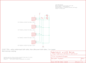

Contents
========

* [PRS10412 > Sparkfun](#prs10412--sparkfun)
	* [Images](#images)
	* [Tags](#tags)
  
![][im]
# PRS10412 > Sparkfun

- ID: PROJ-SPAR-10412-STAN-01
- Hex ID: PRS10412
- Name: Sparkfun
- Description: Sparkfun

## Images
  
  

|kicadPcb3d|kicadPcb3dFront|kicadPcb3dBack|eagleImage|eagleSchemImage|
| :---: | :---: | :---: | :---: | :---: |
||||||

## Tags

- hexID: PRS10412
- oompType: PROJ
- oompSize: SPAR
- oompColor: 10412
- oompDesc: STAN
- oompIndex: 01
- oompName: Fabrickit LED Brick
- sources: All source files from https://github.com/sparkfun/Fabrickit_LED_Brick (source licence details in srcLicense.md)
- linkBuyPage: https://www.sparkfun.com/products/10412
- oompID: PROJ-SPAR-10412-STAN-01
- oompParts: J1,UNMATCHED-UNMATCHED-UNMATCHED-UNMATCHED-UNMATCHED
- oompParts: J2,UNMATCHED-UNMATCHED-UNMATCHED-UNMATCHED-UNMATCHED
- oompParts: J3,UNMATCHED-UNMATCHED-UNMATCHED-UNMATCHED-UNMATCHED
- oompParts: J4,UNMATCHED-UNMATCHED-UNMATCHED-UNMATCHED-UNMATCHED
- oompParts: LED1,UNMATCHED-UNMATCHED-UNMATCHED-UNMATCHED-UNMATCHED
- oompParts: LED2,UNMATCHED-UNMATCHED-UNMATCHED-UNMATCHED-UNMATCHED
- oompParts: R1,UNMATCHED-UNMATCHED-UNMATCHED-UNMATCHED-UNMATCHED
- oompParts: U$1,UNMATCHED-UNMATCHED-UNMATCHED-UNMATCHED-UNMATCHED
- rawParts: J1,FKIT-RIBBON_CONNECTOR-2MM_L_REV2,FKIT-RIBBON_CONNECTOR-2MM_L_REV2,FKIT-RIBBON_CONNECTOR_03_2MM_L,fabrick.it Conductive Ribbon Connector,,
- rawParts: J2,FKIT-RIBBON_CONNECTOR-2MM_L_REV2,FKIT-RIBBON_CONNECTOR-2MM_L_REV2,FKIT-RIBBON_CONNECTOR_03_2MM_L,fabrick.it Conductive Ribbon Connector,,
- rawParts: J3,FKIT-RIBBON_CONNECTOR-2MM_R_REV2,FKIT-RIBBON_CONNECTOR-2MM_R_REV2,FKIT-RIBBON_CONNECTOR_03_2MM_R,fabrick.it Conductive Ribbon Connector,,
- rawParts: J4,FKIT-RIBBON_CONNECTOR-2MM_R_REV2,FKIT-RIBBON_CONNECTOR-2MM_R_REV2,FKIT-RIBBON_CONNECTOR_03_2MM_R,fabrick.it Conductive Ribbon Connector,,
- rawParts: LED1,,LED,FKIT-LED-1206_NO_CREAM,LEDs,,
- rawParts: LED2,,LED-3MM-NO_SILK,LED3MM-NS,LEDs,,
- rawParts: R1,,RESISTOR0603,0603-RES,Resistor,,
- rawParts: U$1,CREATIVE_COMMONS,CREATIVE_COMMONS,CREATIVE_COMMONS,,,

[im]: kicadPcb3d_450.png
