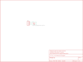

Contents
========

* [PRS10467 > LED Tactile Button Breakout](#prs10467--led-tactile-button-breakout)
	* [Schematic](#schematic)
	* [PCB](#pcb)
	* [Interactive BOM](#interactive-bom)
	* [OOMP Parts](#oomp-parts)
	* [Images](#images)
	* [Tags](#tags)
  
![][im]
# PRS10467 > LED Tactile Button Breakout

- ID: PROJ-SPAR-10467-STAN-01
- Hex ID: PRS10467
- Name: Sparkfun
- Description: Sparkfun
- Long Link: [http://oom.lt/PROJ-SPAR-10467-STAN-01](http://oom.lt/PROJ-SPAR-10467-STAN-01)
- Short Link: [http://oom.lt/PRS10467](http://oom.lt/PRS10467)

## Schematic
  

## PCB
  

## Interactive BOM

- Interactive BOM page: [ibom.html](https://htmlpreview.github.io/?https://github.com/oomlout/oomlout_OOMP_projects/blob/main/PROJ-SPAR-10467-STAN-01/kicad/bom/ibom.html)

## OOMP Parts
  

|OOMP Parts|
| :---: |
|[HEAD-I01-X-PI04-01  2.54 mm 4 Pin Header  JP1](https://github.com/oomlout/oomlout_OOMP_parts/tree/main/HEAD-I01-X-PI04-01/)|
|UNMATCHED-UNMATCHED-X-UNMATCHED-01 S1|

## Images
  
  

|bominteractivefront|bominteractiveback|kicadPcb3d|kicadPcb3dFront|kicadPcb3dBack|eagleImage|eagleSchemImage|pcbdraw|pcbdrawback|
| :---: | :---: | :---: | :---: | :---: | :---: | :---: | :---: | :---: |
||||||||||

## Tags

- hexID: PRS10467
- oompType: PROJ
- oompSize: SPAR
- oompColor: 10467
- oompDesc: STAN
- oompIndex: 01
- oompName: LED Tactile Button Breakout
- sources: All source files from https://github.com/sparkfun/LED_Tactile_Button_Breakout (source licence details in srcLicense.md)
- linkBuyPage: https://www.sparkfun.com/products/10467
- oompID: PROJ-SPAR-10467-STAN-01
- oompParts: JP1,HEAD-I01-X-PI04-01
- oompParts: S1,UNMATCHED-UNMATCHED-X-UNMATCHED-01
- rawParts: FRAME1,FRAME-LETTER,FRAME-LETTER,CREATIVE_COMMONS,Schematic Frame,,
- rawParts: JP1,,M04PTH,1X04,Header 4,,
- rawParts: S1,SWITCH-MOMENTARY-LEDPTH,SWITCH-MOMENTARY-LEDPTH,TACTILE-PTH-LED-12MM,EZ is for Kits. There is no tStop (covering up the top side of the pads with mask). This helps the beginner see which side they should be soldering too.,,

[im]: kicadPcb3d_450.png
