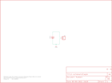

Contents
========

* [PRS10495 > Sparkfun](#prs10495--sparkfun)
	* [Images](#images)
	* [Tags](#tags)
  
![][im]
# PRS10495 > Sparkfun

- ID: PROJ-SPAR-10495-STAN-01
- Hex ID: PRS10495
- Name: Sparkfun
- Description: Sparkfun

## Images
  
  

|kicadPcb3d|kicadPcb3dFront|kicadPcb3dBack|eagleImage|eagleSchemImage|
| :---: | :---: | :---: | :---: | :---: |
||||||

## Tags

- hexID: PRS10495
- oompType: PROJ
- oompSize: SPAR
- oompColor: 10495
- oompDesc: STAN
- oompIndex: 01
- oompName: Coin Cell Battery Holder Breakout-24.5mm
- sources: All source files from https://github.com/sparkfun/Coin_Cell_Battery_Holder_Breakout-24.5mm (source licence details in srcLicense.md)
- linkBuyPage: https://www.sparkfun.com/products/10495
- oompID: PROJ-SPAR-10495-STAN-01
- oompParts: BAT1,UNMATCHED-UNMATCHED-UNMATCHED-UNMATCHED-UNMATCHED
- oompParts: J3,UNMATCHED-UNMATCHED-UNMATCHED-UNMATCHED-UNMATCHED
- oompParts: JP2,UNMATCHED-UNMATCHED-UNMATCHED-UNMATCHED-UNMATCHED
- oompParts: JP4,UNMATCHED-UNMATCHED-UNMATCHED-UNMATCHED-UNMATCHED
- oompParts: JP5,UNMATCHED-UNMATCHED-UNMATCHED-UNMATCHED-UNMATCHED
- oompParts: U$1,UNMATCHED-UNMATCHED-UNMATCHED-UNMATCHED-UNMATCHED
- rawParts: BAT1,,BATTERY245PTH,BATTCON_245MM_PTH,Battery Holders,,
- rawParts: J3,,M02PTH,1X02,Header 2,,
- rawParts: JP2,LOGO-SFENEW,LOGO-SFENEW,SFE-NEW-WEBLOGO,Spark Fun Electronics PCB Logo,,
- rawParts: JP4,STAND-OFF,STAND-OFF,STAND-OFF,Stand Off,,
- rawParts: JP5,STAND-OFF,STAND-OFF,STAND-OFF,Stand Off,,
- rawParts: U$1,CREATIVE_COMMONS,CREATIVE_COMMONS,CREATIVE_COMMONS,,,

[im]: kicadPcb3d_450.png
