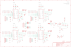

Contents
========

* [PRS10507 > Sparkfun](#prs10507--sparkfun)
	* [Images](#images)
	* [Tags](#tags)
  
![][im]
# PRS10507 > Sparkfun

- ID: PROJ-SPAR-10507-STAN-01
- Hex ID: PRS10507
- Name: Sparkfun
- Description: Sparkfun

## Images
  
  

|kicadPcb3d|kicadPcb3dFront|kicadPcb3dBack|eagleImage|eagleSchemImage|
| :---: | :---: | :---: | :---: | :---: |
||||||

## Tags

- hexID: PRS10507
- oompType: PROJ
- oompSize: SPAR
- oompColor: 10507
- oompDesc: STAN
- oompIndex: 01
- oompName: Quadstepper Motor Driver
- sources: All source files from https://github.com/sparkfun/Quadstepper_Motor_Driver (source licence details in srcLicense.md)
- linkBuyPage: https://www.sparkfun.com/products/10507
- oompID: PROJ-SPAR-10507-STAN-01
- oompParts: C1,UNMATCHED-UNMATCHED-UNMATCHED-UNMATCHED-UNMATCHED
- oompParts: C2,UNMATCHED-UNMATCHED-UNMATCHED-UNMATCHED-UNMATCHED
- oompParts: C3,UNMATCHED-UNMATCHED-UNMATCHED-UNMATCHED-UNMATCHED
- oompParts: C4,UNMATCHED-UNMATCHED-UNMATCHED-UNMATCHED-UNMATCHED
- oompParts: C5,UNMATCHED-UNMATCHED-UNMATCHED-UNMATCHED-UNMATCHED
- oompParts: C6,UNMATCHED-UNMATCHED-UNMATCHED-UNMATCHED-UNMATCHED
- oompParts: C7,UNMATCHED-UNMATCHED-UNMATCHED-UNMATCHED-UNMATCHED
- oompParts: C8,UNMATCHED-UNMATCHED-UNMATCHED-UNMATCHED-UNMATCHED
- oompParts: C9,UNMATCHED-UNMATCHED-UNMATCHED-UNMATCHED-UNMATCHED
- oompParts: C10,UNMATCHED-UNMATCHED-UNMATCHED-UNMATCHED-UNMATCHED
- oompParts: C11,UNMATCHED-UNMATCHED-UNMATCHED-UNMATCHED-UNMATCHED
- oompParts: C12,UNMATCHED-UNMATCHED-UNMATCHED-UNMATCHED-UNMATCHED
- oompParts: C13,UNMATCHED-UNMATCHED-UNMATCHED-UNMATCHED-UNMATCHED
- oompParts: C14,UNMATCHED-UNMATCHED-UNMATCHED-UNMATCHED-UNMATCHED
- oompParts: C15,UNMATCHED-UNMATCHED-UNMATCHED-UNMATCHED-UNMATCHED
- oompParts: C16,UNMATCHED-UNMATCHED-UNMATCHED-UNMATCHED-UNMATCHED
- oompParts: C17,UNMATCHED-UNMATCHED-UNMATCHED-UNMATCHED-UNMATCHED
- oompParts: C18,UNMATCHED-UNMATCHED-UNMATCHED-UNMATCHED-UNMATCHED
- oompParts: C19,UNMATCHED-UNMATCHED-UNMATCHED-UNMATCHED-UNMATCHED
- oompParts: C20,UNMATCHED-UNMATCHED-UNMATCHED-UNMATCHED-UNMATCHED
- oompParts: C21,UNMATCHED-UNMATCHED-UNMATCHED-UNMATCHED-UNMATCHED
- oompParts: C22,UNMATCHED-UNMATCHED-UNMATCHED-UNMATCHED-UNMATCHED
- oompParts: C23,UNMATCHED-UNMATCHED-UNMATCHED-UNMATCHED-UNMATCHED
- oompParts: C24,UNMATCHED-UNMATCHED-UNMATCHED-UNMATCHED-UNMATCHED
- oompParts: C25,UNMATCHED-UNMATCHED-UNMATCHED-UNMATCHED-UNMATCHED
- oompParts: C26,UNMATCHED-UNMATCHED-UNMATCHED-UNMATCHED-UNMATCHED
- oompParts: C27,UNMATCHED-UNMATCHED-UNMATCHED-UNMATCHED-UNMATCHED
- oompParts: C28,UNMATCHED-UNMATCHED-UNMATCHED-UNMATCHED-UNMATCHED
- oompParts: C29,UNMATCHED-UNMATCHED-UNMATCHED-UNMATCHED-UNMATCHED
- oompParts: D1,UNMATCHED-UNMATCHED-UNMATCHED-UNMATCHED-UNMATCHED
- oompParts: F1,UNMATCHED-UNMATCHED-UNMATCHED-UNMATCHED-UNMATCHED
- oompParts: J1,UNMATCHED-UNMATCHED-UNMATCHED-UNMATCHED-UNMATCHED
- oompParts: JP1,UNMATCHED-UNMATCHED-UNMATCHED-UNMATCHED-UNMATCHED
- oompParts: JP2,UNMATCHED-UNMATCHED-UNMATCHED-UNMATCHED-UNMATCHED
- oompParts: JP3,UNMATCHED-UNMATCHED-UNMATCHED-UNMATCHED-UNMATCHED
- oompParts: JP4,UNMATCHED-UNMATCHED-UNMATCHED-UNMATCHED-UNMATCHED
- oompParts: JP5,UNMATCHED-UNMATCHED-UNMATCHED-UNMATCHED-UNMATCHED
- oompParts: JP6,UNMATCHED-UNMATCHED-UNMATCHED-UNMATCHED-UNMATCHED
- oompParts: JP7,UNMATCHED-UNMATCHED-UNMATCHED-UNMATCHED-UNMATCHED
- oompParts: JP8,UNMATCHED-UNMATCHED-UNMATCHED-UNMATCHED-UNMATCHED
- oompParts: JP9,UNMATCHED-UNMATCHED-UNMATCHED-UNMATCHED-UNMATCHED
- oompParts: JP10,UNMATCHED-UNMATCHED-UNMATCHED-UNMATCHED-UNMATCHED
- oompParts: JP11,UNMATCHED-UNMATCHED-UNMATCHED-UNMATCHED-UNMATCHED
- oompParts: JP12,UNMATCHED-UNMATCHED-UNMATCHED-UNMATCHED-UNMATCHED
- oompParts: JP14,UNMATCHED-UNMATCHED-UNMATCHED-UNMATCHED-UNMATCHED
- oompParts: JP15,UNMATCHED-UNMATCHED-UNMATCHED-UNMATCHED-UNMATCHED
- oompParts: JP16,UNMATCHED-UNMATCHED-UNMATCHED-UNMATCHED-UNMATCHED
- oompParts: JP17,UNMATCHED-UNMATCHED-UNMATCHED-UNMATCHED-UNMATCHED
- oompParts: JP18,UNMATCHED-UNMATCHED-UNMATCHED-UNMATCHED-UNMATCHED
- oompParts: JP19,UNMATCHED-UNMATCHED-UNMATCHED-UNMATCHED-UNMATCHED
- oompParts: JP20,UNMATCHED-UNMATCHED-UNMATCHED-UNMATCHED-UNMATCHED
- oompParts: JP21,UNMATCHED-UNMATCHED-UNMATCHED-UNMATCHED-UNMATCHED
- oompParts: JP22,UNMATCHED-UNMATCHED-UNMATCHED-UNMATCHED-UNMATCHED
- oompParts: LED1,UNMATCHED-UNMATCHED-UNMATCHED-UNMATCHED-UNMATCHED
- oompParts: LED2,UNMATCHED-UNMATCHED-UNMATCHED-UNMATCHED-UNMATCHED
- oompParts: LED3,UNMATCHED-UNMATCHED-UNMATCHED-UNMATCHED-UNMATCHED
- oompParts: LED4,UNMATCHED-UNMATCHED-UNMATCHED-UNMATCHED-UNMATCHED
- oompParts: LED5,UNMATCHED-UNMATCHED-UNMATCHED-UNMATCHED-UNMATCHED
- oompParts: R1,UNMATCHED-UNMATCHED-UNMATCHED-UNMATCHED-UNMATCHED
- oompParts: R2,UNMATCHED-UNMATCHED-UNMATCHED-UNMATCHED-UNMATCHED
- oompParts: R3,UNMATCHED-UNMATCHED-UNMATCHED-UNMATCHED-UNMATCHED
- oompParts: R4,UNMATCHED-UNMATCHED-UNMATCHED-UNMATCHED-UNMATCHED
- oompParts: R5,UNMATCHED-UNMATCHED-UNMATCHED-UNMATCHED-UNMATCHED
- oompParts: R6,UNMATCHED-UNMATCHED-UNMATCHED-UNMATCHED-UNMATCHED
- oompParts: R7,UNMATCHED-UNMATCHED-UNMATCHED-UNMATCHED-UNMATCHED
- oompParts: R8,UNMATCHED-UNMATCHED-UNMATCHED-UNMATCHED-UNMATCHED
- oompParts: R9,UNMATCHED-UNMATCHED-UNMATCHED-UNMATCHED-UNMATCHED
- oompParts: R10,UNMATCHED-UNMATCHED-UNMATCHED-UNMATCHED-UNMATCHED
- oompParts: R11,UNMATCHED-UNMATCHED-UNMATCHED-UNMATCHED-UNMATCHED
- oompParts: R12,UNMATCHED-UNMATCHED-UNMATCHED-UNMATCHED-UNMATCHED
- oompParts: R13,UNMATCHED-UNMATCHED-UNMATCHED-UNMATCHED-UNMATCHED
- oompParts: R14,UNMATCHED-UNMATCHED-UNMATCHED-UNMATCHED-UNMATCHED
- oompParts: R15,UNMATCHED-UNMATCHED-UNMATCHED-UNMATCHED-UNMATCHED
- oompParts: R16,UNMATCHED-UNMATCHED-UNMATCHED-UNMATCHED-UNMATCHED
- oompParts: R17,UNMATCHED-UNMATCHED-UNMATCHED-UNMATCHED-UNMATCHED
- oompParts: R18,UNMATCHED-UNMATCHED-UNMATCHED-UNMATCHED-UNMATCHED
- oompParts: R19,UNMATCHED-UNMATCHED-UNMATCHED-UNMATCHED-UNMATCHED
- oompParts: R20,UNMATCHED-UNMATCHED-UNMATCHED-UNMATCHED-UNMATCHED
- oompParts: R21,UNMATCHED-UNMATCHED-UNMATCHED-UNMATCHED-UNMATCHED
- oompParts: R22,UNMATCHED-UNMATCHED-UNMATCHED-UNMATCHED-UNMATCHED
- oompParts: R23,UNMATCHED-UNMATCHED-UNMATCHED-UNMATCHED-UNMATCHED
- oompParts: R24,UNMATCHED-UNMATCHED-UNMATCHED-UNMATCHED-UNMATCHED
- oompParts: R25,UNMATCHED-UNMATCHED-UNMATCHED-UNMATCHED-UNMATCHED
- oompParts: R26,UNMATCHED-UNMATCHED-UNMATCHED-UNMATCHED-UNMATCHED
- oompParts: R27,UNMATCHED-UNMATCHED-UNMATCHED-UNMATCHED-UNMATCHED
- oompParts: R28,UNMATCHED-UNMATCHED-UNMATCHED-UNMATCHED-UNMATCHED
- oompParts: R29,UNMATCHED-UNMATCHED-UNMATCHED-UNMATCHED-UNMATCHED
- oompParts: R30,UNMATCHED-UNMATCHED-UNMATCHED-UNMATCHED-UNMATCHED
- oompParts: R31,UNMATCHED-UNMATCHED-UNMATCHED-UNMATCHED-UNMATCHED
- oompParts: R32,UNMATCHED-UNMATCHED-UNMATCHED-UNMATCHED-UNMATCHED
- oompParts: R33,UNMATCHED-UNMATCHED-UNMATCHED-UNMATCHED-UNMATCHED
- oompParts: R34,UNMATCHED-UNMATCHED-UNMATCHED-UNMATCHED-UNMATCHED
- oompParts: R35,UNMATCHED-UNMATCHED-UNMATCHED-UNMATCHED-UNMATCHED
- oompParts: R36,UNMATCHED-UNMATCHED-UNMATCHED-UNMATCHED-UNMATCHED
- oompParts: R37,UNMATCHED-UNMATCHED-UNMATCHED-UNMATCHED-UNMATCHED
- oompParts: R38,UNMATCHED-UNMATCHED-UNMATCHED-UNMATCHED-UNMATCHED
- oompParts: R39,UNMATCHED-UNMATCHED-UNMATCHED-UNMATCHED-UNMATCHED
- oompParts: R40,UNMATCHED-UNMATCHED-UNMATCHED-UNMATCHED-UNMATCHED
- oompParts: R41,UNMATCHED-UNMATCHED-UNMATCHED-UNMATCHED-UNMATCHED
- oompParts: R42,UNMATCHED-UNMATCHED-UNMATCHED-UNMATCHED-UNMATCHED
- oompParts: R43,UNMATCHED-UNMATCHED-UNMATCHED-UNMATCHED-UNMATCHED
- oompParts: R44,UNMATCHED-UNMATCHED-UNMATCHED-UNMATCHED-UNMATCHED
- oompParts: R45,UNMATCHED-UNMATCHED-UNMATCHED-UNMATCHED-UNMATCHED
- oompParts: R46,UNMATCHED-UNMATCHED-UNMATCHED-UNMATCHED-UNMATCHED
- oompParts: R47,UNMATCHED-UNMATCHED-UNMATCHED-UNMATCHED-UNMATCHED
- oompParts: R48,UNMATCHED-UNMATCHED-UNMATCHED-UNMATCHED-UNMATCHED
- oompParts: SJ1,UNMATCHED-UNMATCHED-UNMATCHED-UNMATCHED-UNMATCHED
- oompParts: SJ2,UNMATCHED-UNMATCHED-UNMATCHED-UNMATCHED-UNMATCHED
- oompParts: SJ3,UNMATCHED-UNMATCHED-UNMATCHED-UNMATCHED-UNMATCHED
- oompParts: SJ4,UNMATCHED-UNMATCHED-UNMATCHED-UNMATCHED-UNMATCHED
- oompParts: SJ5,UNMATCHED-UNMATCHED-UNMATCHED-UNMATCHED-UNMATCHED
- oompParts: SJ6,UNMATCHED-UNMATCHED-UNMATCHED-UNMATCHED-UNMATCHED
- oompParts: SJ7,UNMATCHED-UNMATCHED-UNMATCHED-UNMATCHED-UNMATCHED
- oompParts: SJ8,UNMATCHED-UNMATCHED-UNMATCHED-UNMATCHED-UNMATCHED
- oompParts: SJ9,UNMATCHED-UNMATCHED-UNMATCHED-UNMATCHED-UNMATCHED
- oompParts: TP1,UNMATCHED-UNMATCHED-UNMATCHED-UNMATCHED-UNMATCHED
- oompParts: TP2,UNMATCHED-UNMATCHED-UNMATCHED-UNMATCHED-UNMATCHED
- oompParts: TP3,UNMATCHED-UNMATCHED-UNMATCHED-UNMATCHED-UNMATCHED
- oompParts: TP4,UNMATCHED-UNMATCHED-UNMATCHED-UNMATCHED-UNMATCHED
- oompParts: U1,UNMATCHED-UNMATCHED-UNMATCHED-UNMATCHED-UNMATCHED
- oompParts: U2,UNMATCHED-UNMATCHED-UNMATCHED-UNMATCHED-UNMATCHED
- oompParts: U3,UNMATCHED-UNMATCHED-UNMATCHED-UNMATCHED-UNMATCHED
- oompParts: U4,UNMATCHED-UNMATCHED-UNMATCHED-UNMATCHED-UNMATCHED
- oompParts: U5,UNMATCHED-UNMATCHED-UNMATCHED-UNMATCHED-UNMATCHED
- rawParts: C1,0.1uF,CAP0402-CAP,0402-CAP,Capacitor,,
- rawParts: C2,100uF,CAP_POLG,PANASONIC_G,Capacitor Polarized,,
- rawParts: C3,10uF,CAP_POL1206,EIA3216,Capacitor Polarized,,
- rawParts: C4,1uF,CAP0805,0805,Capacitor,,
- rawParts: C5,0.1uF,CAP0402-CAP,0402-CAP,Capacitor,,
- rawParts: C6,0.1uF,CAP0402-CAP,0402-CAP,Capacitor,,
- rawParts: C7,0.1uF,CAP0402-CAP,0402-CAP,Capacitor,,
- rawParts: C8,0.22uF,CAP0402-CAP,0402-CAP,Capacitor,,
- rawParts: C9,0.1uF,CAP0402-CAP,0402-CAP,Capacitor,,
- rawParts: C10,0.1uF,CAP0402-CAP,0402-CAP,Capacitor,,
- rawParts: C11,0.1uF,CAP0402-CAP,0402-CAP,Capacitor,,
- rawParts: C12,0.1uF,CAP0402-CAP,0402-CAP,Capacitor,,
- rawParts: C13,0.1uF,CAP0402-CAP,0402-CAP,Capacitor,,
- rawParts: C14,0.22uF,CAP0402-CAP,0402-CAP,Capacitor,,
- rawParts: C15,0.1uF,CAP0402-CAP,0402-CAP,Capacitor,,
- rawParts: C16,0.1uF,CAP0402-CAP,0402-CAP,Capacitor,,
- rawParts: C17,0.1uF,CAP0402-CAP,0402-CAP,Capacitor,,
- rawParts: C18,0.1uF,CAP0402-CAP,0402-CAP,Capacitor,,
- rawParts: C19,0.1uF,CAP0402-CAP,0402-CAP,Capacitor,,
- rawParts: C20,0.22uF,CAP0402-CAP,0402-CAP,Capacitor,,
- rawParts: C21,0.1uF,CAP0402-CAP,0402-CAP,Capacitor,,
- rawParts: C22,0.1uF,CAP0402-CAP,0402-CAP,Capacitor,,
- rawParts: C23,0.1uF,CAP0402-CAP,0402-CAP,Capacitor,,
- rawParts: C24,0.1uF,CAP0402-CAP,0402-CAP,Capacitor,,
- rawParts: C25,0.1uF,CAP0402-CAP,0402-CAP,Capacitor,,
- rawParts: C26,0.22uF,CAP0402-CAP,0402-CAP,Capacitor,,
- rawParts: C27,0.1uF,CAP0402-CAP,0402-CAP,Capacitor,,
- rawParts: C28,0.1uF,CAP0402-CAP,0402-CAP,Capacitor,,
- rawParts: C29,0.1uF,CAP0402-CAP,0402-CAP,Capacitor,,
- rawParts: D1,B340A,DIODESMA,SMA-DIODE,Diode,,
- rawParts: F1,PTC,PTCSMD,PTC-1206,Resettable Fuse PTC,,
- rawParts: J1,Barrel Jack,POWER_JACKSMD,POWER_JACK_SMD,Power Jack,,
- rawParts: JP1,,M023.5MM_LOCK,SCREWTERMINAL-3.5MM-2_LOCK,Header 2,,
- rawParts: JP2,,M023.5MM_LOCK,SCREWTERMINAL-3.5MM-2_LOCK,Header 2,,
- rawParts: JP3,,M02PTH,1X02,Header 2,,
- rawParts: JP4,,M02PTH,1X02,Header 2,,
- rawParts: JP5,,M023.5MM_LOCK,SCREWTERMINAL-3.5MM-2_LOCK,Header 2,,
- rawParts: JP6,,M023.5MM_LOCK,SCREWTERMINAL-3.5MM-2_LOCK,Header 2,,
- rawParts: JP7,,M023.5MM_LOCK,SCREWTERMINAL-3.5MM-2_LOCK,Header 2,,
- rawParts: JP8,,M023.5MM_LOCK,SCREWTERMINAL-3.5MM-2_LOCK,Header 2,,
- rawParts: JP9,STAND-OFF,STAND-OFF,STAND-OFF,Stand Off,,
- rawParts: JP10,STAND-OFF,STAND-OFF,STAND-OFF,Stand Off,,
- rawParts: JP11,STAND-OFF,STAND-OFF,STAND-OFF,Stand Off,,
- rawParts: JP12,STAND-OFF,STAND-OFF,STAND-OFF,Stand Off,,
- rawParts: JP14,,M023.5MM_LOCK,SCREWTERMINAL-3.5MM-2_LOCK,Header 2,,
- rawParts: JP15,,M023.5MM_LOCK,SCREWTERMINAL-3.5MM-2_LOCK,Header 2,,
- rawParts: JP16,CH1,M08,1X08,Header 8,,
- rawParts: JP17,CH3,M08,1X08,Header 8,,
- rawParts: JP18,CH4,M08,1X08,Header 8,,
- rawParts: JP19,CH2,M08,1X08,Header 8,,
- rawParts: JP20,LOGO-SFENEW,LOGO-SFENEW,SFE-NEW-WEBLOGO,Spark Fun Electronics PCB Logo,,
- rawParts: JP21,,M02PTH,1X02,Header 2,,
- rawParts: JP22,,M08,1X08,Header 8,,
- rawParts: LED1,green,LED0603,LED-0603,LEDs,,
- rawParts: LED2,green,LED0603,LED-0603,LEDs,,
- rawParts: LED3,green,LED0603,LED-0603,LEDs,,
- rawParts: LED4,green,LED0603,LED-0603,LEDs,,
- rawParts: LED5,red,LED0603,LED-0603,LEDs,,
- rawParts: R1,240,RESISTOR0402-RES,0402-RES,Resistor,,
- rawParts: R2,390,RESISTOR0402-RES,0402-RES,Resistor,,
- rawParts: R3,Trimpot,TRIMPOTSMD,TRIMPOT-3MM,,,
- rawParts: R4,0.22,RESISTOR0805-RES,0805,Resistor,,
- rawParts: R5,0.22,RESISTOR0805-RES,0805,Resistor,,
- rawParts: R6,20k,RESISTOR0402-RES,0402-RES,Resistor,,
- rawParts: R7,330,RESISTOR0402-RES,0402-RES,Resistor,,
- rawParts: R8,100k,RESISTOR0402-RES,0402-RES,Resistor,,
- rawParts: R9,100k,RESISTOR0402-RES,0402-RES,Resistor,,
- rawParts: R10,Trimpot,TRIMPOTSMD,TRIMPOT-3MM,,,
- rawParts: R11,0.22,RESISTOR0805-RES,0805,Resistor,,
- rawParts: R12,0.22,RESISTOR0805-RES,0805,Resistor,,
- rawParts: R13,20k,RESISTOR0402-RES,0402-RES,Resistor,,
- rawParts: R14,330,RESISTOR0402-RES,0402-RES,Resistor,,
- rawParts: R15,100k,RESISTOR0402-RES,0402-RES,Resistor,,
- rawParts: R16,100k,RESISTOR0402-RES,0402-RES,Resistor,,
- rawParts: R17,Trimpot,TRIMPOTSMD,TRIMPOT-3MM,,,
- rawParts: R18,0.22,RESISTOR0805-RES,0805,Resistor,,
- rawParts: R19,0.22,RESISTOR0805-RES,0805,Resistor,,
- rawParts: R20,20k,RESISTOR0402-RES,0402-RES,Resistor,,
- rawParts: R21,330,RESISTOR0402-RES,0402-RES,Resistor,,
- rawParts: R22,100k,RESISTOR0402-RES,0402-RES,Resistor,,
- rawParts: R23,100k,RESISTOR0402-RES,0402-RES,Resistor,,
- rawParts: R24,Trimpot,TRIMPOTSMD,TRIMPOT-3MM,,,
- rawParts: R25,0.22,RESISTOR0805-RES,0805,Resistor,,
- rawParts: R26,0.22,RESISTOR0805-RES,0805,Resistor,,
- rawParts: R27,20k,RESISTOR0402-RES,0402-RES,Resistor,,
- rawParts: R28,330,RESISTOR0402-RES,0402-RES,Resistor,,
- rawParts: R29,100k,RESISTOR0402-RES,0402-RES,Resistor,,
- rawParts: R30,100k,RESISTOR0402-RES,0402-RES,Resistor,,
- rawParts: R31,100k,RESISTOR0402-RES,0402-RES,Resistor,,
- rawParts: R32,100k,RESISTOR0402-RES,0402-RES,Resistor,,
- rawParts: R33,100k,RESISTOR0402-RES,0402-RES,Resistor,,
- rawParts: R34,100k,RESISTOR0402-RES,0402-RES,Resistor,,
- rawParts: R35,330,RESISTOR0402-RES,0402-RES,Resistor,,
- rawParts: R36,330,RESISTOR0402-RES,0402-RES,Resistor,,
- rawParts: R37,100k,RESISTOR0402-RES,0402-RES,Resistor,,
- rawParts: R38,100k,RESISTOR0402-RES,0402-RES,Resistor,,
- rawParts: R39,100k,RESISTOR0402-RES,0402-RES,Resistor,,
- rawParts: R40,100k,RESISTOR0402-RES,0402-RES,Resistor,,
- rawParts: R41,100k,RESISTOR0402-RES,0402-RES,Resistor,,
- rawParts: R42,100k,RESISTOR0402-RES,0402-RES,Resistor,,
- rawParts: R43,100k,RESISTOR0402-RES,0402-RES,Resistor,,
- rawParts: R44,100k,RESISTOR0402-RES,0402-RES,Resistor,,
- rawParts: R45,100k,RESISTOR0402-RES,0402-RES,Resistor,,
- rawParts: R46,100k,RESISTOR0402-RES,0402-RES,Resistor,,
- rawParts: R47,100k,RESISTOR0402-RES,0402-RES,Resistor,,
- rawParts: R48,100k,RESISTOR0402-RES,0402-RES,Resistor,,
- rawParts: SJ1,SOLDERJUMPERNO,SOLDERJUMPERNO,SJ_2S-NO,Solder Jumper,,
- rawParts: SJ2,SOLDERJUMPERNO,SOLDERJUMPERNO,SJ_2S-NO,Solder Jumper,,
- rawParts: SJ3,SOLDERJUMPERNO,SOLDERJUMPERNO,SJ_2S-NO,Solder Jumper,,
- rawParts: SJ4,SOLDERJUMPERNO,SOLDERJUMPERNO,SJ_2S-NO,Solder Jumper,,
- rawParts: SJ5,SOLDERJUMPERNO,SOLDERJUMPERNO,SJ_2S-NO,Solder Jumper,,
- rawParts: SJ6,SOLDERJUMPERNO,SOLDERJUMPERNO,SJ_2S-NO,Solder Jumper,,
- rawParts: SJ7,SOLDERJUMPERNO,SOLDERJUMPERNO,SJ_2S-NO,Solder Jumper,,
- rawParts: SJ8,SOLDERJUMPERNO,SOLDERJUMPERNO,SJ_2S-NO,Solder Jumper,,
- rawParts: SJ9,SOLDERJUMPERNO,SOLDERJUMPERNO,SJ_2S-NO,Solder Jumper,,
- rawParts: TP1,TEST-POINT3X5,TEST-POINT3X5,PAD.03X.05,,,
- rawParts: TP2,TEST-POINT3X5,TEST-POINT3X5,PAD.03X.05,,,
- rawParts: TP3,TEST-POINT3X5,TEST-POINT3X5,PAD.03X.05,,,
- rawParts: TP4,TEST-POINT3X5,TEST-POINT3X5,PAD.03X.05,,,
- rawParts: U1,A4983,A4983,QFN-28-5MM,DMOS Microstepping Driver with Translator,,
- rawParts: U2,LM317,V_REG_MC33269DT,DPAK,,,
- rawParts: U3,A4983,A4983,QFN-28-5MM,DMOS Microstepping Driver with Translator,,
- rawParts: U4,A4983,A4983,QFN-28-5MM,DMOS Microstepping Driver with Translator,,
- rawParts: U5,A4983,A4983,QFN-28-5MM,DMOS Microstepping Driver with Translator,,

[im]: kicadPcb3d_450.png
